# Grossberg Ch.4 — Chunk 1: 경계와 표면 채우기의 기본 원리 (pp. 122-136)

> 원문: Stephen Grossberg, *Conscious MIND Resonant BRAIN*, Chapter 4, pp. 122–136
> 섹션 1–6: 경계의 두 역할, COCE, 조명 할인, 계층적 해결, 밝기 항등성, 공명의 이유

---

## 1. 경계는 표면 채우기의 장벽이다

> [해설] 이 장의 출발점: 채우기는 실제로 존재하는가?
>
> 4장은 매우 전략적인 출발점에서 시작한다. Grossberg가 먼저 해결해야 할 것은, 채우기(filling-in)가 뇌에서 실제로 일어나는 물리적 과정인지를 독자에게 납득시키는 일이다. 이것은 나중에 나오는 Daniel Dennett과의 논쟁(§6)을 예비하는 포석이기도 하다.
>
> 전략: "경계가 사라지면 채우기가 드러난다"는 실험을 먼저 보여주어, 채우기가 눈에 보이는 현상이라는 것을 확립한다. 채우기가 보이려면 평소에는 경계가 그것을 가리고 있다는 뜻이다 — 즉, **경계는 채우기의 장벽**이다.

1960년대, 심리학자 John Krauskopf(1963)와 소련의 A.L. Yarbus(1967)는 망막에서 이미지가 안정화되었을 때 어떤 일이 벌어지는지를 연구했다. 정상적인 눈은 끊임없이 미세하게 떨리는데(microsaccade), 이 떨림 때문에 이미지가 망막 위에서 조금씩 움직인다. 만약 이 움직임을 보정하여 이미지가 망막의 정확히 같은 위치에만 맺히도록 하면 — 즉 이미지를 **안정화(stabilize)**하면 — 망막 세포들이 적응하여 그 이미지는 지각에서 **사라진다**. 맹점이나 망막 혈관이 보이지 않는 것과 같은 원리다.

이 실험의 핵심 결과는 그림 4.1에서 잘 드러난다. 두 개의 빨간 원반이 각각 흰색과 검은색 직사각형 안에 놓여 있고, 전체는 빨간 배경 위에 있다. 직사각형의 경계를 망막에 대해 안정화하면, 이 경계들이 서서히 지각에서 사라진다. 그 결과는 놀랍다 — 빨간색이 흑백 영역 위로 퍼져 나가, 전체가 균일한 빨간색으로 채워진 것처럼 보인다.

<figure>

<figcaption><strong>그림 4.1</strong> — 안정화된 이미지와 채우기. 왼쪽(Image): 빨간 원반들이 흑백 직사각형 안에 있고, 전체는 빨간 배경 위에 있다. 오른쪽(Percept): 직사각형 경계를 안정화하면 경계가 사라지고, 빨간색이 흑백 영역까지 퍼진다. 흑백의 밝기 대비 효과는 남아 있지만, 흑백 자체는 보이지 않는다.</figcaption>
</figure>

이 실험에서 두 가지 핵심 사실이 드러난다:

| 원리 | 설명 | 함의 |
|------|------|------|
| **경계 = 채우기의 장벽** | 경계가 있으면 빨간색이 흑백 영역으로 퍼지지 못한다 | 경계가 사라지자 채우기가 드러난다 |
| **경계 = 채우기의 생성기** | 경계가 사라지면, 특징 윤곽이 채우기를 더 이상 지원할 수 없다 | 채우기는 경계에 의존한다 |

더욱 미묘한 사실은 **"보이지 않는 원인의 보이는 효과"**다. 빨간색이 퍼진 후에도, 배경의 흑백은 최종 지각에서 보이지 않는다 — 하지만 밝기 대비 효과는 여전히 남아 있다. 즉, 흑백 직사각형은 의식적 지각에서 사라졌지만, 그것들이 만들어낸 밝기 계산 결과는 지각에 남아 있다. 이것은 밝기와 색상 대비 계산이 채우기가 일어나는 단계 **이전에** 발생함을 시사한다 — 물체 인식보다 앞선 단계에서.

**쌍안 경합(binocular rivalry)** 도 같은 원리를 보여주는 또 다른 예다. 두 눈에 서로 다른 이미지가 제시되면, 각 이미지에 의해 유도된 경계들이 우세를 놓고 경쟁한다. **승리한 경계만이** 가시적 표면의 밝기와 색상에 대한 의식적 지각을 지원할 수 있다. 패배한 경계의 이미지는 그 순간 우리에게 보이지 않는다.

> [해설] 이 절이 확립한 것 — 그리고 아직 답하지 않은 것
>
> 이 절은 경계의 두 역할 — 장벽이자 생성기 — 을 실험적으로 보여주었다. 하지만 두 가지 핵심 질문은 아직 답하지 않는다:
>
> 1. 경계는 어떻게 **형성**되는가? (→ §7-17에서 답한다)
> 2. 채우기는 어떻게 **작동**하는가? — 특히, 무엇이 채우기를 시작하게 하는가? (→ §3-5에서 답한다)
>
> Grossberg가 이 두 질문 중 채우기의 메커니즘부터 설명하는 이유는, 채우기의 기반 — 조명 할인 — 이 경계 형성보다 개념적으로 더 단순하기 때문이다. 경계 형성은 훨씬 복잡한 협력과 경쟁의 상호작용을 필요로 한다.

---

## 2. Craik-O'Brien-Cornsweet 효과

> [해설] 왜 COCE가 여기 나오는가?
>
> §1이 "경계가 사라지면 채우기가 드러난다"는 원리를 보여주었다면, §2는 그 역을 보여준다: **경계가 있으면 채우기가 어떻게 작동하는가**. COCE는 경계가 좌우의 채우기를 완전히 독립적으로 제어한다는 것을 극적으로 보여주는 사례다. 또한 이 효과는 닫힌 경계만이 의미 있는 표면 지각을 만든다는 원리(§31에서 심화)를 예비한다.

채우기의 힘을 보여주는 또 다른 고전은 **COCE(Craik-O'Brien-Cornsweet Effect)**다. Craik(1940s), O'Brien(1958), Cornsweet(1970)이 각각 독립적으로 발견한 이 효과는, 경계 하나가 양쪽 표면을 완전히 다르게 채울 수 있음을 보여준다.

<figure>
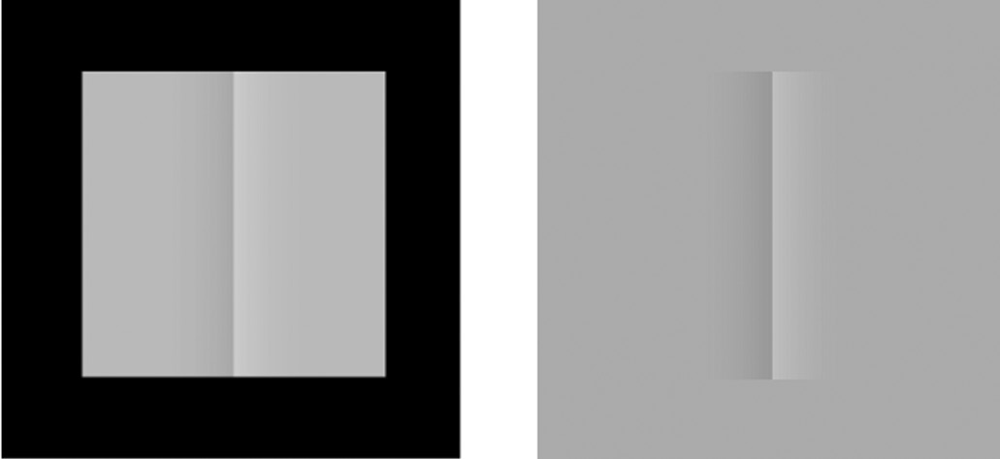
<figcaption><strong>그림 4.2</strong> — COCE: 이제 보이나요? 이제 안 보이나요? 왼쪽: 검은 테두리로 둘러싸인 직사각형 안에 수직 밝기 계단(cusp)이 있다. 검은 테두리가 만드는 닫힌 경계 때문에, 좌우가 다른 밝기로 채워져 두 개의 균일한 회색 직사각형처럼 보인다. 오른쪽: 검은 테두리를 회색으로 바꾸면 닫힌 경계가 사라지고, 갑자기 수직 cusp가 보인다.</figcaption>
</figure>

자극은 이렇다: 회색 직사각형 안에 수직 **cusp**(밝기 계단)가 있다. 왼쪽 절반은 약간 더 밝고, 오른쪽은 약간 더 어둡다. 하지만 검은 테두리가 이 전체를 둘러싸면, 우리는 cusp를 보지 못한다. 대신 왼쪽 전체가 균일하게 밝은 직사각형, 오른쪽 전체가 균일하게 어두운 직사각형으로 보인다.

메커니즘:
- 검은 테두리가 만드는 닫힌 경계가 cusp 양쪽의 밝기 신호를 각각 가두어, 표면 채우기가 독립적으로 일어남
- 테두리가 없으면, 채우기가 cusp를 넘어 자유롭게 흘러 밝기가 균등화됨 — cusp가 보임

이 효과는 실용적인 함의도 있다: 그래픽 디자인에서 실제로는 균일하지 않은 표면을 균일하게 보이게 하거나, 반대로 균일한 것을 불균일하게 보이게 하는 데 활용할 수 있다.

> [해설] COCE의 핵심 교훈
>
> COCE가 보여주는 것: 우리가 지각하는 표면의 밝기는 그 표면 위의 **실제 빛의 분포**와 다를 수 있다. 뇌는 경계 위치에서의 밝기 **변화(contrast)**를 측정하고, 이 변화를 경계 안쪽으로 채워서 표면 표현을 구성한다. 이것이 §3-4에서 설명할 "조명 할인"과 "특징 윤곽"의 기초다.
>
> COCE가 보여주지 않는 것: 왜 뇌가 이런 방식으로 작동하는가? 이 방식이 진화적으로 유리한 이유는 무엇인가? → §3에서 조명 할인 개념으로 답한다.

---

## 3. 밝기 지각과 조명 할인

> [해설] §1-2에서 현상을 확립했다면, §3부터는 메커니즘으로 들어간다.
>
> Grossberg의 논증 전환점: "채우기가 일어난다는 것은 알았다. 그런데 채우기는 **무엇을 채우는가**?" 답은 특징 윤곽(feature contour) 신호다. 그런데 특징 윤곽은 어떻게 생겨나는가? 조명 할인으로부터다. 따라서 §3은 채우기의 **입력**을 설명한다.

### 조명 할인(Discounting the Illuminant)

Hermann von Helmholtz(1866)가 깨달았듯이, 우리는 석양의 붉은 빛 아래에서도 흰 종이를 흰색으로 본다. 이것이 **색 항등성(color constancy)**이다. 뇌가 어떻게 조명의 색을 할인하고 물체의 "실제" 색을 추출하는가?

Edwin Land의 **McCann Mondrian** 실험은 이 현상을 극적으로 보여준다.

<figure>
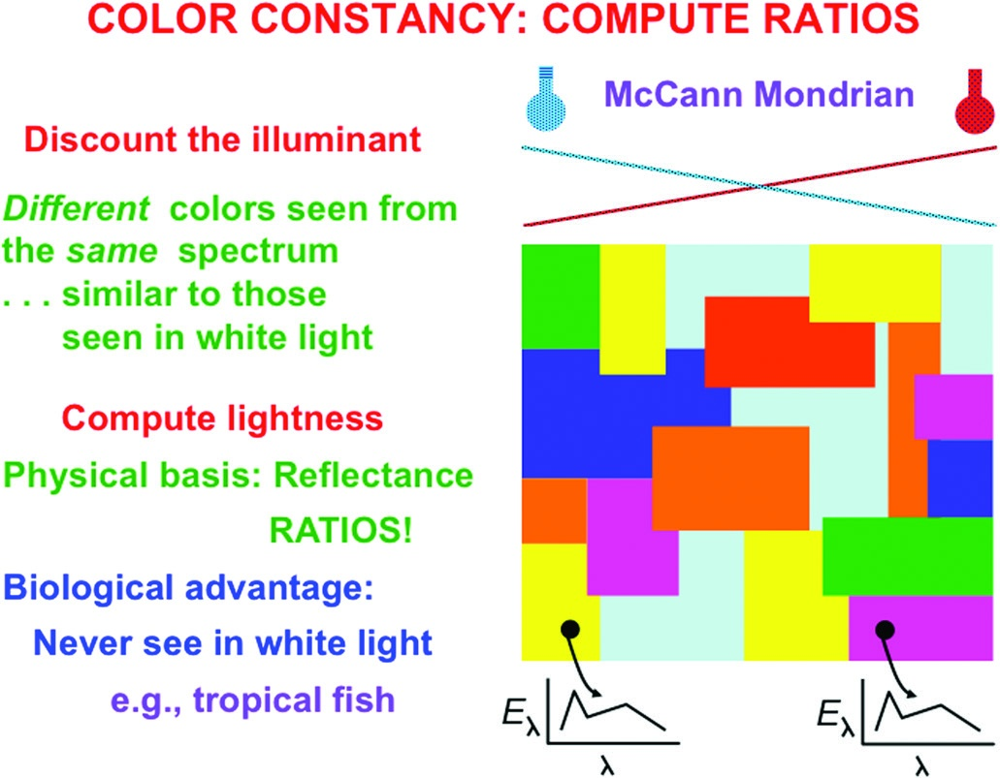
<figcaption><strong>그림 4.3</strong> — McCann Mondrian. 다양한 색의 패치들로 구성된 퍼즐 같은 이미지. Land의 실험에서 각 패치를 서로 다른 색과 강도의 조명으로 비추어도, 관찰자는 패치들의 색을 거의 동일하게 지각한다. 뇌가 반사광의 상대적 비율을 계산하여 조명의 영향을 제거하기 때문이다.</figcaption>
</figure>

Land의 실험: 여러 색 패치들로 구성된 Mondrian 패턴에 다양한 색의 조명을 비추어도, 각 패치의 지각 색은 거의 변하지 않는다. 뇌는 절대적인 빛의 양이 아니라 **상대적 반사율 비율**을 계산하는 것이다.

### 경쟁이 좋을 때: 아날로그 계산을 가능하게 하는 경쟁

뇌 세포들이 어떻게 이 비율을 계산하는가? 답은 **경쟁(competition)**이다.

경쟁적 네트워크에서 $i$번째 세포의 활동은:

$$\theta_i = \frac{I_i}{\sum_{k=1}^{n} I_k}$$

여기서 $I_i$는 $i$번째 세포의 입력, 분모는 네트워크 내 모든 입력의 합이다. 이 비율은 조명 강도 $I$와 무관하다 — 조명이 두 배가 되면 분자도 분모도 두 배가 되어 비율은 그대로다. 이것이 **조명 할인**의 기계적 기반이다.

> [해설] 왜 경쟁이 할인을 구현하는가?
>
> 이 수식이 직관적으로 의미하는 것: 각 세포는 자신이 받은 자극의 **전체 자극 대비 상대적 강도**를 측정한다. 조명이 바뀌면 모든 자극이 같은 비율로 바뀌므로, 상대적 강도는 변하지 않는다. 이것은 뇌가 "전역 평균을 빼는" 방식으로 조명을 제거하는 것과 유사하다.
>
> 더 깊은 통찰: 이 경쟁 메커니즘은 이후 등장하는 경계 시스템의 단거리 경쟁(§7), 표면 시스템의 이중 대립 네트워크(§30) 등 4장 전체에서 반복적으로 등장하는 기본 원리다. Grossberg가 여기서 이 원리를 먼저 소개하는 이유가 있다.

---

## 4. 계층적 해결: 조명 할인, 특징 윤곽, 표면 채우기

> [해설] 이 절의 위치: "불확실성의 계층적 해결"의 첫 번째 사례
>
> §3에서 조명 할인이 **무엇**인지 설명했다면, §4는 조명 할인이 야기하는 **문제**와 그 **해결**을 설명한다. 이것이 4장 전체를 관통하는 테마인 "불확실성의 계층적 해결"의 첫 번째 사례다. 이 구조 — 각 처리 단계가 정보를 변환하고, 다음 단계가 그 변환이 야기한 정보 손실을 복원한다 — 는 §18에서 세 가지 불확실성의 계층적 해결로 총정리된다.

### 패치 경계에서의 반사율 변화 계산

<figure>
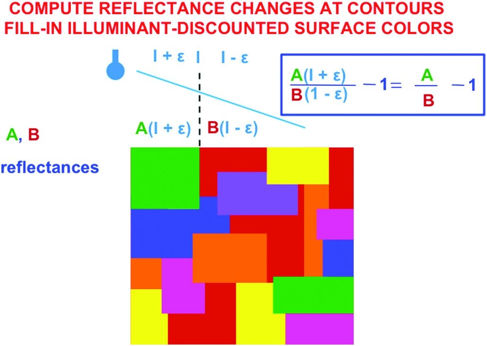
<figcaption><strong>그림 4.4</strong> — 조명 기울기가 McCann Mondrian을 비출 때. 조명이 한쪽에서 더 강하게 비쳐도, 패치 경계에서 반사율 변화를 측정하는 방식은 조명 강도와 독립적이다.</figcaption>
</figure>

패치 경계에서 반사율이 $A$에서 $B$로 갑자기 변할 때, 조명 강도 $I$ 근처에서 경계 대비는:

$$\frac{A(I+\varepsilon) - B(I-\varepsilon)}{A(I+\varepsilon) + B(I-\varepsilon)}$$

$\varepsilon \ll I$이면, 이것은 근사적으로:

$$\frac{A - B}{A + B}$$

이 결과의 핵심 의미:

| 위치 | 조건 | 결과 |
|------|------|------|
| **패치 내부** | A = B (같은 반사율) | 비율 = 0 → 대비 신호 없음 |
| **패치 경계** | A ≠ B (다른 반사율) | 비율 ≠ 0 → 반사율 변화 측정 |

패치 내부에서는 대비 신호가 없고, **경계에서만** 반사율 차이를 측정하는 신호가 남는다. 이것이 **특징 윤곽(feature contour)** 또는 **색상 윤곽(color contour)**이다.

### 정보 손실 → 복원: 채우기의 역할

<figure>
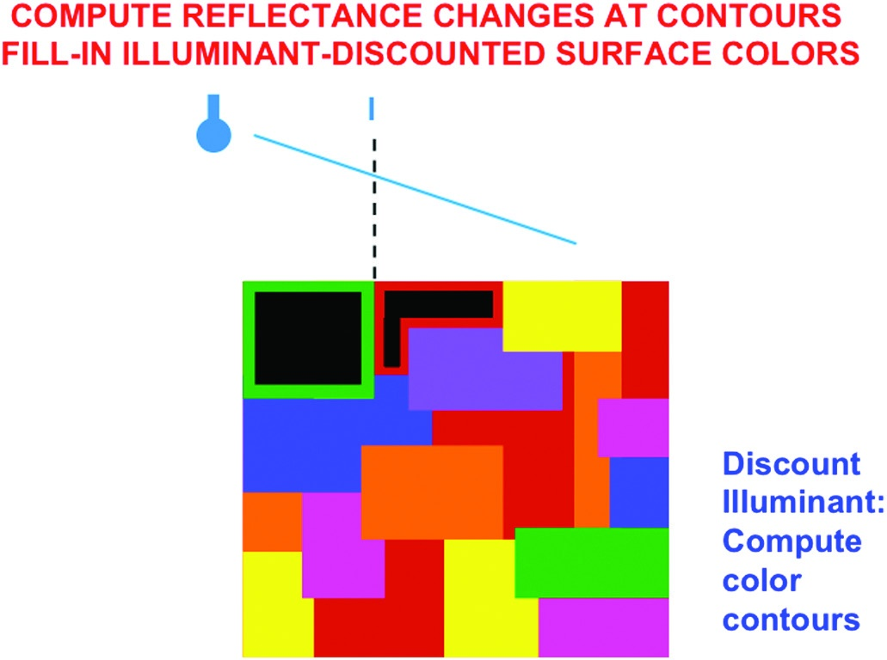
<figcaption><strong>그림 4.5</strong> — 다중 스케일 균형 경쟁이 색 윤곽을 선택. 패치 내부의 완만한 조명 기울기는 제거되고, 패치 경계의 대비 신호만 남는다.</figcaption>
</figure>

<figure>
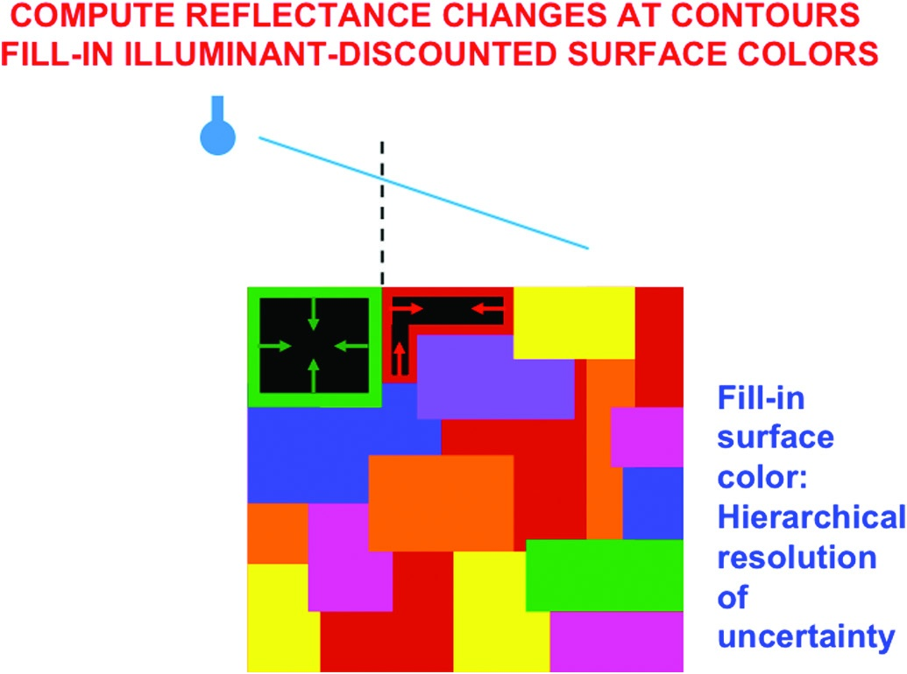
<figcaption><strong>그림 4.6</strong> — 색 윤곽의 채우기가 표면 색을 복원. 왼쪽: 조명 기울기 아래의 원본 자극. 가운데: 조명 할인 후의 특징 윤곽 — 내부 정보는 사라졌다. 오른쪽: 특징 윤곽이 경계 안쪽으로 채워져 연속적 표면 색이 복원된다.</figcaption>
</figure>

이 과정이 **"불확실성의 계층적 해결"의 첫 번째 사례**다:

```
원본 이미지 (연속적 밝기/색상)
    ↓ [조명 할인 — 정보 손실]
특징 윤곽 (이산적 경계 신호만 남음)
    ↓ [채우기 — 정보 복원]
지각된 표면 (조명이 할인된 연속적 밝기/색상)
```

첫 단계(조명 할인)는 연속적 패턴을 이산적 윤곽으로 변환하며 **정보를 손실**시킨다. 두 번째 단계(채우기)는 이 이산적 윤곽으로부터 연속적 표면 표현을 **복원**한다. 역설적으로, 조명 할인이 야기한 왜곡을 채우기가 되돌린다 — 하지만 이 과정에서 조명의 절대적 영향은 제거된다.

> [해설] "계층적"이라는 말의 의미
>
> 이 과정이 "계층적(hierarchical)"인 이유:
> - 각 단계는 이전 단계의 출력을 입력으로 받는다
> - 각 단계는 서로 다른 종류의 불확실성을 처리한다
> - **앞 단계의 처리가 뒤 단계가 해결해야 할 문제를 만들어낸다**
>
> 이것은 단순한 처리 파이프라인이 아니다. 각 단계는 **의도적으로** 정보를 왜곡하고, 다음 단계가 그 왜곡을 활용하여 더 유용한 표현을 만들어낸다. 조명 할인 없이는 조명 기울기가 있는 장면에서 색 항등성이 불가능하다.

---

## 5. 밝기 항등성, 대비, 동화

> [해설] §3-4의 이론을 §5에서 시뮬레이션으로 검증한다
>
> Grossberg의 방법론 패턴: 이론을 제안한 뒤, 그 이론으로부터 유도된 모델이 기존 실험 데이터를 재현하는지 시뮬레이션으로 확인한다. §5는 1988년 Grossberg & Todorovic 모델이 밝기 항등성, 대비, 동화, COCE 등 다양한 밝기 지각 현상을 단일 메커니즘으로 설명함을 보인다.

### 밝기 항등성(Brightness Constancy) 시뮬레이션

<figure>
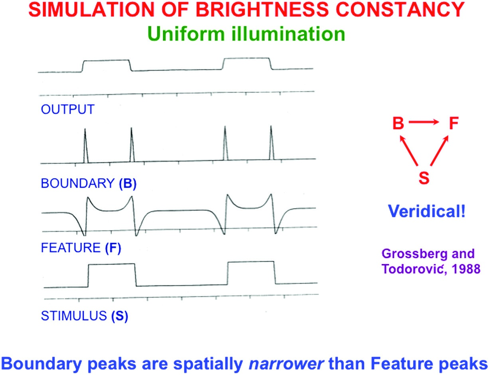
<figcaption><strong>그림 4.7</strong> — 균일 조명 하의 밝기 항등성 시뮬레이션 (Grossberg & Todorovic, 1988). S: 원본 자극 (균일한 배경 위의 두 수직 막대). F: 조명 할인 후 특징 윤곽 — 막대 경계에서만 신호가 남는다. B: 경계 추출 — 특징 윤곽보다 공간적으로 좁다. Output: 경계 안에서 채우기가 일어나 원래 밝기 패턴을 충실히 재현한다.</figcaption>
</figure>

이 시뮬레이션의 주목할 점: **경계 봉우리(B)가 특징 윤곽 봉우리(F)보다 공간적으로 좁다**. 이 사실은 경계 형성이 대비에 민감하기 때문이다. 특징 윤곽이 퍼진 신호를 만들어도, 경계 시스템이 이를 더 날카로운 신호로 압축한다.

### 조명 기울기에서의 밝기 항등성

<figure>
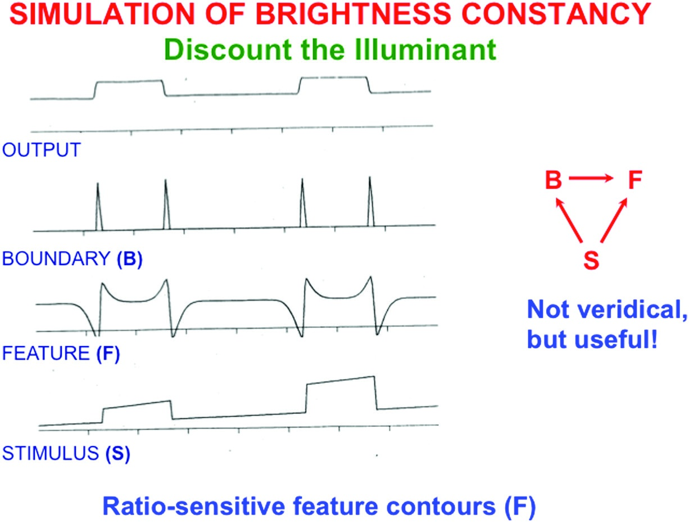
<figcaption><strong>그림 4.8</strong> — 조명 기울기 하의 밝기 항등성 시뮬레이션. 놀랍게도, 조명 기울기가 있어도 특징 윤곽(F)과 경계(B) 패턴은 그림 4.7과 동일하다. 최종 출력도 동일하다 — 이것이 밝기 항등성의 본질이다.</figcaption>
</figure>

이 결과가 놀라운 이유: 조명이 한쪽에서 더 강하게 비쳐도, 조명 할인 메커니즘이 대비를 추정하므로 F와 B 패턴이 그림 4.7과 동일하다. 같은 원인 → 같은 중간 표현 → 같은 최종 지각. 이것이 바로 **밝기 항등성**이다.

### 밝기 대비(Brightness Contrast)

<figure>
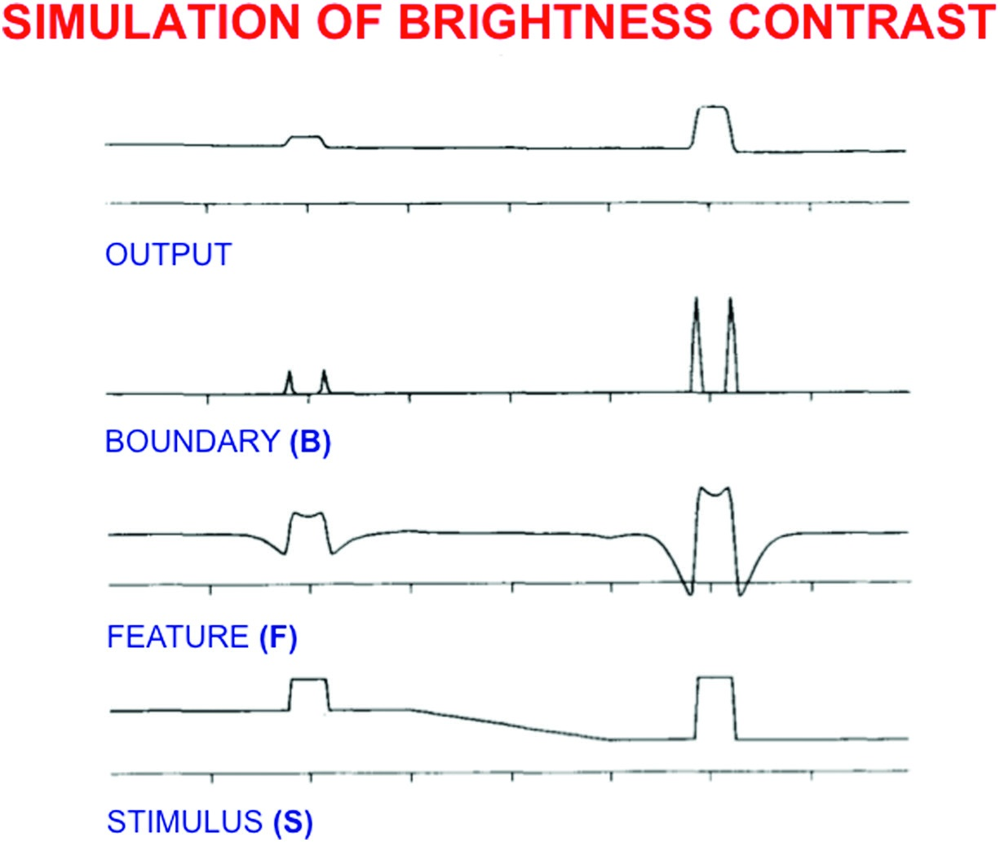
<figcaption><strong>그림 4.9</strong> — 밝기 대비 시뮬레이션. 두 막대의 실제 밝기는 동일하지만, 오른쪽 막대의 배경이 더 어둡기 때문에 오른쪽 막대가 더 밝게 보인다. 배경이 어두울수록 막대와의 대비가 커져, 더 강한 특징 윤곽 신호가 생성된다.</figcaption>
</figure>

밝기 대비는 **인접 영역 간의 밝기 차이를 증강**한다. 두 막대의 실제 물리적 밝기가 동일해도, 더 어두운 배경 위에 있는 막대가 더 밝게 보인다. 이것은 특징 윤곽 신호가 절대 밝기가 아닌 **상대 대비**를 측정하기 때문이다.

### 밝기 동화(Brightness Assimilation)

<figure>
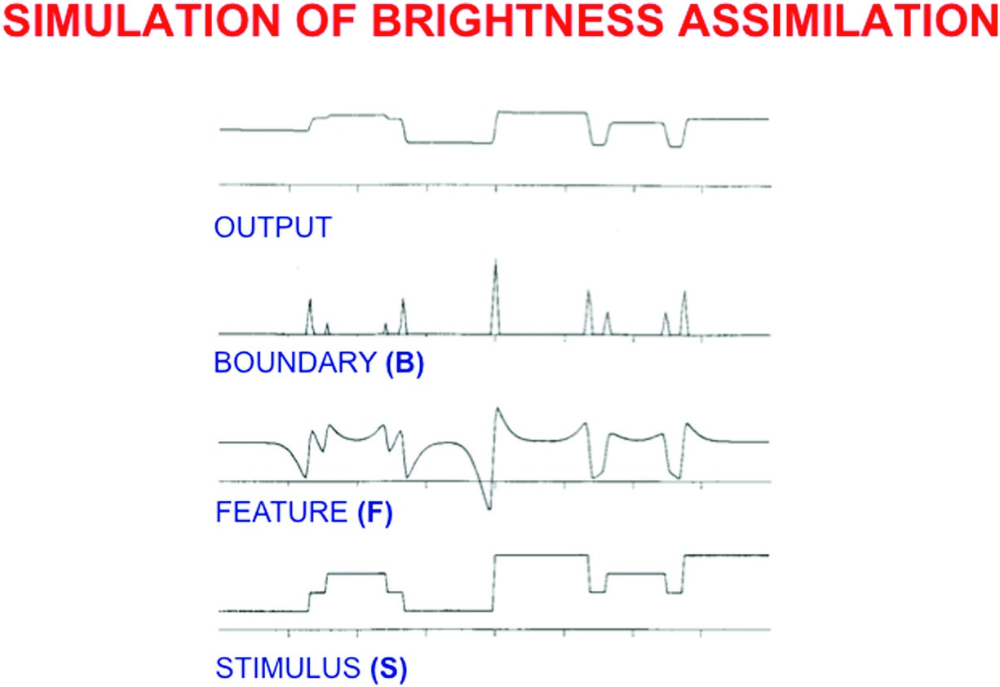
<figcaption><strong>그림 4.10</strong> — 밝기 동화 시뮬레이션. 밝기 대비와 반대로, 주변 밝기가 중간 영역의 지각 밝기를 자신 쪽으로 끌어당기는 현상. 같은 밝기의 계단이 다른 배경에서 다르게 보인다.</figcaption>
</figure>

> [해설] 대비 vs. 동화: 왜 두 방향이 모두 존재하는가?
>
> 밝기 대비와 동화가 반대 방향으로 작용한다는 사실은 처음에는 모순처럼 보인다. 같은 뇌가 어떤 때는 대비를 증강하고, 어떤 때는 감소시키는가?
>
> 핵심: 두 효과는 **다른 공간 스케일**에서 작동한다.
> - 대비: 경계 시스템이 **큰 스케일**의 밝기 차이를 처리할 때 → 경계가 두드러짐
> - 동화: 채우기 시스템이 **작은 스케일**의 패턴 (얇은 선, 작은 패치) 내에서 작동할 때 → 주변의 밝기가 내부로 "스며든다"
>
> 이 공간 스케일 의존성은 이중 필터 모델(§19)에서 형식화된다.

### 이중 계단과 COCE 시뮬레이션

<figure>
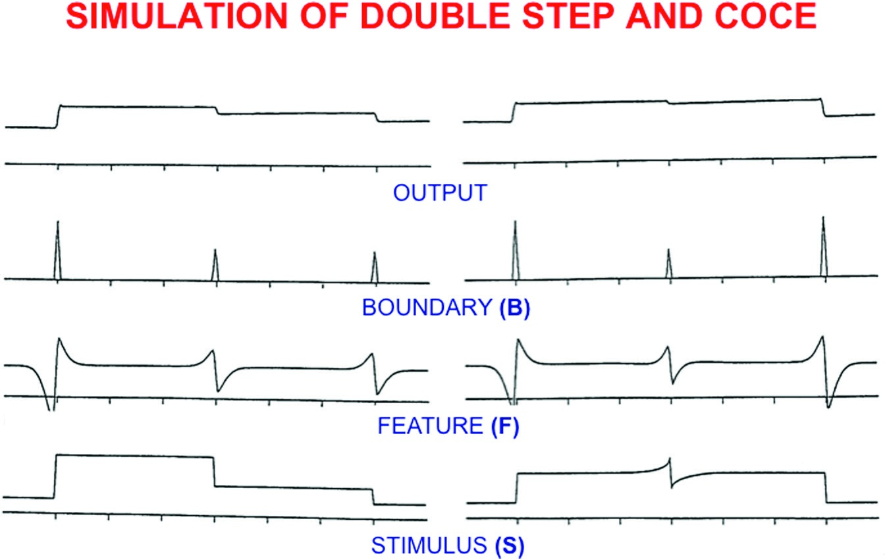
<figcaption><strong>그림 4.11</strong> — 이중 계단(double step)과 COCE 자극이 같은 특징 윤곽 패턴을 생성함을 보인다. 이것이 이 두 자극이 유사한 지각을 만드는 이유다.</figcaption>
</figure>

이중 계단과 COCE는 **물리적으로 다른 자극**이지만, 조명 할인 후 **동일한 특징 윤곽 패턴**을 생성한다. 두 자극의 가장자리에서 유사한 대비가 있기 때문이다. 같은 중간 표현 → 같은 지각. 이것은 모델의 강력한 예측이다.

### 2D COCE 시뮬레이션

<figure>
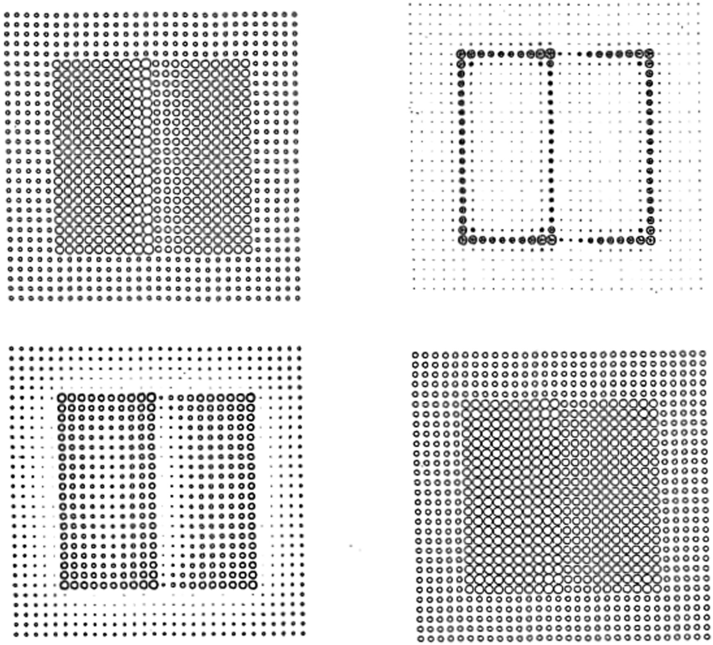
<figcaption><strong>그림 4.12</strong> — Grossberg & Todorovic(1988)의 2D COCE 시뮬레이션. 좌상: 원본 자극, 우상: 경계 추출, 좌하: 조명 할인 후 세포 활동, 우하: 채우기 후 COCE 지각. 전체 처리 파이프라인이 한눈에 보인다.</figcaption>
</figure>

### 대비 항등성(Contrast Constancy)

<figure>
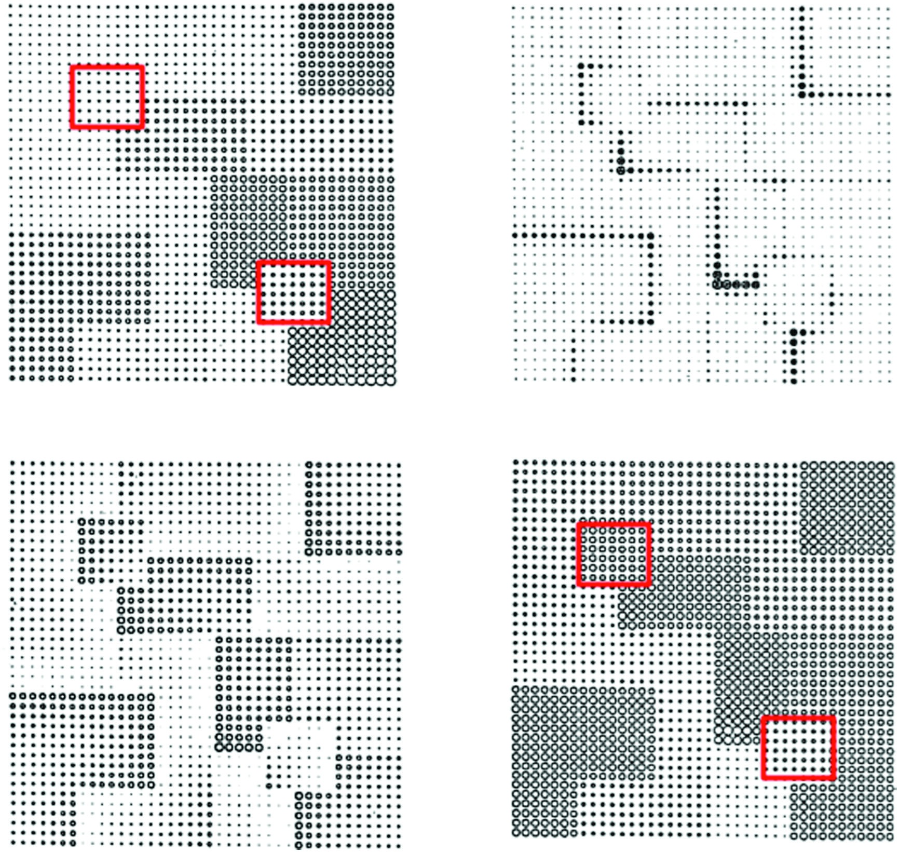
<figcaption><strong>그림 4.13</strong> — 조명 기울기 하에서도 패치 간 상대적 대비가 보존된다. 이것이 대비 항등성이다 — 밝기 항등성과 마찬가지로, 조명의 절대값이 아닌 상대적 비율을 계산하기 때문에 가능하다.</figcaption>
</figure>

### 채우기를 "현장에서" 잡기

<figure>
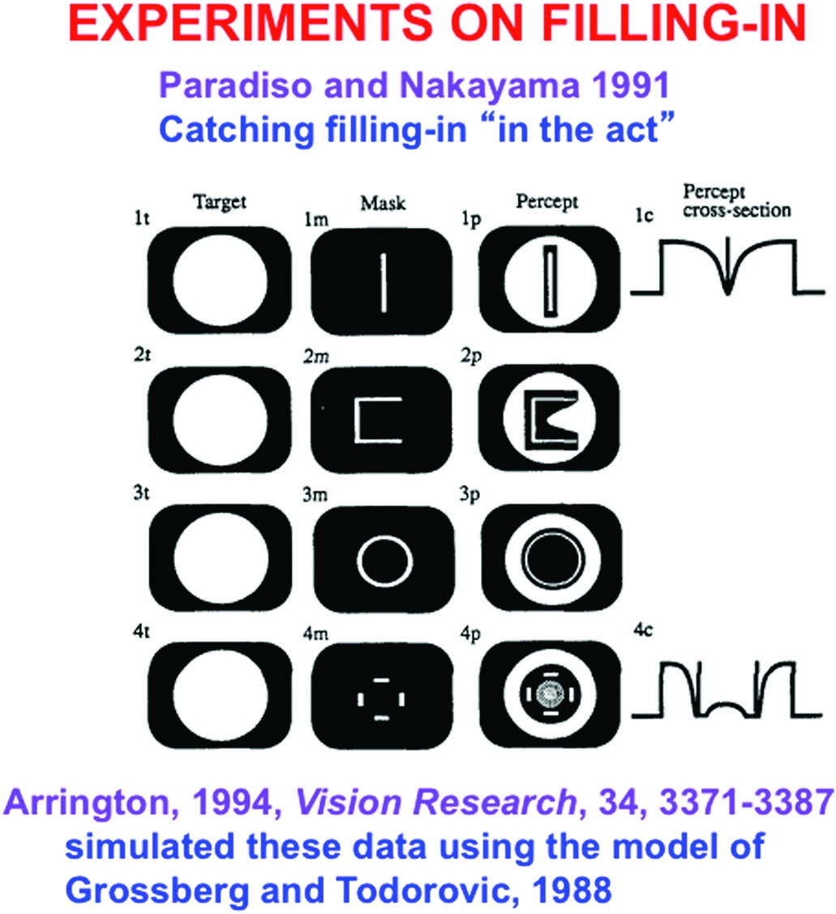
<figcaption><strong>그림 4.14</strong> — Paradiso & Nakayama(1991)의 채우기 실험. 흰 원반을 짧게 제시한 후 마스킹 자극을 제시하면, 관찰자가 보고한 밝기 프로파일이 원반 중심에서 가장자리로 퍼지는 채우기 과정을 반영한다.</figcaption>
</figure>

Michael Paradiso와 Ken Nakayama(1991)는 채우기가 실시간으로 진행되는 과정임을 직접 보여주었다. 흰 원반을 매우 짧게 제시한 후, 다양한 지연 시간으로 마스킹 자극을 제시했다. 관찰자들이 보고한 지각은 채우기가 원반의 경계에서 시작하여 중심으로 **안쪽으로(inwardly)** 퍼진다는 것을 보였다. 경계가 채우기를 시작하게 하는 **생성기** 역할을 한다는 §1의 원리를 직접 확인한 것이다.

Karl Arrington(1994)은 Grossberg-Todorovic 모델로 이 데이터를 성공적으로 시뮬레이션했다. 이것은 §1-4에서 구축한 이론 체계가 독립적인 실험 데이터를 예측할 수 있음을 보여준다.

> [해설] §5가 달성한 것
>
> §5의 시뮬레이션들이 보여준 것:
> - 밝기 항등성, 대비, 동화, COCE라는 **겉보기에 다른 현상들**이 동일한 메커니즘 — 조명 할인 + 특징 윤곽 + 채우기 — 의 다른 표현임
> - 조명 기울기에도 불구하고 밝기 항등성이 유지됨 (모델의 비자명한 예측)
> - 채우기는 실시간으로 일어나는 공간적 과정임 (Paradiso & Nakayama 데이터로 확인)
>
> §5가 답하지 않은 것:
> - 이 모든 과정이 **의식**과 어떻게 연결되는가? → §6에서 다룬다
> - 경계 시스템(BCS)이 경계를 어떻게 형성하는가? → §7-17에서 다룬다
> - 이 메커니즘의 신경 기반은 무엇인가? → §8-11에서 다룬다

---

## 6. 왜 공명인가? 철학자들의 도움

> [해설] §6의 논증 구조: 이론과 반론
>
> §6은 이 장 전반부의 마지막 절로, 두 가지 일을 한다:
> 1. §4-5에서 보인 "불확실성의 계층적 해결"이 의식(resonance)과 어떻게 연결되는지 선언한다
> 2. Daniel Dennett의 반론 — 채우기는 실제 물리적 과정이 아니다 — 을 반박한다
>
> Grossberg가 여기서 멈추는 이유: 경계 형성의 신경 메커니즘으로 들어가기 전에, 이 모든 것이 왜 의식 이론과 관련이 있는지를 먼저 확립하려는 것이다.

### 세 가지 불확실성의 계층적 해결과 공명

§3-5에서 보인 과정들은 모두 초기 시각 처리에 상당한 **불확실성**이 존재함을 드러낸다. 조명 할인은 연속적 표면 정보를 이산적 경계 신호로 변환하며 불확실성을 만들고, 채우기가 이를 해결한다. 하지만 이것은 빙산의 일각이다. 경계 형성 과정(§7-17)에서 두 가지 추가적인 불확실성의 계층적 해결이 일어난다.

Grossberg의 핵심 제안:

> **뇌 공명(brain resonance)과 그것과 함께하는 의식적 인식(conscious awareness)은, 경계와 표면 표현이 충분히 완전하고 안정적이 된 후에 촉발된다.**

이 제안의 논리: 세 가지 불확실성의 해결이 **모두** 완료되어야만, 적응적 행동을 제어하기에 충분히 완전하고 안정적인 시각 표현이 만들어진다. 이 완성된 표현이 **공명**을 촉발하고, 공명이 의식적 지각을 만든다. 따라서 채우기 과정이 실제 물리적 과정이라는 것은 의식 이론의 핵심이다.

### Daniel Dennett과의 논쟁

Daniel Dennett(1991)은 그의 저서 *Consciousness Explained*에서 채우기가 물리적 과정이 아니라고 주장했다. Dennett의 입장: 맹점 같은 곳에서 채우기가 일어난다는 것은, 뇌가 실제로 무언가를 채워 넣는 것이 아니라 단지 정보의 **부재를 무시하는** 것일 뿐이다.

Grossberg는 이에 동의하지 않는다. Paradiso & Nakayama(1991)의 실험(§5)은 채우기가 실시간으로 공간을 가로질러 퍼지는 과정임을 직접 보여준다 — 이것은 "정보 부재의 무시"로는 설명할 수 없다. 또한 Grossberg & Mingolla(1985)가 *Psychological Review*에 발표한 **네온 색 확산**의 신경 모델은, 채우기가 실제 뇌 과정임을 구체적인 신경 회로로 설명한다.

> [해설] Dennett 논쟁의 더 깊은 함의
>
> Dennett의 입장과 Grossberg의 입장은 단지 채우기에 대한 의견 차이가 아니다. 이것은 의식 이론의 근본적인 분기점이다:
>
> | Dennett의 입장 | Grossberg의 입장 |
> |---------------|----------------|
> | 뇌는 "충분하면 된다" 방식으로 표현을 구성 | 뇌는 완전하고 안정적인 표현을 실제로 구성 |
> | 채우기는 메타포 | 채우기는 물리적 과정 |
> | 의식은 여러 뇌 영역의 동시 활동 | 의식은 공명 — 상호작용적 동기화 |
>
> Grossberg가 채우기의 물리적 실재를 강조하는 이유는, 그것이 공명 이론의 기초이기 때문이다. 채우기가 실제로 일어나지 않는다면, "표현이 충분히 완전해질 때 공명이 촉발된다"는 제안 자체가 무의미해진다.

### 이 절이 예비하는 것: §7-19의 로드맵

§6이 확립한 결론 — 세 가지 불확실성의 계층적 해결이 공명의 전제 조건이다 — 은 §7부터 시작하는 경계 시스템 분석 전체의 동기다. §7-19는 다음 두 가지 불확실성의 해결 메커니즘을 구체적으로 분석한다:

| 해결 번호 | 메커니즘 | 해결하는 불확실성 | 등장 절 |
|---------|----------|----------------|--------|
| 1번 | 조명 할인 → 채우기 (이미 설명함) | 연속적 조명 변화 속에서 표면 색 추출 | §3-5 |
| 2번 | End gap → End cut | 선분 끝에서의 위치-방향 불확실성 | §13-17 |
| 3번 | 바이폴 세포의 장거리 그루핑 | 흩어진 경계 유도인자들을 연결하는 불확실성 | §17 |

---

## Chunk 1 핵심 개념 정리

| 개념 | 설명 | 등장 맥락 |
|------|------|---------|
| **채우기(filling-in)** | 특징 윤곽 신호가 경계 안쪽으로 확산되어 연속적 표면 표현을 생성하는 물리적 과정 | §1-5 전체 |
| **특징 윤곽(feature contour)** | 조명 할인 후 경계에서만 남는 밝기/색상 대비 신호 | §4 |
| **조명 할인** | 경쟁 네트워크가 절대 밝기 대신 상대적 비율을 계산하여 조명 효과를 제거하는 과정 | §3-4 |
| **불확실성의 계층적 해결** | 각 처리 단계가 정보를 왜곡하고 다음 단계가 복원하는 다단계 과정 | §4, §18 |
| **경계 = 장벽 + 생성기** | 경계는 채우기를 막는 동시에 채우기를 시작하게 하는 이중 역할 | §1, §17 |
| **COCE** | 닫힌 경계가 좌우의 채우기를 독립적으로 제어함을 보여주는 효과 | §2 |
| **밝기 항등성** | 조명이 바뀌어도 물체의 지각 밝기가 일정하게 유지되는 현상 | §5 |
| **공명** | 경계와 표면 표현이 충분히 완전해질 때 촉발되는, 의식적 지각의 기반 | §6 |

---

> **다음 Chunk 2 (pp. 136-142)**: 경계 형성의 기초 — 협력과 경쟁의 균형, BCS와 FCS의 정의, FACADE 이론 소개. §7-9에서는 네온 색 확산이라는 "탐침 자극"을 이용해 경계 시스템의 규칙을 역추론한다.
