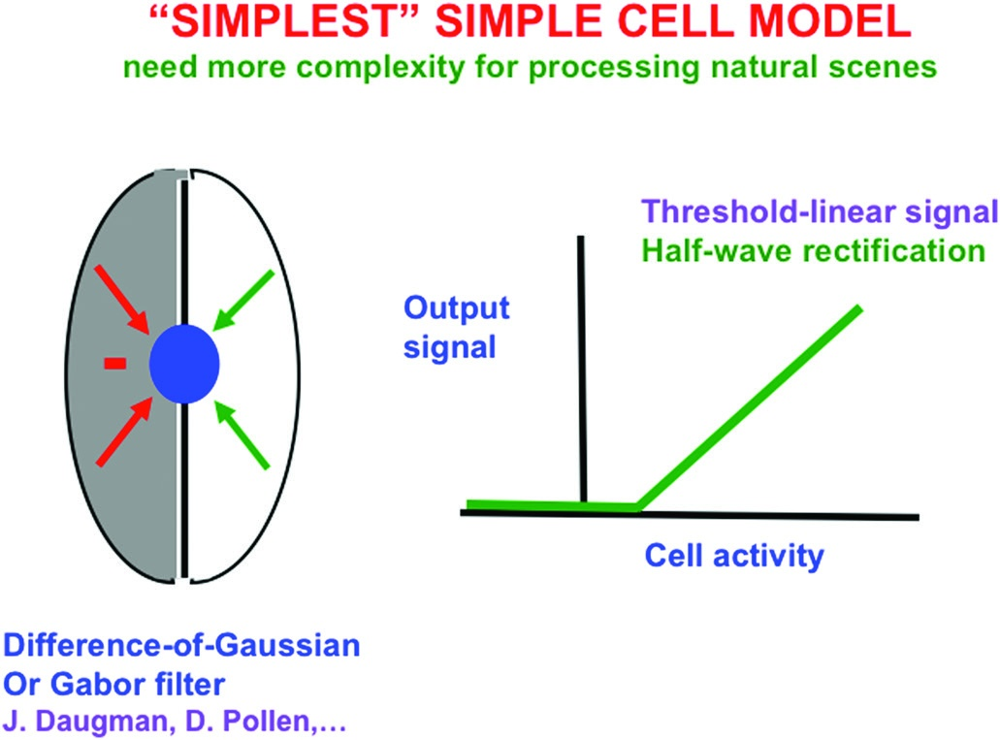
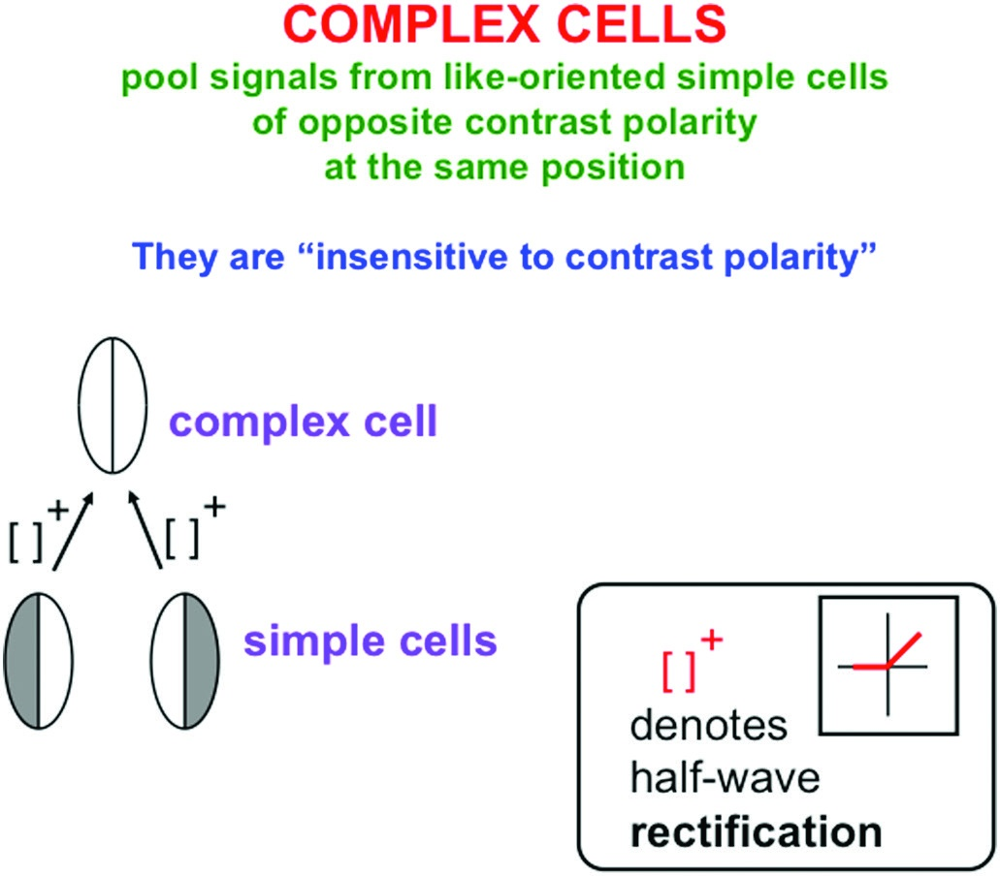
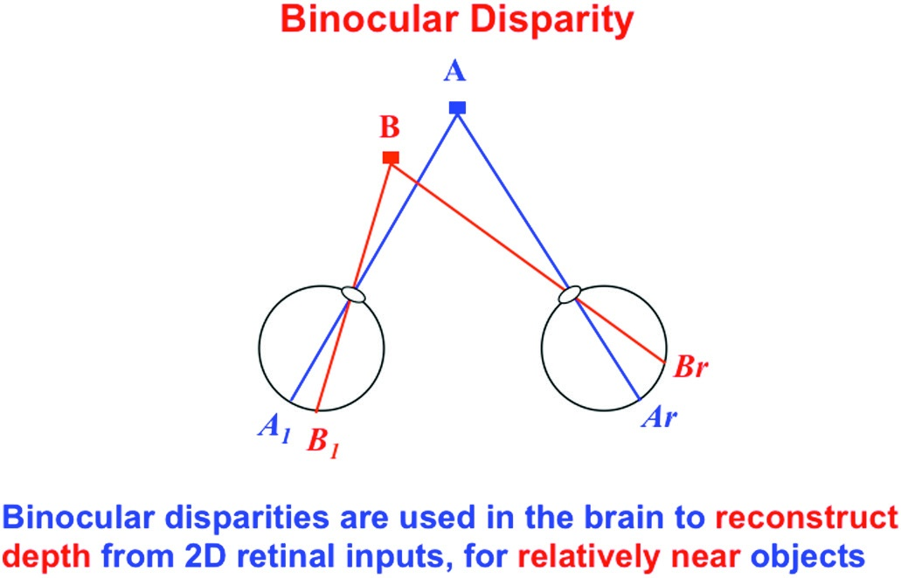
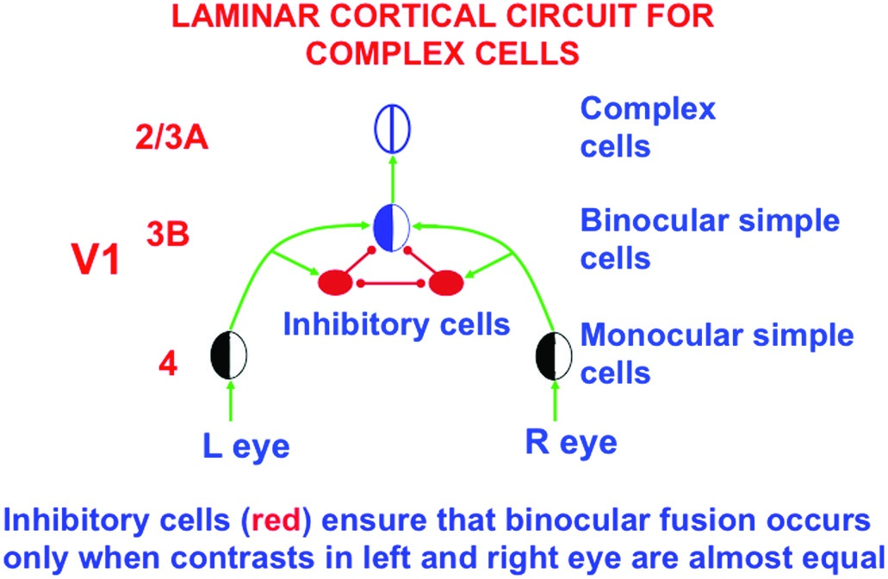
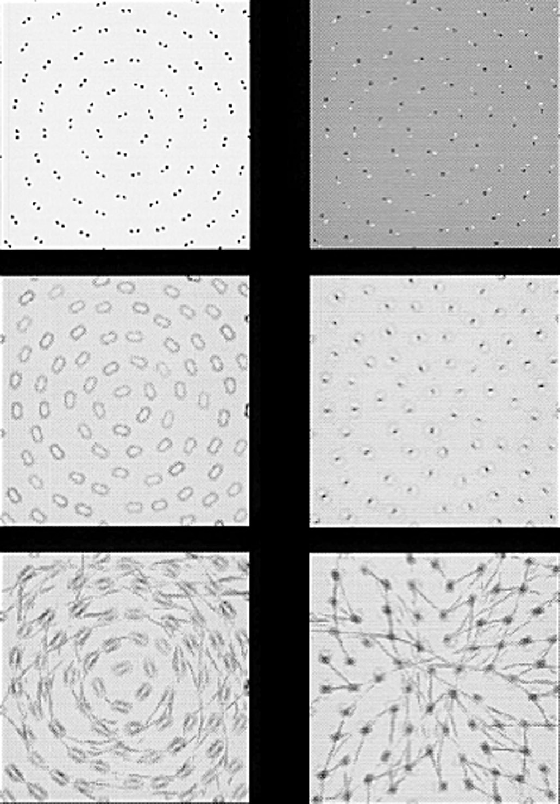
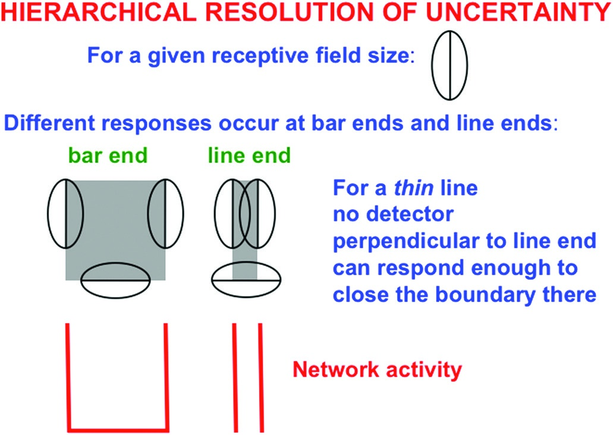
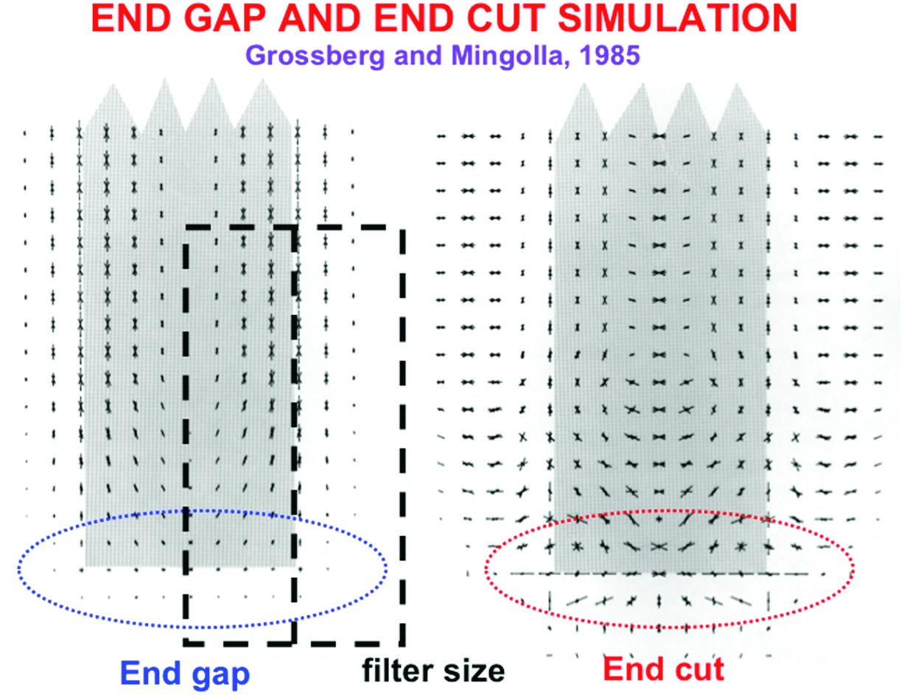

# Grossberg Ch.4 — Chunk 3: 단순/복잡 세포와 위치-방향 불확실성 (pp. 142-148)

> 원문: Stephen Grossberg, *Conscious MIND Resonant BRAIN*, Chapter 4, pp. 142-148
> 섹션 10-13: 단순 세포의 반파 정류, 복잡 세포의 전파 정류, Glass 패턴, 위치-방향 불확실성 원리

---

## 10. 단순 세포와 반파 정류

> [해설] §10의 위치: BCS의 가장 낮은 수준으로 내려가기
>
> §8이 단순 세포를 "방향성 국소 대비 검출기"로 소개했다면, §10은 그 내부 수학을 펼친다. 왜 단순 세포가 특정 방식으로 반응하는지를 수용장 구조와 **반파 정류(half-wave rectification)**로 설명한다. 이 절은 기계적 디테일처럼 보이지만, §11의 복잡 세포와 §13의 불확실성 원리로 이어지는 필수 기초다.

### 단순 세포의 수용장 구조

<figure>

<figcaption><strong>그림 4.16</strong> — 가장 단순한 단순 세포 모델. 수용장이 두 반쪽으로 나뉘어, 한쪽은 "밝음"에 반응하고 다른 쪽은 "어둠"에 반응한다. 두 반응이 합쳐져 순 활동(net activity)이 되고, 이 값이 역치를 초과할 때만 출력이 나온다.</figcaption>
</figure>

단순 세포의 수용장(receptive field)은 두 개의 인접한 영역으로 나뉜다:
- **"밝은" 쪽 (on region)**: 빛이 오면 세포를 흥분(excite)
- **"어두운" 쪽 (off region)**: 빛이 오면 세포를 억제(inhibit)

두 영역의 기여가 합쳐져 세포의 순 활동(net activity)이 계산된다. 이 모양은 **Gabor 필터** 또는 **가우시안 차이(Difference-of-Gaussian, DoG)** 필터로 수학적으로 모델링된다.

### 반파 정류(Half-Wave Rectification)

순 활동이 계산된 후 세포가 출력을 생성하는 방식:

$$\text{출력} = \max(0, \text{순 활동} - \theta)$$

여기서 $\theta$는 **역치(threshold)**다. 이 연산이 **반파 정류(half-wave rectification)**다 — 양의 값만 통과시키고 음의 값은 0으로 만드는 비선형 변환.

왜 반파 정류인가? 뉴런의 발화율(firing rate)은 음수가 될 수 없다. 세포는 흥분하거나 침묵할 뿐, 음의 활동은 내지 못한다. 반파 정류는 이 생물학적 제약을 수학적으로 구현한다.

> [해설] 반파 정류의 숨겨진 중요성
>
> 반파 정류는 단순한 공학적 편의가 아니다. 이 비선형성 때문에:
>
> 1. **대비 극성이 보존된다**: 밝음->어둠 경계와 어둠->밝음 경계가 **다른** 단순 세포에 반응한다. 두 경계는 정보적으로 구분된다.
> 2. **정보 손실이 일어난다**: 음의 순 활동(반대 극성 반응)은 버려진다.
> 3. **복잡 세포의 필요성이 생긴다**: 대비 극성을 **통합**하려면 반대 극성 단순 세포의 출력을 합쳐야 한다 -> 복잡 세포 (§11).
>
> 반파 정류가 없다면 단순 세포의 출력이 선형이 되어, 모든 대비 정보가 선형 합으로 평탄화된다. 단순->복잡->초복잡->바이폴의 계층 전체가 반파 정류의 비선형성에 기초해 작동한다.

### 홀수 수용장과 짝수 수용장

단순 세포는 수용장의 **공간적 대칭성**에 따라 두 유형으로 구분된다:

| 유형 | 구조 | 반응 대상 |
|------|------|---------|
| **홀수(odd) 수용장** | 비대칭 (한쪽 밝음, 반대쪽 어둠) | 가장자리(edge) — 밝음->어둠 전환 |
| **짝수(even) 수용장** | 대칭 (중앙 밝음, 양쪽 어둠 또는 그 반대) | 선분(line) — 양면이 같은 대비의 얇은 구조 |

Hubel과 Wiesel이 1981년 노벨상을 수상한 고전적 실험에서 두 유형 모두를 보고했다. 두 유형이 모두 필요한 이유:
- **홀수 수용장**: 물체의 경계(가장자리)에 반응
- **짝수 수용장**: 얇은 선(글씨, 혈관, 선분)에 반응

시각 세계에는 가장자리와 선분이 모두 나타나므로, BCS는 두 유형 모두를 가진다.

---

## 11. 복잡 세포: 무양식 경계 검출기

> [해설] §11의 논증 전환점: 왜 복잡 세포가 필요한가?
>
> §10의 단순 세포는 대비 극성에 민감하다 — 이것은 장점이자 문제다. 물체의 경계를 완성하려면 **"여기에 경계가 있다"**는 사실이 중요하지, **"여기에 밝음->어둠 경계가 있다"**는 세부 극성은 오히려 방해가 될 수 있다. 물체의 한 가장자리에서 국소적으로 밝음과 어둠이 뒤섞이면, 단순 세포만으로는 일관된 경계를 완성할 수 없다.
>
> 복잡 세포는 이 문제를 해결하는 **추상화 단계**다: 대비 극성을 제거하고, 방향과 위치의 정보만 남긴다.

### 복잡 세포의 구조: 반대 극성 단순 세포의 풀링

<figure>

<figcaption><strong>그림 4.17</strong> — 복잡 세포는 반대 대비 극성의 단순 세포를 풀링(pool)한다. 같은 위치, 같은 방향이지만 반대 극성(밝음->어둠 vs. 어둠->밝음)을 가진 두 단순 세포의 출력이 모두 복잡 세포로 입력된다. 복잡 세포는 두 출력의 반파 정류된 값을 합산하여, 극성과 무관한 경계 신호를 생성한다.</figcaption>
</figure>

복잡 세포(complex cells)는 같은 위치에서 **반대 대비 극성**의 단순 세포 쌍의 출력을 합산한다:

$$\text{복잡 세포 출력} = [\text{밝음->어둠}]^+ + [\text{어둠->밝음}]^+$$

여기서 $[x]^+ = \max(0, x)$는 반파 정류다. 양쪽 단순 세포의 반파 정류된 출력을 더하는 것이 **전파 정류(full-wave rectification)**와 같은 효과를 낸다.

### 복잡 세포의 세 가지 핵심 속성

| 속성 | 의미 |
|------|------|
| **대비 극성 불감성** | 밝음->어둠, 어둠->밝음 모두에 반응 |
| **위치·방향·크기·대비량에 민감** | 경계 완성에 필요한 정보 유지 |
| **특정 질(qualia)에 불감** | 극성과 파장 정보 없음 -> 색이나 밝기의 "느낌" 감지 불가 |

### "모든 경계는 보이지 않는다"의 신경학적 이유

> **핵심 원리**: 복잡 세포가 대비 극성을 풀링하기 때문에, 경계 시스템은 **특정 시각적 질(visual quality)**을 감지할 수 없다.

이것은 이 책 전체에서 반복되는 슬로건 **"모든 경계는 보이지 않는다"**의 신경학적 기반이다. 경계 시스템은:
- 어디에 경계가 있는지는 안다
- 어느 방향인지는 안다
- 얼마나 강한지는 안다
- **그러나 그 경계가 "빨간색과 초록색" 사이인지, "밝음과 어둠" 사이인지는 모른다**

이 "모름"이 문제가 아니라 설계의 핵심이다. 경계의 역할은 표면의 속성을 담을 **그릇**을 만드는 것이지, 그릇 안에 무엇이 담기는지를 결정하는 것이 아니다. 색상/밝기 정보는 FCS(특징 윤곽 시스템)가 제공한다.

> [해설] 상보성의 구체적 구현
>
> §8에서 언급한 BCS와 FCS의 상보성이 여기서 구체적으로 드러난다:
>
> | 시스템 | 민감한 정보 | 둔감한 정보 |
> |--------|-----------|----------|
> | BCS (복잡 세포) | 방향, 위치, 대비 크기 | **대비 극성, 파장(색상)** |
> | FCS | 대비 극성, 파장(색상) | **방향적 정보** |
>
> 각 시스템은 상대 시스템이 가진 정보를 **의도적으로 버린다**. 둘의 출력이 결합될 때에만 완전한 시각 표현이 만들어진다. 이것이 상보성의 정확한 의미다.

### 양안 시차(Binocular Disparity)와 복잡 세포

<figure>

<figcaption><strong>그림 4.18</strong> — 양안 시차. 두 눈이 약간 다른 각도에서 세계를 보기 때문에, 같은 물체가 두 망막의 약간 다른 위치에 투영된다. 이 위치 차이(양안 시차, binocular disparity)가 깊이의 강력한 단서가 된다. 멀리 있는 물체는 시차가 작고, 가까운 물체는 시차가 크다.</figcaption>
</figure>

복잡 세포는 3D 시각의 기반이기도 하다. 두 눈은 약간 다른 시점에서 세계를 보기 때문에, 같은 물체가 두 망막의 다른 위치에 투영된다. 이 **양안 시차(binocular disparity)**는 깊이 지각의 핵심 단서다.

### V1의 층상 피질 회로

<figure>

<figcaption><strong>그림 4.19</strong> — 복잡 세포를 위한 V1의 층상 피질 회로. Layer 4에는 단안 단순 세포가, Layer 3B에는 양안 단순 세포가, Layer 2/3에는 복잡 세포가 위치한다. 양쪽 눈의 대비가 거의 같을 때만 양안 융합이 일어나도록 억제 세포(빨간색)가 보장한다.</figcaption>
</figure>

V1의 층상 구조에서 각 층이 담당하는 역할:

| 피질 층 | 세포 유형 | 기능 |
|--------|----------|------|
| **Layer 4** | 단안 단순 세포 | 한쪽 눈의 입력만 받아 방향성 대비 검출 |
| **Layer 3B** | 양안 단순 세포 | 양쪽 눈의 **같은 극성** 입력을 결합 |
| **Layer 2/3** | 복잡 세포 | **반대 극성**의 양안 단순 세포 출력을 풀링 |

**억제 세포(그림 4.19의 빨간색)**의 역할: 양쪽 눈의 대비가 거의 같을 때만 양안 융합(binocular fusion)이 일어나도록 제어한다. 한쪽 눈만 강한 자극을 받으면 이 억제가 해제되어 단안 처리로 전환된다. 이것이 쌍안 경합(binocular rivalry)의 기계적 기반이기도 하다.

---

## 12. Glass 패턴: 단거리 vs. 장거리 협력

> [해설] §12의 전략적 역할: 개념 구별을 위한 결정적 실험
>
> §7에서 Grossberg는 "장거리 협력"을 도입했지만, 이것이 단순 세포의 국소 반응과 어떻게 다른지는 불분명할 수 있다. Glass 패턴은 이 구분을 **실험적으로 분리**하는 결정적 자극이다. 같은 이미지에서 점 쌍의 극성만 바꾸어 단순 세포와 복잡 세포의 역할을 해부한다.

### Glass 패턴이란?

<figure>

<figcaption><strong>그림 4.20</strong> — Glass 패턴(왼쪽 열)과 역대비 Glass 패턴(오른쪽 열). 각 패턴은 점 쌍들로 구성되며, 점 쌍들은 어떤 기하학적 구조를 암시한다. Glass 패턴에서는 점 쌍이 같은 극성(흰-흰 또는 검-검)이고, 역대비 Glass 패턴에서는 반대 극성(흰-검)이다. 이 작은 차이가 지각에 극적인 영향을 미친다.</figcaption>
</figure>

Leon Glass(1969)가 만든 **Glass 패턴**은 다음과 같이 구성된다:
- 많은 점 쌍들이 평면 위에 배열됨
- 각 점 쌍은 특정 기하학적 변환(회전, 팽창 등)에 의해 연결됨
- 전체 구성은 원형, 방사형, 나선형 등의 패턴을 시사

Glass 패턴이 흥미로운 이유: 패턴을 정의하는 것은 개별 점이 아니라 **점 쌍 사이의 국소적 관계**다. 그러나 우리는 전체 원형/방사형 패턴을 본다 — 국소적 관계를 전역적 구조로 통합하는 시각 시스템의 능력이 드러난다.

### 두 패턴의 비교

| | **Glass 패턴** (같은 극성 쌍) | **역대비 Glass 패턴** (반대 극성 쌍) |
|---|---|---|
| **점 쌍의 극성** | 같음 (흰-흰 또는 검-검) | 반대 (흰-검) |
| **단순 세포 반응** | 쌍의 국소 방향 검출 가능 | 같은 극성 쌍이 아니므로 검출 불가 |
| **복잡 세포 반응** | 방향 정보가 있으면 원형 그루핑 가능 | 반대 극성 정보 풀링 후 여전히 어떤 반응 가능 |
| **지각** | 원형 경계 명확 | 원형 경계 흐려지거나 사라짐 |

### 무엇을 추론할 수 있는가?

이 비교에서 얻는 결정적 결론:

> **같은 극성 풀링 vs. 반대 극성 풀링의 차이가 존재한다.**

- **단거리 처리(단순 세포 수준)**: 같은 대비 극성의 신호만 풀링 -> Glass 패턴만 처리 가능
- **장거리 처리(바이폴 세포 수준, §17)**: 양쪽 극성 모두에서 경계 완성 가능

역대비 Glass 패턴에서 원형이 약해지는 이유는 단순 세포 수준의 국소 방향 검출이 실패하기 때문이다. 반면 정상 Glass 패턴에서는 단순->복잡->장거리 처리의 전체 흐름이 원형 경계를 만들어낼 수 있다.

> [해설] 이 절의 근본 교훈
>
> Glass 패턴은 단순히 흥미로운 착시가 아니다. 이것은 **처리 수준을 분리하는 도구**다. 지각이 변한다 -> 어느 단계가 차이를 만드는지 역추론할 수 있다.
>
> 이 논리는 Grossberg 방법론의 본질이다: **"이 자극에서는 이 기능이 실패한다"**는 관찰에서 **"이 기능은 이 회로에 있다"**는 결론으로 이동한다. 신경과학 실험이 불가능하거나 제한적일 때, 정교한 자극 설계가 같은 역할을 한다.

---

## 13. 위치-방향 불확실성 원리

> [해설] 이 절의 역사적 중요성
>
> Grossberg(1984)가 발표한 **위치-방향 불확실성 원리**는 4장의 이론적 핵심 중 하나다. 이것은 양자역학의 하이젠베르크 불확실성 원리를 시각 처리에 유비적으로 적용한 것으로, **방향적 확실성과 위치적 정확성 사이의 원리적 트레이드오프**를 제시한다.
>
> 왜 이것이 중요한가? 이 원리로부터 **end gap**이 선분 끝에 필연적으로 생긴다는 결론이 유도되고, 이 end gap이 "지각적 재난"(§14)을 야기하며, 이를 해결하기 위한 end cut(§15-16)과 장거리 협력(§17)이 필요해진다. 즉, 4장 후반부의 논증 대부분이 이 원리에서 출발한다.

### Grossberg의 불확실성 원리 (1984)

> **위치-방향 불확실성 원리**: 방향적 확실성은 선분 끝과 모서리에서 위치적 불확실성을 의미한다.
> (Orientational certainty implies positional uncertainty at line ends and corners.)

쉽게 말해: 선분이나 경계가 어느 방향인지 **정확하게** 알기 위해서는 일정한 공간적 범위에서 정보를 모아야 하는데, 그 공간적 범위 안에서는 선분의 끝 위치를 **정확하게** 알 수 없다. 방향과 끝 위치를 동시에 정밀하게 알 수 없다는 뜻이다.

### 막대 끝 vs. 선분 끝: 결정적 차이

<figure>

<figcaption><strong>그림 4.21</strong> — 막대 끝과 선분 끝에서의 단순 세포 반응. 왼쪽: 두꺼운 막대의 끝에서는 수직과 수평 방향 단순 세포가 모두 반응할 수 있다(끝 모서리에 수평 가장자리가 있으므로). 오른쪽: 가는 선분의 끝에서는 수직 방향만 반응하고 수평 방향은 거의 반응하지 않는다. 이 차이가 end gap의 원인이다.</figcaption>
</figure>

**두꺼운 막대(bar)의 끝**:
- 막대가 충분히 두꺼워서, 끝 부분에 **수평 가장자리**가 존재
- 수직 방향 단순 세포(막대의 옆면)와 **수평 방향 단순 세포(막대의 끝면)** 모두 반응 가능
- 결과: 경계가 끝에서 올바르게 닫힌다 (수평 경계가 막대 끝에서 만들어짐)

**가는 선분(line)의 끝**:
- 선분이 너무 가늘어서, 끝 부분에 충분한 수평 가장자리가 **없음**
- 수직 방향 단순 세포만 반응, 수평 방향 세포는 거의 반응 못 함
- 결과: 경계에 **수평 신호가 빠진 구멍** — 이것이 end gap이다

### End Gap 시뮬레이션

<figure>

<figcaption><strong>그림 4.22</strong> — end gap과 end cut 시뮬레이션. 왼쪽 상단: 선분 자극. 오른쪽 상단: 단순 세포 반응 — 선분 끝에서 수평 방향 신호가 없어 end gap 발생. 아래 행: end cut 생성 후의 활동 — 수직에 수직인 방향들의 퍼진 대역으로 경계가 닫힌다.</figcaption>
</figure>

그림 4.22가 드러내는 end cut의 두 가지 중요한 속성:

1. **위치적 초과민성(positional hyperacuity)**: end cut이 실제 선분 끝의 정확한 위치에서 발생
2. **방향적 퍼짐(orientational fuzziness)**: 수직과 수직에 가까운 여러 방향의 end cut이 생성됨

> [발표 포인트] 왜 이 원리가 "불확실성 원리"인가?
>
> 하이젠베르크의 양자역학 불확실성 원리: 입자의 위치를 정확히 알수록 운동량을 정확히 알 수 없다.
>
> Grossberg의 시각 불확실성 원리: 선분의 방향을 정확히 알수록 선분 끝의 위치(와 수직 방향 정보)를 정확히 알 수 없다.
>
> 공통점: 둘 다 **원리적 트레이드오프**이지, 측정 기술의 한계가 아니다. 단순 세포가 방향을 확실하게 추출하려면 일정한 공간 범위(수용장)에서 정보를 적분해야 하고, 그 범위 안에서는 끝 위치가 흐려진다. 수용장이 작아질수록 방향 정확도가 떨어진다 — 이것이 물리적 트레이드오프다.

### 이 원리가 4장 논증에 미치는 영향

위치-방향 불확실성 원리는 단순히 흥미로운 관찰이 아니라, **뇌 회로 설계의 제약**이다:

| 문제 | 원인 | 해결 (이후 절) |
|------|------|-------------|
| End gap 발생 | 불확실성 원리 | End cut (§14-16) |
| 선분 끝 색 유출 | End gap | End cut + 단거리 경쟁 (§16) |
| 불완전한 물체 경계 | 유도인자 간 틈 | 장거리 협력, 바이폴 세포 (§17) |

이 원리는 **불완전함이 불가피하다**는 선언이자, **그 불완전함을 해결하는 메커니즘이 진화했다**는 주장의 출발점이다. 4장 후반은 이 해결 메커니즘들의 구체적 분석이다.

> [해설] 다음 절로의 연결: 재난에서 해결로
>
> §13은 문제를 설정한다: end gap이 필연적이다. §14는 이 문제가 얼마나 심각한지를 보여준다: 닫히지 않은 end gap은 지각적 재난이다. §15-17은 해결책을 제시한다: end cut과 장거리 협력.
>
> Grossberg의 수사적 전략: 문제의 심각성을 먼저 과장하여 보여주고, 그 다음 해결책의 우아함을 강조한다. §13의 건조한 원리가 §14의 "지각적 재난"이라는 극적 표현으로 이어지는 것은 이 전략의 일부다.

---

## Chunk 3 핵심 개념 정리

| 개념 | 설명 | 등장 맥락 |
|------|------|---------|
| **반파 정류** | $\max(0, x - \theta)$; 양의 순 활동만 출력 | §10 |
| **Gabor/DoG 필터** | 단순 세포 수용장의 수학적 모델 | §10 |
| **홀수 수용장** | 비대칭 수용장; 가장자리에 반응 | §10 |
| **짝수 수용장** | 대칭 수용장; 선분(얇은 구조)에 반응 | §10 |
| **전파 정류** | 반대 극성의 반파 정류 출력을 합산 | §11 |
| **복잡 세포** | 대비 극성 불감성 경계 검출기 | §11 |
| **양안 시차** | 두 눈의 이미지 위치 차이; 깊이 단서 | §11 |
| **Glass 패턴** | 같은 극성 점 쌍; 단순 세포가 방향 추출 가능 | §12 |
| **역대비 Glass 패턴** | 반대 극성 점 쌍; 단순 세포 검출 실패 | §12 |
| **위치-방향 불확실성 원리** | 방향적 확실성 -> 선분 끝 위치 불확실성 | §13 |
| **End gap** | 선분 끝에서 수평 방향 신호 부재로 생기는 경계 구멍 | §13 |

---

> **다음 Chunk 4 (pp. 148-153)**: 지각적 재난 (§14), end cut의 등장 (§15), 패턴으로 계산하기와 단거리 경쟁 (§16 — 이미 발표 자료에서 상세 다룸), 바이폴 세포의 장거리 협력 (§17), 세 가지 불확실성의 계층적 해결 (§18), 이중 필터 네트워크 (§19).
