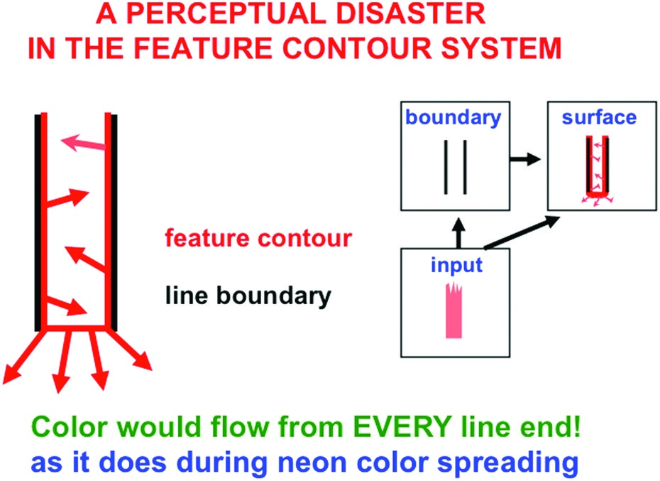
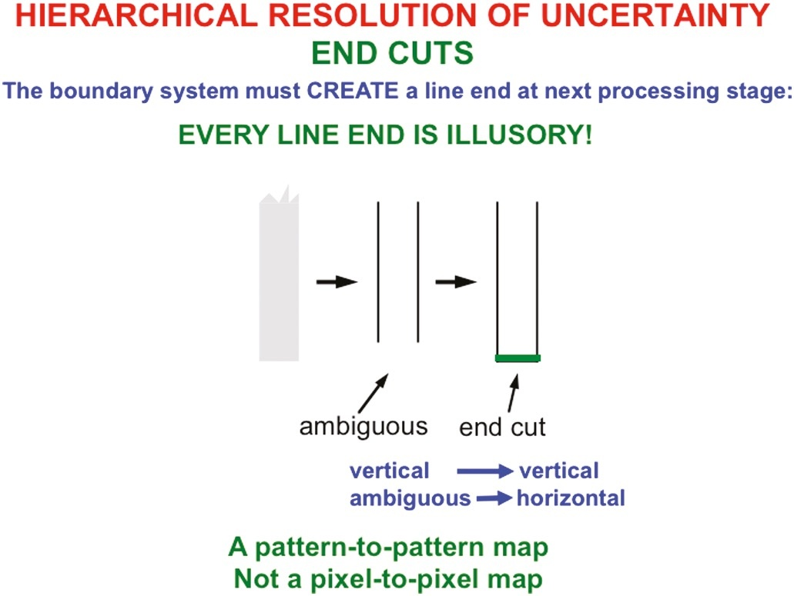
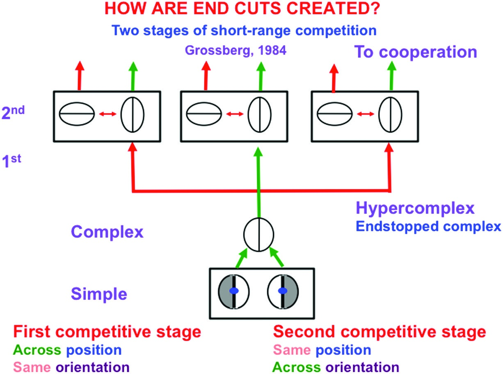
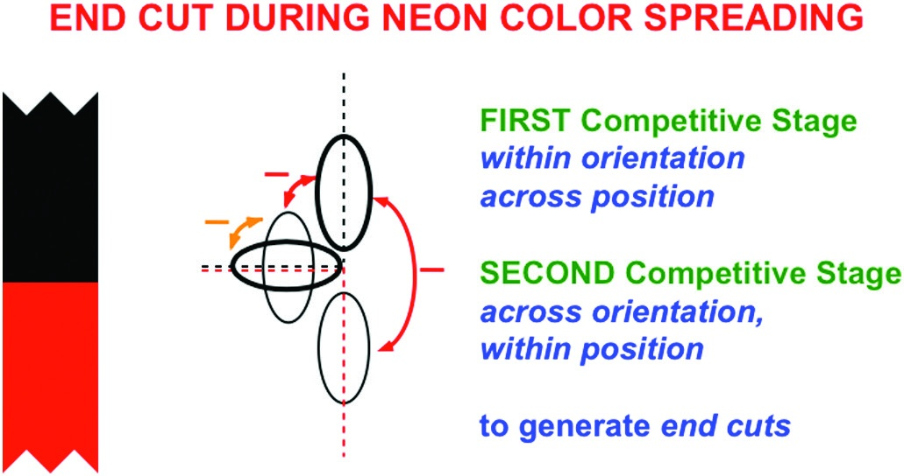
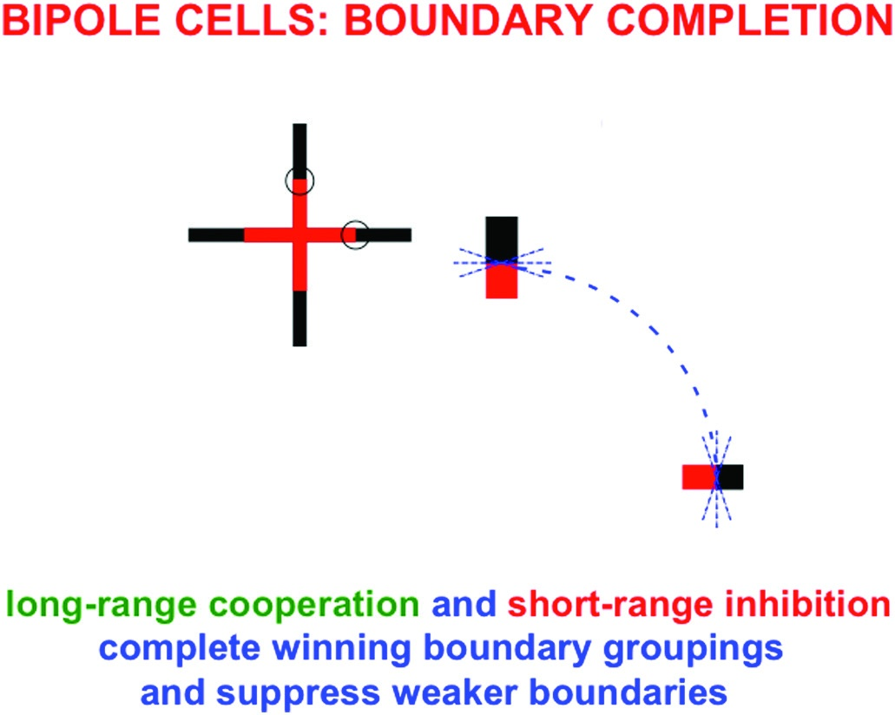
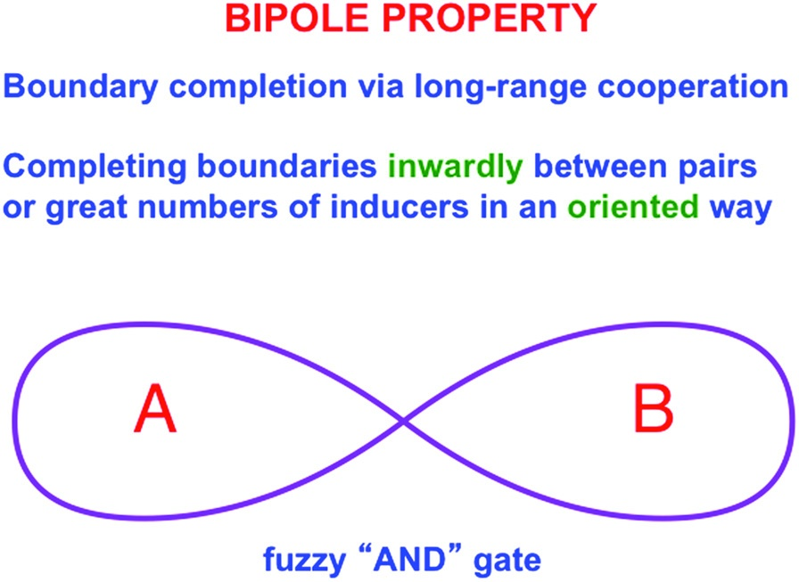
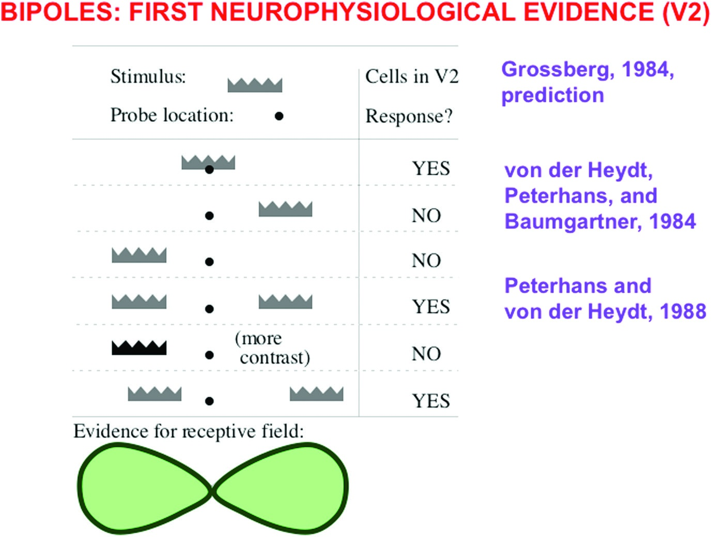
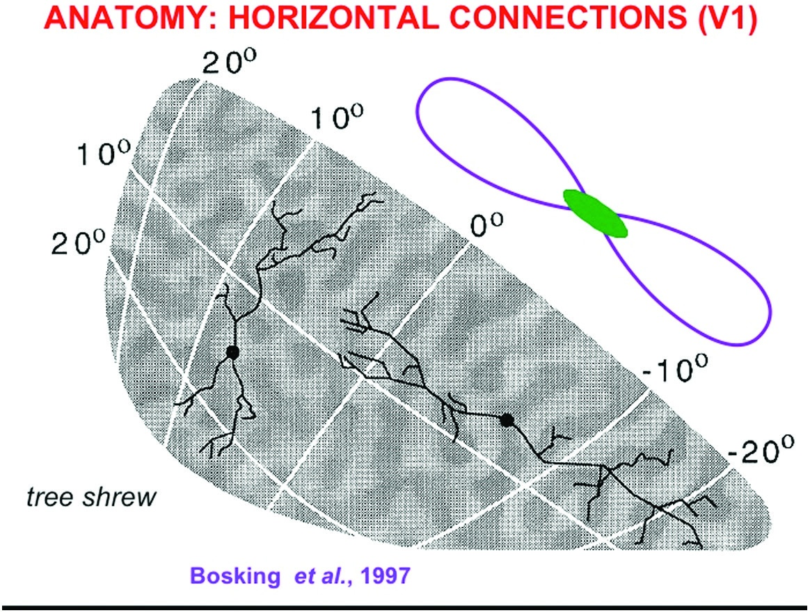
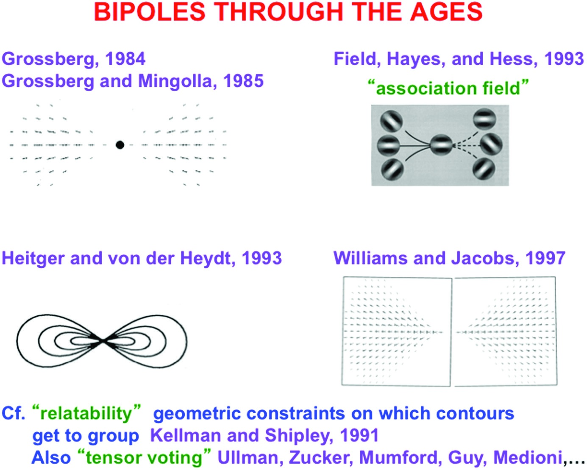
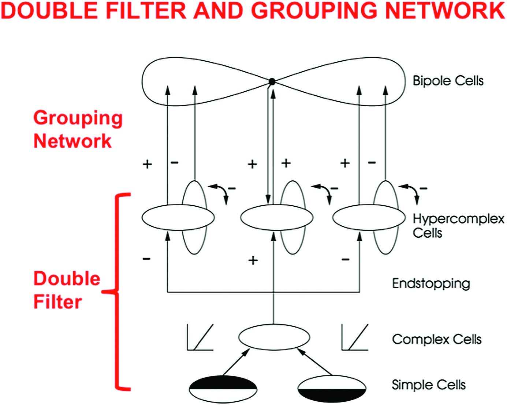

# Grossberg Ch.4 — Chunk 4: End Cut, 바이폴 세포, 세 가지 불확실성 (pp. 148-153)

> 원문: Stephen Grossberg, *Conscious MIND Resonant BRAIN*, Chapter 4, pp. 148-153
> 섹션 14-19: 지각적 재난, End Cut, 단거리 경쟁, 바이폴 세포, 세 가지 불확실성의 계층적 해결, 이중 필터 네트워크

---

## 14. 지각적 재난: 통제되지 않는 채우기

> [해설] §14의 수사적 기능
>
> §13에서 불확실성 원리가 end gap을 예측했다면, §14는 이 end gap이 해결되지 않을 경우 시각이 어떻게 완전히 망가지는지를 보여준다. Grossberg는 이 절에서 의도적으로 극적인 언어("재난", "통제 불능")를 사용한다. 목적: **해결책(§15-17)의 필요성과 우아함을 강조**하기 위해 문제의 심각성을 최대로 부각시킨다.

### End Gap이 닫히지 않으면 무슨 일이 일어나는가?

<figure>

<figcaption><strong>그림 4.23</strong> — End gap이 닫히지 않으면 모든 선분 끝에서 색이 흘러나온다! 수직 선분의 끝에서 수평 경계 신호가 빠져 있으므로, BCS 경계에 구멍이 생긴다. FCS에서 조명 할인 후 남은 특징 윤곽 신호가 이 구멍을 통해 새어나와, 선분 끝마다 색과 밝기가 통제 불능으로 확산된다.</figcaption>
</figure>

End gap이 뇌의 다음 처리 단계에서 닫히지 않는다면, 연쇄 효과가 발생한다:

1. BCS 경계에 선분 끝마다 구멍이 있음
2. FCS의 특징 윤곽 신호(조명 할인 후 남은 밝기/색 대비)가 이 구멍으로 새어나감
3. 결과: **모든 선분 끝에서 색과 밝기가 통제 불능으로 확산**

### 재난의 규모

이 재난이 상상적이지 않은 이유: 우리가 일상에서 보는 거의 모든 물체에 **선분 끝과 모서리**가 있다. 글자, 가구의 가장자리, 나뭇가지, 머리카락, 손가락, 건물의 모서리 — 모든 곳에서 end gap이 생길 수 있다.

만약 이 모든 위치에서 색이 새어나간다면:
- 글자를 읽을 수 없음 (획 끝마다 색 유출)
- 물체 경계가 흐려짐 (물체 모서리마다 색 유출)
- 공간 위치를 파악할 수 없음 (선분 기반 위치 판단 불가능)
- 전체 장면이 색의 범람으로 덮임

> [발표 포인트] 이 문제의 보편성
>
> End gap은 특정 착시 자극에만 나타나는 것이 아니다. **모든** 시각 자극에서, 선분 끝과 모서리가 있는 모든 위치에서 필연적으로 발생한다. 이것이 불확실성 원리(§13)의 함의다. 뇌가 end cut 메커니즘을 진화시키지 않았다면, 인간 시각은 현재의 기능을 가질 수 없었을 것이다.

### 패턴-대-패턴 맵의 필요성

<figure>

<figcaption><strong>그림 4.24</strong> — End cut은 패턴-대-패턴(pattern-to-pattern) 맵이 필요하다. 개별 뉴런이 독립적으로 작동하는 픽셀 단위 연산으로는 end cut을 생성할 수 없다. 수직 방향 세포들의 전역적 활성화 패턴을 입력으로 받아 경계 패턴을 출력하는 변환이 필요하다.</figcaption>
</figure>

> **핵심**: end cut은 **픽셀 단위**가 아닌 **패턴 단위**의 변환이다. 개별 뉴런이 아닌, 수직 반응의 **전역적 맥락**에 민감한 패턴-대-패턴 맵이 필요하다.

이유: End gap이 있는 위치(선분 끝)에서는 **상향식 입력이 없다**. 그 위치의 뉴런 혼자서는 아무런 단서도 받지 못한다. 따라서 이웃 위치의 활성화 패턴을 참조하여 끝 위치를 추론해야 한다. 이것이 §16의 "패턴으로 계산하기" 원리의 등장 배경이다.

---

## 15. 모든 선분 끝은 환상이다!

> [해설] §15의 도전적 주장
>
> 이 한 줄짜리 절의 제목은 이 장에서 가장 도전적인 선언 중 하나다: **"모든 선분 끝은 환상이다!"** 일상적 직관과 정면으로 충돌하는 이 주장은 Grossberg 이론의 핵심 통찰을 압축한다.

### End Cut의 등장

시각 시스템은 end gap을 BCS의 다음 처리 단계에서 **닫아야** 한다. 이렇게 완성된 경계를 **end cut**이라 한다.

> **"모든 선분 끝은 환상이다!"** — End cut은 뉴런이 아무런 상향식(bottom-up) 입력을 받지 않는 위치에서 구성되기 때문에, 시각적 환상(illusion)이다.

이 주장이 왜 도전적인가?

- 우리가 보는 모든 선분에는 "끝"이 있다 (글자 획 끝, 가구 모서리, 연필 끝 등)
- 이 모든 끝은 뇌가 **스스로 만들어낸** 경계다
- 자극 자체에는 끝 위치의 경계 신호가 없다 — 단순 세포가 그 위치에서 반응하지 않으므로
- 따라서 **일상의 모든 시각 경험**은 이미 환상을 포함한다

### 왜 환상인가 — 더 정확한 표현

"환상"이라는 단어는 오해를 부를 수 있다. Grossberg가 뜻하는 것은:

| 일상적 "환상" | Grossberg의 "환상" |
|-------------|-----------------|
| 실제로 없는 것을 본다 (예: 신기루) | 물리적 자극에 대응하는 국소 신호 없이 뇌가 경계를 구성함 |
| 잘못된 지각 | **적응적이고 유용한** 구성 |
| 드물게 일어남 | 모든 시각에서 일어남 |

End cut은 "잘못된" 지각이 아니라 **뇌가 불완전한 입력을 완성하는 능동적 과정**의 결과다. 이것이 환상적이라면, 대부분의 의식적 지각이 환상적이다 — 이것이 §9의 FACADE 이론 철학과도 맞닿는다.

### 불확실성의 계층적 해결 (두 번째 사례)

이것은 §4에서 소개한 **불확실성의 계층적 해결** 패턴의 두 번째 사례다:

| 사례 | 정보 손실 단계 | 복원 단계 |
|------|-------------|---------|
| 1번 (§4) | 조명 할인이 연속적 표면 정보를 이산적 윤곽으로 변환 | 채우기가 연속적 표면 표현 복원 |
| 2번 (§15) | 불확실성 원리가 선분 끝에 end gap 생성 | End cut이 경계 완성 |

두 사례 모두 **정보 손실 -> 복원**의 2단 구조를 가진다. 각 단계의 처리가 정보를 왜곡하지만, 다음 단계가 그 왜곡을 보상한다.

### 로마 서체의 세리프 — 일상 속의 end cut 힌트

흥미로운 관찰: Times New Roman 같은 서체는 선분 끝에 작은 **세리프(serif)** — 가로 마감 획 — 을 붙인다. 이 세리프의 기능 중 하나는 뇌가 end cut을 스스로 만들 필요를 **줄여주는** 것이다.

왜 세리프가 있는 서체가 긴 글의 본문에서 선호되는가? 뇌가 선분 끝마다 end cut을 만드는 계산 부담을 덜어주기 때문이다. 세리프가 이미 수평 경계 신호를 제공하므로, 단순 세포가 그 위치에서 직접 반응할 수 있다.

> [해설] 이 관찰의 인식론적 의미
>
> 인쇄 타이포그래피의 진화가 시각 신경과학과 수렴했다는 흥미로운 사실. 수세기에 걸친 타이포그래퍼들의 경험적 지식이 Grossberg가 수학적으로 예측한 end cut 메커니즘을 간접적으로 확인한다. "세리프가 읽기 쉽게 만든다"는 전통적 지식의 신경학적 기반이 드러난 것이다.

---

## 16. 패턴으로 계산하기

> [해설] 이 절에 대한 상세 발표 자료가 별도로 작성됨
>
> §16 "패턴으로 계산하기"와 §16 내부의 "단거리 경쟁: 공간과 방향에 걸쳐" 섹션(원서의 §27-28)에 대한 매우 상세한 해설은 `presentation_sec27_28.md`에 있다. 이 chunk에서는 핵심 요지만 정리한다.

### 핵심 요지

End cut 생성 메커니즘: **두 단계의 단거리 경쟁(short-range competition)**

<figure>

<figcaption><strong>그림 4.25</strong> — End cut을 생성하는 단순·복잡·초복잡 세포 네트워크. 공간 경쟁 + 방향 경쟁의 두 단계로 end cut이 형성된다.</figcaption>
</figure>

| 단계 | 유형 | 결과 속성 |
|------|------|--------|
| **1단계** | 공간 경쟁 (on-center off-surround) | 위치적 초과민성 (선분 끝의 정확한 위치) |
| **2단계** | 방향 경쟁 (push-pull) | 방향적 퍼짐 (수직 근방 방향 대역) |

**초복잡 세포(hypercomplex cells, endstopped complex cells)**:
- Hubel & Wiesel 발견; 자극이 수용장을 넘으면 반응 감소
- End cut 생성의 핵심 세포; V2에서 주로 발견

**신경생리학적 증거 — von der Heydt, Peterhans, Baumgartner (1984, 1989)**:
- V1 단순/복잡 세포: 선분 끝 반응 없음
- V2 세포: 선분 끝 반응 있음 + 방향적 퍼짐 확인
- End cut 예측의 직접적 검증

> 상세 설명은 `presentation_sec27_28.md` 참조.

---

## 17. 바이폴 세포와 장거리 협력적 경계 완성

> [해설] §17의 위치: 세 번째 불확실성의 해결
>
> §16이 **단거리 경쟁**으로 end cut을 만들었다면, §17은 **장거리 협력**으로 경계를 완성하는 바이폴 세포를 도입한다. 이것은 세 번째 불확실성의 계층적 해결 — 유도인자들이 흩어져 있을 때 어떻게 하나의 연속 경계를 만드는가 — 의 핵심이다.
>
> 왜 세 번째 해결이 필요한가? 맹점, 망막 혈관, Kanizsa 사각형, 가려진 물체 — 이 모든 경우에 **유도인자 사이에 틈**이 있다. 이 틈을 "뛰어넘어" 경계를 완성하는 것이 바이폴 세포의 역할이다.

### 네온 색 확산에서의 End Cut

<figure>

<figcaption><strong>그림 4.26</strong> — 네온 색 확산 중에 end cut이 형성되는 방식. 빨간 십자가 끝의 end gap이 §16의 단거리 경쟁에 의해 처리되지만, 검은 십자가의 강한 경쟁 때문에 완전히 닫히지 않는다. 이 부분적 end gap을 통해 빨간색이 흘러나오고, 에렌슈타인 환상 윤곽 안에서 멈춘다.</figcaption>
</figure>

네온 색 확산(§7에서 소개)은 이제 완전히 설명된다:
1. 빨간 십자가 끝의 경계가 검은 십자가의 강한 경쟁에 의해 약화됨 (단거리 경쟁)
2. 부분적 end gap이 생겨 빨간색이 흘러나옴
3. 흘러나온 빨간색은 검은 선분 끝들이 장거리 협력으로 만든 에렌슈타인 환상 윤곽에서 멈춤 (장거리 협력)

이것이 §7에서 약속한 "세 가지 불확실성의 결합 효과"의 완전한 그림이다.

### 장거리 협력이 필요한 이유

<figure>

<figcaption><strong>그림 4.27</strong> — 바이폴 세포가 경계를 완성하는 방식. 공선적(collinear) 유도인자들이 양쪽 극에서 바이폴 세포를 활성화시키면, 두 유도인자 사이의 빈 공간에 경계가 완성된다. 이것은 단순 세포나 복잡 세포의 국소 반응으로는 불가능하다.</figcaption>
</figure>

장거리 상호작용이 필요한 상황들:

| 상황 | 왜 장거리가 필요한가 |
|------|------------------|
| **맹점** | 망막의 맹점 영역에는 상향식 입력이 전혀 없음 |
| **망막 혈관** | 혈관이 시각 정보를 차단하는 영역 |
| **Kanizsa 사각형** | 팩맨 유도인자 사이의 빈 공간에서 경계 완성 |
| **가려진 물체** | 앞 물체에 의해 가려진 뒷 물체의 경계 완성 |

모든 경우에 공통점: **떨어진 유도인자 사이의 틈을 메우는** 경계 완성이 필요하다.

### 바이폴 세포의 구조

<figure>

<figcaption><strong>그림 4.28</strong> — 바이폴 세포의 수용장 구조. 수용장이 두 개의 방향성 가지(pole A, pole B)로 나뉘며, 대부분 두 가지가 공선적으로 배열된다. 세포는 양쪽 가지 모두에서 입력을 받아야 발화한다 — 퍼지 AND 게이트처럼 작동한다.</figcaption>
</figure>

Grossberg가 1984년에 예측한 **바이폴 세포(bipole cell)**의 핵심 속성:

| 속성 | 의미 |
|------|------|
| **두 개의 가지(pole A, pole B)** | 수용장이 공간적으로 분리된 두 영역으로 구성 |
| **공선적 배열** | 대부분의 바이폴 세포에서 두 가지가 같은 직선 위에 있음 |
| **퍼지 AND 게이트** | 양쪽 가지 **모두**에서 입력을 받아야 발화 |
| **안쪽 경계 형성** | 두 유도인자 사이의 공간에 경계를 완성 |

**퍼지 AND의 중요성**: 한쪽 가지만 활성화되어도 약간의 반응은 있지만, 양쪽이 모두 활성화되어야 강한 반응이 나온다. 이 비선형성이 장거리 협력의 핵심이다 — 외로운 유도인자가 임의로 경계를 만들지 못하고, 짝을 이룰 유도인자가 있어야 경계가 완성된다.

> [해설] "안쪽으로(inwardly) 형성"의 의미
>
> 바이폴 세포는 두 유도인자 **사이**의 빈 공간에 경계를 만든다 (유도인자의 바깥쪽이 아님). 이것이 경계와 표면의 상보성(그림 3.7)의 한 구현이다:
>
> - 경계: 유도인자 **안쪽**에서 형성 (유도인자를 연결)
> - 표면: 경계 **안쪽**으로 채워짐 (경계가 담는 공간)
>
> 둘 다 "안쪽"이지만 의미가 다르다. 경계는 유도인자가 가리키는 **안쪽 공간**(둘 사이)을 채우고, 표면은 경계가 감싸는 **안쪽 공간**(경계 내부)을 채운다. 이 상보적 "안쪽" 작동이 합쳐져 지각을 만든다.

### 신경생리학적 증거

<figure>

<figcaption><strong>그림 4.29</strong> — V2에서의 바이폴 세포 증거. von der Heydt, Peterhans, Baumgartner(1984)의 V2 기록에서, 수용장의 양쪽 극이 모두 활성화되어야 발화하는 세포들이 발견되었다. 이는 Grossberg(1984)의 바이폴 세포 예측과 일치한다.</figcaption>
</figure>

<figure>

<figcaption><strong>그림 4.30</strong> — V1 내 장거리 수평 연결의 해부학적 증거. Bosking et al.(1997)의 V1 추적 연구에서, 두 개의 수용장/극을 가진 장거리 수평 연결이 확인되었다. 주로 피질 Layer 2/3에서 발견된다.</figcaption>
</figure>

핵심 증거 세 가지:

1. **von der Heydt et al. (1984)** — V2의 바이폴 반응 세포 기록
2. **Bosking et al. (1997)** — V1 Layer 2/3의 장거리 수평 연결 해부학적 확인
3. **Field, Hayes, Hess (1993)** — "association field" 심리물리 실험으로 바이폴 구조 확인

### 바이폴 세포 연구의 역사

<figure>

<figcaption><strong>그림 4.31</strong> — 바이폴 세포의 역사적 발전. Grossberg의 1984년 이론적 예측에서 시작하여, 여러 연구자들이 다양한 접근으로 유사한 구조를 발견했다.</figcaption>
</figure>

| 연구자 | 연도 | 기여 |
|--------|------|------|
| **Grossberg** | 1984 | 바이폴 세포 이론적 예측 |
| Grossberg & Mingolla | 1985 | 수용장 상세 모델, 네온 색 확산 설명 |
| Heitger & von der Heydt | 1993 | 신경생리학적 모델 |
| Field, Hayes, Hess | 1993 | "Association field" — 심리물리적으로 유사 구조 |
| Williams & Jacobs | 1997 | 컴퓨터 비전 응용 |
| Kellman & Shipley | 1991 | "Relatability" 조건 — 곡선 보간 |

**요점**: 1984년 Grossberg의 단일 예측이 여러 독립적인 접근에서 수렴했다. 이것은 강한 이론적 타당성의 증거다.

### 협력-경쟁 피드백이 최종 그루핑을 선택

바이폴 세포만으로는 복잡한 장면에서 정확한 경계 선택이 불가능하다. Grossberg의 모델은 **CC Loop(cooperative-competitive loop, 협력-경쟁 루프)**를 도입한다:

```
CC Loop의 작동:

1. 활성 바이폴 세포 -> 같은 방향/위치의 초복잡 세포 흥분 (피드백)
   (협력)
                   |
                   v
2. 이 양성 피드백이 특정 그루핑을 강화
                   |
                   v
3. 강화된 초복잡 세포 -> 다른 방향/위치 세포와 경쟁
   (경쟁)
                   |
                   v
4. 가장 강한 그루핑이 승리, 약한 그루핑은 억제
```

**CC Loop의 특성**:
- **비매개변수적(nonparametric)**: 사전에 고정된 매개변수 없이 작동
- **실시간 자율(real-time autonomous)**: 외부 감독 없이 자기 조직화
- **아날로그(analog)**: 전부 아니면 전무가 아닌 연속적 강도 출력

---

## 18. 의식 다시!: 세 가지 불확실성의 계층적 해결

> [해설] §18의 종합적 역할
>
> §18은 지금까지의 논증을 의식 이론의 관점에서 종합한다. §6에서 "왜 공명인가?"라는 질문을 제기했을 때, Grossberg는 "세 가지 불확실성의 해결"이 의식의 전제 조건이라고 선언했다. §18은 이제 그 세 가지를 명시적으로 정리하고, 공명(의식)과의 연결을 다시 확인한다.

### 세 가지 불확실성의 계층적 해결 — 완전 정리

| 해결 | 메커니즘 | 극복하는 불확실성 | 등장 절 |
|------|----------|----------------|--------|
| **1차** | 공간·방향 경쟁 | 단순 세포의 경계 불확실성 -> end cut 생성 | §13-16 |
| **2차** | 바이폴 그루핑 피드백 | 초기 퍼진 그루핑의 불확실성 -> 날카로운 경계 선택 | §17 (CC Loop) |
| **3차** | 표면 채우기 | 조명 할인에 의한 불확실성 -> 표면 밝기/색상 복원 | §3-5 |

주목: 해결의 **순서**가 중요하다. 시각 입력 -> 조명 할인(3차의 출발) -> 경계 신호 -> end cut(1차) -> 그루핑 선택(2차) -> 채우기(3차의 완성). 세 가지가 병렬이 아닌 **상호작용적 계층**으로 작동한다.

### 공명과 의식적 인식의 촉발

> 이 세 가지 불확실성이 모두 해결된 후에야, 경계가 완성되고 표면이 채워져, 적응적 행동을 제어하기에 충분히 완전하고 안정적인 시각 표현이 생성된다. 이 표현은 **표면-감싸개 공명(surface-shroud resonance)**에 의해 의식적 인식으로 표시된다.

왜 이 순서가 중요한가?
- **불완전한 경계**는 잘못된 표면 채우기를 유발 (§14의 재난)
- **잘못된 그루핑**은 적응적 행동을 방해
- **왜곡된 표면 색상**은 물체 인식을 방해

이 모든 것이 해결되어야만, 뇌가 **"세계가 이렇다"**고 자신 있게 선언할 수 있다. 공명은 이 자신감의 신경학적 신호다 — 위아래 피질 층들이 서로 일치하는 정보를 주고받을 때 발생하는 동기화된 활동.

> [발표 포인트] 공명 개념의 독특성
>
> Grossberg의 공명(resonance) 개념은 흔한 "뇌 동기화(synchronization)" 이론과 다르다. 공명은:
> - 단순한 시간적 동기 아님 — 피드백 루프의 평형 상태
> - 상향식 신호와 하향식 기대의 **매치** 결과
> - 자극 -> 표현 -> 매치 확인 -> 공명 -> 의식
>
> 이것은 ART(Adaptive Resonance Theory, 적응적 공명 이론)의 핵심이며, Grossberg가 50년간 발전시킨 이론이다. 4장은 이 이론의 시각 영역 실현을 보여준다.

---

## 19. 이중 필터와 그루핑 네트워크

> [해설] §19의 구조화 역할
>
> §10-18에서 소개한 많은 세부 회로들을 §19가 두 개의 **기능적 단위**로 묶는다: 이중 필터(double filter)와 그루핑 네트워크(grouping network). 이 추상화는 이후 장들(3D 시각, 주의, 인식)에서 반복적으로 사용될 개념적 도구가 된다.

### BCS의 두 기능 단위

<figure>

<figcaption><strong>그림 4.32</strong> — 이중 필터와 그루핑 네트워크. 전체 BCS 회로가 두 개의 기능적 모듈로 분해된다: (1) 단순 세포와 복잡 세포의 이중 필터가 국소 방향성 경계를 추출하고, (2) 바이폴 세포와 초복잡 세포의 그루핑 네트워크가 장거리 경계를 완성한다.</figcaption>
</figure>

### 이중 필터(Double Filter)

이중 필터는 두 개의 연속된 필터링 단계로 구성된다:

**1차 필터 — 단순 세포의 방향성 수용장:**
- Gabor 필터 또는 DoG 필터 구조
- 국소 대비와 방향 추출
- 홀수/짝수 수용장 구별

**2차 필터 — 공간 경쟁(endstopping):**
- 초복잡 세포의 끝정지 속성 구현
- 1차 필터보다 **더 큰** 공간 스케일에서 작동
- 선분 끝, 모서리 검출

**왜 두 필터의 공간 스케일이 다른가?** 1차 필터가 국소 방향을 추출하면, 2차 필터가 **그 방향 활성화의 변화(gradient)**를 검출한다. 변화는 국소보다 넓은 맥락에서만 의미가 있으므로, 2차 필터의 수용장이 더 커야 한다.

### 그루핑 네트워크(Grouping Network)

그루핑 네트워크는 바이폴 세포와 초복잡 세포 간의 **CC Loop**다 (§17):
- 바이폴 세포 -> 피드백 -> 초복잡 세포 흥분 (협력)
- 흥분된 초복잡 세포들 간의 경쟁 (경쟁)
- 최종 경계 그루핑 선택

### 이중 필터 + 그루핑 네트워크 = 경계 완성

두 모듈이 함께 작동하여 다음을 설명한다:

| 현상 | 관련 모듈 |
|------|--------|
| 단순 방향 대비 검출 | 이중 필터 (1차) |
| End cut 생성 | 이중 필터 (2차) |
| 환상적 윤곽 완성 | 그루핑 네트워크 |
| 질감 분리 | 이중 필터 + 그루핑 네트워크 |
| 초과민성 | 이중 필터 (2차, §25) |
| 환상적 윤곽 강도의 역U자 | 그루핑 네트워크 (§26) |

§20부터 Grossberg는 이 이중 필터 + 그루핑 네트워크 프레임워크로 다양한 시각 현상을 설명한다.

> [해설] 모듈화의 장점
>
> §19의 두 모듈로 분해는 인식론적 중요성이 있다: 각 모듈이 독립적으로 개선되거나 대체될 수 있다. 예를 들어 3D 시각에서는 이중 필터에 깊이 정보가 추가되고, 그루핑 네트워크는 깊이별로 분리된다. 주의 시스템이 추가되면, 주의가 그루핑 네트워크에 피드백을 준다.
>
> 이 모듈화는 Grossberg가 말하는 **"최소 해부학의 방법"**(§37)의 구현이다 — 최소한의 구조로 최대한의 현상을 설명하고, 필요할 때만 확장한다.

---

## Chunk 4 핵심 개념 정리

| 개념 | 설명 | 등장 맥락 |
|------|------|---------|
| **지각적 재난** | End gap이 닫히지 않으면 모든 선분 끝에서 색 유출 | §14 |
| **패턴-대-패턴 맵** | End cut은 픽셀 단위가 아닌 활성화 패턴 전체의 변환 | §14 |
| **End cut** | 뉴런이 상향식 입력을 받지 않는 위치에서 만들어지는 환상 경계 | §15 |
| **"모든 선분 끝은 환상이다"** | 일상의 모든 선분 끝 지각이 뇌의 구성 결과임 | §15 |
| **초복잡 세포** | 끝정지 속성 가진 복잡 세포; end cut 생성 담당 | §16 |
| **바이폴 세포** | 두 공선적 극을 가진 퍼지 AND 세포; 장거리 경계 완성 | §17 |
| **CC Loop** | 바이폴-초복잡 세포 간 협력-경쟁 피드백; 최종 그루핑 선택 | §17 |
| **세 가지 불확실성의 계층적 해결** | 경계(1차+2차) + 표면(3차) = 완전한 지각 표현 | §18 |
| **표면-감싸개 공명** | 의식적 인식을 촉발하는 시각 공명 | §18 |
| **이중 필터** | 단순 세포 + 공간 경쟁; 국소 방향 + 끝 검출 | §19 |
| **그루핑 네트워크** | 바이폴 + 초복잡 세포 CC Loop; 장거리 완성 | §19 |

---

> **다음 Chunk 5 (pp. 153-163)**: 불확실성과 함께 살기, 베이즈 없는 뇌의 철학, 질감 분리, T-교차점과 공간적 불투과성, Banksy 그래피티와 Mooney 얼굴, 초과민성, 환상적 윤곽 강도의 역U자 곡선. 후반부(3D 시각과 전경-배경 분리)로의 전환점.
