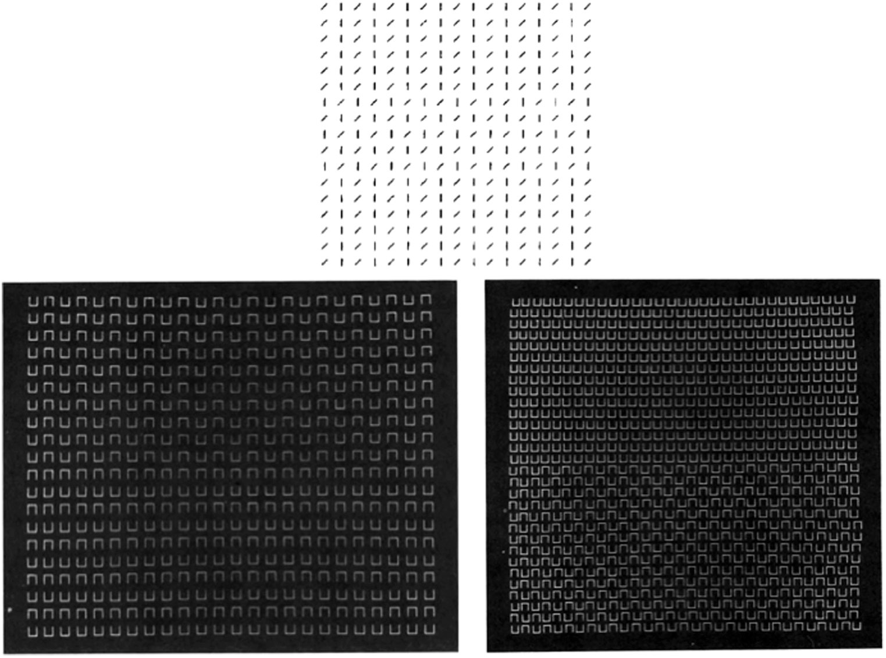
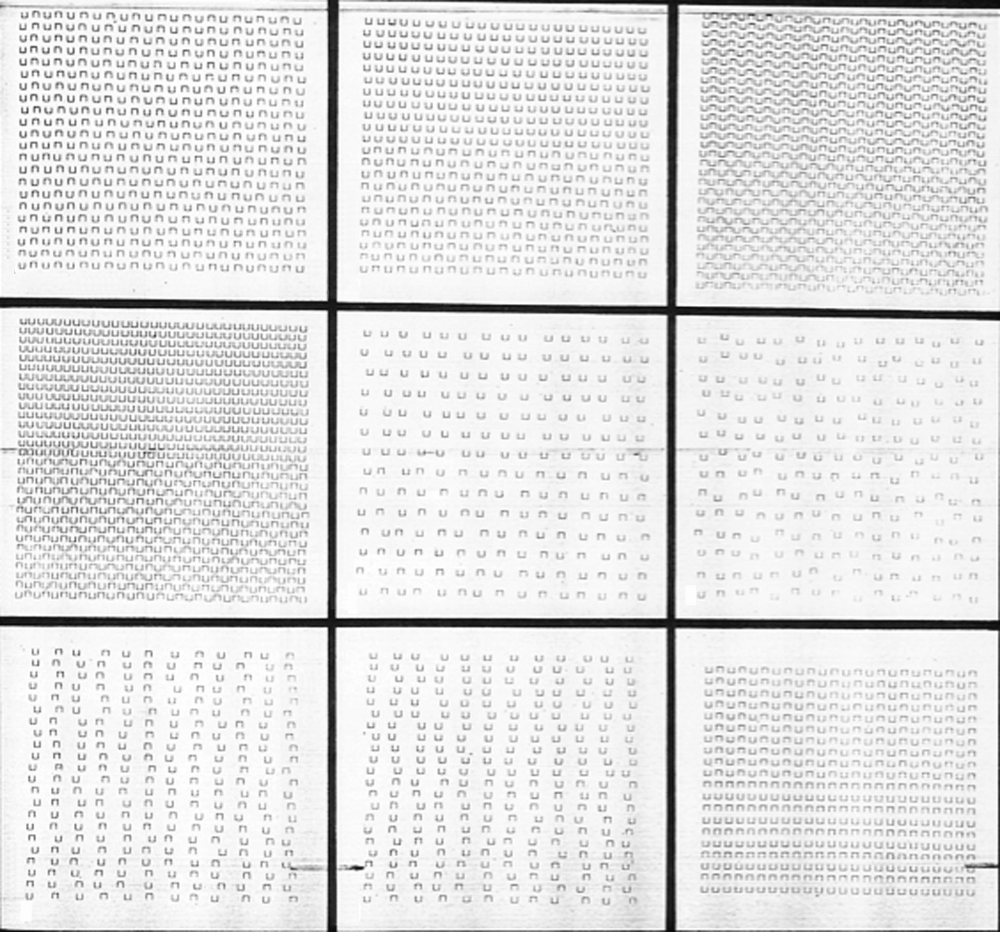
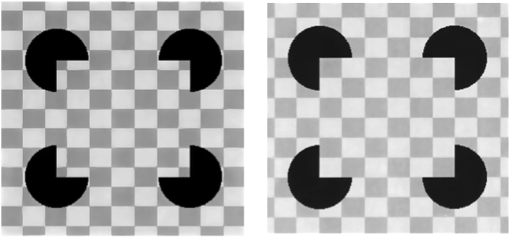
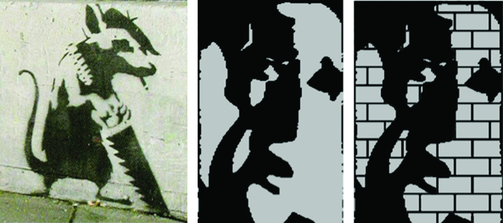
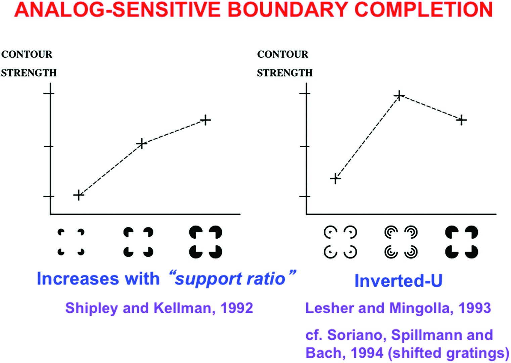
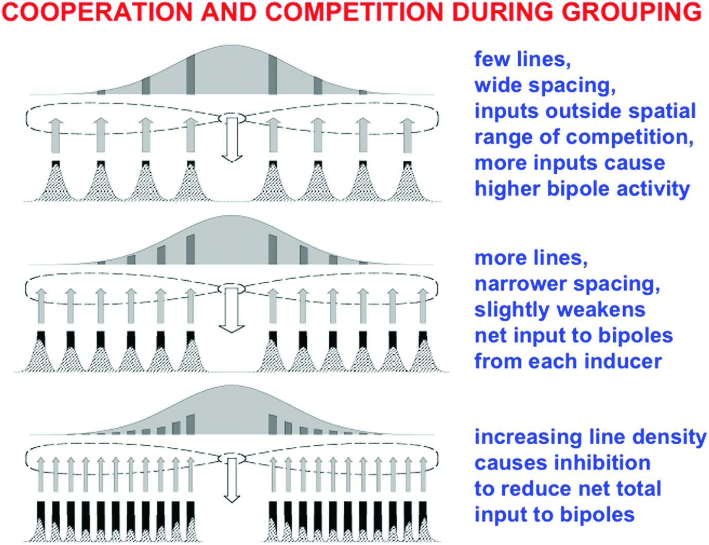

# Grossberg Ch.4 — Chunk 5: 불확실성, 베이즈, 질감, T-교차점, 초과민성 (pp. 153-163)

> 원문: Stephen Grossberg, *Conscious MIND Resonant BRAIN*, Chapter 4, pp. 153-163
> 섹션 20-26: 불확실성과 함께 살기, 베이즈 없는 뇌, 질감 분리, 공간적 불투과성과 T-교차점, Banksy와 Mooney 얼굴, 초과민성, 환상적 윤곽 강도의 역U자 곡선

---

## 20. 불확실성과 함께 살기

> [해설] 장 후반부의 시작 — 철학적 재조정
>
> 4장 전반부(§1-19)가 BCS와 FCS의 구체적 회로에 집중했다면, §20부터는 더 넓은 **계산적 철학**으로 시야를 확장한다. Grossberg는 여기서 잠시 멈추고, 지금까지의 모든 메커니즘이 공유하는 공통된 원리를 명시한다: **불확실성과 공존하는 계산**.
>
> 이것은 §21의 "베이즈 없는 뇌"와 §22부터의 질감 분리 설명으로 이어지는 철학적 다리 역할을 한다.

### 뇌의 계산 단위는 무엇인가?

Grossberg가 여기서 제시하는 핵심 원리:

> **뇌의 계산 단위는 종종 공간적으로 분포된 세포 네트워크의 활성화 패턴(activation pattern)이다.**

개별 뉴런 하나의 활동이 아니라, 뉴런들의 **집단 활성화 패턴**이 정보의 운반자다. 이 원리는 §14의 "패턴-대-패턴 맵"과 일치하며, 뇌 계산의 본질적 특징을 드러낸다.

### 초기 처리에서의 불확실성

초기 시각 처리 단계에서 이 패턴은 자주 **모호하거나 불완전하다**. 네트워크가 처리할 수 있는 **가능성의 범위(range of possibilities)**를 나타낸다는 점에서, 하나의 확정된 답이 아닌 여러 후보의 분포를 인코딩한다.

예시:
- 위치-방향 불확실성: 단순 세포의 활성화는 방향 정보를 가지지만 끝 위치는 모호
- 바이폴 그루핑 피드백 전: 여러 가능한 그루핑이 동시에 활성화
- End cut 생성 전: 방향적 퍼짐이 있는 여러 후보

### 핵심 원리 세 가지

| 원리 | 의미 |
|------|------|
| **불확실성은 자연스럽다** | 처리의 오류가 아닌, 정보 통합을 기다리는 상태 |
| **나중 단계의 맥락이 해결한다** | 시간이 지나고 추가 정보가 누적되면 모호함이 감소 |
| **활성화 패턴은 실시간 확률 분포** | 더 큰 활성화 = 더 높은 후보 확률 |

이 관점에서:
- 초기 모호함 -> "가능성의 지도"
- 맥락 유입 -> 가능성 분포의 좁혀짐
- 공명 촉발 -> 단일 해석으로 수렴

### "실시간 확률 분포"의 의미

정규화된 활성화 패턴은 **실시간 확률 분포**처럼 작동한다:
- 각 세포의 활성화 = 그 세포가 표현하는 가능성의 "확률"
- 모든 활성화의 합 = 1로 정규화 가능 (경쟁 네트워크)
- 더 많이 활성화된 뉴런 -> 더 가능성 높은 해석

그러나 이것은 **고전적 확률과는 다른** 실시간 버전이다:
- 사전 확률(prior) 없이 작동
- 데이터와 맥락에 따라 연속적으로 갱신
- 결정은 확률 샘플링이 아닌 경쟁/협력 동역학으로 이루어짐

> [해설] 왜 이 절이 §21을 예비하는가
>
> §20이 "뇌가 확률 분포처럼 작동한다"고 말했다면, §21은 "그러나 베이지안 통계는 아니다"라고 단서를 단다. 이 구분이 중요하다 — Grossberg는 확률적 처리를 인정하면서도 고전적 확률 이론이 뇌의 **실제 메커니즘**을 포착하지 못한다고 주장한다.

---

## 21. 베이즈 없는 뇌

> [해설] §21의 도전적 입장
>
> 21세기 인지과학의 주류 중 하나는 "베이지안 뇌(Bayesian Brain)" 가설 — 뇌가 베이지안 추론 규칙에 따라 작동한다는 관점이다. §21은 이 주류에 대한 Grossberg의 명확한 반대 입장이다. 이 절은 짧지만 이론적으로 중요하다: 왜 Grossberg의 자기 조직화 모델이 베이지안 프레임워크보다 뇌를 더 잘 설명하는지를 주장한다.

### 베이지안 접근의 기본

베이지안 추론은 다음 공식을 사용한다:

$$P(H|D) = \frac{P(D|H) \cdot P(H)}{P(D)}$$

- $P(H|D)$: 데이터가 주어졌을 때 가설의 확률 (사후 확률)
- $P(D|H)$: 가설이 참일 때 데이터의 확률 (우도)
- $P(H)$: 가설의 사전 확률 (prior)
- $P(D)$: 데이터의 주변 확률

뇌가 베이지안이라는 주장: 지각, 인식, 의사결정이 이 공식과 유사한 계산을 수행한다.

### Grossberg의 네 가지 반론

| 차원 | 베이지안 접근 | 뇌의 실제 방식 |
|-----|------------|-------------|
| **사전 확률** | prior $P(H)$가 필요 | 희귀하지만 중요한 사건에도 적응적 반응 |
| **안정성 가정** | stationarity (통계가 시간에 걸쳐 일정) | 비안정적(nonstationary) 세계에 적응 |
| **설계 원리** | 모델 구조 자체는 설계자가 제공 | 자기 조직화 패턴으로 적응적 반응 달성 |
| **물리적 구현** | 특정 신경 메커니즘 설명 없음 | 신경 메커니즘의 구체적 설명 |

각 반론의 심화:

**반론 1 — 사전 확률 문제**: 베이지안이 작동하려면 $P(H)$가 필요한데, 생애에 한 번 일어날까 말까 한 희귀 사건에 대한 prior는 어떻게 얻어지는가? 베이지안은 "uninformed prior"를 가정하지만, 이 자체가 임의적이다.

**반론 2 — 비안정성 문제**: 베이지안 통계는 환경의 통계가 **일정하다고 가정**한다. 그러나 실제 세계는 끊임없이 변한다 — 새로운 물체, 새로운 조명, 새로운 맥락. 뇌는 이런 비안정성에 **실시간**으로 적응한다.

**반론 3 — 모델 설계 문제**: 베이지안은 "어떤 모델을 사용할 것인가"에 대한 답을 주지 않는다. 모델 구조는 설계자가 제공해야 한다. 반면 뇌의 자기 조직화는 경험에 따라 구조를 **스스로** 만든다.

**반론 4 — 물리적 구현 문제**: "뇌는 베이지안 계산을 한다"는 주장은 **어떻게** 그 계산이 일어나는지를 설명하지 않는다. 어느 뉴런이 prior를 저장하는가? 어느 회로가 우도를 계산하는가?

### Grossberg의 대안

> 뇌는 고전적 확률 형식론을 **넘어서는** 방식으로 정보를 처리한다. 뇌의 **자기 조직화 패턴**은 끊임없이 변하는 세계에 적응하면서도, 실시간 확률적 의사결정의 특성을 가진다.

Grossberg의 대안 — ART (Adaptive Resonance Theory):
- Prior 불필요: 새 패턴이 오면 새 카테고리 생성 가능
- 비안정성에 적응: 경계 이동, 새 카테고리, 기존 카테고리 갱신
- 자기 조직화: 학습 규칙이 구조를 스스로 생성
- 신경 구현: 구체적인 층상 회로로 구현 가능

> [발표 포인트] 이 논쟁의 현재 상태
>
> 베이지안 뇌 가설 vs. Grossberg의 자기 조직화 관점은 현재 인지과학에서 진행 중인 논쟁이다. 두 관점 모두 부분적 진실을 담고 있을 수 있다 — 베이지안 계산은 특정 과제의 **기술(description)** 수준에서 유용하지만, 뇌의 실제 **메커니즘** 수준에서는 Grossberg의 자기 조직화가 더 사실적일 수 있다. David Marr의 분석 수준(계산 / 알고리즘 / 구현) 중 어느 수준을 이야기하느냐에 따라 답이 달라진다.

---

## 22. 질감 분리에서의 창발적 특징

> [해설] §22의 위치: 이론을 복잡한 자극에 적용
>
> §10-19에서 구축한 BCS 회로(이중 필터 + 그루핑 네트워크)가 실제 장면에서 어떻게 작동하는지를 보여주는 구체적 사례로 **질감 분리(texture segregation)**가 등장한다. 질감 분리는 자연 이미지에서 물체를 구별하는 기본 과정이며, BCS의 능력을 극적으로 드러낸다.

### Beck의 질감 실험

<figure>

<figcaption><strong>그림 4.33</strong> — 삼분할·이분할 질감과 창발적 경계 그루핑. Jacob Beck(1983)의 유명한 실험 자극들. 상단: 삼분할 질감 (수직선과 대각선이 섞여 있으나 공선적 그루핑이 보임). 하단 왼쪽: U자와 역U자로 이루어진 이분할 질감 (수직 환상적 윤곽). 하단 오른쪽: 같은 요소로 구성되지만 대각 그루핑이 지배. 같은 구성 요소가 전역적 배치에 따라 다른 그루핑을 만든다.</figcaption>
</figure>

Jacob Beck, Azriel Prazdny, Azriel Rosenfeld(1983)의 실험:

| 질감 유형 | 구성 | 지배적 그루핑 |
|---------|------|-------------|
| **삼분할(tripartite)** (상단) | 수직선과 대각선의 영역 | **공선적(collinear)** 그루핑 |
| **이분할(bipartite)** (하단 왼쪽) | U자와 역U자의 영역 | **수직** 환상적 윤곽 |
| **이분할(bipartite)** (하단 오른쪽) | 같은 구성 (U, 역U) 다른 배치 | **대각** 그루핑 |

### 핵심 교훈: 전역적 배치가 그루핑을 결정한다

같은 구성 요소(U자, 역U자)가 서로 다른 전역적 배치에서 **다른 방향의 그루핑**을 만든다. 이것은:
- 국소 특징만으로는 그루핑을 예측할 수 없음
- 전역적 맥락이 어떤 그루핑이 "승리"할지를 결정
- **창발적 특징(emergent features)**: 개별 요소에는 없지만 전체 배치에서 나타나는 특성

CC Loop(§17)가 이를 설명한다: 여러 그루핑 후보가 동시에 활성화되지만, **협력(같은 방향으로 정렬된 유도인자들이 서로 강화)**과 **경쟁(다른 방향 후보들을 억제)**의 상호작용으로 가장 강한 그루핑이 선택된다.

### 이중 필터로 질감 데이터 설명

<figure>

<figcaption><strong>그림 4.34</strong> — Complex channels 모델과 BCS의 비교. Sutter, Beck, Graham(1989)의 다양한 질감 자극에서, Complex channels 모델과 BCS 모델이 예측하는 구별성 순서. BCS는 모든 질감 자극에서 올바른 순서를 예측하지만, Complex channels 모델은 일부 질감(g와 i)에서 잘못된 순서를 예측한다.</figcaption>
</figure>

Sutter, Beck, Graham(1989)은 다양한 질감 자극에서 지각적 구별성을 측정했다. 두 모델을 비교:

| 모델 | 질감 (g)와 (i)의 구별성 순서 예측 | 결과 |
|------|------------------------------|------|
| **Complex channels** (Graham et al.) | 잘못된 순서 예측 | 실패 |
| **BCS** (Grossberg + 이중 필터) | 올바른 순서 예측 | 성공 |

BCS의 성공 이유: **바이폴 세포의 장거리 그루핑**이 포함됨. Complex channels 모델은 국소 필터 응답만 사용하지만, BCS는 이중 필터 + 그루핑 네트워크의 전체 흐름을 포함한다.

> [해설] 이 비교의 일반적 교훈
>
> Grossberg의 방법론적 교훈: 많은 시각 현상은 국소 필터(심지어 잘 설계된 Gabor 필터)만으로는 설명할 수 없다. 장거리 그루핑을 포함한 **전체 회로**가 필요하다. 이것이 BCS를 단순한 "가장자리 검출" 모델과 구별짓는 핵심이다.

---

## 23. 공간적 불투과성과 T-교차점

> [해설] §23의 역할: 3D 시각의 기반 마련
>
> 4장 후반부의 목표 중 하나는 2D 이미지에서 **3D 해석(전경/배경)**이 어떻게 나오는지를 설명하는 것이다. 그 핵심 열쇠가 **T-교차점**과 그 처리 메커니즘인 **공간적 불투과성**이다. §23은 이 두 개념을 도입한다.

### T-교차점: 가림(occlusion)의 신호

두 선이 교차할 때 "T" 모양을 만든다면, 이것은 시각 시스템에서 특별한 의미를 가진다:
- T의 **가로획**: 앞에 있는 물체의 가장자리
- T의 **세로획**: 뒤에 있는 (가려진) 물체의 가장자리
- 해석: 가로획의 물체가 세로획의 물체를 **가린다**

T-교차점이 어디에나 흔한 이유: 실제 세계에서 앞 물체가 뒷 물체를 가릴 때마다 T-교차점이 생긴다. 이것은 전경-배경 분리의 주요 2D 단서다.

### 공간적 불투과성(Spatial Impenetrability)

BCS 모델의 핵심 속성 중 하나로 Grossberg가 제시하는 것이 **공간적 불투과성**이다:

> **공간적 불투과성**: 한 방향의 초복잡 세포의 출력이 같은 위치의 **다른 방향**의 바이폴 세포를 억제한다 (그리고 그 반대도 마찬가지).

이것의 의미:
- 수직 초복잡 세포가 강하게 활성화됨 -> 같은 위치의 수평 바이폴 세포 억제
- 한 방향의 경계가 **다른 방향의 경계 완성을 차단**
- 차폐된 물체의 경계가 앞에 있는 물체를 **관통하지 못함**

### T-교차점에서의 공간적 불투과성 작동

<figure>

<figcaption><strong>그림 4.35</strong> — 공간적 불투과성이 pac-men 그루핑을 방지한다. 왼쪽: 배경에 수평선이 있는 Kanizsa 자극 — 수평 경계가 수직 바이폴 세포를 억제하여 pac-men 간 수직 그루핑이 방해된다. 오른쪽: 배경에 수직선이 있는 자극 — 수직 경계가 pac-men과 공선적이어서 Kanizsa 사각형이 형성된다.</figcaption>
</figure>

**예시 — Kanizsa 사각형과 배경 선:**

| 배경 조건 | 공간적 불투과성 효과 | 결과 |
|---------|-----------------|------|
| 배경에 **수평** 선들 | 수평 경계가 수직 바이폴 세포 억제 | Kanizsa 사각형 형성 실패 |
| 배경에 **수직** 선들 | 수직 경계가 pac-men과 공선적 | Kanizsa 사각형 정상 형성 |

이 비대칭성은 공간적 불투과성의 존재를 직접 증명한다. 단순한 국소 대비 계산으로는 이 차이를 설명할 수 없다.

### 왜 이것이 전경-배경 분리를 가능하게 하는가

T-교차점에서의 공간적 불투과성 작동:
1. T의 가로획 (앞 물체 경계)이 강하게 활성화
2. 이 강한 가로 경계가 **교차점에서의 세로 바이폴 세포를 억제**
3. 결과: 세로획이 교차점을 통과해 이어지지 않고 **멈춤**
4. 이 멈춤이 "뒤 물체가 가려졌다"는 신경학적 신호

즉, 공간적 불투과성은 **가림의 단서**를 뇌의 회로 수준에서 구현한다. 3D 해석의 물리적 기반이다.

---

## 24. 그래피티 예술가와 Mooney 얼굴

> [해설] §24의 전략: 실세계 관찰과 실험의 수렴
>
> Grossberg는 공간적 불투과성 개념을 두 가지 흥미로운 예시로 구체화한다: 그래피티 예술가 **Banksy**의 작품과 **Mooney 얼굴**. 이 두 예시는 같은 메커니즘이 일상적 예술과 심리학 실험에서 동시에 작동함을 보여준다.

### Banksy와 벽의 차이

<figure>

<figcaption><strong>그림 4.36</strong> — Banksy의 그래피티와 Mooney 얼굴. Banksy는 매끄러운 벽에서는 스텐실 뒤 영역을 채우지 않지만, 벽돌 벽에서는 추가로 색칠한다. 오른쪽: Mooney 얼굴 — 이진화된 얼굴 사진으로 환상적 윤곽을 통해 인식된다.</figcaption>
</figure>

Banksy의 그래피티 작업에서 흥미로운 선택:
- **매끄러운 벽**: 스텐실 뒤 영역을 칠하지 않아도 전경 분리가 잘 됨
- **벽돌 벽**: 스텐실 뒤 영역을 추가로 색칠함

왜 이런 차이가 있는가? BCS의 관점에서:

**매끄러운 벽의 경우:**
- 배경에 방향적 대비 없음
- 관찰자의 바이폴 세포가 스텐실의 경계를 자유롭게 완성
- 그래피티가 전경으로 분리됨

**벽돌 벽의 경우:**
- 배경에 **수평 벽돌 가장자리** 존재
- 이 수평 경계가 **공간적 불투과성**을 활성화
- 스텐실 주변의 환상적 윤곽 형성이 방해됨
- 그래피티가 벽돌 사이로 "뚫어 보임"

Banksy의 해결: 벽돌의 수평 경계를 덮도록 추가 색칠 -> 공간적 불투과성 회피.

> [발표 포인트] 예술가의 직관 = 신경과학 원리
>
> Banksy가 이 원리를 의식적으로 알고 있었을 리 없다. 그는 경험적으로 무엇이 작동하고 무엇이 작동하지 않는지 배웠다. 그러나 그의 해결책은 공간적 불투과성을 정확히 회피하는 방향이다. 수세기간의 예술 기법과 현대 신경과학이 같은 메커니즘을 향해 수렴한다는 것이 흥미로운 점이다.

### Mooney 얼굴

Craig Mooney(1957)가 고안한 **Mooney 얼굴**:
- 얼굴 사진의 밝기를 **이진화**(흑과 백만 남김)
- 중간 톤이 사라져 얼굴 요소가 단편적으로만 남음
- 그럼에도 우리는 얼굴을 **인식**한다

메커니즘 — BCS의 장거리 협력이 작동:
1. 이진화된 흑/백 조각들이 유도인자가 됨
2. 바이폴 세포의 장거리 협력으로 턱, 볼, 이마 사이에 **환상적 윤곽** 생성
3. 완성된 얼굴 경계가 FCS의 채우기를 유도
4. 전체 얼굴 지각 출현

### Mooney + 벽돌 격자 실험

만약 Mooney 얼굴을 벽돌 격자로 오버레이하면:
- 벽돌의 수평선이 공간적 불투과성을 활성화
- 수직 방향 환상적 윤곽 (턱, 볼의 곡선) 형성이 방해됨
- 얼굴 인식이 어려워지거나 불가능해짐

이것은 Mooney 얼굴 인식이 **장거리 환상적 윤곽에 의존**한다는 것을 직접 증명한다. 공간적 불투과성이 그 메커니즘을 차단하면 인식이 무너진다.

> [해설] 이 두 예시가 보여주는 것
>
> Banksy와 Mooney 얼굴은 BCS의 **장거리 협력**(§17)과 **공간적 불투과성**(§23)이 실생활에서 어떻게 상호작용하는지 보여주는 자연 실험이다. 실험실 자극(Kanizsa 사각형 등)이 아닌 실제 예술 작품과 사진에서도 같은 메커니즘이 작동한다는 증거다.

---

## 25. 초과민성과 공간 위치 결정

> [해설] §25의 역할: 두 번째 필터(공간 경쟁)의 정량적 검증
>
> §19에서 이중 필터의 두 번째 단계가 공간 경쟁임을 밝혔다. §25는 이 공간 경쟁이 만드는 구체적인 지각 현상 — **초과민성(hyperacuity)** — 을 실험적으로 검증한다.

### 초과민성이란?

BCS 모델이 설명하는 중요한 현상: 뇌가 어떻게 **수용장 크기보다 훨씬 정밀한** 위치 추정을 달성하는가?

- 단순 세포의 수용장 크기: 약 5-10 시각분(arcmin)
- 인간의 위치 분해능: 약 **5 시각초(arcsec)** — 수용장의 1/100 수준!
- 이 초과민성이 어떻게 가능한가?

### Badcock & Westheimer 실험(1985)

Badcock과 Westheimer(1985)의 고전적 실험:
- 테스트 라인(test line)의 위치를 판단하는 과제
- **플랭킹 라인(flanking line)**을 옆에 추가
- 플랭킹 라인이 테스트 라인의 지각 위치를 **변화시킴**

핵심 결과 — 플랭킹 라인의 효과가 극성에 따라 다르다:

| 플랭킹 라인의 대비 극성 | 테스트 라인 위치 변화 | 메커니즘 |
|--------------------|-------------------|---------|
| **같은 극성** | 플랭킹 쪽으로 **끌림(attraction)** | 단순 세포 수용장 내 풀링 |
| **반대 극성** | 플랭킹에서 **반발(repulsion)** | 공간 경쟁의 억제 효과 |

### 모델의 설명

**같은 극성 — 끌림:**
- 두 선이 모두 같은 극성(예: 밝은 선)
- 같은 방향의 단순 세포가 두 선의 신호를 **공동으로** 풀링
- 결과: 지각된 위치가 두 선의 중심 쪽으로 이동 (끌림)

**반대 극성 — 반발:**
- 한 선은 밝고, 다른 선은 어두움
- 반대 극성 단순 세포들의 출력이 복잡 세포로 풀링됨 (전파 정류, §11)
- 복잡 세포의 활성이 공간 경쟁을 유발
- 공간 경쟁: on-center off-surround -> 주변 억제
- 결과: 지각된 위치가 플랭킹 라인에서 **멀어짐** (반발)

> [해설] 이 결과의 중요성
>
> Badcock-Westheimer 결과는 모델의 세 가지 가설을 동시에 지지한다:
>
> 1. 반대 극성 단순 세포가 **복잡 세포로 풀링**된다 (반파 정류 출력)
> 2. 복잡 세포 출력이 **공간 경쟁**을 활성화한다 (이중 필터의 2차)
> 3. 공간 경쟁이 **초과민성**을 만든다
>
> 세 가설 중 하나라도 틀리면 반발 효과를 설명할 수 없다. 이 단일 실험이 이중 필터 모델 전체를 검증한다.

---

## 26. 환상적 윤곽 강도의 역U자 곡선

> [해설] §26의 역할: 세 번째 필터(그루핑 네트워크)의 정량적 검증
>
> §25가 공간 경쟁을 검증했다면, §26은 **그루핑 네트워크**(바이폴-초복잡 CC Loop)를 검증한다. 이 장의 두 핵심 모듈(§19)이 모두 실험적으로 확인된다.

### Inverted-U 현상

<figure>

<figcaption><strong>그림 4.37</strong> — Kanizsa 사각형의 Inverted-U 윤곽 강도. 유도인자(pac-men) 개수가 증가하면, 처음에는 환상적 윤곽이 강해지지만, 너무 많아지면 다시 약해진다. 윤곽 강도와 유도인자 밀도 사이에 역U자(inverted-U) 관계가 있다.</figcaption>
</figure>

<figure>

<figcaption><strong>그림 4.38</strong> — 바이폴 세포와 단거리 경쟁의 상호작용. 유도인자 밀도가 낮을 때는 바이폴 세포가 약하게 활성화. 밀도가 증가하면 바이폴 활성이 증가. 밀도가 더 증가하면 단거리 공간 경쟁이 강해져 바이폴 입력 감소 -> 역U자 곡선.</figcaption>
</figure>

유도인자 밀도와 환상적 윤곽 강도의 비선형 관계:

```
밀도 낮음   --(증가)-->  밀도 중간  --(증가)-->  밀도 높음
  |                         |                        |
약한 윤곽   -->   강한 윤곽 (peak)   -->    약한 윤곽
```

### 메커니즘 — 협력과 경쟁의 균형

**초기 증가 구간 (밀도 낮 -> 중):**
- 더 많은 유도인자 -> 바이폴 세포가 더 많은 입력을 받음
- 바이폴 활성 증가
- 환상적 윤곽 강도 증가

**감소 구간 (밀도 중 -> 고):**
- 유도인자들이 너무 가까워짐
- 단거리 공간 경쟁(이중 필터 2차)이 강해짐
- 각 유도인자 신호가 이웃에게 억제됨
- 바이폴 세포의 **순(net) 입력** 감소
- 환상적 윤곽 강도 감소

### 일반 원리: 협력과 경쟁의 균형

이 역U자 곡선은 BCS 전체에서 반복되는 **협력과 경쟁의 균형** 원리의 또 다른 예다:
- 협력만 있으면 -> 무한정 증가 (비현실적)
- 경쟁만 있으면 -> 신호 억압
- **협력 + 경쟁** -> 최적 강도에서 peak

Grossberg 모델이 이 정밀한 양적 예측을 만들 수 있다는 것은 CC Loop의 존재를 강하게 시사한다.

### 아날로그 일관성(Analog Coherence)

승리한 그루핑은 **전부 아니면 전무(all-or-none)**가 아닌 **아날로그(analog)** 값을 가진다:

| 그루핑 강도 결정 요인 |
|-------------------|
| 유도인자의 수 |
| 유도인자의 위치 |
| 유도인자의 방향 |
| 상대적 대비 크기 |

이 속성을 **아날로그 일관성(analog coherence)**이라 한다. 그루핑은 "있다/없다"가 아니라 "얼마나 강하게 있다"로 표현된다.

왜 아날로그가 필요한가?
- 실제 세계 자극은 연속적 변화
- 이진적 그루핑은 적응적 행동에 부족
- 밝기, 주의, 지속성 등이 그루핑 강도와 연관

이 속성을 **강건하게(robustly)** 달성하려면, 시각 피질의 **층상 구조**가 필수적이다 (§27에서 LAMINART 모델로 구체화).

> [해설] 이 Chunk의 흐름 요약
>
> §20-21 (철학적 기반) -> §22 (복잡 자극에서의 BCS 작동) -> §23-24 (3D 단서: T-교차점, 공간적 불투과성) -> §25-26 (이중 필터와 그루핑 네트워크의 정량적 검증)
>
> 이 흐름이 이끄는 곳: §27의 LAMINART 모델 — 이 모든 것이 실제 층상 피질에서 어떻게 구현되는가. 그리고 §28부터는 3D 시각의 구체적 메커니즘.

---

## Chunk 5 핵심 개념 정리

| 개념 | 설명 | 등장 맥락 |
|------|------|---------|
| **활성화 패턴** | 뇌의 계산 단위; 분포된 세포의 집단 활동 | §20 |
| **실시간 확률 분포** | 정규화된 활성화 패턴의 해석 | §20 |
| **베이지안 뇌 비판** | Prior, 안정성, 자기조직화, 구현 측면의 네 반론 | §21 |
| **창발적 특징** | 개별 요소에 없지만 전체 배치에서 나타나는 속성 | §22 |
| **T-교차점** | 앞 물체의 가장자리가 뒷 물체를 자르는 모양; 가림 단서 | §23 |
| **공간적 불투과성** | 한 방향 경계가 다른 방향의 완성을 차단하는 성질 | §23 |
| **Mooney 얼굴** | 이진화된 얼굴 사진; 환상적 윤곽으로 인식 | §24 |
| **초과민성** | 수용장 크기보다 정밀한 위치 분해능 | §25 |
| **Badcock-Westheimer 효과** | 플랭킹 라인이 테스트 라인 위치 지각을 변화시킴 | §25 |
| **Inverted-U 곡선** | 유도인자 밀도와 환상적 윤곽 강도의 비선형 관계 | §26 |
| **아날로그 일관성** | 그루핑 강도가 연속적 값을 가진다는 속성 | §26 |

---

> **다음 Chunk 6 (pp. 163-173)**: LAMINART 모델 (§27) — 피질 층상 회로의 구체적 모델; Koffka-Benussi와 Kanizsa-Minguzzi 고리 (§28); 2D -> 3D 깊이 지각 전환 (§29); 경계의 이중 역할과 이중 대립 경쟁 (§30). 3장 후반부의 핵심 모델로 진입.
