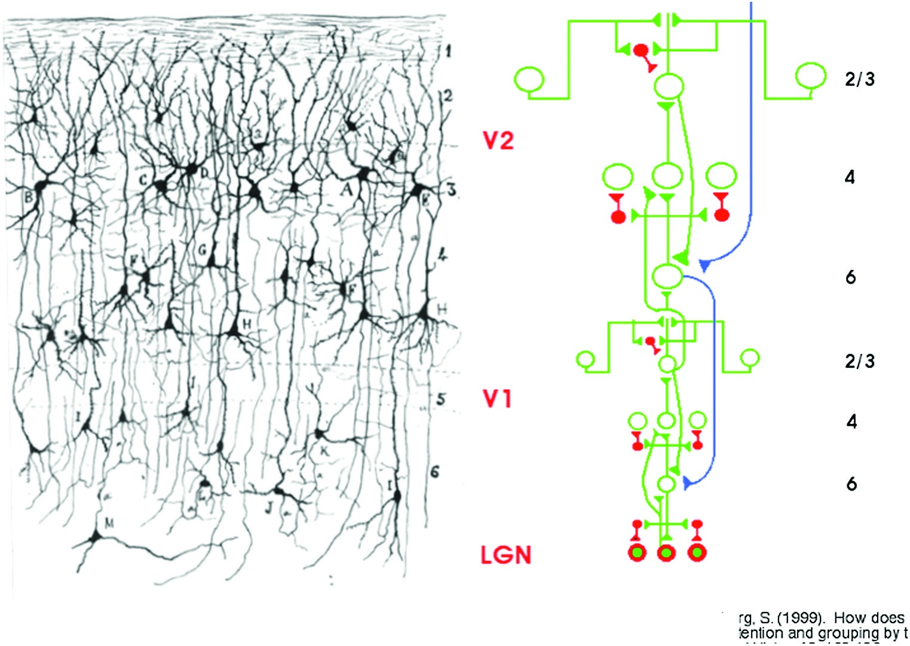
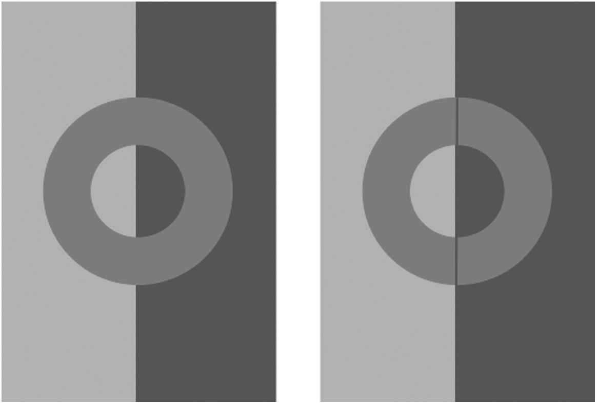
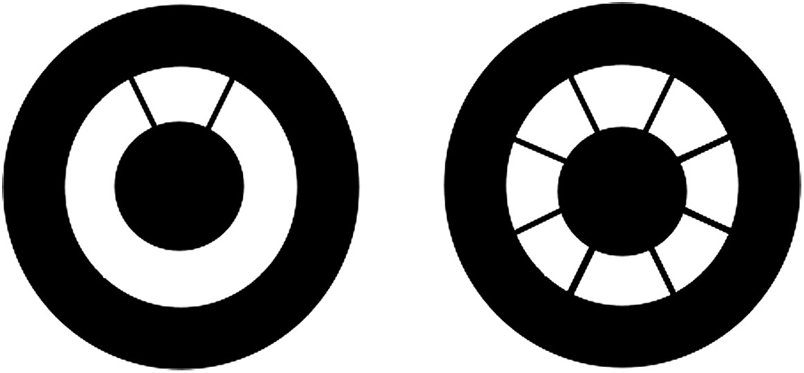
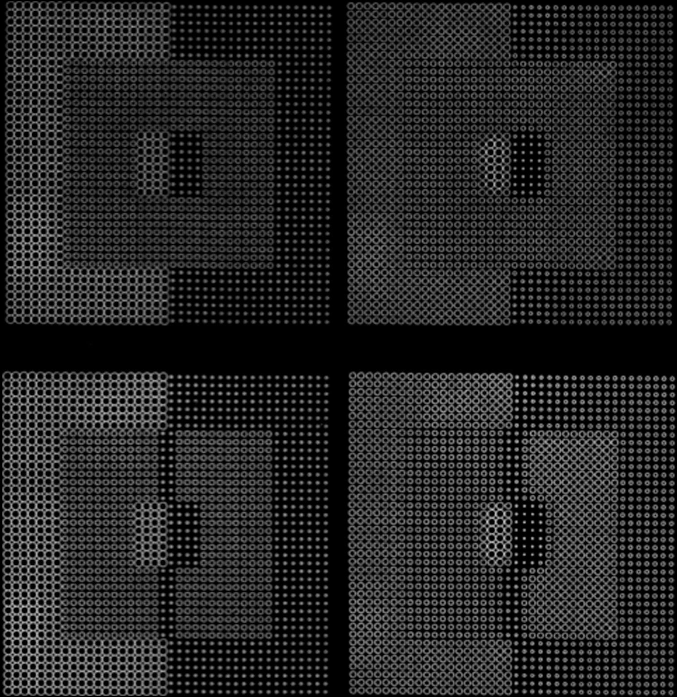
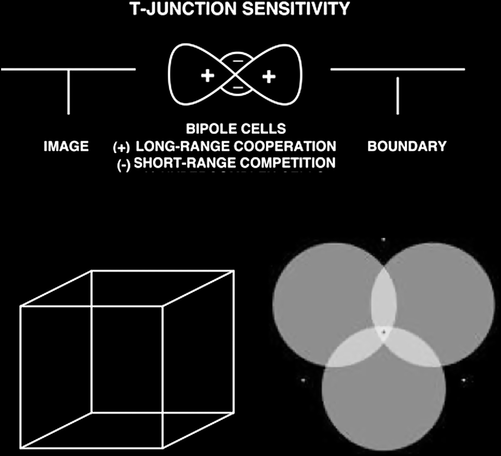
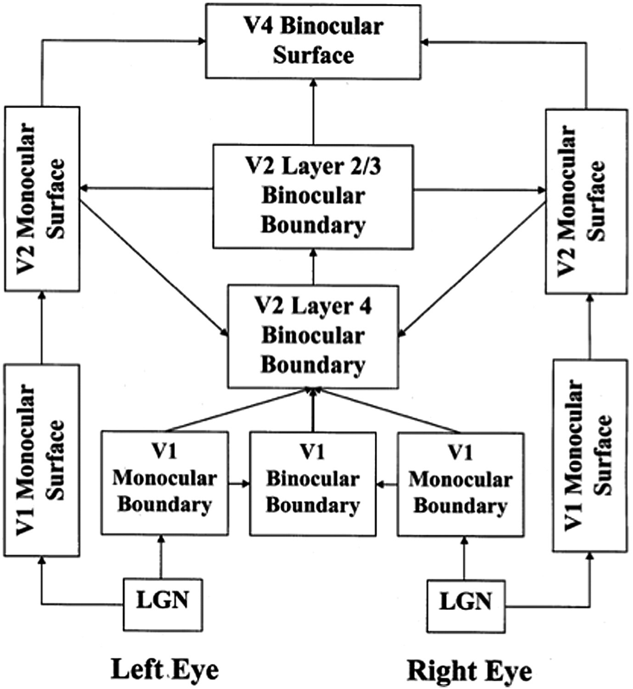
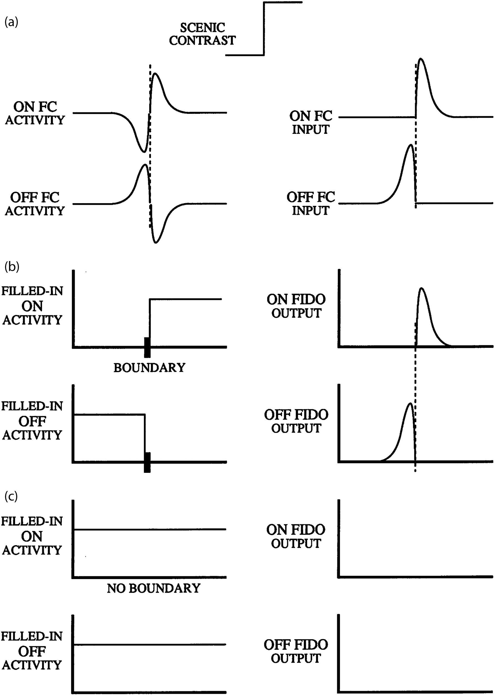
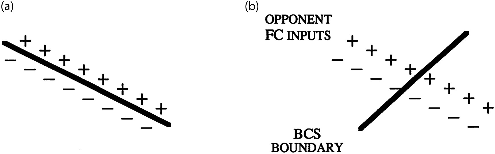
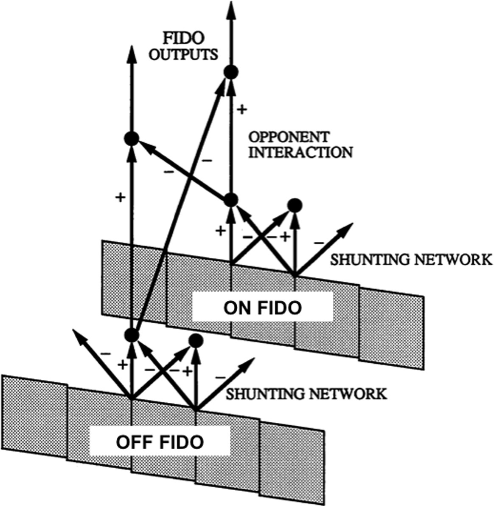

# Grossberg Ch.4 — Chunk 6: LAMINART, 고리 현상, 깊이 지각으로의 전환 (pp. 163-173)

> 원문: Stephen Grossberg, *Conscious MIND Resonant BRAIN*, Chapter 4, pp. 163-173
> 섹션 27-30: 아날로그 일관성과 층상 피질 구조(LAMINART), Koffka-Benussi/Kanizsa-Minguzzi 고리, 2D에서 3D로, 이중 대립 경쟁

---

## 27. 아날로그 일관성과 층상 피질 구조

> [해설] §27의 위치: 이론의 층상 피질 구현
>
> §26에서 "아날로그 일관성을 강건하게 달성하려면 층상 구조가 필수"라고 했던 언급이 이 절에서 구체화된다. Grossberg는 여기서 **LAMINART 모델**을 본격적으로 소개한다. LAMINART = LAMINar + ART (Adaptive Resonance Theory). 이것은 Grossberg의 이론 전체에서 가장 중요한 구성 요소 중 하나다.

### LAMINART 모델의 소개

<figure>

<figcaption><strong>그림 4.39</strong> — LAMINART 모델의 도식. 시각 피질(V1, V2)의 6개 층 간 상향식, 수평, 하향식 연결을 통합한 모델. Layer 6은 LGN 혹은 이전 영역의 입력을 받고, Layer 4는 주요 처리 층, Layer 2/3은 수평 연결과 그루핑을 담당한다. ART의 하향식 기대와 주의가 층상 회로에서 어떻게 실현되는지 보여준다.</figcaption>
</figure>

**LAMINART**는 1997년 Grossberg, Mingolla, Ross가 제안한 모델로, 다음 세 가지를 통합한다:

1. **시각 피질의 층상 해부학**: V1과 V2의 6개 층 구조
2. **ART(Adaptive Resonance Theory)의 원리**: 상향식 매칭 + 하향식 기대
3. **BCS의 구체적 회로**: 단순/복잡/초복잡/바이폴 세포의 실제 위치

1999년에는 **기대와 주의를 위한 하향식 회로**도 포함하도록 확장되었다.

### V1과 V2의 층상 역할 분담

| 피질 영역 | V1 (1차 시각 피질) | V2 (2차 시각 피질) |
|---------|-----------------|------------------|
| **Layer 6** | LGN으로부터 입력; 하향식 주의 게이팅 | V1으로부터 입력; V2 내부 주의 |
| **Layer 4** | 단안 단순 세포; 극성 선택적 공간 경쟁 | 이중 필터 처리; End cut 준비 |
| **Layer 2/3** | 복잡 세포, 바이폴 세포 초기 | 더 큰 스케일의 그루핑; 주요 바이폴 처리 |

### Layer 6 -> 4 -> 2/3: 계층적 처리 경로

LAMINART의 핵심 회로 흐름:

```
 LGN (시상)
   |
   v
 Layer 6 (V1)  <--- 하향식 주의 게이팅
   |
   v
 Layer 4 (V1)  <--- 단안 단순 세포
   |
   v
 Layer 2/3 (V1)  <--- 복잡 세포, 초기 바이폴
   |
   v
 Layer 6 (V2)  <--- 다음 단계로의 전달
   |
   v
 Layer 4 (V2)  <--- 이중 필터 2차
   |
   v
 Layer 2/3 (V2)  <--- 장거리 그루핑, 바이폴 CC Loop
```

### 왜 층상 구조가 아날로그 일관성에 필수인가

Grossberg의 핵심 논증: **단일 층 회로로는 아날로그 일관성을 달성할 수 없다.**

이유:
- 아날로그 일관성 요구: 그루핑 강도가 유도인자의 수, 위치, 방향, 대비에 **연속적**으로 민감
- 단일 층 승자독식(WTA): 하나의 그루핑만 강하게 살아남고 나머지는 완전히 억제됨
- 단일 층 선형 합: 잡음에 취약하고 경쟁이 없어 명확한 그루핑 없음

**해결 — 층상 구조의 역할:**
- Layer 6 -> 4 상향식 게이팅: 선택적 강화
- Layer 4 내부 공간 경쟁: 국소 대비 보존
- Layer 2/3 수평 연결: 장거리 그루핑 협력
- Layer 2/3 -> 6 피드백: 전역적 일관성 확인

이 **상호 피드백의 위계**가 아날로그 강도를 유지하면서 경쟁의 명확성을 달성한다.

> [발표 포인트] LAMINART의 의의
>
> LAMINART의 중요성: BCS 이론이 **뇌 해부학에 정확히 맞춰졌다**는 것이다. 이전의 BCS/FCS 모델은 기능적 회로였지만, 어느 뇌 영역의 어느 층에 속하는지 명시하지 않았다. LAMINART는 이 간극을 메운다. 각 회로 요소가 **특정 피질 층에 대응**한다.
>
> 이것이 왜 중요한가? 신경생리학 실험이 특정 층에서 예측된 세포 유형을 찾을 수 있게 된다. 이론의 **검증 가능성**이 크게 증가한다.

### 3D LAMINART로의 확장

1987-1997년 사이에 Grossberg와 동료들은 2D BCS/FCS를 3D로 확장했다: **FACADE 모델** (Grossberg 1994, 1997). 이후 비층상 FACADE를 층상화: **3D LAMINART 모델**. 이것이 현재 시각 피질 작동 방식에 대한 Grossberg 이론의 **가장 진보된 형태**다.

3D LAMINART의 추가 기능:
- 양안 시차 처리 (양안 경계 + 양안 표면)
- 깊이 선택적 채우기 도메인(FIDO)
- 표면 윤곽 피드백을 통한 경계 가지치기
- 전경-배경 분리

이 내용들은 §29부터 본격적으로 다룬다.

### 보편적 설계 원리

Grossberg의 강력한 주장: **같은 층상 회로의 변형이 시각, 음성, 인지 모두에 적용된다.**

| 모델 | 영역 | 연도 |
|------|------|------|
| **LAMINART** | 시각 (V1, V2) | 1997, 1999 |
| **cARTWORD** | 음성 인식 | 2011-2016 |
| **LIST PARSE** | 작업 기억 (목록 순서) | 2008 |
| **lisTELOS** | 목록 청킹 (단기 기억) | 2011 |

이 모델들이 공유하는 구조:
- 6개 층 피질 구조
- 상향식 매칭 + 하향식 기대의 ART 원리
- 층 간 흥분/억제의 특정 패턴

이것은 **신피질이 범용 처리 아키텍처**라는 Grossberg의 주장의 기반이다 (§8의 "뇌에서 미래 칩으로" 참조).

---

## 28. Koffka-Benussi 고리와 Kanizsa-Minguzzi 고리

> [해설] §28의 역할: 채우기의 "이상한" 결과들
>
> §27에서 LAMINART를 확립한 후, Grossberg는 이 모델이 설명하는 **흥미로운 현상들**로 돌아온다. Koffka-Benussi 고리와 Kanizsa-Minguzzi 고리는 경계와 표면의 상호작용이 만드는 반직관적 결과들이다. 이들은 BCS/FCS 모델의 예측력을 검증하는 역할을 한다.

### Koffka-Benussi 고리

<figure>

<figcaption><strong>그림 4.40</strong> — Koffka-Benussi 고리. 두 개의 균일한 밝기 배경 영역 사이에 고리가 놓여 있다. 왼쪽: 구분선 없음 — 고리의 양쪽 반이 다른 밝기로 보인다 (밝기 대비). 오른쪽: 수직선이 고리를 관통 — 채우기가 차단되어 양쪽 반의 밝기 차이가 더 극적으로 보인다.</figcaption>
</figure>

**자극 구성:**
- 두 개의 균일한 배경 (왼쪽 어두움, 오른쪽 밝음)
- 배경을 가로지르는 회색 고리

**관찰:**
- **왼쪽 (구분선 없음)**: 고리 양쪽 반이 다른 밝기로 보임 (밝기 대비)
- **오른쪽 (수직선이 관통)**: 양쪽 반의 밝기 차이가 더 극명

### BCS/FCS 해석

| 조건 | 메커니즘 |
|------|--------|
| 구분선 없음 | 고리 내부의 채우기가 양쪽을 연결 시도 -> 부분적 평균화 -> 약한 대비 |
| 수직선 관통 | 수직선이 경계 역할 -> 채우기가 차단 -> 각 반이 **독립적**으로 채워짐 -> 강한 대비 |

왜 더 밝은 배경이 인접 반고리의 특징 윤곽 활동을 더 많이 억제하는가?
- 밝은 배경 영역의 특징 윤곽 활동이 더 큼
- 인접 고리 반의 특징 윤곽에 대한 측면 억제(lateral inhibition)가 더 강함
- 결과: 밝은 배경 쪽 고리 반이 **더 어둡게** 보임 (대비 증강)

이것은 §5의 밝기 대비(brightness contrast) 현상의 특수한 표현이다.

### Kanizsa-Minguzzi 고리 — 비정상적 밝기 분화

<figure>

<figcaption><strong>그림 4.41</strong> — Kanizsa-Minguzzi 고리. 중앙 검은 원반, 둘레 검은 띠, 그 사이에 흰 고리. 두 개의 방사선이 고리를 불균등한 부채꼴로 나눈다. 놀랍게도 작은 부채꼴이 약간 더 밝게 보인다 — 이것이 비정상적 밝기 분화(anomalous brightness differentiation).</figcaption>
</figure>

**자극 구성:**
- 중앙 검은 원반
- 둘레 검은 띠
- 사이에 흰 고리
- 두 개의 방사선이 고리를 **불균등한** 부채꼴로 분할

**놀라운 결과:** 작은 부채꼴이 큰 부채꼴보다 **약간 더 밝게** 보인다.

### Grossberg의 설명: 면적 평균화

이 현상은 채우기의 **면적 평균화(area averaging)** 효과로 설명된다:

1. 두 방사선은 고리 안쪽에 환상적 윤곽을 유도
2. 이 환상적 윤곽이 특징 윤곽의 **밝기 증강(brightening)** 효과를 생성
3. 이 증강은 고리 전체에서 **동일한 총량**
4. 그러나 채우기 시 **면적으로 평균화**됨:

$$\text{부채꼴 밝기} = \frac{\text{총 증강}}{\text{부채꼴 면적}}$$

5. 작은 부채꼴 = 작은 면적 = 더 큰 단위 면적당 증강 -> **더 밝아 보임**

<figure>

<figcaption><strong>그림 4.42</strong> — Kanizsa-Minguzzi 고리의 컴퓨터 시뮬레이션. BCS/FCS 모델로 비정상적 밝기 분화 현상을 재현한 시뮬레이션. 작은 부채꼴이 더 밝게 나오는 것을 모델이 정확히 예측한다.</figcaption>
</figure>

> [해설] 왜 이 현상이 이론적으로 중요한가
>
> Kanizsa-Minguzzi 고리는 **순수하게 반직관적**이다. 물리적으로 아무것도 다른 것이 없는 두 부채꼴이 다른 밝기로 보인다. 이런 현상은 뇌가 단순히 "표면 위의 빛을 측정"하는 것이 아니라 **능동적으로 표면 표현을 구성**한다는 것을 결정적으로 증명한다. 또한 채우기가 단순한 확산이 아니라 **정량적 면적 평균화**를 수행한다는 구체적 예측도 이 실험으로 검증된다.

---

## 29. 2D에서 3D로: 깊이 지각

> [해설] §29의 전환점
>
> §1-28이 2D 시각에 집중했다면, §29부터 Grossberg는 **3D 시각**으로 진입한다. 이것은 4장의 두 번째 거대 테마다. 핵심 질문: 우리의 망막에 2D 이미지가 맺히는데, 어떻게 3D 세계를 지각하는가?
>
> §29는 이 전환을 이끄는 열쇠를 T-교차점의 **깊이 해석**에서 찾는다. §23에서 공간적 불투과성을 도입했던 것이 여기서 3D 해석으로 확장된다.

### T-교차점과 전경-배경 분리

<figure>

<figcaption><strong>그림 4.43</strong> — T-교차점에서의 바이폴 세포와 end gap. (a): T-교차점에서 수평 바이폴은 양쪽 가지 모두에서 입력 받아 강하게 발화; 수직 바이폴은 한쪽 가지만 입력 받아 약하게 발화. 강한 수평 경계가 약한 수직 경계에 end gap 생성 (Type 2 end gap). 색이 end gap을 통해 퍼져나간다. (b): Necker 큐브 — 2D 그림에서 양립적(bistable) 3D 지각. (c): Peter Tse(2005)의 실험 — 주의를 한 원반에 집중하면 더 가깝고 어둡게 보인다.</figcaption>
</figure>

### Type 2 End Gap 메커니즘

T-교차점에서 일어나는 일 (그림 4.43a):

1. **T의 가로획 (앞 물체 경계)**: 길고 선명 -> 수평 바이폴 세포가 양쪽 가지 모두에서 강한 입력 받음 -> 강한 발화
2. **T의 세로획 (뒷 물체 경계)**: 교차점에서 절반만 있음 -> 수직 바이폴 세포는 한쪽 가지만 입력 -> 약한 발화
3. **공간적 불투과성 (§23)**: 강한 수평 경계가 같은 위치의 약한 수직 경계를 억제 -> 세로획에 **Type 2 end gap** 생성
4. **색 유출**: 세로획의 end gap을 통해 앞 물체의 색이 배경으로 약간 새어나감
5. **깊이 해석**: 이것이 전경-배경 분리의 시작점

### Type 1 vs. Type 2 End Gap

| 유형 | 원인 | 결과 |
|------|------|------|
| **Type 1** (§13) | 불확실성 원리 — 선분 끝의 방향 정보 부재 | 선분 끝의 수평 경계 부재; end cut으로 해결 |
| **Type 2** (§29) | 공간적 불투과성 — 다른 방향 경계의 억제 | T-교차점의 세로획 억제; 전경-배경 단서 |

두 종류의 end gap이 서로 다른 신경학적 원인과 기능을 가진다. Type 1은 경계 완성의 문제지만, Type 2는 **3D 해석의 단서**다.

### 양립적 3D 지각: Necker 큐브

Necker 큐브(그림 4.43b)는 2D 선 그림이 **두 가지 3D 해석**을 만드는 고전적 예다:
- 해석 A: 앞면이 왼쪽 아래
- 해석 B: 앞면이 오른쪽 위

관찰자의 지각은 두 해석 사이를 **자발적으로** 전환한다. 이것은:
- 3D 해석이 **내재적 애매성**을 가짐
- 뇌가 두 해석을 모두 유지하다가 교대로 선택
- 승자독식이 아닌 동적 경쟁

### 주의와 깊이 해석: Peter Tse 실험

Peter Tse(2005)의 실험(그림 4.43c):
- 두 개의 원반을 관찰
- 한 원반에 주의를 집중
- 결과: **주의받는 원반이 더 가깝고 더 어둡게 보임**

이 현상의 이론적 함의:
- 깊이 지각은 순수하게 상향식이 아님
- **주의**가 3D 해석을 조절
- 주의 + 깊이 + 밝기가 상호작용

Grossberg의 모델에서: 주의가 **경계와 표면 활동을 증폭** -> 증폭된 활동이 경계 가지치기 신호를 강화 -> 주의받는 물체가 더 가까운 깊이에 할당됨.

> [발표 포인트] 왜 주의가 깊이에 영향을 미치는가
>
> 직관적으로는 깊이가 2D 단서(시차, 가림 등)로만 결정된다고 생각할 수 있다. 그러나 Tse 실험은 **주의가 깊이 할당의 능동적 요인**임을 보여준다. 이것은 3D 지각이 단순히 "계산"되는 것이 아니라 **구성되는** 것임을 드러낸다. §34의 경계 가지치기 메커니즘이 이 현상의 구체적 회로를 제공한다.

---

## 30. 경계는 채우기 생성기이자 장벽: 이중 대립 경쟁

> [해설] §30의 위치: FACADE 매크로 회로의 시작
>
> §29가 T-교차점을 통해 2D에서 3D로의 전환을 암시했다면, §30은 이제 **전체 시각 경로의 매크로 회로**를 소개한다. LGN에서 V4까지의 경계와 표면 처리 전체를 조망한다. 또한 FCS의 구체적 회로인 **이중 대립 네트워크(double opponent network)**가 도입된다.

### FACADE 매크로 회로

<figure>

<figcaption><strong>그림 4.44</strong> — LGN에서 V4까지의 경계·표면 형성 매크로 회로. 단안 처리(V1), 양안 경계 형성(V2 Layer 4), 그루핑(V2 Layer 2/3), 단안/양안 표면(V2), 양안 표면(V4)의 순서로 진행된다.</figcaption>
</figure>

경계와 표면 형성의 주요 단계:

```
LGN -> V1 (단안 경계/표면)
                   |
                   v
         V2 Layer 4 (양안 경계)
                   |
                   v
         V2 Layer 2/3 (양안 경계, 그루핑)
                   |
                   v
              V2 (단안/양안 표면)
                   |
                   v
              V4 (양안 표면)
```

각 단계의 역할:
- **LGN -> V1**: 기본 단안 처리; 조명 할인, 단순/복잡 세포
- **V2 Layer 4**: 양안 정보 통합 시작; 시차 검출
- **V2 Layer 2/3**: 장거리 그루핑; 바이폴 세포 CC Loop
- **V2 표면**: 깊이 선택적 채우기 도메인(FIDO)
- **V4**: 최종 가시적 표면; 의식적 지각의 기반

### ON/OFF 특징 윤곽과 채우기

<figure>

<figcaption><strong>그림 4.45</strong> — ON/OFF 특징 윤곽이 채우기 영역을 생성하는 방식. 밝은 영역은 ON 특징 윤곽을, 어두운 영역은 OFF 특징 윤곽을 생성한다. ON과 OFF 신호가 경계 안쪽으로 각각 채워져 표면 밝기를 복원한다.</figcaption>
</figure>

<figure>

<figcaption><strong>그림 4.46</strong> — 특징 윤곽과 경계가 정렬될 때만 채우기 발생. 왼쪽: 경계와 특징 윤곽이 정렬됨 -> 정상 채우기. 오른쪽: 경계와 특징 윤곽이 정렬되지 않음 -> 채우기가 일어나지 않음. 경계의 **위치적 정렬(positional alignment)**이 채우기의 필수 조건이다.</figcaption>
</figure>

핵심 원리: 경계 윤곽이 특징 윤곽과 **위치적으로 정렬(positionally aligned)**될 때만 제대로 작동한다.

정렬된 경우:
- 경계가 **채우기 생성기** 역할: ON/OFF 특징 윤곽이 경계 양쪽에서 채워짐
- 경계가 **채우기 장벽** 역할: 색/밝기가 경계를 넘어 퍼지지 못함

정렬되지 않은 경우:
- 특징 윤곽이 채우기를 시작할 수 없음
- 경계가 엉뚱한 위치에 있어 유의미한 표면 표현 형성 안 됨

이것이 §1의 "경계는 장벽이자 생성기"의 구체적 회로 수준 구현이다.

### 이중 대립 네트워크(Double Opponent Network)

<figure>

<figcaption><strong>그림 4.47</strong> — 이중 대립 네트워크: ON/OFF FIDO 처리. 두 단계 경쟁: (1) 각 ON/OFF FIDO 내에서 on-center off-surround 공간 경쟁, (2) ON FIDO와 OFF FIDO 사이의 대립 색 경쟁. 이 구조가 조직 대비(tissue contrast) 같은 색 현상을 설명한다.</figcaption>
</figure>

**이중 대립 네트워크**의 두 단계 경쟁:

| 단계 | 유형 | 내용 |
|------|------|------|
| **1단계** | 공간 경쟁 | 각 ON/OFF FIDO 내에서 on-center off-surround |
| **2단계** | 색 경쟁 | ON FIDO와 OFF FIDO 사이의 대립 색 경쟁 |

**FIDO(Filling-In Domain)**: 채우기가 일어나는 영역. ON FIDO와 OFF FIDO가 각각 밝기의 양극(밝음/어둠) 또는 색상의 대립쌍(빨강/초록, 파랑/노랑)을 처리.

### 조직 대비(Tissue Contrast) 현상

이 네트워크가 설명하는 고전적 현상 — Helmholtz(1866)가 관찰한 **조직 대비**:

**실험:**
- 회색 원반을 빨간 띠로 둘러쌈 -> 회색이 **녹색**으로 보임 (빨강의 대립색)
- 원반 주위에 얇은 검은 선을 그리면 -> 다시 회색으로 보임

왜 검은 선이 효과를 바꾸는가?
- 검은 선이 강한 경계를 만들어 이중 대립 경쟁의 **공간적 확산**을 차단
- 빨간 띠의 녹색 유도 효과가 회색 원반에 도달하지 못함
- 원반이 본래의 회색으로 지각됨

> [해설] "모든 선은 두꺼운 것이다!"의 재해석
>
> Helmholtz의 유명한 말: "All lines are thick!" 이것은 얇은 선조차도 **국소적인 경계 효과**를 가진다는 뜻이다. 이중 대립 네트워크의 관점에서: 어떤 경계든 이중 대립 경쟁의 공간적 확산을 차단하는 역할을 한다. 얇은 선이 **색 지각을 극적으로 바꿀 수 있다**는 현상이 이 원리로 설명된다.
>
> 이 현상은 일상에서도 발견된다: 만화가의 먹선, 건축 도면의 경계선, 도자기의 장식선 — 모두 색과 형태의 지각을 강화하는 역할을 한다.

### FCS의 이중 대립 + BCS의 경계 = 통합 지각

§30이 종합하는 그림:

- **BCS가 제공**: 정렬된 경계 표현 (채우기의 틀)
- **FCS가 제공**: 이중 대립 네트워크의 ON/OFF 특징 윤곽 (채우기의 재료)
- **두 시스템의 상호작용**: 경계 안쪽에서 ON/OFF 특징 윤곽이 채워져 **지각된 표면**이 만들어짐

이것이 FACADE 이론의 핵심 작동 원리다. §31부터 3D 시각에서 이 원리가 어떻게 확장되는지를 보인다.

---

## Chunk 6 핵심 개념 정리

| 개념 | 설명 | 등장 맥락 |
|------|------|---------|
| **LAMINART** | 층상 피질 회로의 ART 모델 (1997) | §27 |
| **3D LAMINART** | 2D LAMINART의 3D 확장 (FACADE 층상화) | §27 |
| **보편적 피질 설계** | 시각, 음성, 인지가 공유하는 층상 회로 | §27 |
| **Koffka-Benussi 고리** | 배경 대비에 의한 고리의 밝기 지각 변화 | §28 |
| **Kanizsa-Minguzzi 고리** | 비정상적 밝기 분화; 면적 평균화로 설명 | §28 |
| **면적 평균화** | 채우기 총량이 면적으로 나누어지는 효과 | §28 |
| **Type 2 End Gap** | T-교차점에서 공간적 불투과성으로 생기는 end gap | §29 |
| **Peter Tse 효과** | 주의가 깊이와 밝기 지각에 영향 | §29 |
| **FACADE 매크로 회로** | LGN -> V1 -> V2 -> V4의 경계·표면 처리 | §30 |
| **FIDO** | Filling-In Domain; 채우기가 일어나는 영역 | §30 |
| **이중 대립 네트워크** | ON/OFF FIDO 간의 대립 색 경쟁 | §30 |
| **조직 대비** | 주변 색이 중앙 영역의 색을 대립색으로 편향 | §30 |

---

> **다음 Chunk 7 (pp. 173-183)**: 4장의 마지막 부분 — 닫힌 경계만이 가시적 표면을 만든다 (§31), 다빈치 입체시 (§32), 깊이 선택적 경계 (§33), 표면 윤곽과 전경-배경 분리 (§34), 근접성-밝기 공변 (§35), V2와 V4의 가림과 투명성 (§36), 최소 해부학의 방법론 (§37). 3D 시각의 완전한 회로와 장 전체의 정리.
