# Grossberg *Conscious MIND Resonant BRAIN* 1장 완전 해설

> 원문: Stephen Grossberg, Conscious MIND Resonant BRAIN, Chapter 1 (pp. 1–49)
> 이 문서는 원문의 서사적 흐름을 따라, 수식·그림·이론을 한국어로 친절하게 풀어 설명합니다.

---

## 목차

### 전반부 (pp. 1-25)
1. [기대, 상상, 창의성, 그리고 환상](#1-기대-상상-창의성-그리고-환상)
2. [보기, 인식하기, 그리고 의식](#2-보기-인식하기-그리고-의식)
3. [환상과 현실](#3-환상과-현실)
4. [예술과 영화는 경계와 표면으로 보인다](#4-예술과-영화는-경계와-표면으로-보인다)
5. [헬름홀츠와 카니자에서 적응 공명으로](#5-헬름홀츠와-카니자에서-적응-공명으로)
6. [빠른 학습, 느린 망각, 탐험, 그리고 문화](#6-빠른-학습-느린-망각-탐험-그리고-문화)
7. [학습, 기대, 주의](#7-학습-기대-주의)
8. [변화하는 세계에 실시간으로 자율 적응](#8-변화하는-세계에-실시간으로-자율-적응)
9. [노이즈-포화 딜레마: 협력과 경쟁의 균형](#9-노이즈-포화-딜레마-협력과-경쟁의-균형)
10. [단기기억, 작업기억, 장기기억](#10-단기기억-작업기억-장기기억)
11. [협력-경쟁 역학: 안정적 경제 시장과 보이지 않는 손](#11-협력-경쟁-역학-안정적-경제-시장과-보이지-않는-손)
12. [협력과 경쟁 역학: 민주주의, 전체주의, 사회주의](#12-협력과-경쟁-역학-민주주의-전체주의-사회주의)
13. [시그모이드 신호는 승자독식 없이 노이즈 억제를 가능하게 한다](#13-시그모이드-신호는-승자독식-없이-노이즈-억제를-가능하게-한다)
14. [협력-경쟁 학습 역학: 뇌와 기술에서의 ART](#14-협력-경쟁-학습-역학-뇌와-기술에서의-art)
15. [인지와 감정: 남성인가 여성인가?](#15-인지와-감정-남성인가-여성인가)
16. [인과성, 미신, 도박: 고전적 조건화와 예측](#16-인과성-미신-도박-고전적-조건화와-예측)
17. [다음에 일어날 일 예측: 차단과 차단 해제](#17-다음에-일어날-일-예측-차단과-차단-해제)
18. [예측적 불일치, 비특이적 각성, 기억 탐색](#18-예측적-불일치-비특이적-각성-기억-탐색)
19. [예상치 못한 비발생, 정서적 반동, 이완 반응](#19-예상치-못한-비발생-정서적-반동-이완-반응)
20. [피크 이동과 행동 대비](#20-피크-이동과-행동-대비)
21. [노이즈-포화 딜레마와 단기기억 정규화](#21-노이즈-포화-딜레마와-단기기억-정규화)
22. [대립 처리, 망각, 강박, 탐험](#22-대립-처리-망각-강박-탐험)
23. [부분 보상: 비합리성, 도박, 창의성, 짝사랑](#23-부분-보상-비합리성-도박-창의성-짝사랑)
24. [이차 조건화와 광고](#24-이차-조건화와-광고)
25. [게이트 이중극 대립 처리: 각성, 습관화, 경쟁](#25-게이트-이중극-대립-처리-각성-습관화-경쟁)
26. [STM, MTM, LTM](#26-stm-mtm-ltm)
27. [동기, 포만, 그리고 사랑에 굶주리기](#27-동기-포만-그리고-사랑에-굶주리기)
28. [황금 평균, 역U, 두 종류의 정서적 우울](#28-황금-평균-역u-두-종류의-정서적-우울)

### 후반부 (pp. 27-49)
29. [정서 신경과학, 정신 장애, 그리고 당신을 끌어내리는 흥분제](#29-정서-신경과학-정신-장애-그리고-당신을-끌어내리는-흥분제)
30. [두 종류의 학습: 지각하고 알기 vs 움직이고 탐색하기](#30-두-종류의-학습-지각하고-알기-vs-움직이고-탐색하기)
31. [무엇과 어디서 피질 처리 흐름과 의식](#31-무엇과-어디서-피질-처리-흐름과-의식)
32. [두 가지 혁명적 패러다임: 상보 컴퓨팅과 층상 컴퓨팅](#32-두-가지-혁명적-패러다임-상보-컴퓨팅과-층상-컴퓨팅)
33. [층상 신피질](#33-층상-신피질)
34. [상보 컴퓨팅 vs 독립 모듈](#34-상보-컴퓨팅-vs-독립-모듈)
35. [음소 복원과 안정적 학습](#35-음소-복원과-안정적-학습)
36. [학습된 기대: 항목 청크와 목록 청크 사이의 공명](#36-학습된-기대-항목-청크와-목록-청크-사이의-공명)
37. [객체 주의는 어떻게 작동하는가? ART 매칭 규칙](#37-객체-주의는-어떻게-작동하는가-art-매칭-규칙)
38. [모든 의식 상태는 공명 상태이다](#38-모든-의식-상태는-공명-상태이다)
39. [불변 학습, 기대, 초기 종교적 믿음에서의 인지-정서 공명](#39-불변-학습-기대-초기-종교적-믿음에서의-인지-정서-공명)
40. [의식적 보기, 듣기, 느끼기, 알기: 의식을 행동과 연결하기](#40-의식적-보기-듣기-느끼기-알기-의식을-행동과-연결하기)
41. [ART로 가는 길: 헬름홀츠, 제임스, 그레고리](#41-art로-가는-길-헬름홀츠-제임스-그레고리)
42. [보기, 듣기, 느끼기, 알기 동안의 다양한 공명 경험](#42-보기-듣기-느끼기-알기-동안의-다양한-공명-경험)
43. [모든 의식 상태는 공명 상태이지만, 일부 공명 상태는 의식적이지 않다](#43-모든-의식-상태는-공명-상태이지만-일부-공명-상태는-의식적이지-않다)
44. [의식의 어려운 문제를 향하여](#44-의식의-어려운-문제를-향하여)
45. [공명하는 뇌 역학과 의식적 마음 사이의 연결 가설](#45-공명하는-뇌-역학과-의식적-마음-사이의-연결-가설)
46. [방정식, 모듈, 그리고 양식 아키텍처](#46-방정식-모듈-그리고-양식-아키텍처)
47. [의식 이해를 위한 다른 접근법들](#47-의식-이해를-위한-다른-접근법들)

---

# 전반부 (pp. 1-25)

---

## 1. 기대, 상상, 창의성, 그리고 환상

### 왜 우리는 기대를 가지는가?

우리의 뇌는 끊임없이 미래를 예측합니다. 이 장은 다음과 같은 근본적인 질문으로 시작합니다: 왜 우리는 기대(expectations)를 가지는가? 환상(fantasy)과 현실(reality)의 차이는 무엇인가?

이러한 질문들은 단순히 철학적인 것이 아닙니다. 이는 뇌가 세상을 처리하는 방식의 핵심에 놓여 있습니다. 우리의 뇌는 수동적으로 감각 입력을 받아들이는 것이 아니라, **능동적으로 예측을 생성하고 그 예측을 현실과 비교**합니다.

기대는 우리가 경험한 것으로부터 학습된 것입니다. 우리는 과거의 경험을 바탕으로 미래에 무엇이 일어날지 예측하는 내부 모델을 구축합니다. 이 내부 모델이 실제와 일치할 때 우리는 현실을 지각하고, 일치하지 않을 때 놀라움이나 오류 신호를 경험합니다.

**상상력(imagination)**은 이러한 기대 시스템의 창의적 사용입니다. 우리는 실제로 존재하지 않는 것을 마음속에서 시뮬레이션할 수 있습니다. **창의성(creativity)**은 새로운 방식으로 기존의 기대 패턴을 결합하거나 변형하는 능력에서 비롯됩니다.

**환상(illusion)**은 뇌의 기대 시스템이 잘못 작동할 때 발생합니다. 뇌는 불완전한 정보로부터 가장 그럴듯한 해석을 생성하려 하며, 때로는 이것이 실제와 다른 지각을 만들어냅니다.

---

## 2. 보기, 인식하기, 그리고 의식

### 보는 것과 아는 것의 차이

시각은 단순히 빛을 감지하는 것이 아닙니다. 우리가 "본다"는 것은 실제로 두 가지 과정을 포함합니다: **보기(seeing)**와 **인식하기(knowing)**. 이 두 과정은 서로 다른 신경 메커니즘을 사용하며, 서로 상호작용합니다.

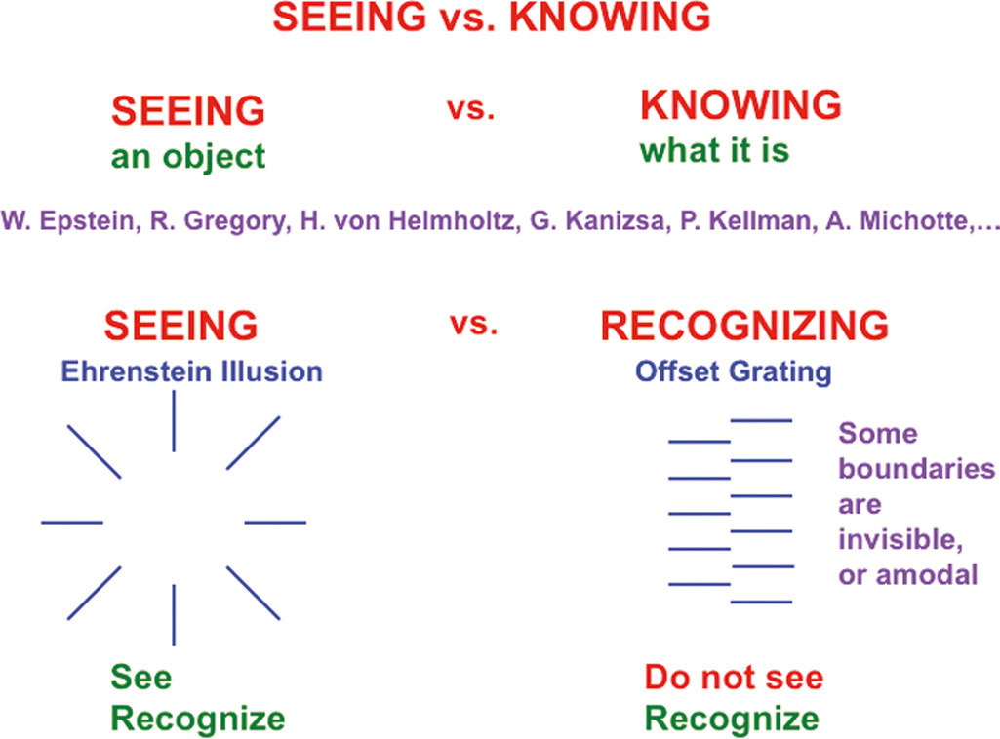

그림 1.1은 이 차이를 명확하게 보여줍니다. **오프셋 격자(offset grating)**에서 우리는 실제로는 존재하지 않는 경계선을 지각합니다. **에렌슈타인 환상(Ehrenstein illusion)**에서는 방사형 선들의 교차점에서 밝은 원반을 봅니다. 이러한 현상들은 우리의 시각 시스템이 단순히 망막의 자극 패턴을 반영하는 것이 아니라, 능동적으로 해석하고 구성한다는 것을 보여줍니다.

### 아모달 지각과 모달 지각

**아모달 지각(amodal percept)**은 의식적으로 경험되지 않는 지각입니다. 예를 들어, 한 물체가 다른 물체 뒤에 숨겨져 있을 때, 우리는 숨겨진 부분이 존재한다는 것을 "알지만" 실제로 보지는 못합니다. 이것이 아모달 완성(amodal completion)입니다.

**모달 지각(modal percept)**은 실제로 의식에 존재하는 지각입니다. 빛, 색상, 움직임 등 실제로 경험되는 감각 속성들이 여기에 해당합니다.

**감각질(qualia)**은 이러한 의식적 경험의 주관적인 성격입니다. 빨강의 빨강함, 통증의 아픔 - 이것들은 순수하게 물리적인 설명으로는 포착되기 어려운 경험의 "무엇 같은" 측면입니다.

---

## 3. 환상과 현실

### 달마시안 개와 보이지 않는 경계

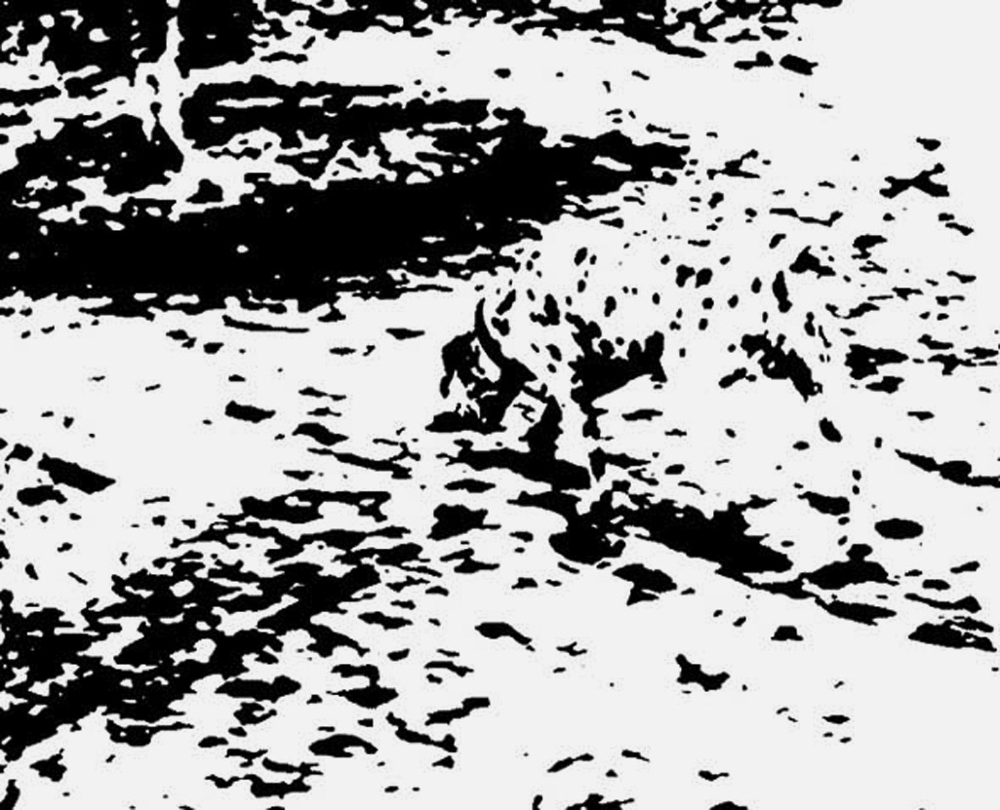

그림 1.2는 눈밭 위의 달마시안 개를 보여줍니다. 처음에는 무작위한 흑백 패턴처럼 보이지만, 일단 개를 인식하면 그 이후로는 항상 개를 보게 됩니다. 이것은 우리의 시각 시스템이 어떻게 학습된 지식을 사용하여 모호한 입력을 해석하는지 보여줍니다.

이 이미지에서 개의 경계는 실제로 명확하게 그어져 있지 않습니다. 대신, 우리의 뇌가 점들의 패턴으로부터 경계를 **완성(completion)**합니다. 이것은 **보이지 않는 경계(invisible boundaries)**가 인식을 돕는다는 역설적인 상황을 만들어냅니다.

### 시각 환상과 세계-환상

시각 환상(visual illusions)은 우리의 지각 시스템이 얼마나 능동적으로 구성적인지를 보여줍니다. 우리가 보는 것은 망막에 투사된 것의 직접적인 복사본이 아니라, 뇌가 만들어낸 해석입니다.

이러한 관점에서 보면, 우리가 경험하는 "현실"은 사실 우리 뇌가 구성한 **세계-환상(World-As-Illusion)**에 가깝습니다. 그러나 이것이 현실이 존재하지 않는다는 의미가 아닙니다. 오히려 우리의 지각이 현실에 적응하기 위해 진화한 능동적 구성 과정이라는 것입니다.

---

## 4. 예술과 영화는 경계와 표면으로 보인다

### 아모달 완성: 세 개의 직사각형

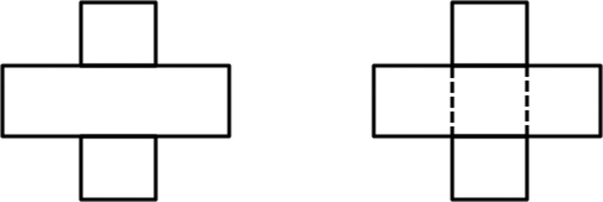

그림 1.3은 아모달 완성의 고전적인 예를 보여줍니다. 세 개의 직사각형이 배열되어 있을 때, 우리는 그것들이 더 긴 수평 막대를 가리고 있다고 지각합니다. 이 막대는 실제로 그림에 존재하지 않지만, 우리의 뇌는 그것을 완성합니다.

이러한 현상은 예술과 영화에서 광범위하게 활용됩니다. 화가와 영화 감독들은 우리의 지각 시스템이 경계와 표면을 어떻게 처리하는지를 활용하여 깊이, 움직임, 감정을 전달합니다.

### 경계 소유권과 그림-배경 지각

**경계 소유권(border ownership)**은 어떤 물체가 공유된 경계를 "소유"하는지에 관한 것입니다. 두 물체가 경계를 공유할 때, 우리의 뇌는 그 경계가 앞쪽에 있는 물체에 속한다고 해석합니다.

**그림-배경 지각(figure-ground perception)**은 우리가 장면을 앞쪽의 "그림(figure)"과 뒤쪽의 "배경(ground)"으로 분리하는 방식입니다. 이것은 자동적으로 일어나지만, 실제로는 복잡한 신경 계산의 결과입니다.

---

## 5. 헬름홀츠와 카니자에서 적응 공명으로

### 카니자의 층상화와 투명성

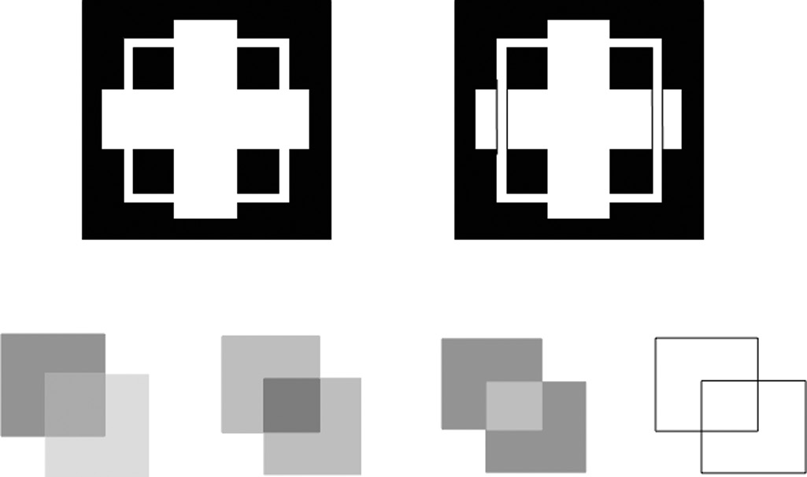

그림 1.4는 이탈리아 심리학자 가에타노 카니자(Gaetano Kanizsa)의 연구에서 가져온 이미지입니다. 위쪽 행은 **층상화(stratification)** 현상을 보여줍니다: 우리는 표면들이 여러 층으로 쌓여 있다고 지각합니다. 아래쪽 행은 **투명성(transparency)** 현상을 보여줍니다: 하나의 표면이 다른 표면을 통해 보이는 것처럼 보입니다.

이러한 지각은 **이중 안정(bistable)** 특성을 가집니다. 즉, 같은 이미지가 두 가지 다른 방식으로 해석될 수 있으며, 우리의 지각은 이 두 해석 사이를 왔다 갔다 합니다.

### 상향식과 하향식 처리

이러한 현상들을 이해하기 위해서는 **상향식(bottom-up)**과 **하향식(top-down)** 처리의 상호작용을 이해해야 합니다.

- **상향식 처리**: 감각 기관에서 더 높은 수준의 처리 영역으로 정보가 흐르는 방향. 원시 감각 데이터에서 더 복잡한 표현으로 나아감.
- **하향식 처리**: 더 높은 수준의 인지 과정이 더 낮은 수준의 지각에 영향을 미치는 방향. 기대, 맥락, 사전 지식이 지각에 영향을 미침.

### 적응 공명 이론(ART)의 도입

1976년, Grossberg는 **적응 공명 이론(Adaptive Resonance Theory, ART)**을 제안했습니다. 이 이론은 상향식과 하향식 처리가 어떻게 상호작용하여 학습과 지각을 가능하게 하는지 설명합니다.

ART의 핵심 아이디어는 다음과 같습니다:
- 뇌는 입력 패턴을 기존의 범주와 매칭하려 합니다
- 매칭이 성공하면 **공명(resonance)**이 발생하여 기억이 안정화됩니다
- 매칭이 실패하면 새로운 범주를 학습합니다

이 이론은 **안정성-가소성 딜레마(stability-plasticity dilemma)**를 해결하는 핵심 메커니즘을 제공합니다.

---

## 6. 빠른 학습, 느린 망각, 탐험, 그리고 문화

### 안정성-가소성 딜레마

뇌는 두 가지 상충되는 요구에 직면합니다:

1. **가소성(plasticity)**: 새로운 것을 빠르게 학습하는 능력
2. **안정성(stability)**: 이미 학습한 것을 잊지 않는 능력

새로운 경험이 기존의 기억을 덮어쓰지 않으면서도, 새로운 것을 학습할 수 있어야 합니다. 이것이 안정성-가소성 딜레마입니다.

ART는 이 딜레마를 해결하는 메커니즘을 제공합니다. 핵심은 **경계 일치(vigilance)** 파라미터를 통해 얼마나 세밀하게 범주를 구분할지를 조정하는 것입니다. 높은 경계 일치는 더 세밀한 범주 구분을 만들고, 낮은 경계 일치는 더 일반화된 범주를 만듭니다.

### 균형: 상보 컴퓨팅

뇌는 **상보 컴퓨팅(Complementary Computing)**을 통해 이 딜레마를 해결합니다. 서로 다른 뇌 영역들이 서로 상보적인 기능을 수행하면서, 각각의 한계를 서로 보완합니다.

이러한 상보적 관계는 뇌의 여러 수준에서 나타납니다: 피질 영역 간, 반구 간, 심지어 같은 영역 내의 다른 층 사이에서도 나타납니다.

---

## 7. 학습, 기대, 주의

### 하향식과 상향식 주의

**주의(attention)**는 두 가지 유형으로 구분됩니다:

- **상향식 주의(bottom-up attention)**: 자극의 두드러진 특성에 의해 자동적으로 끌리는 주의. 갑자기 움직이는 물체나 큰 소리에 반응하는 것.
- **하향식 주의(top-down attention)**: 목표, 기대, 사전 지식에 의해 조절되는 자발적 주의. 특정 색상의 물체를 찾거나 특정 단어를 듣는 것.

### 의도적 존재와 주의적 존재

인간을 포함한 복잡한 생물체들은 두 가지 핵심 능력을 가집니다:

- **의도적 존재(Intentional Beings)**: 목표 지향적 행동을 할 수 있는 능력. 미래 상태를 표현하고 그 상태를 달성하기 위해 행동을 계획하는 능력.
- **주의적 존재(Attentional Beings)**: 무한한 감각 입력 중에서 관련 있는 정보를 선택하는 능력. 현재 목표와 관련된 정보에 주의를 집중하는 능력.

이 두 능력은 서로 긴밀하게 연결되어 있습니다. 우리의 의도가 우리의 주의를 이끌고, 우리의 주의가 우리의 의도 실행을 지원합니다.

---

## 8. 변화하는 세계에 실시간으로 자율 적응

### 자율 적응의 과제

변화하는 세계에 적응한다는 것은 쉬운 일이 아닙니다. 우리의 환경은 끊임없이 변하고, 우리는 이러한 변화에 실시간으로 대응해야 합니다. 이것은 다음과 같은 능력을 요구합니다:

1. **지속적 학습**: 새로운 정보를 계속해서 통합하는 능력
2. **이전 지식 보존**: 새로운 학습이 이전에 배운 것을 지우지 않도록 하는 능력
3. **예측 및 기대**: 미래 사건을 예측하여 선제적으로 대응하는 능력
4. **오류 수정**: 예측이 틀렸을 때 수정하는 능력

Grossberg의 연구는 뇌가 이러한 능력들을 어떻게 구현하는지를 수학적으로 모델링합니다.

---

## 9. 노이즈-포화 딜레마: 협력과 경쟁의 균형

### 노이즈-포화 딜레마란 무엇인가?

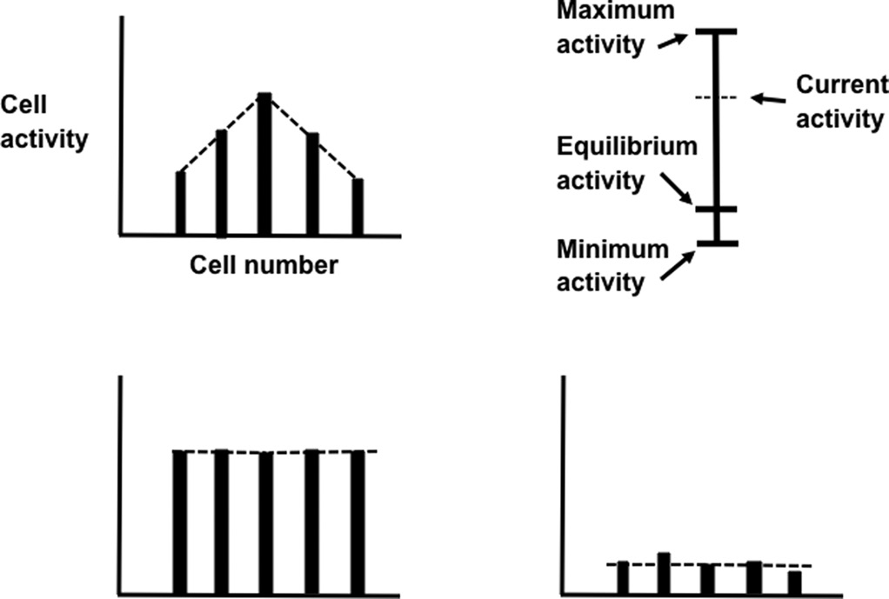

그림 1.5는 **노이즈-포화 딜레마(noise-saturation dilemma)**를 시각적으로 보여줍니다. 신경 네트워크는 두 가지 극단적인 문제에 직면합니다:

- **노이즈 문제**: 입력 신호가 너무 약할 경우, 신경 세포들이 무작위 배경 활동(노이즈)에 묻혀버립니다. 작은 신호와 노이즈를 구별하기 어려워집니다.
- **포화 문제**: 입력 신호가 너무 강할 경우, 신경 세포들이 모두 최대 활성화 상태(포화)에 달합니다. 서로 다른 강도의 신호들이 구별되지 않게 됩니다.

이 두 극단 사이에서 유용한 신호를 처리하는 것이 과제입니다.

### 상보성 원리와 협력-경쟁

닐스 보어(Niels Bohr)의 **상보성 원리(complementarity principle)**에서 영감을 받아, Grossberg는 뇌가 이 딜레마를 협력과 경쟁의 균형을 통해 해결한다고 제안합니다.

- **협력(cooperation)**: 유사한 패턴을 강화하여 신호를 보존
- **경쟁(competition)**: 서로 다른 패턴을 억제하여 대비를 강화

이 두 메커니즘의 균형이 노이즈를 억제하면서도 중요한 패턴을 보존하는 것을 가능하게 합니다.

**중심-흥분 주변-억제(on-center off-surround)** 네트워크가 이 메커니즘의 핵심입니다: 중심 세포는 이웃 세포들로부터 흥분성 신호를 받는 동시에, 더 멀리 있는 세포들을 억제합니다.

---

## 10. 단기기억, 작업기억, 장기기억

### 작업기억에서의 최신성 기울기

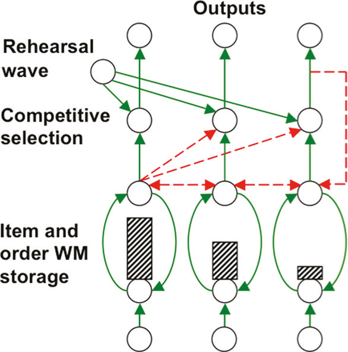

그림 1.6은 **작업기억(working memory)**에서의 **최신성 기울기(primacy gradient)**를 보여줍니다. 중심-흥분 주변-억제 네트워크에서, 처음에 제시된 항목들이 더 강하게 활성화되는 경향이 있습니다.

기억 시스템의 세 가지 시간 척도:
- **단기기억(Short-Term Memory, STM)**: 수초 내의 빠른 활성화 패턴. 현재 처리 중인 정보를 유지.
- **작업기억(Working Memory)**: 더 지속적인 활성화. 복잡한 인지 과제를 수행하는 동안 필요한 정보를 유지.
- **장기기억(Long-Term Memory, LTM)**: 시냅스 강도의 변화로 인코딩된 영구적인 기억. 학습을 통해 형성됨.

### 리허설 파와 경쟁적 선택

**리허설 파(rehearsal wave)**는 작업기억에서 항목들이 순서대로 활성화되는 과정입니다. 이 파는 다음과 같은 특성을 가집니다:
- 가장 강하게 활성화된 항목이 먼저 선택됩니다
- 선택된 항목은 억제되어 다음 항목이 선택될 수 있게 합니다 (억제의 귀환, inhibition of return)
- 이 과정이 반복되면서 항목들이 순서대로 리허설됩니다

---

## 11. 협력-경쟁 역학: 안정적 경제 시장과 보이지 않는 손

### ABC 정리와 적응 수준 시스템

**ABC 정리(ABC Theorem)**는 협력-경쟁 역학의 핵심 수학적 결과입니다. 이는 특정 조건 하에서 신경 네트워크가 안정적인 상태로 수렴한다는 것을 보여줍니다.

**적응 수준 시스템(Adaptation Level Systems)**은 신경 네트워크가 평균적인 입력 수준에 적응하는 방식을 설명합니다. 이는 심리학에서 헬슨(Helson)의 적응 수준 이론과 연결됩니다.

### 애덤 스미스의 보이지 않는 손 비유

Grossberg는 신경 협력-경쟁 역학과 경제학의 **보이지 않는 손(Invisible Hand)** 개념 사이의 흥미로운 유사성을 지적합니다. 애덤 스미스(Adam Smith)가 제안한 것처럼, 개별 행위자들의 자기 이익 추구가 시장 균형이라는 집단적 결과를 만들어낼 수 있습니다.

마찬가지로, 개별 뉴런들이 각자의 활성화 규칙을 따를 때, 전체 신경망은 유용한 지각적 또는 인지적 결과로 수렴합니다.

**자유 시장 비유**:
- 개별 뉴런 ↔ 시장 참여자
- 신경 활성화 ↔ 가격 신호
- 경쟁적 억제 ↔ 시장 경쟁
- 안정적 활성화 패턴 ↔ 시장 균형

이러한 비유는 신경 역학과 사회 역학 사이의 깊은 구조적 유사성을 보여줍니다.

---

## 12. 협력과 경쟁 역학: 민주주의, 전체주의, 사회주의

### 신호 함수의 선택

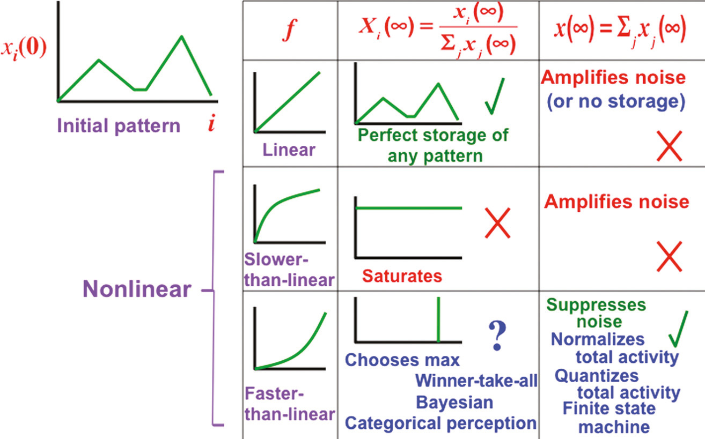

그림 1.7은 세 가지 다른 유형의 신호 함수를 보여줍니다. 신호 함수의 선택은 신경 네트워크의 집단적 행동에 극적인 영향을 미칩니다:

- **선형 함수**: 활동 수준에 비례한 신호. 중간적인 동작.
- **선형보다 느린 함수**: 낮은 활동에 대한 과장된 반응. 노이즈에 민감.
- **선형보다 빠른 함수**: 높은 활동 수준에서만 강한 반응. 대비 강화.

### 정치 시스템 비유

이러한 신호 함수의 차이는 흥미롭게도 다양한 정치 시스템의 특성과 비유됩니다:

- **민주주의**: 다양한 "목소리"가 균형을 이루는 시스템. 시그모이드 신호 함수와 유사.
- **전체주의**: 하나의 활성화 패턴이 모든 것을 지배하는 **승자독식(winner-take-all)** 시스템. 매우 빠른 신호 함수와 유사.
- **사회주의**: 모든 활동이 동등하게 취급되는 시스템. 선형 함수와 유사.

**베이지안 추론**과 **범주 지각(categorical perception)**도 이러한 신호 함수의 특성과 관련됩니다.

---

## 13. 시그모이드 신호는 승자독식 없이 노이즈 억제를 가능하게 한다

### 시그모이드 함수의 세 가지 역할

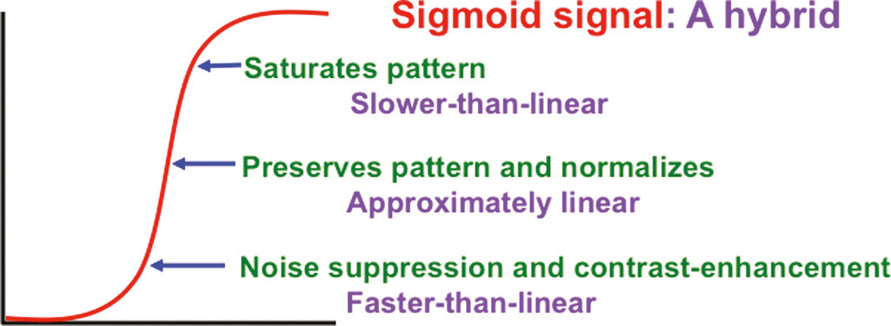

그림 1.8은 **시그모이드(sigmoid) 신호 함수**가 어떻게 세 가지 상충되는 요구를 동시에 충족시키는지 보여줍니다:

1. **노이즈 억제(noise suppression)**: 낮은 활동 수준의 세포들은 거의 신호를 생성하지 않으므로, 노이즈가 억제됩니다.
2. **대비 강화(contrast enhancement)**: 중간 수준의 활동에서 가파른 상승이 있어, 강한 활성화와 약한 활성화 사이의 대비가 강화됩니다.
3. **패턴 보존(pattern preservation)**: 높은 활동 수준에서 포화에 도달하지만, 그 이전에 다양한 수준의 활동이 구별됩니다.

### 켄칭 임계값

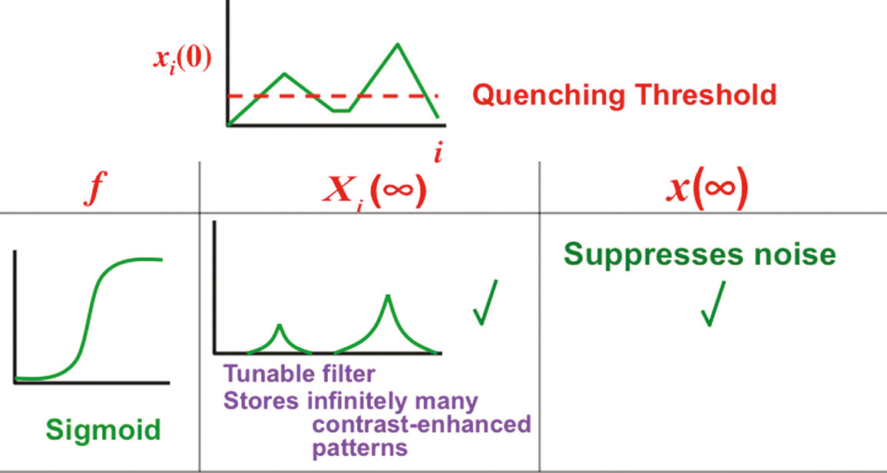

그림 1.9는 **켄칭 임계값(quenching threshold, QT)**의 개념을 보여줍니다. QT는 시그모이드 신호 함수가 노이즈를 억제하면서 패턴을 보존하는 기준점입니다:
- QT 이하의 활동: 효과적으로 켄칭(억제)됨
- QT 이상의 활동: 증폭되고 경쟁에서 살아남음

수학적으로, QT는 시그모이드 함수의 변곡점과 관련됩니다. 이 임계값은 네트워크 파라미터에 따라 조정될 수 있어, 다양한 상황에 적응적으로 대응합니다.

$$f(x) = \frac{x^n}{x^n + \theta^n}$$

여기서 $\theta$는 켄칭 임계값을 결정하는 파라미터이고, $n$은 함수의 가파름을 결정합니다.

---

## 14. 협력-경쟁 학습 역학: 뇌와 기술에서의 ART

### ART의 광범위한 응용

적응 공명 이론(ART)은 이론적 신경과학을 넘어 다양한 실용적 응용을 가지고 있습니다:

**기술 응용**:
- 항공기 설계 최적화
- 의료 진단 (암 탐지, 유방조영술 분석)
- 원격 탐사 및 위성 이미지 분류
- 얼굴 인식 시스템
- 산업용 품질 관리
- 로봇 공학의 물체 인식
- 금융 시장 분석 및 예측
- DNA 시퀀스 분류

**신경과학 응용**:
- 시각 피질의 기능 모델링
- 청각 처리 시스템 이해
- 언어 처리 메커니즘 설명
- 주의 메커니즘의 계산적 모델

ART가 이렇게 다양한 분야에 적용될 수 있는 이유는 그 기본 원리들이 도메인에 독립적인 범용 학습 메커니즘을 표현하기 때문입니다.

---

## 15. 인지와 감정: 남성인가 여성인가?

### 인지적 과정과 감정적 과정

전통적으로 인지(cognition)와 감정(emotion)은 별개의 시스템으로 다루어졌습니다. 그러나 Grossberg의 연구는 이 두 시스템이 긴밀하게 통합되어 있음을 보여줍니다.

**감정 컴퓨팅(Affective Computing)**과 **감정 신경과학(Affective Neuroscience)**은 감정이 인지 과정에 어떻게 영향을 미치는지, 그리고 이를 어떻게 계산적으로 모델링할 수 있는지를 연구합니다.

흥미로운 점은 인지와 감정 처리에 성차가 있다는 주장이 있지만, Grossberg의 모델은 이러한 차이들이 기본적인 신경 회로의 차이보다는 경험과 문화의 영향을 더 많이 반영한다고 시사합니다.

---

## 16. 인과성, 미신, 도박: 고전적 조건화와 예측

### 파블로프 조건화

**파블로프 조건화(Pavlovian conditioning)**는 고전적 조건화의 가장 잘 알려진 예입니다. 이 패러다임에서:

- **조건 자극(Conditioned Stimulus, CS)**: 처음에는 중립적인 자극 (예: 종소리)
- **무조건 자극(Unconditioned Stimulus, US)**: 자연적으로 반응을 유발하는 자극 (예: 음식)
- **무조건 반응(Unconditioned Response, UR)**: US에 대한 자연적 반응 (예: 침 분비)
- **조건 반응(Conditioned Response, CR)**: CS만으로 유발된 학습된 반응

조건화가 일어나면 CS → CR 연결이 형성됩니다. 즉, 종소리만 들어도 침을 분비하게 됩니다.

### 특성-범주 공명과 인지-감정 공명

Grossberg는 조건화를 더 넓은 틀에서 이해합니다:

- **특성-범주 공명(feature-category resonance)**: 감각 특성들이 특정 범주와 공명하여 인식이 이루어지는 과정
- **인지-감정 공명(cognitive-emotional resonance)**: 인지적 처리와 감정적 평가가 상호작용하는 과정

### CogEM 모델

**CogEM(Cognitive-Emotional Motivational)** 모델은 인지, 감정, 동기가 어떻게 통합되는지를 설명합니다. 이 모델에서:
- 인지 과정은 "무엇이 일어나고 있는가"를 처리
- 감정 과정은 "이것이 좋은가 나쁜가"를 평가
- 동기 과정은 "무엇을 해야 하는가"를 결정

미신(superstition)과 도박은 이 시스템이 잘못 보정되었을 때 발생할 수 있습니다. 우연한 상관관계를 인과관계로 잘못 해석하거나, 보상에 대한 기대가 지나치게 강화될 때 발생합니다.

---

## 17. 다음에 일어날 일 예측: 차단과 차단 해제

### 차단 패러다임

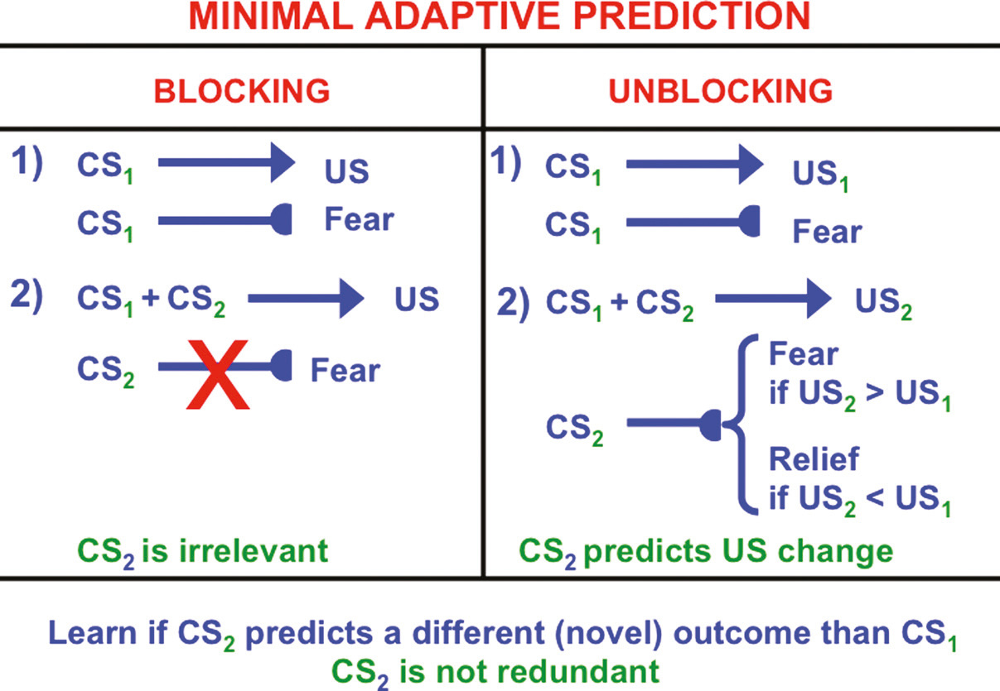

그림 1.10은 **차단(blocking)** 현상을 보여줍니다. 이 현상은 Kamin(1969)이 발견했습니다:

**차단 패러다임의 단계**:
1. 1단계: CS1 → US 쌍 훈련 (CS1이 US를 완전히 예측하도록 학습)
2. 2단계: CS1 + CS2 → US 복합 훈련
3. 테스트: CS2만 제시 → 거의 CR 없음

왜 CS2에 대한 학습이 일어나지 않을까요? CS1이 이미 US를 완전히 예측하므로, CS2는 추가적인 예측 정보를 제공하지 않습니다. 뇌는 **최소 적응 예측기(minimal adaptive predictors)**만 학습합니다.

### 차단 해제와 불확인 순간

**차단 해제(unblocking)**는 차단의 반대 과정입니다. 만약 2단계에서 US의 크기나 성격이 변경되면, CS2에 대한 학습이 일어납니다.

이 순간을 **불확인 순간(disconfirming moment)**이라고 합니다: CS1의 예측이 불확인되어 새로운 학습의 문이 열립니다.

---

## 18. 예측적 불일치, 비특이적 각성, 기억 탐색

### 불일치 탐지와 각성

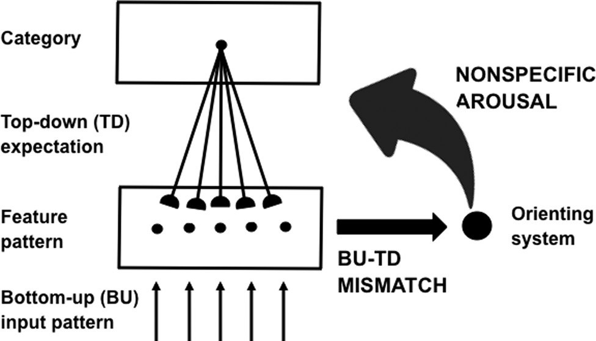

그림 1.11은 **예측적 불일치(predictive mismatch)**가 어떻게 행동에 영향을 미치는지 보여줍니다.

처리 흐름:
1. **상향식 입력(BU)**: 감각으로부터 들어오는 현재 상황 정보
2. **하향식 예측(TD)**: 학습된 기대에 기반한 예측
3. **불일치 탐지**: BU와 TD가 맞지 않을 때 불일치 신호 발생
4. **비특이적 각성(nonspecific arousal)**: 불일치 신호가 전반적인 각성 수준을 높임
5. **지향 시스템(orienting system)**: 새로운 학습이나 주의 재조정을 위한 메커니즘 활성화

이 메커니즘은 우리가 예상과 다른 것을 경험할 때 느끼는 놀라움과 주의 전환을 설명합니다. "어라?" 반응이 자동적으로 발생하여 우리의 주의를 새로운 자극으로 향하게 합니다.

---

## 19. 예상치 못한 비발생, 정서적 반동, 이완 반응

### 긍정적 및 부정적 정서적 반동

흥미로운 현상은 예상된 자극이 **발생하지 않을 때(unexpected non-occurrence)** 무슨 일이 일어나는가입니다.

**부정적 정서적 반동(negative emotional rebound)**:
- 긍정적 자극(보상)이 예상되었지만 발생하지 않음 → 좌절(frustration) 또는 실망
- 이는 단순히 중립적인 상태로의 복귀가 아니라 적극적인 부정적 반응

**긍정적 정서적 반동(positive emotional rebound)**:
- 부정적 자극(처벌)이 예상되었지만 발생하지 않음 → 안도(relief) 또는 기쁨
- 이 역시 단순한 중립 상태가 아닌 적극적인 긍정적 반응

### 이완 반응

**이완 반응(Relaxation Response)**은 Herbert Benson이 명명한 현상으로, 스트레스를 유발하는 자극이 제거될 때 발생하는 생리적 반응입니다. 이는 정서적 반동의 생리적 측면을 반영합니다.

---

## 20. 피크 이동과 행동 대비

### 일반화 기울기와 피크 이동

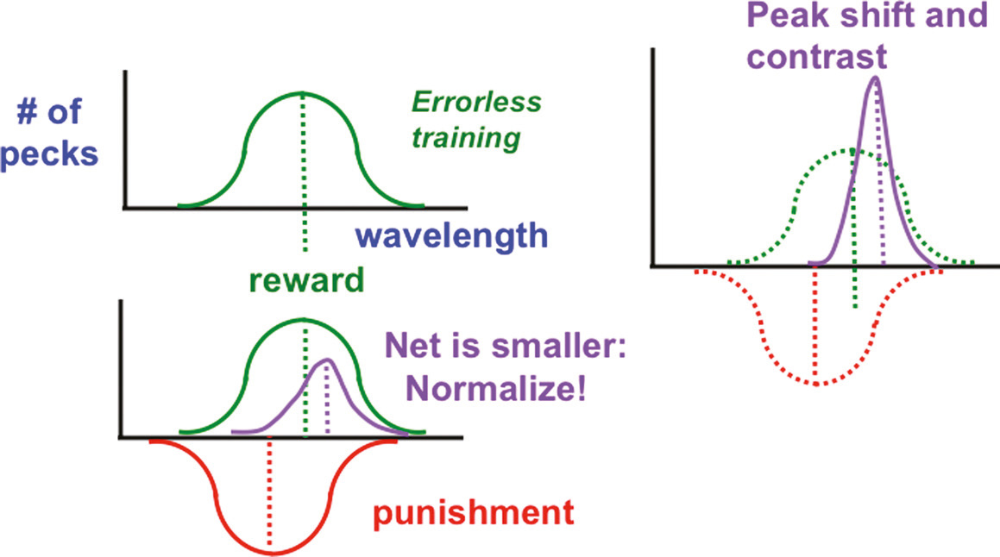

그림 1.12는 **피크 이동(peak shift)**과 **행동 대비(behavioral contrast)** 현상을 보여줍니다.

**피크 이동**:
- 동물을 CS+ (보상)와 CS- (처벌) 자극으로 훈련
- 테스트에서 CS+와 같은 방향으로 더 이동한 자극에 최대 반응
- 예: CS+가 580nm 파장, CS-가 540nm → 600nm 파장에 최대 반응

**행동 대비**:
- 보상 일정이 변경되면 이전 조건과의 대비가 행동에 영향
- 긍정적 대비: 기대보다 더 좋은 보상 → 행동 증가
- 부정적 대비: 기대보다 나쁜 보상 → 행동 감소

### 조작적 조건화와 강화 일정

**조작적 조건화(operant conditioning)**에서 행동은 그 결과에 의해 형성됩니다. **강화 일정(reinforcement schedules)**은 보상이 어떤 패턴으로 제공되는지를 결정하며, 이것이 행동의 율(rate)과 지속성에 영향을 미칩니다.

---

## 21. 노이즈-포화 딜레마와 단기기억 정규화

### 총 활동 정규화

신경 네트워크의 중요한 특성 중 하나는 **총 활동 정규화(total activity normalization)**입니다. 네트워크의 총 활성화가 일정하게 유지되려는 경향이 있습니다.

이는 다음과 같이 작동합니다:
- 어떤 세포가 더 강하게 활성화되면, 다른 세포들의 활성화가 감소
- 이를 통해 네트워크는 강한 신호에 의해 포화되는 것을 방지
- 동시에 약한 신호들도 상대적으로 표현될 수 있음

수학적으로 이는 다음과 같은 정규화 방정식으로 표현됩니다:

$$x_i(t+1) = \frac{I_i}{\sum_j I_j + \sigma}$$

여기서 $I_i$는 세포 $i$의 입력, $\sigma$는 작은 상수입니다.

### 중심-흥분 주변-억제 정규화

**중심-흥분 주변-억제(on-center off-surround)** 네트워크는 노이즈를 억제하면서 패턴을 보존하는 가장 효과적인 방법 중 하나입니다:
- 중심(on-center): 동일한 패턴을 감지하는 세포들이 서로를 흥분
- 주변(off-surround): 다른 패턴을 감지하는 세포들을 억제

---

## 22. 대립 처리, 망각, 강박, 탐험

### 대립 채널

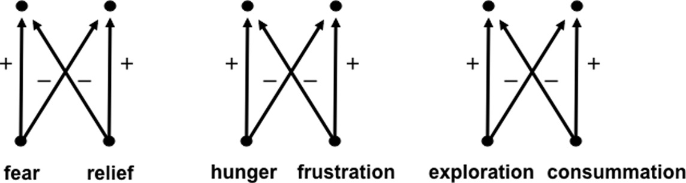

그림 1.13은 **대립 채널(opponent channels)** 시스템을 보여줍니다. 뇌는 많은 감각 및 감정 정보를 대립 쌍으로 처리합니다:

- **공포(fear) / 안도(relief)**
- **배고픔(hunger) / 좌절(frustration)**
- **탐험(exploration) / 소비(consummation)**

이러한 대립 구조는 매우 효율적입니다. 두 가지 상태 사이의 전환을 효과적으로 표현하고, 균형 잡힌 반응을 가능하게 합니다.

### 소멸, 강박증, 탐험

**소멸(extinction)**은 강화 없이 CS를 반복 제시할 때 CR이 감소하는 과정입니다. 그러나 소멸은 망각이 아닙니다 - 기억은 여전히 존재하지만 일시적으로 억제됩니다.

**강박증(obsession)**은 대립 채널이 균형을 잃었을 때 발생할 수 있습니다. 특정 채널이 지속적으로 활성화되어 다른 채널이 억제되지 못하는 상태입니다.

**긍정 정신의학(Positive Psychiatry)**은 단순히 병리를 제거하는 것이 아니라, 회복력과 긍정적인 정서 상태를 구축하는 데 초점을 맞춥니다.

---

## 23. 부분 보상: 비합리성, 도박, 창의성, 짝사랑

### 부분 강화 획득 효과

인간과 동물의 행동에서 놀라운 현상이 있습니다: 항상 보상을 받는 것보다 **때때로만** 보상을 받을 때 행동이 더 지속적으로 유지됩니다. 이를 **부분 강화 획득 효과(partial reinforcement acquisition effect)**라고 합니다.

이것이 도박이 중독적인 이유 중 하나입니다. 슬롯 머신은 불규칙적으로만 보상을 주지만, 이 불규칙성이 오히려 더 강한 행동 지속성을 만들어냅니다.

**학습된 무기력(learned helplessness)**은 반대 극단입니다. 통제할 수 없는 부정적 사건을 반복적으로 경험하면, 나중에 통제 가능한 상황에서도 적극적으로 대응하지 않게 됩니다.

**짝사랑(unrequited love)**도 부분 강화의 예로 볼 수 있습니다. 불규칙적으로 주어지는 긍정적 반응이 강한 집착을 만들어냅니다.

---

## 24. 이차 조건화와 광고

### 조건 강화물과 이차 조건화

**조건 강화물(conditioned reinforcers)**은 원래는 중립적이었지만, 일차 강화물(음식, 물 등)과의 연합을 통해 강화 가치를 얻은 자극입니다. 돈이 가장 좋은 예입니다.

**이차 조건화(secondary conditioning)**는 조건 강화물을 이용한 추가적인 학습을 가능하게 합니다. 이는 학습 체계를 더 유연하고 복잡하게 만드는 중요한 메커니즘입니다.

**광고(advertising)**는 이 원리를 체계적으로 활용합니다:
- 제품(CS2)과 이미 긍정적인 연합을 가진 자극(CS1: 미인, 성공한 삶, 음악)을 함께 제시
- 반복적 노출을 통해 제품 자체가 긍정적 가치를 갖게 됨
- 이것이 이차 조건화를 통한 학습

---

## 25. 게이트 이중극 대립 처리: 각성, 습관화, 경쟁

### 게이트 이중극 회로

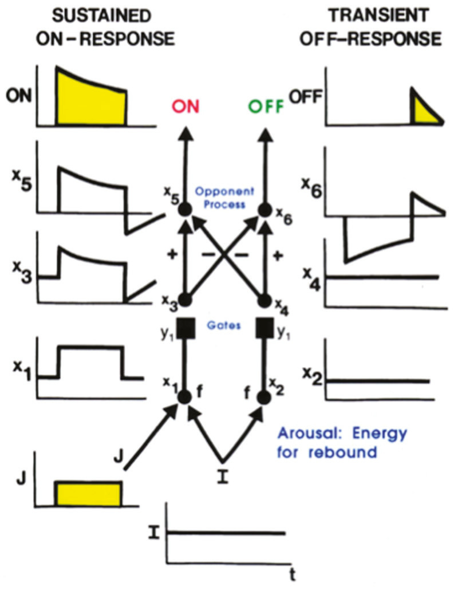

그림 1.14는 **게이트 이중극 회로(gated dipole circuit)**를 보여줍니다. 이것은 대립 처리의 핵심 신경 회로입니다.

**회로의 주요 구성 요소**:
- **ON 채널**: 자극의 시작에 반응하는 세포들
- **OFF 채널**: 자극의 종료에 반응하는 세포들
- **전달물질 게이트**: 시냅스 전달물질의 가용성에 의해 조절되는 시냅스

### 전달물질 습관화

**전달물질 습관화(transmitter habituation)** 또는 **시냅스 억제(synaptic depression)**는 반복적 자극에 의해 신경 전달물질이 고갈되는 현상입니다. 이는 다음과 같은 효과를 가집니다:

- 지속적인 자극에 대한 반응 감소 (습관화)
- 자극 종료 후 반동 효과 (대립 반동)
- 새로운 자극에 대한 민감도 유지

### 위상성 vs 강장성 입력

- **위상성 입력(phasic inputs)**: 일시적이고 급격한 자극. 변화에 반응.
- **강장성 입력(tonic inputs)**: 지속적이고 일정한 배경 자극. 기저 활동 수준 유지.

이 두 유형의 입력의 상호작용이 풍부한 시간적 패턴을 만들어냅니다.

---

## 26. STM, MTM, LTM

### READ 회로

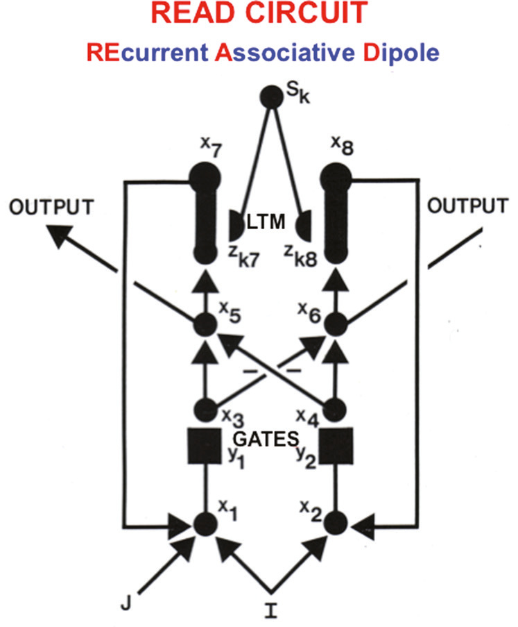

그림 1.15는 **READ 회로(REcurrent Associative Dipole)**를 보여줍니다. 이 회로는 세 가지 시간 척도의 기억이 어떻게 통합되는지를 보여줍니다.

**세 가지 기억 시간 척도**:

| 기억 유형 | 시간 척도 | 신경 메커니즘 | 기능 |
|-----------|-----------|--------------|------|
| STM (단기기억) | 초-분 | 지속적 신경 발화 | 현재 작업 중인 정보 유지 |
| MTM (중기기억) | 분-시간 | 전달물질 가용성 변화 | 중간 강도의 학습 |
| LTM (장기기억) | 일-년 | 시냅스 강도 변화 | 영구적 지식 저장 |

STM과 LTM의 상호작용은 다음과 같습니다:
$$\frac{dx_i}{dt} = -\alpha x_i + (1 - \beta x_i)f(x_i) - x_i\sum_{j \neq i} g(x_j)$$

여기서 $x_i$는 세포 $i$의 STM 활성화, $f$는 출력 신호 함수, $g$는 억제 신호 함수입니다.

**조건 강화물 학습을 위한 LTM 흔적**:
조건 강화물이 어떤 자극들과 연합되어 있는지는 LTM 흔적을 통해 저장됩니다. 이 흔적들은 경험에 따라 천천히 형성되지만, 한번 형성되면 안정적으로 유지됩니다.

---

## 27. 동기, 포만, 그리고 사랑에 굶주리기

### CogEM 모델의 처리 단계

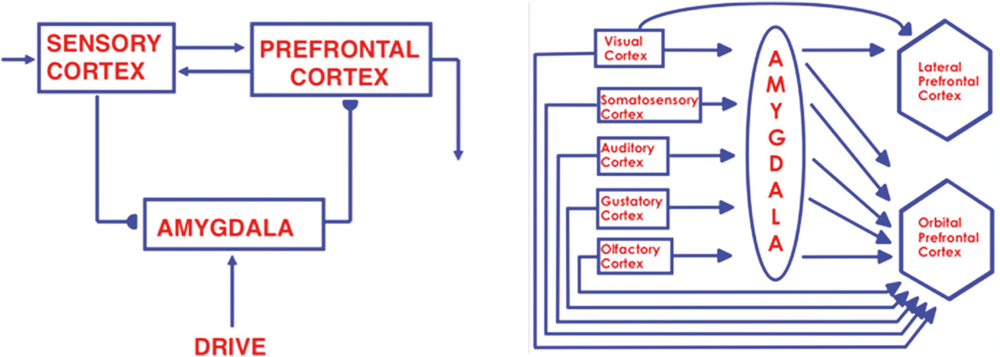

그림 1.16은 **CogEM(Cognitive-Emotional Motivational)** 모델의 처리 단계를 보여줍니다:

1. **감각 표현(sensory representation)**: 외부 세계의 자극이 감각 피질에서 처리됨
2. **범주 학습(category learning)**: 자극 패턴이 학습된 범주와 매칭됨
3. **감정 평가(emotional evaluation)**: 편도체가 자극의 감정적 중요성을 평가
4. **동기 출력(motivational output)**: 시상하부가 동기 관련 반응을 조절

### 감각-동기 이종 위계

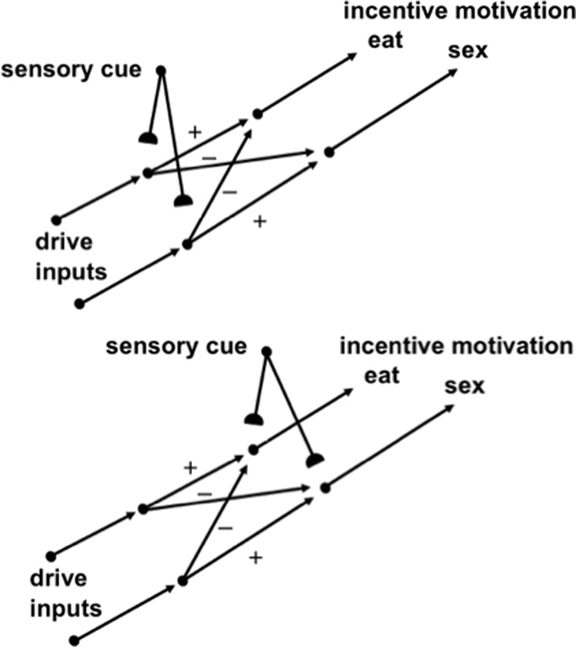

그림 1.17은 두 가지 다른 방식으로 동기와 감각이 상호작용하는 방식을 보여줍니다:

- **동기 위계(drive hierarchy)**: 동기가 계층적으로 배열되어 가장 강한 동기가 행동을 지배
- **감각-동기 이종 위계(sensory-drive heterarchy)**: 동기와 감각 입력이 복잡하게 상호작용하는 비계층적 구조

**편도체(amygdala)**는 감정적 학습의 핵심 구조입니다. 편도체는 감각 입력의 감정적 중요성을 평가하고, 이를 시상하부와 다른 구조들에 전달합니다.

**시상하부(hypothalamus)**는 기본 동기(배고픔, 갈증, 성욕 등)를 조절합니다. 동기 상태는 어떤 자극이 강화 가치를 가지는지에 영향을 미칩니다 - 배고플 때는 음식이 더 매력적으로 보입니다.

**포만(satiety)**은 동기가 충족된 상태입니다. 포만은 특정 보상에 대한 반응을 감소시켜, 새로운 경험이나 다른 동기를 추구하게 만듭니다.

**"사랑에 굶주리기"**는 사회적 연결에 대한 기본적인 욕구가 충족되지 않을 때 발생하는 상태를 묘사합니다. 이는 음식에 대한 배고픔과 유사한 신경 메커니즘을 공유합니다.

---

## 28. 황금 평균, 역U, 두 종류의 정서적 우울

### 역U 곡선과 최적 각성

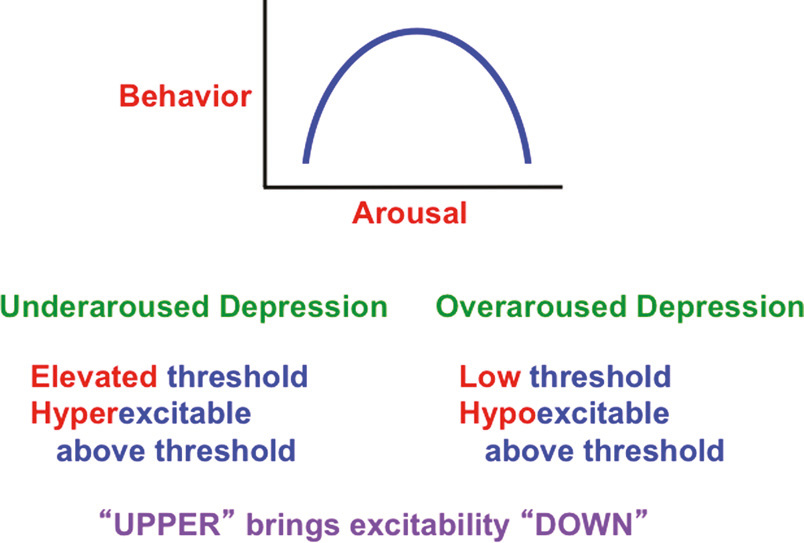

그림 1.18은 **역U 곡선(inverted U)**을 보여줍니다. 이는 **여크스-도슨 법칙(Yerkes-Dodson law)**으로도 알려져 있습니다:
- 너무 낮은 각성: 졸음, 집중력 부족, 수행 저하
- 최적 각성: 최고의 수행
- 너무 높은 각성: 불안, 과부하, 수행 저하

### 두 종류의 정서적 우울

**저각성 우울(underaroused depression)**:
- 각성 수준이 너무 낮아 동기와 활력이 부족
- 둔한 감정, 무기력, 무관심
- 치료: 각성 수준을 높이는 방법 (운동, 자극, 일부 항우울제)

**과각성 우울(overaroused depression)**:
- 각성 수준이 너무 높아 불안과 과부하가 발생
- 지속적인 걱정, 불안, 불면증
- 치료: 각성 수준을 낮추는 방법 (이완, 명상, 다른 종류의 약물)

**황금 평균(Golden Mean)**은 아리스토텔레스가 제안한 개념으로, 극단을 피하고 중간을 추구하는 것입니다. 이것은 최적 각성 수준에도 적용됩니다.

**ADHD(주의력결핍 과잉행동장애)**는 이 맥락에서 이해될 수 있습니다. ADHD는 종종 저각성 상태와 관련이 있으며, 각성제가 치료에 사용되는 것이 이를 반영합니다.

**항상성 가소성(homeostatic plasticity)**은 뇌가 자신의 활동 수준을 적절한 범위 내에 유지하려는 경향입니다.

---

# 후반부 (pp. 27-49)

---

## 29. 정서 신경과학, 정신 장애, 그리고 당신을 끌어내리는 흥분제

### 인지 과학의 탄생과 인지 혁명

1956년은 **인지 과학(Cognitive Science)**의 탄생을 알리는 해로 종종 언급됩니다. 이 해에 밀러(Miller), 갈란터(Galanter), 프리브람(Pribram)의 "계획과 행동의 구조", 촘스키(Chomsky)의 언어학 연구, 그리고 인공지능 분야의 첫 번째 학회가 열렸습니다.

**인지 혁명(Cognitive Revolution)**은 행동주의(behaviorism)에서 인지과학으로의 전환을 의미합니다. 스키너(Skinner)의 순수한 자극-반응 행동주의에 대한 촘스키(Chomsky)의 비판이 이 혁명의 중요한 계기가 되었습니다.

**인지 과학 학회(Cognitive Science Society)**의 형성은 심리학, 언어학, 철학, 인공지능, 신경과학의 학제 간 통합을 가져왔습니다.

### 역설적 약물 효과

"당신을 끌어내리는 흥분제"는 흥미로운 역설을 가리킵니다. ADHD 치료에 사용되는 암페타민 같은 흥분제가 과잉 활동적인 아이들을 오히려 진정시키는 효과가 있습니다.

이것은 역U 곡선으로 설명됩니다: ADHD 아이들이 이미 최적 수준보다 낮은 각성 상태에 있다면, 흥분제가 각성 수준을 최적점으로 끌어올려 행동을 개선합니다.

---

## 30. 두 종류의 학습: 지각하고 알기 vs 움직이고 탐색하기

### 선언적 학습과 절차적 학습

뇌는 두 가지 근본적으로 다른 종류의 학습을 수행합니다:

1. **지각 및 인식 학습(Perceiving and Knowing)**:
   - 무엇이 세상에 있는지 학습
   - 물체 인식, 범주 학습, 사실 기억
   - 주로 피질 시스템 (특히 측두엽)에 의존

2. **운동 및 탐색 학습(Moving and Navigating)**:
   - 어떻게 행동할지 학습
   - 운동 기술, 공간 탐색, 절차적 기억
   - 주로 소뇌, 기저핵, 해마에 의존

이 두 시스템은 서로 다른 신경 회로를 사용하며, 다른 방식으로 학습합니다. 이 구분은 기억 장애를 가진 환자들의 연구에서 명확하게 드러납니다.

---

## 31. 무엇과 어디서 피질 처리 흐름과 의식

### 복측과 배측 경로

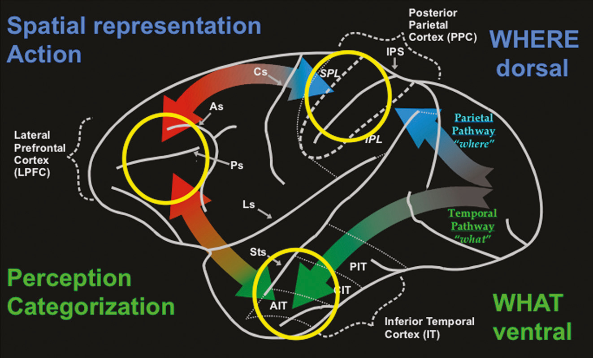

그림 1.19는 시각 처리의 두 주요 경로를 보여줍니다:

- **"무엇" 경로(What pathway, 복측 경로)**: V1 → V2 → V4 → IT (하측두엽). 물체 인식, 색상, 형태 처리.
- **"어디서" 경로(Where pathway, 배측 경로)**: V1 → V2 → MT → PPC (두정엽). 공간 위치, 움직임, 공간 관계 처리.

### 의식과 처리 경로

의식적 경험은 두 경로와 다르게 관련됩니다:
- **복측 경로**: 물체의 의식적 지각과 더 밀접하게 연관 (qualia 포함)
- **배측 경로**: 더 많은 무의식적 처리. 시각적 행동 안내.

이는 **상보적 처리 흐름(complementary processing streams)**의 좋은 예입니다: 두 경로는 서로 다른 정보를 처리하면서 전체적인 시각 인식을 위해 협력합니다.

---

## 32. 두 가지 혁명적 패러다임: 상보 컴퓨팅과 층상 컴퓨팅

### 상보 컴퓨팅

**상보 컴퓨팅(Complementary Computing)**은 Grossberg가 제안한 핵심 패러다임입니다. 이에 따르면 뇌는 단일 통합 시스템이 아니라, 상보적인 기능을 가진 여러 시스템들의 협력으로 작동합니다.

**표 1.1: 상보적 피질 처리 흐름**

| 복측 경로 (무엇) | 배측 경로 (어디서) |
|-----------------|-------------------|
| 물체 인식 | 공간 위치 |
| 색상 처리 | 움직임 처리 |
| 형태 처리 | 심도 처리 |
| 장기 기억 | 단기 공간 기억 |
| 느린 학습 | 빠른 적응 |
| 의식적 지각 | 무의식적 행동 안내 |

**표 1.2: 무엇 vs 어디서 경로의 특성**

| 특성 | 무엇 경로 | 어디서 경로 |
|------|-----------|------------|
| 흥분성 매칭 | 있음 | 없음 |
| 억제성 매칭 | 있음 | 없음 |
| 매칭 시 학습 | 느림 | 빠름 |
| 불일치 시 학습 | 없음 | 있음 |
| 주의 | 물체 기반 | 공간 기반 |

### 뇌의 대칭성 파괴

**대뇌 우세성(cerebral dominance)**과 **대칭성 파괴(symmetry-breaking)**는 뇌의 좌우 반구가 다른 기능을 전문화하는 방식을 설명합니다. 이것 역시 상보 컴퓨팅의 일환입니다.

---

## 33. 층상 신피질

### 신피질의 6개 층

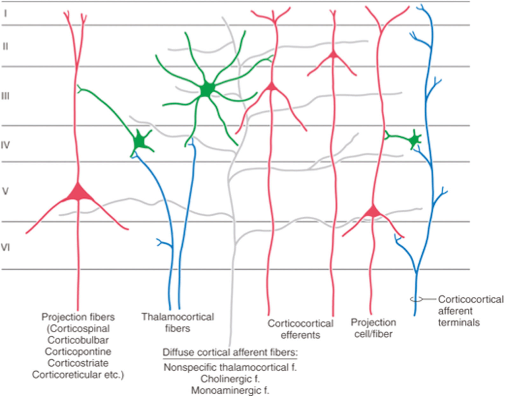

그림 1.20은 신피질의 **층상(laminar)** 구조를 보여줍니다. 신피질은 6개의 구별되는 층으로 구성됩니다:

| 층 | 이름 | 주요 특성 | 주요 연결 |
|----|------|-----------|-----------|
| I | 분자층 | 희소한 세포 | 세포 이외 연결 |
| II | 외부 과립층 | 작은 피라미드 세포 | 피질 내 연결 |
| III | 외부 피라미드층 | 피라미드 세포 | 긴 피질-피질 연결 |
| IV | 내부 과립층 | 별 모양 세포 | 시상으로부터 입력 수신 |
| V | 내부 피라미드층 | 대형 피라미드 세포 | 피질 하 구조로 출력 |
| VI | 다형층 | 다양한 세포 | 시상으로 피드백 |

### 층상 모델들

Grossberg의 연구팀은 신피질의 층상 구조를 설명하는 여러 모델을 개발했습니다:
- **LAMINART**: 층상 피질에서의 시각 인식과 주의 모델
- **3D LAMINART**: 입체 시각과 깊이 지각 모델
- **cARTWORD**: 음성 및 언어 처리 모델
- **LIST PARSE**: 서열 학습과 작업기억 모델

---

## 34. 상보 컴퓨팅 vs 독립 모듈

### 시각 피질 경로의 복잡성

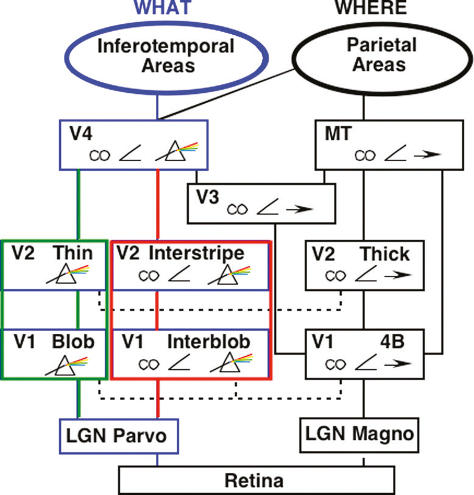

그림 1.21은 시각 피질의 복잡한 연결망을 보여줍니다. 이 그림은 V1의 blob/interblob 구분에서 시작하여 V2, V3, V4(색상/형태), MT(움직임), IT(물체 인식), PPC(공간)까지의 계층적 처리를 보여줍니다.

### 불확실성의 계층적 해결

**불확실성의 계층적 해결(hierarchical resolution of uncertainty)**은 Grossberg의 중요한 개념입니다:
- 낮은 수준의 처리: 지역적 특성 탐지 (모서리, 색상, 움직임)
- 중간 수준의 처리: 지역적 특성의 통합 (형태, 표면)
- 높은 수준의 처리: 전체적 해석 (물체, 장면)

각 수준은 모호성을 줄이고 더 확실한 해석을 만들어냅니다.

### 상보적 일관성

**상보적 일관성(complementary consistency)**은 상보적 경로들이 서로 독립적으로 작동하는 것이 아니라, 서로 정보를 교환하고 일관성을 유지한다는 것입니다. 이것은 독립 모듈 이론과 근본적으로 다릅니다.

**자기 조직화 측정 시스템으로서의 뇌**: 뇌는 수동적으로 세상을 측정하는 것이 아니라, 능동적으로 자신의 표현을 조직화하면서 세상을 이해합니다.

---

## 35. 음소 복원과 안정적 학습

### 리처드 워런의 실험

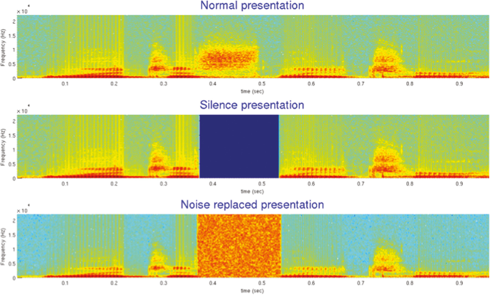

그림 1.22는 **음소 복원(phonemic restoration)** 현상을 시각적으로 보여줍니다. 리처드 워런(Richard Warren)의 실험에서:

- **정상 음성**: 모든 음소가 완전히 존재
- **침묵**: 특정 음소를 침묵으로 대체 → 빈 자리가 들림
- **노이즈 대체**: 같은 음소를 노이즈로 대체 → 원래 단어가 완전하게 들림

놀랍게도, 노이즈가 오히려 음소를 복원시킵니다! 이것은 언어의 상위 처리(단어, 문장 수준)가 하위 처리(음소 수준)에 하향식으로 영향을 미친다는 것을 보여줍니다.

### 맥락적 명확화

이 현상은 **맥락적 명확화(contextual disambiguation)**의 강력한 예입니다. 더 높은 수준의 맥락(단어, 문장)이 낮은 수준의 지각(개별 음소)을 명확히 하는 데 도움을 줍니다.

ART는 이 메커니즘을 설명합니다: 상위 범주(단어)가 하향식 기대를 통해 하위 특성(음소)의 처리에 영향을 미칩니다. 이것이 안정적 학습을 가능하게 하는 동시에 맥락에 민감한 지각을 허용합니다.

---

## 36. 학습된 기대: 항목 청크와 목록 청크 사이의 공명

### 작업기억 저장과 청크

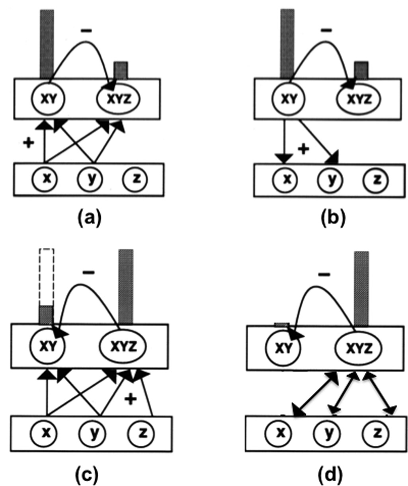

그림 1.23은 작업기억이 어떻게 항목(item)과 목록(list)을 저장하는지 보여줍니다:

- **항목 청크(item chunks)**: 개별 항목들 (예: 개별 단어, 음소)
- **목록 청크(list chunks)**: 항목들의 시퀀스 (예: 단어들의 순서)

패널 (a)에서 (d)까지는 목록이 입력됨에 따라 항목들의 활성화 패턴이 어떻게 변화하는지를 보여줍니다.

### IOR 마스킹 필드

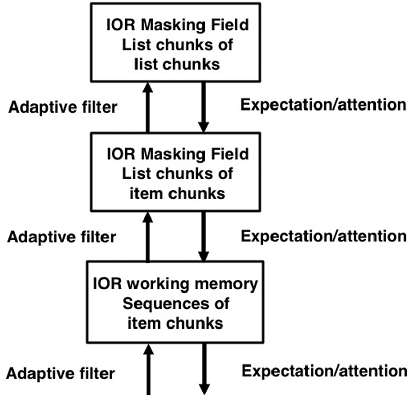

그림 1.24는 **IOR(Inhibition Of Return) 마스킹 필드**를 보여줍니다. 이 구조는 세 가지 처리 수준을 가집니다:
1. **특성 수준**: 개별 특성들의 처리
2. **항목 수준**: 특성들의 조합으로 형성된 항목
3. **목록 수준**: 항목들의 시퀀스와 순서

**ART 시간 속에서(ART In Time)**와 **순방향 vs 피드백** 연결의 상호작용이 이 구조를 통해 안정적인 시퀀스 학습을 가능하게 합니다.

---

## 37. 객체 주의는 어떻게 작동하는가? ART 매칭 규칙

### ART 매칭 규칙

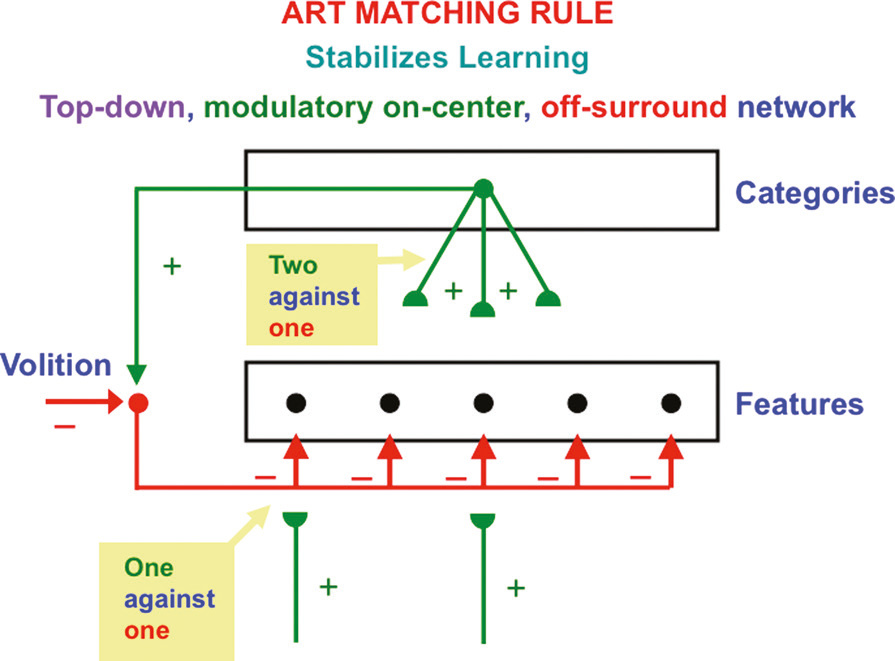

그림 1.25는 **ART 매칭 규칙(ART Matching Rule)**을 보여줍니다. 이것은 어떻게 하향식 기대가 상향식 입력을 선택적으로 증폭하거나 억제하는지를 설명합니다.

**핵심 메커니즘**:
- **하향식 조절 중심-흥분(top-down modulatory on-center)**: 기대와 일치하는 특성들을 강화
- **주변-억제(off-surround)**: 기대와 불일치하는 특성들을 억제

**2대1 대 1대1 비교**:
- **2대1**: 상향식 입력 + 하향식 기대가 모두 활성화할 때 특성이 강하게 유지됨
- **1대1**: 둘 중 하나만 활성화할 때 특성이 억제됨

이것이 **주의의 선택성**을 만들어냅니다. 우리의 기대가 우리가 지각하는 것에 영향을 미치는 것은 단순히 해석의 편향이 아니라, 실제 신경 신호의 증폭과 억제를 통해 일어납니다.

---

## 38. 모든 의식 상태는 공명 상태이다

### CLEARS 과정

Grossberg는 의식의 핵심 과정들을 **CLEARS**라는 약어로 요약합니다:

- **C**onsciousness (의식): 의식적 경험의 발생
- **L**earning (학습): 경험으로부터의 지식 습득
- **E**xpectation (기대): 미래 사건에 대한 예측
- **A**ttention (주의): 관련 정보의 선택
- **R**esonance (공명): 상향식과 하향식 처리의 동기화
- **S**ynchrony (동기화): 신경 발화의 시간적 조율

**표 1.3: 의식과 다양한 감각 양식**

| 의식 유형 | 처리 영역 | 공명 유형 | 대표 경험 |
|-----------|-----------|-----------|-----------|
| 시각적 의식 | 시각 피질 | 표면-수의 공명 | 색상, 형태 지각 |
| 청각적 의식 | 청각 피질 | 분광-음높이 공명 | 음악, 언어 지각 |
| 감정적 의식 | 편도체, 피질 | 인지-감정 공명 | 기쁨, 슬픔 느낌 |

### 자아의 출현과 통일성

흥미롭게도, Grossberg는 공명의 통일성이 **자아(self)**의 경험을 만들어낼 수 있다고 제안합니다. 서로 다른 감각 양식과 인지 과정이 공명을 통해 일관된 전체로 통합될 때, "나"라는 경험이 출현합니다.

이는 일신교(monotheism)와의 흥미로운 유사성을 보여줍니다: 다양한 경험들의 통일성이 단일한 자아의 경험을 만들어내는 것처럼, 다양한 신의 개념들이 하나의 통일된 신 개념으로 수렴하는 문화적 과정과 유사합니다.

---

## 39. 불변 학습, 기대, 초기 종교적 믿음에서의 인지-감정 공명

### 불변 학습과 종교

인간 뇌의 놀라운 능력 중 하나는 **불변 표현(invariant representations)**을 형성하는 것입니다. 이는 다양한 관점, 조명, 크기에서도 동일한 물체를 인식하는 능력입니다.

이 능력은 또한 추상적인 개념의 형성에도 적용됩니다. 다양한 경험에서 공통된 패턴을 추출하여 일반적인 규칙이나 원리를 형성합니다.

초기 종교적 믿음은 이러한 인지 과정과 감정적 공명의 결합으로 이해될 수 있습니다:
- 자연 현상에서 패턴을 인식하는 인지 과정
- 이 패턴에 대한 감정적 반응(경외, 두려움, 기쁨)
- 이 인지와 감정의 공명이 강한 믿음 체계를 형성

---

## 40. 의식적 보기, 듣기, 느끼기, 알기: 의식을 행동과 연결하기

### 자기-안정화 기억

의식적 경험은 단순히 수동적인 관찰이 아닙니다. **자기-안정화 기억(self-stabilizing memories)**은 의식적 처리가 기억을 더욱 견고하게 만드는 방식을 설명합니다.

공명 상태에서:
1. 상향식과 하향식 신호가 서로를 강화
2. 이 강화된 활동이 시냅스 강도의 변화를 통해 LTM에 인코딩
3. 미래의 유사한 경험이 더 쉽게 인식됨

### 편향 없이 평생 학습하는 도전

**편향 없이 평생 학습**하는 것은 뇌가 직면하는 가장 큰 도전 중 하나입니다. 새로운 경험이 기존의 편향을 강화하지 않고, 진정한 새로운 정보를 통합할 수 있어야 합니다.

ART는 이를 **경계 일치(vigilance)** 파라미터를 통해 조절합니다:
- 높은 경계 일치: 유사한 경험에서도 새로운 범주 형성 (더 세밀한 구분)
- 낮은 경계 일치: 더 넓은 범주 허용 (더 많은 일반화)

---

## 41. ART로 가는 길: 헬름홀츠, 제임스, 그레고리

### 무의식적 추론, 실용주의, 인지적 윤곽

ART의 지적 역사는 세 명의 중요한 사상가와 연결됩니다:

**헤르만 폰 헬름홀츠(Hermann von Helmholtz)**:
- **무의식적 추론(unconscious inference)**: 우리는 종종 과거 경험에 기반한 무의식적 추론을 통해 지각한다
- 이것이 ART의 하향식 기대 개념의 전신

**윌리엄 제임스(William James)**:
- **실용주의(pragmatism)**: 믿음의 진리는 그 실용적 결과에 있다
- 지각과 인지는 행동을 위해 존재한다는 관점

**리처드 그레고리(Richard Gregory)**:
- **인지적 윤곽(cognitive contours)**: 존재하지 않는 경계를 지각하는 현상 (예: 카니자 삼각형)
- 이것이 뇌의 구성적 본성을 보여준다고 주장

**표 1.4: 여섯 가지 주요 공명 유형**

| 공명 유형 | 관련 시스템 | 기능 | 의식 연관성 |
|-----------|------------|------|-------------|
| 표면-수의 공명 | 시각 피질, 두정엽 | 물체 지각, 주의 | 시각적 의식 |
| 특성-범주 공명 | 시각 피질, 측두엽 | 물체 인식 | 범주적 지각 |
| 흐름-수의 공명 | 배측 경로 | 공간 주의 | 공간적 의식 |
| 분광-음높이-음색 공명 | 청각 피질 | 청각 지각 | 청각적 의식 |
| 항목-목록 공명 | 전두엽, 측두엽 | 시퀀스 처리 | 인지적 의식 |
| 인지-감정 공명 | 피질, 편도체 | 감정적 평가 | 감정적 의식 |

---

## 42. 보기, 듣기, 느끼기, 알기 동안의 다양한 공명 경험

### 감각 양식을 넘나드는 공명

의식의 풍부함은 여러 유형의 공명이 동시에 또는 순차적으로 발생하기 때문입니다.

**시각적 공명**:
- 색상과 형태의 표면이 주의와 공명 → 의식적 시각 경험
- 물체 범주가 감각 특성과 공명 → 인식

**청각적 공명**:
- 주파수 스펙트럼이 음높이와 음색 표현과 공명 → 음악 경험
- 음소 패턴이 단어 범주와 공명 → 언어 이해

**감정적 공명**:
- 인지적 평가가 감정적 상태와 공명 → 감정 경험
- 기억이 현재 경험과 공명 → 향수, 기대

**인지적 공명**:
- 아이디어가 관련 개념과 공명 → 통찰과 이해
- 문제 구조가 해결책 패턴과 공명 → 창의적 해결

---

## 43. 모든 의식 상태는 공명 상태이지만, 일부 공명 상태는 의식적이지 않다

### 의식적 공명과 비의식적 공명의 구분

공명은 필요 조건이지만 충분 조건은 아닙니다. 모든 의식적 상태는 공명을 포함하지만, 모든 공명이 의식적이지는 않습니다.

**비의식적 공명의 예**:
- 무의식적 프라이밍: 이전 자극이 이후 처리에 영향을 미치지만 의식에 도달하지 않음
- 수면 중 처리: 뇌는 활발한 공명을 유지하지만 의식이 없음
- 자동화된 기술: 숙달된 운동 기술은 공명 없이 실행됨

**의식적 공명의 특성**:
- 충분한 강도: 공명이 특정 임계값을 넘어야 의식에 도달
- 지속 시간: 충분히 오래 지속되어야 함
- 주의와의 상호작용: 주의 시스템과의 연결이 필요

---

## 44. 의식의 어려운 문제를 향하여

### 설명적 간격과 Hard Problem

**설명적 간격(explanatory gap)**은 물리적 뇌 과정과 주관적 의식 경험 사이의 간격입니다. 신경 발화 패턴이 어떻게 색상의 빨강함이나 음악의 아름다움이라는 주관적 경험을 만들어내는가?

철학자 **데이비드 챨머스(David Chalmers)**는 이를 **의식의 어려운 문제(Hard Problem of Consciousness)**라고 명명했습니다:
- **쉬운 문제들**: 주의, 기억, 보고 등의 기능적 설명은 원칙적으로 가능
- **어려운 문제**: 왜 어떤 물리적 과정이 주관적 경험을 가지는가?

Grossberg는 이 어려운 문제에 대해 완전히 해결하지는 않지만, 새로운 관점을 제시합니다: 공명이 의식의 필요 조건이라면, 공명의 신경 상관물을 이해함으로써 의식의 특성들을 더 잘 이해할 수 있을 것입니다.

---

## 45. 공명하는 뇌 역학과 의식적 마음 사이의 연결 가설

### cART 모델

**cART(conscious ART)** 모델은 의식과 신경 역학을 연결하는 가설을 형식화합니다. 이 가설은 다음을 주장합니다:

1. 특정 유형의 공명 상태만이 의식적 경험을 생성한다
2. 이 공명 상태들은 특정한 신경적 특성을 가진다
3. 이 특성들이 의식의 주관적 성질을 결정한다

**연결 가설(linking hypothesis)**:
$$\text{공명 상태} \xrightarrow{\text{연결}} \text{의식적 경험}$$

### CLEARS 예측과 실험적 지지

cART/CLEARS 모델은 다음과 같은 예측을 합니다:

1. **연속성 예측**: 의식은 공명 상태에서만 발생하므로, 공명의 단절은 의식의 단절을 유발해야 함
2. **통합 예측**: 더 광범위한 공명은 더 통합된 의식 경험을 만들어야 함
3. **주의 예측**: 주의와 공명은 서로 긴밀하게 연결되어 있어야 함
4. **학습 예측**: 의식적 경험은 비의식적 처리보다 학습에 더 효과적이어야 함

이러한 예측들은 다양한 실험적 데이터에 의해 지지됩니다.

---

## 46. 방정식, 모듈, 그리고 양식 아키텍처

### 기본 방정식들

Grossberg의 모델은 세 가지 핵심 방정식에 기반합니다:

**STM (단기기억) 방정식**:
$$\frac{dx_i}{dt} = -Ax_i + (B - x_i)f(x_i) - x_i \sum_{j \neq i} g(x_j) + I_i$$

여기서 $x_i$: 세포 $i$의 활성화, $A$: 자기 억제율, $B$: 최대 활성화, $f$: 흥분성 신호, $g$: 억제성 신호, $I_i$: 외부 입력

**MTM (중기기억) 방정식**:
$$\frac{dz_{ij}}{dt} = -\gamma z_{ij} + \delta x_i(1 - z_{ij})$$

여기서 $z_{ij}$: 세포 $i$에서 세포 $j$로의 전달물질 가용성, $\gamma$: 회복율, $\delta$: 고갈율

**LTM (장기기억) 방정식**:
$$\frac{dw_{ij}}{dt} = \epsilon x_i (x_j - w_{ij})$$

여기서 $w_{ij}$: 세포 $i$에서 세포 $j$로의 시냅스 강도, $\epsilon$: 학습율

### 핵심 모듈

이 방정식들로 구현된 핵심 모듈들:

| 모듈 | 기능 | 구현 |
|------|------|------|
| 션팅 네트워크 | 노이즈 억제, 정규화 | STM 방정식 |
| 게이트 이중극 | 대립 처리, 반동 | STM + MTM |
| 연합 학습 | 패턴 연합 | LTM 방정식 |
| 경쟁 학습 | 범주 형성 | STM + LTM |
| ART 매칭 | 불일치 탐지 | 중심-흥분 주변-억제 |

### 양식 아키텍처

이 모듈들이 조합되어 다양한 감각 양식(시각, 청각, 인지)을 위한 **양식 아키텍처(modal architectures)**를 형성합니다.

---

## 47. 의식 이해를 위한 다른 접근법들

### 신경 전역 작업공간 이론

**Dehaene의 신경 전역 작업공간(Neural Global Workspace)** 이론:
- 의식은 분산된 뇌 영역들에 정보를 "방송"하는 전역 작업공간에서 발생
- 정보가 이 전역 공간에 접근할 때 의식적이 됨
- 전두두정 피질이 이 전역 작업공간의 핵심

**Grossberg의 관점**: 이 이론은 기능적 설명을 제공하지만, 왜 전역 방송이 의식을 만들어내는지 설명하지 못합니다. 또한 구체적인 신경 메커니즘이 부족합니다.

### 통합 정보 이론

**Tononi의 통합 정보 이론(Integrated Information Theory, IIT)**:
- 의식은 통합된 정보($\Phi$, phi)의 양에 비례
- $\Phi$가 높을수록 더 많은 의식
- 시스템의 어떤 부분도 전체만큼 많은 정보를 통합할 수 없을 때 의식이 발생

**Grossberg의 관점**: IIT는 의식을 측정하는 흥미로운 방법을 제안하지만, 어떻게 특정 신경 계산이 의식적 경험을 만들어내는지의 메커니즘적 설명이 부족합니다.

### 데닛의 다중 초안 이론

**Dennett의 다중 초안(Multiple Drafts)** 이론:
- 의식에 단일한 "Cartesian theater"는 없음
- 대신, 뇌는 동시에 여러 "초안"을 처리하고 수정
- 의식은 이 병렬 처리의 결과

**Grossberg의 관점**: 이 이론은 의식의 통일성을 설명하는 데 어려움이 있습니다.

### 다마지오의 접근

**Damasio**는 감정과 신체 상태가 의식에 핵심적이라고 주장합니다. 이것은 CogEM 모델의 인지-감정 통합과 유사한 부분이 있습니다.

### 원칙적 메커니즘 이론의 필요성

Grossberg는 이러한 이론들이 모두 중요한 통찰을 제공하지만, **원칙적인 메커니즘 이론(principled mechanistic theory)**이 필요하다고 주장합니다.

원칙적 메커니즘 이론의 특징:
1. 구체적인 신경 회로와 방정식으로 표현 가능
2. 다양한 실험 데이터를 예측하고 설명 가능
3. 기능적 설명과 구현 수준이 연결됨
4. 새로운 실험을 유도할 수 있는 예측 생성

ART와 CLEARS 프레임워크가 이러한 원칙적 메커니즘 이론을 향한 중요한 발걸음입니다.

---

## 1장 종합 정리

### 핵심 주제들의 연결

1장은 다음과 같은 핵심 주제들을 통합적으로 제시합니다:

**기본 딜레마들**:
- 안정성-가소성 딜레마 → ART로 해결
- 노이즈-포화 딜레마 → 시그모이드 신호와 중심-흥분 주변-억제로 해결
- 의식의 어려운 문제 → cART와 CLEARS로 접근

**핵심 메커니즘들**:
- 상향식-하향식 처리의 공명
- 대립 처리와 게이트 이중극
- 협력-경쟁 역학

**이론의 범위**:
- 시각적 지각 → 청각적 지각 → 인지 → 감정 → 의식
- 개별 신경 세포 → 신경 회로 → 행동 → 문화

### Grossberg의 포괄적 비전

Grossberg의 연구는 단순히 특정 뇌 기능을 모델링하는 것이 아닙니다. 그것은 **마음과 뇌를 연결하는 포괄적인 이론**을 향한 야심찬 시도입니다.

이 이론의 핵심은 다음과 같은 혁명적인 주장입니다:
> **모든 의식 상태는 공명 상태이다.**

이 단순해 보이는 주장이 시각, 청각, 감정, 인지, 그리고 의식 자체에 대한 수십 년의 연구를 하나로 통합합니다.

---

*이 문서는 Grossberg의 Conscious MIND Resonant BRAIN 1장의 핵심 내용을 한국어로 요약한 것입니다. 각 섹션은 원문의 논의를 충실히 반영하면서도, 한국어 독자들이 이해하기 쉽도록 설명을 보완했습니다.*
