# Grossberg *Conscious MIND Resonant BRAIN* 2장 완전 해설

> 원문: Stephen Grossberg, Conscious MIND Resonant BRAIN, Chapter 2 (pp. 50–85)
> 이 문서는 원문의 서사적 흐름을 따라, 수식·그림·이론을 한국어로 친절하게 풀어 설명합니다.

---

## 목차

### 전반부 (pp. 50-74)
1. [역사적 배경: 세 개의 N의 탄생](#역사적-분수령-뇌-이론이-탄생했을-때-물리학과-심리학의-분열)
2. [뇌가 마음을 만드는 방식](#1-뇌가-마음을-만드는-방식-how-a-brain-makes-a-mind)
3. [연속 학습과 시간의 역설](#1-서론-연속-학습의-중요성)
4. [STM과 LTM의 발견과 상호작용](#개요-stm과-ltm의-분리)
5. [이진 모델에서 연속 모델로](#43-역전파backpropagation의-역사와-한계)
6. [왜 신경망인가](#hartline-ratliff-miller-모델-투구게-망막에서-시작되는-이야기)
7. [노이즈-포화 딜레마와 그 해결](#7-노이즈-포화-딜레마와-그-해결)

### 후반부 (pp. 75-85)
8. [막 방정식과 신경생리학의 일치](#8-막-방정식과-신경생리학의-일치)
9. [Weber 법칙과 이동 특성](#9-weber-법칙과-이동-특성)
10. [협력-경쟁 역학과 Mudpuppy 망막](#10-협력-경쟁-역학과-mudpuppy-망막)
11. [침묵 억제에서 과분극과 적응 수준으로](#11-침묵-억제에서-과분극과-적응-수준으로)
12. [정보적 노이즈 억제](#12-정보적-노이즈-억제)
13. [노이즈 억제에서 패턴 매칭으로](#13-노이즈-억제에서-패턴-매칭으로)
14. [다중 채널 네트워크와 윤곽 검출](#14-다중-채널-네트워크와-윤곽-검출)
15. [뇌를 진화시키는 방법: 모델링 방법론](#15-뇌를-진화시키는-방법-모델링-방법론)
16. [임베딩, 언럼핑, 대응 원리](#16-임베딩-언럼핑-대응-원리)
17. [뇌 이론에서 기술 응용으로](#17-뇌-이론에서-기술-응용으로)

---

# 전반부 (pp. 50-74)

---

## 역사적 분수령: 뇌 이론이 탄생했을 때 물리학과 심리학의 분열

19세기에는 위대한 물리학자들이 동시에 위대한 심리학자이거나 신경과학자이기도 했습니다. 놀랍게도, 이러한 현상은 20세기 초부터 더 이상 사실이 되지 않았습니다. 왜 그랬을까요? 이 질문에 대한 답은 **마음과 뇌를 연결하는 문제가 어떤 성격을 가지는지**, 그리고 이 분야에서의 최근 진전의 본질을 명확히 합니다.

### 과학자들의 다학문적 경력

독일의 헤르만 폰 헬름홀츠(Hermann von Helmholtz), 잉글랜드의 클러크 맥스웰(Clerk Maxwell), 오스트리아의 에른스트 마흐(Ernst Mach) 같은 과학자들은 물리학뿐만 아니라 심리학과 신경과학에도 획기적인 기여를 했습니다. 그들은 물리적 공간과 시간에 대한 관심을 심리적 공간과 시간에 대한 매력과 결합했습니다.

**마흐의 예시**:
- 모든 물리학자들은 **마흐 수(Mach numbers)**를 알고 있으며, 이는 초음속 비행을 이해하는 데 도움이 됩니다
- 또한 그는 **시각의 마흐 대역(Mach bands)**에 대한 연구로 유명합니다 (그림 2.1 참조)

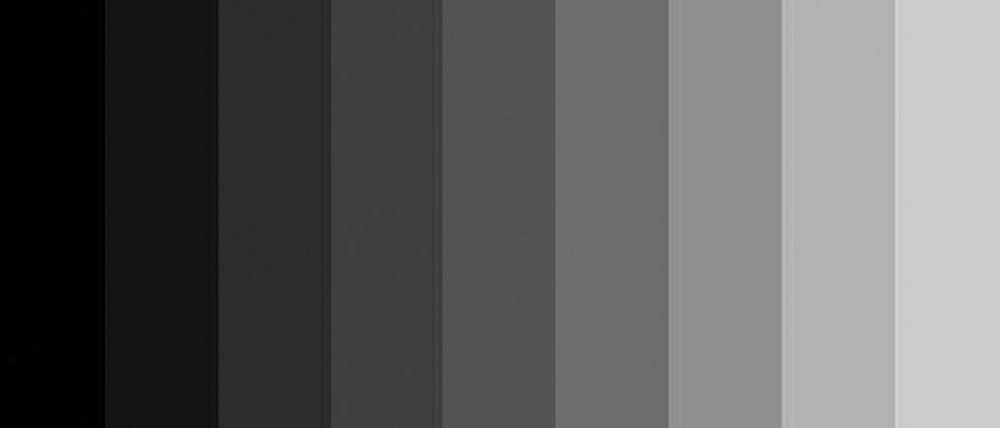

- 놀랍게도, 이 두 가지 모두를 배운 과학자는 거의 없습니다
- 1914년 마흐는 "과학 전체와 물리학 특히의 기초는 생물학 쪽, 특히 감각의 분석 쪽에서 다음 위대한 밝힘을 기다리게 될 것이라는 깊은 확신을 가지고 있다"고 표현했습니다

**맥스웰의 다재다능함**:
- 전자기 이론의 근본적 기여, 특히 유명한 **맥스웰 방정식**
- 이 방정식에 기반해 전등, 컴퓨터, 전기 가전제품, 전화, 라디오, TV, 휴대폰 등 수많은 현대 발명품이 만들어졌습니다
- 기체 분자 운동론에도 중요한 기여를 했습니다
- 이 세 명(뉴턴, 아인슈타인과 함께) 역대 최고의 이론물리학자 중 한 명으로 꼽힙니다
- 놀랍게도, 맥스웰은 영향력 있는 심리학자이기도 했습니다. 그는 **삼색 이론(trichromatic color theory)**을 개발했는데, 이는 정상 인간 망막에 색각 수용체(cone)가 세 종류가 있다는 발견을 예측했습니다

**헬름홀츠의 다학문적 경력**:
- 의사로 훈련받았고, 신경 경로에서 전기 신호의 속도 실험을 통해 **에너지 보존 원칙** 발견에 기여했습니다
- 광학에 대한 근본적 기여는 시각 지각(Helmholtz, 1866)에 대한 고전적 기초가 되었습니다
- 물리적 음향학에서의 업적은 청각 지각과 음악 이해(Helmholtz, 1875)에 대한 주요 기여를 뒷받침했습니다

### 왜 다음 세대에서는 이러한 전통이 끊겼을까요?

헬름홀츠, 맥스웰, 마흐의 위대한 다학문적 성공이 다수의 헌신적인 다학문적 제자들을 낳을 것이라는 상식처럼 여겨졌지만, 이는 일어나지 않았습니다. 다음 세대 물리학자들 중에서는 알베르트 아인슈타인조차 예외가 아니었습니다. 1933년 그는 벨기에 엘리자베스 여왕에게 보낸 편지에서 이렇게 썼습니다:

"우리 대부분은 우리 자신 내부보다는 외부를 보기를 더 좋아합니다. 후자의 경우 우리가 보는 것은 아무것도 의미하지 않는 '어두운 구멍'에 불과하기 때문입니다."

이 '어두운 구멍'이란 **인지 불투명성(cognitive impenetrability)** 때문입니다. 뉴런 계산은 일상 경험을 조절하지만, 우리는 이를 직접적으로 접근할 수 없습니다. 이러한 불투명성 덕분에 우리는 개별 뉴런, 전기 전위, 화학 전달물질에 대해 걱정하거나 방해받지 않아도 상호작용하는 지각, 감정, 아이디어의 세계에서 행동할 수 있습니다. 우리는 행동 숙달의 외관적인 단순함을 경험하며, 그것을 생성하는 실제적인 신경 기계의 복잡성을 인식하지 못합니다.

### 19세기 말의 지적 위기

이러한 고려사항들은 왜 아인슈타인마저 마음의 '어두운 구멍'에 과학적 빛을 비추려 하지 않았는지 설명하지 못합니다. 왜 그는 기체 운동론과 상대성 이론에서와 같이, 심리학 및 신경과학에서 그의 선배들 맥스웰과 마흐의 통찰에 기반을 두지 않았을까요?

아인슈타인의 말은 19세기 말 물리학과 뇌 과학 사이에서 발생한 주요 분열을 반영합니다. 이전에는 물리학과 심리학의 다학문적 연구로 크게 활기를 얻었던 과학자들은, 이제는 다른 분야에 대한 기초적인 지식조차 갖추지 못한 과학자들로 빠르게 대체되었습니다.

이 분열의 근본적 원인은 바로 헬름홀츠, 맥스웰, 마흐 같은 선구자들의 과학적 발견에서 비롯되었습니다. 시각 지각에 대한 헬름홀츠의 연구에서 두 가지 예시가 이를 설명합니다:

---

## 세 개의 N: 비선형(Nonlinear), 비국소적(Nonlocal), 비정상적(Nonstationary)

### 색채 이론: 뉴턴 vs 헬름홀츠

**뉴턴의 발견 (1704)**:
- 흰색 빛은 모든 가시 파장의 동일한 강도로 구성됩니다
- 프리즘을 사용해 흰색 빛의 다른 색상 성분을 무지개로 굴절시켜 증명했습니다
- 뉴턴의 흰색 정의는 **공간 내 개별 위치에서의 빛 측정**에 기반합니다

**헬름홀츠의 혁신적 통찰**:
- 장면의 평균 색상은 **감쇠되어(desaturated)** 인지된다는 것을 깨달았습니다
- 즉, 실제보다 더 흰색으로 보이는 경향이 있습니다
- 예를 들어, 해질녘에 붉은 빛으로 조명되면 그 색상은 중화되어 장면 내 객체의 "실제" 색상을 더 잘 볼 수 있게 됩니다

**비선형성과 비국소성의 등장**:
- 헬름홀츠는 인간이 흰색 빛을 어떻게 지각하는지 분석하려면 네트워크 위치 간의 **장거리 상호작용(비국소적)**을 조사해야 한다는 것을 깨달았습니다
- 이러한 네트워크 상호작용은 가변적인 조명 조건에 보상하거나 "광원을 할인(discount the illuminant)"하는 데 도움이 됩니다
- **할인 과정**은 어떻게든 "나눗셈"을 통해 광원을 제거하여 장면의 실제 색상을 인간이 다양한 조명 조건 아래서 볼 수 있게 합니다
- 덧셈과 뺄셈이 아닌 연산을 포함하는 모든 과정(예: 나눗셈)은 **비선형적(nonlinear)**이라고 합니다

### 학습, 기대, 매칭

헬름홀츠는 시각 지각 과정을 개념화하려 할 때 또 다른 장벽에 부딪혔습니다. 그는 **무의식적 추론(unconscious inference)**이라는 교리를 발전시켜, 우리는 종종 과거 학습을 기반으로 기대하는 것을 지각한다는 아이디어를 표현했습니다.

헬름홀츠의 교리는 그림 2.2에서 **적응 공명 이론(Adaptive Resonance Theory)**의 더 현대적인 용어로 재구성됩니다:

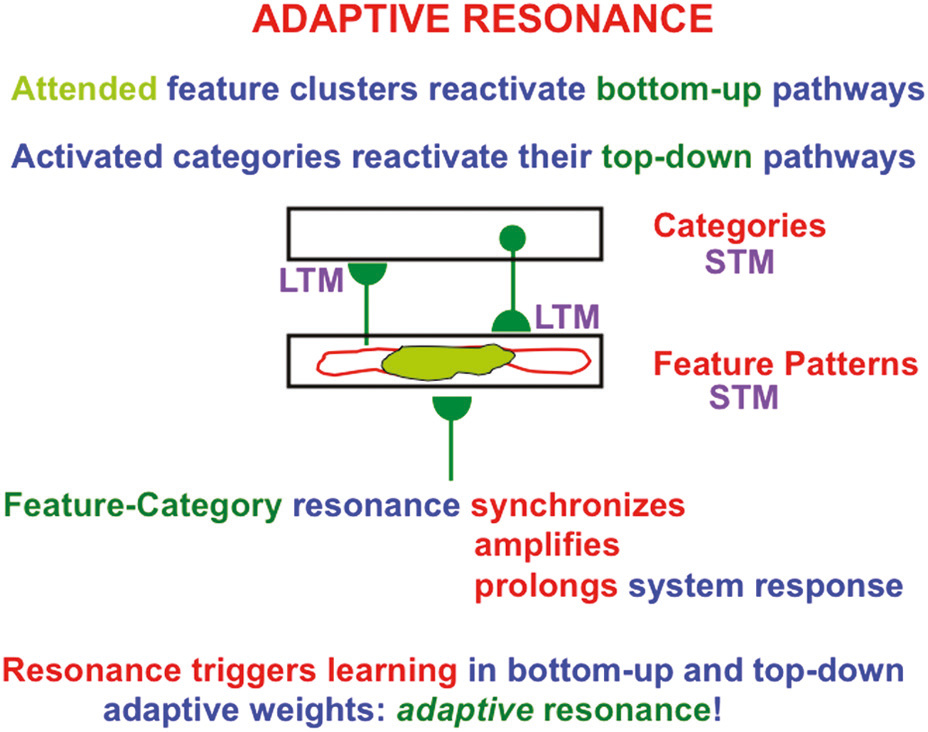

1. **상향식(bottom-up) 학습**: 환경에서 활성화된 입력이 적응적 가중치나 장기기억(LTM) 흔적을 통해 어떤 세포가 미래에 이 입력에 선택적으로 반응할지 결정합니다
2. **인식 카테고리(recognition categories)**: 선택된 세포들은 활성화될 수 있으며, 학습된 하향식 기대를 읽어내도록 트리거할 수 있습니다
3. **상향식 기대의 하향식 매칭**: 이러한 기대는 특성 선택적 세포 네트워크를 통해 하향식 입력과 매칭됩니다
4. **협력적-경쟁적 매칭**: 하향식과 상향식 신호는 매칭 과정을 통해 협력하고 경쟁합니다

### 19세기 물리학과의 근본적 차이

헬름홀츠의 실험적 발견은 그에게 시각 지각에 대한 이론적 이해는 새로운 **비선형, 비국소적, 비정상적(nonstationary)** 직관적 개념과 수학적 방정식의 발견을 필요로 한다는 것을 본능적으로 깨닫게 했습니다.

**비정상성(Nonstationarity)**: 하향식과 상향식 학습 과정은 비정상적입니다. 즉, 그들은 변화하는 세계에 적응하기 위해 시간에 따라 LTM 흔적을 변경하는 과정입니다.

**19세기 물리학의 제약**:
- 대부분의 19세기 물리학 이론은 **선형적(linear), 국소적(local), 정상적(stationary)** 수학을 사용했습니다
- 이러한 19세기 수학 개념과 방법은 심리학적 및 신경생물학적 데이터를 설명할 수 없었습니다
- 이러한 무능력은 마음과 뇌를 연구하려는 모든 이론자들에게 **지적 위기(intellectual crisis)**를 창조했습니다

**20세기 물리학 혁명의 아이러니**:
- 20세기 물리학의 주요 혁명들은 19세기 수학으로 지원될 수 있었습니다
- 예를 들어, 아인슈타인의 특수 상대성 이론은 계산을 수행하기에 기초 대수만 필요로 했습니다(Einstein, 1905)
- 그의 직관적 통찰을 표현하기에 더 진보된 수학이 필요하다는 것을 깨달았을 때, 그의 친구 마르셀 그로스만이 19세기 리만 기하학을 소개해주었습니다

### 결론: 새로운 수학의 필요성

이러한 분열의 가장 근본적인 원인은 헬름홀츠, 맥스웰, 마흐 같은 선구자들의 발견에 내재된 과학적 딜레마였습니다. 그들은 자신들의 실험이 선형적, 국소적, 정상적인 수학으로는 설명될 수 없다는 것을 발견했습니다.

이는 뇌가 작동하는 방식을 모델링하는 것이 단순히 다른 분야의 수학을 적용하는 문제가 아니라, 뇌의 본질적인 특성을 포착하는 새로운 수학적 개념을 발견하는 문제임을 시사합니다. 이 통찰은 오늘날 우리가 경험하는 신경과학 혁명의 본질을 이해하는 데 핵심적입니다.

---

**다음 섹션으로 넘어가기 전 요약**:
- 19세기에는 물리학자들이 동시에 심리학자이기도 했으나, 20세기 초 이 분열이 발생했습니다
- 헬름홀츠, 맥스웰, 마흐의 다학문적 성공은 예상 외로 후속 세대로 이어지지 않았습니다
- 시각 지각 연구를 통해 '세 개의 N' - 비선형성, 비국소성, 비정상성 - 이라는 새로운 수학적 개념의 필요성이 드러났습니다
- 19세기 물리학의 선형적 수학으로는 뇌의 복잡한 현상을 설명할 수 없어 지적 위기가 발생했습니다
- 이러한 위기는 뇌 이론 발전에 대한 새로운 접근법을 요구했습니다

---

## 1. 뇌가 마음을 만드는 방식 (How a Brain Makes a Mind)

### 역사적 전환점: 물리학자들이 뇌 과학자들이 되던 시대

19세기의 위대한 물리학자들 중 상당수는 동시에 위대한 심리학자이나 뇌 과학자이기도 했습니다. 독일의 Hermann von Helmholtz, 영국의 Clerk Maxwell, 오스트리아의 Ernst Mach와 같은 과학자들은 물리학에서뿐만 아니라 심리학과 뇌과학에도 선구적인 기여를 했습니다. 그들은 물리적 공간과 시간의 구조에 대한 관심이 심리적 공간과 시간에 대한 매혹에 의해 증진되었습니다.

### 이중적 관심사의 예시

- **Mach**:
  - 물리학: Mach 수 (초음속 비행 이해)
  - 심리학: Mach band (시각에서의 밝고 어두운 대비)
  - "과학의 기초, 특히 물리학은 생물학, 특히 감각 분석의 측면에서 위대한 밝힘을 기다리고 있다" (1914)

- **Maxwell**:
  - 물리학: 전자기 이론의 근본 기여 (Maxwell 방정식)
  - 심리학: 삼색 이론 (색채 수용체 발견 예측)

- **Helmholtz**:
  - 의사로서 시작해 신경 경로에서 전기 신호 속도 실험
  - 에너지 보존 원리 발견 (19세기 물리학의 기둥)
  - 광학, 청각, 시지각 분야에 근본적 기여

### 과학의 분열: 20세기 초반

그러나 20세기 초반이 되자 이러한 다학문적 접근 방식은 더 이상 통하지 않았습니다. 이는 마음과 뇌를 연결하는 문제의 종류와 이를 통해 최근에 이루어진 진보의 성격을 명확히 합니다.

Albert Einstein은 1933년 벨기에 엘리자베스 여왕에게 보낸 편지에서 이렇게 썼습니다:
"우리 대부분은 자기 내부보다 외부를 더 좋아합니다. 후자의 경우, 우리는 아무것도 의미하지 않는 어두운 구멍만 봅니다."

이 "어두운 구멍"은 **인지 불투명성(cognitive impenetrability)** 으로 인해 우리의 일상 경험을 조절하는 신경 계산이 우리에게 접근 불가능하기 때문입니다. 이 불투명성 덕분에 우리는 상호작용하는 지각, 감정, 아이디어의 세계에서 행동할 수 있으며, 개별 뉴런, 전기 전위, 화학 전달물질에 대해 걱정하거나 방해받을 필요가 없습니다.

---

## 2. 숲, 나무, 그리고 잎을 모두 보기 (Keeping the forest, trees, and leaves all in view)

### 다양한 수준의 설명

어떻게 이렇게 다른 수준의 설명—행동, 신경망, 개별 뉴런—을 한 번에 모두 마음에 담을 수 있을까요? 이것은 전체 숲, 개별 나무들, 그리고 모든 나무의 잎들에 대해 알려진 모든 것을 마음에 담으려는 것과 조금 비슷합니다.

이러한 업적을 수행하려면 과학적 언어가 필요합니다. 이 언어는 행동의 속성으로 매핑되는 상호작용하는 수많은 뉴런의 창발적 특성을 포함하여, 자연스러운 방식으로 세 수준을 동시에 표현할 만큼 강력해야 합니다.

### 수학적 언어의 필요성

과학에서 흔히 있는 것처럼, 이것은 수학적 언어를 사용하여 가장 잘 이루어집니다. 수학만이 그러한 복잡성을 직접적이고 모호하지 않은 용어로 표현할 정밀도를 가지고 있습니다.

"수학은 어렵다"는 광범위한 편견에도 불구하고, 현실적으로 수학은 어려운 개념과 메커니즘을 훨씬 더 쉽게 이해할 수 있게 만들 수 있습니다. 과학자들은 항상 그들의 가장 깊은 통찰력을 표현하기 위해 수학에 의존해 왔습니다.

### 미분 방정식의 역할

미분 방정식은 많은 과학 학문, 특히 물리학에서 보편적으로 수용된 수학적 형식주의입니다. 왜냐하면 그들은 시간에 따라 사건이 어떻게 진화하는지를 설명하기 때문입니다. 그들은 "미분적"이라고 불리는 이유는 과정이 시간에 따라 진화하는 비율을 설명하기 때문입니다.

올바르게 인덱싱되어 어떤 뉴런을 설명하는지 추적할 수 있도록 되어 있는, 몇 가지 다른 유형의 미분 방정식은 수많은 개별 뉴런의 역학, 신경망에서 상호작용하는 방식, 그리고 이러한 상호작용에서 발생하는 행동적 특성을 편리하게 설명할 수 있습니다.

---

## 3. 행동에서 뇌로: 변화하는 세계에 대한 자율적 적응 (From behavior to brain: Autonomous adaptation to a changing world)

### 연구의 시작점: 행동 데이터

나는 1957년 Dartmouth College의 1학년 학부생으로 있을 때 마음과 뇌를 연결하는 직관적 개념과 수학적 방정식을 발견하는 나의 여정을 시작했습니다. 당시 나는 Introductory Psychology 과정을 수강하면서 짧은 기억(STM), 중기 기억(MTM), 장기 기억(LTM)에 대한 법칙을 발견하는 흥미로운 경험을 했습니다. 이 법칙들의 변형은 오늘날 대부분의 계산 신경과학자들이 여전히 사용하고 있습니다.

이러한 상호작용하는 법칙이 인간 학습 데이터를 어떻게 설명할 수 있는지 보여줌으로써, 나는 예를 들어 신경망의 창발적 특성이 관찰 가능한 행동과 일치하는 시스템의 비선형 미분 방정식을 사용하는 패러다임을 소개했습니다.

### 자율적 적응의 중요성

우리의 마음이 환경 조건이 변경되었음을 알려주지 않거나 이러한 조건이 어떻게 변경되었는지 알려주지 않아도 스스로 변화하는 환경에 적응할 수 있다는 핵심 사실을 통합해야 합니다. 이것은 개인이 예상치 못한 사건으로 가득 찬 변화하는 세계에 실시간으로 자율적으로 적응하는 문제를 정면으로 공격해야 함을 의미합니다.

이것을 성공적으로 수행하는 방법은 현재 예술의 형태입니다. 이러한 노력에서 성공을 보장할 수 있는 알고리즘은 현재 존재하지 않습니다. 이것은 정적 데이터 곡선의 무더기를 개인의 마음 내에서 연속적으로 시간에 따라 진화하는 기저 정신 과정에 대한 가설로 변환할 수 있어야 함을 의미합니다.

### 데이터의 양

우리가 방대한 양의 데이터와 함께 작업해야 하는 이유는, 그렇지 않으면 너무 많이 그럴듯하지만 잘못된 뇌 작동 방식에 대한 가설들을 배제할 수 없기 때문입니다. 행동 데이터로 시작하는 위대한 점은 심리학의 많은 분야에서 지난 세기 동안 보고되고 복제된 수많은 데이터가 있다는 것입니다.

심리학 데이터의 전체 말뭉치는 어떤 과학의 데이터베이스보다 큰 데이터베이스 중 하나를 나타냅니다. 비록 어떤 좋은 이론가가 몇 가지 사실에 대한 여러 설명을 제안할 수 있겠지만, 수백 개의 실험 데이터에서 원칙적인 설명을 찾아내려는 것은 매우 도전적인 과제이며, 이는 나에게 많은 놀라운 발견을 이끌어주었습니다.

---

## 4. 왜 뇌는 신경망을 사용하는가 (Why does the brain use neural networks)

### 행동 데이터에서 신경망으로의 자연스러운 진화

내가 개인의 행동이 변화하는 세계에 자율적으로 적응하는 방식을 분석할 때마다, 지능의 어떤 학문을 분석하든 항상 뇌의 일부처럼 보이거나 더 정확히 말하면 상호작용하는 뉴런의 네트워크, 즉 신경망으로 보이는 모델로 이끌렸습니다.

1957년 이것이 처음 내게 일어났을 때, 나는 신경과학을 전혀 몰랐습니다. 나의 첫 번째 신경망은 본질적으로 인간이 언어적 학습을 어떻게 하는지, 특히 개인들이 단어나 다른 어휘 항목을 여러 번 연습하고 나중에 하나씩 회상하는 방식에 대한 심리학적 데이터 분석에서 자연스럽게 자랐습니다.

### 신경 독트린의 발견

이것은 당신이 시간에 따라 무슨 일이 일어나는지 생각하게 만드는 종류의 데이터입니다. 나는 신경과학을 공부하는 의예과 학생 친구들과 대화하기 시작했을 때만, 나의 심리학적 학습 역학 분석이 뇌의 기본 속성을 파생시켰다는 것을 깨달기 시작했습니다.

- 신경 세포체 (neuron)
- 축삭 (axon) - 뉴런 간 신호 전달
- 축삭 말단의 시냅스 결절 (synaptic knobs)
- 화학 전달물질 (chemical transmitters)
- 시냅스 (synapses)
- 세포 전위 (cell body potentials)

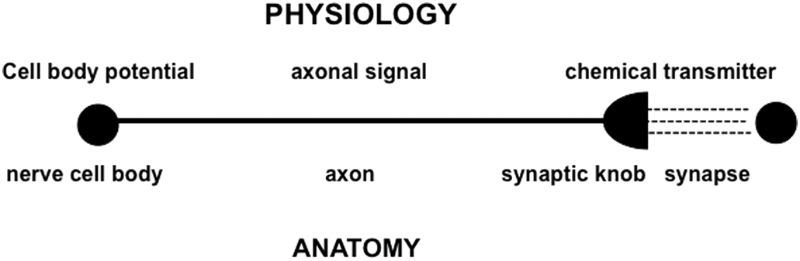

이러한 요소들은 이미 나의 행동에서 유도된 신경망에 표현되어 있었습니다! 나는 신경 독트린에 대해 아무것도 알지 못한 채 심리학적 데이터를 사용하여 이 독트린의 기본 사실을 파생시켰습니다.

### 이러한 인식의 의미

이러한 인식은 나에게 상상할 수 있는 것 이상으로 놀라웠습니다. 이것은 행동 데이터에서 출발하여 뇌 이론에 도달할 수 있음을 보여줍니다. 뇌 진화는 행동 성취를 달성해야 합니다. 그래서 어떤 뇌 이론도 진화에 의해 형성된 설계 원리를 사용하여 뇌를 마음에 연결하려면, 뇌 메커니즘이 상호작용하여 행동 성공을 제어하는 계산 수준을 설명해야 합니다.

---

## 5. 공명의 기반: 작업 기억과 리스트 청크 (Resonance as the basis of consciousness)

### 공명(Resonance)의 개념

Grossberg의 이론에서 **공명(resonance)** 은 의식의 핵심 메커니즘입니다. 이는 상향(bottom-up) 입력과 하향(top-down) 기대가 서로 강화되면서 서로를 증폭시키는 과정입니다.

### 핵심 예시: 음성 복원 현상(Phonemic Restoration)

음성 복원 현상은 공명이 어떻게 작동하는지 보여주는 구체적인 예입니다:
- "delivery"나 "deliberation" 같은 단어에서 'v'나 'b'를 넓은 대역 노이즈로 교체해도 여전히 완전한 단어로 들림
- 하지만 침묵으로 바꾸면 복원이 일어나지 않음
- "noise-eel"이 문맥에 따라 "meal"이나 "wheel" 등으로 들림

### 작업 기억(Working Memory)의 역할

이러한 현상은 다음과 같은 단계로 설명됩니다:

1. **항목 저장**: 단어나 음성 항목이 작업 기억에 저장됨 (그림 1.6, 1.23)
2. **분류**: 항목 시퀀스가 더 높은 처리 수준에서 범주화됨
3. **리스트 청크(List Chunk)**: 작업 기억에 저장된 항목 목록에 선택적으로 반응하는 범주
4. **경쟁**: 리스트 청크들이 지배성을 위해 경쟁함
5. **상향-하향 매칭**: 승리한 리스트 청크가 하향 학습된 기대를 활성화하여 저장된 작업 기억 항목과 매칭
6. **공명**: 선택된 상향과 하향 신호가 피드백 교환을 통해 순환적으로 서로를 강화

### 수학적 설명의 필요성

"미래" 입력("wagon")이 "과거" 입력("noise-eel")의 의식적 지각에 영향을 줄 수 있음을 설명해야 합니다. 이는 **형식적 시간(formal time)** 변수를 사용하는 미분 방정식으로 가능합니다:

- 형식적 시간: 입력이 켜지고 꺼지는 시점을 정의
- 의식적 지각 시간: 미분 방정식의 창발적 속성

### 시간 지각과 공명

공명 파(ast)는 형식적 시간에 받은 순서대로 외부 입력에 의해 구동되지만, 공명이 임계값에 도달하고 의식적이게 될 때까지 미래 제약을 통합할 수 있습니다. 이 공명 파는 우리가 의식적으로 듣는 소리의 흐름을 과거에서 미래로 만듭니다.

이 공명 과정은 다음과 같은 특징을 가집니다:

- **Item-List 공명**: 승리한 리스트 청크가 작업 기억에 저장된 호환 가능한 항목 시퀀스를 선택하고 결합함
- **미래 제약 통합**: 현재 입력을 처리하면서 미래 정보를 통합함
- **선택적 인지**: 공명된 활동만이 의식에 도달, 노이즈 등은 억제됨

### 기술적 함의

이러한 공명 역학이 우리의 iPhone에 통합될 때, Siri의 후속 기술들은 더 도전적인 음성적 맥락에서 빠르고 안정적으로 학습할 수 있게 될 것입니다.

---

## 요약: Section 1의 핵심 메시지

1. **역사적 맥락**: 19세기에는 물리학자들이 동시에 뇌 과학자였지만, 20세기 초반에는 과학의 분열이 발생

2. **다중 수준의 설명**:
   - 행동 수준 (심리 현상)
   - 신경망 수준 (상호작용하는 뉴런 그룹)
   - 뉴런 수준 (개별 신경세포)
   - 이 세 가지 수준을 모두 이해해야 함

3. **수학적 언어의 중요성**:
   - 미분 방정식이 시간에 따른 변화를 표현하는 자연스러운 언어
   - 복잡한 신경 과정을 정확하게 기술할 수 있음

4. **공명의 중요성**:
   - 의식은 상향 입력과 하향 기대의 공명에서 발생
   - 작업 기억과 리스트 청크가 공명의 기초
   - 시간 지각과 예측 보정이 공명을 통해 이루어짐

5. **자율적 적응**:
   - 뇌는 변화하는 환경에 스스로 적응해야 함
   - 행동 데이터에서 출발한 모델이 자연스럽게 신경망 구조로 이어짐

이러한 통찰력들은 뇌가 마음을 만드는 방식을 이해하는 기초가 되며, 이후 장에서 더 깊이 있게 다루어질 것입니다.

---

## 연속 학습 (Serial Learning) (pp. 59-62)

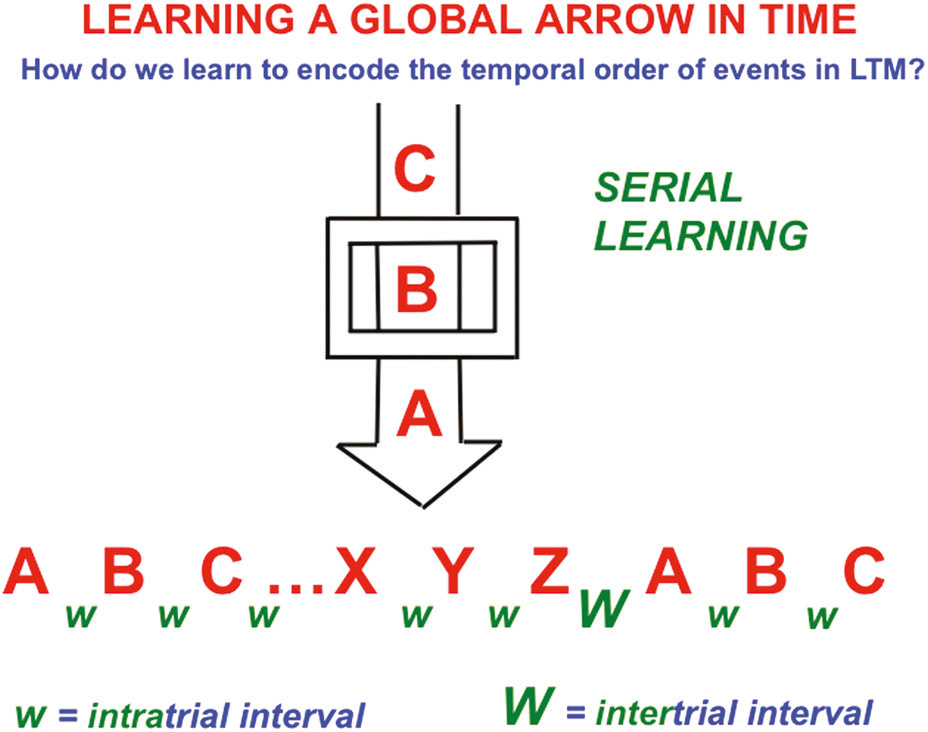

---

## 1. 서론: 연속 학습의 중요성

Grossberg의 연속 학습 이론은 단순한 자극-반응 학습을 넘어, **시간 속에서 일어나는 동적 학습 과정**을 설명합니다. 이 이론은 심리학의 오랜 난제였던 **"왜 사람들은 특정 순서로 정보를 더 잘 기억하는가?"** 에 대한 답을 제공합니다.

### 핵심 질문

인간은 왜 다음과 같은 현상을 보일까요?
- 처음과 끝의 항목을 중간보다 더 잘 기억함 (시리즈 포지션 효과)
- 학습 순서가 정보의 의미와 구조에 영향을 미침
- 시간에 따른 간격 변화가 기억 효율에 영향을 줌

이러한 현상들은 단순한 모델로는 설명할 수 없는 복잡한 시간적 상호작용을 포함합니다.

---

## 2. 시리즈 포지션 곡선 (Bow Curve)

### 현상 설명

연속 학습에서 관찰되는 가장 기본적인 현상은 **bow-shaped 곡선**입니다. 이 곡선은 학습된 항목의 기억 정확도를 시리즈 내 위치에 따라 그린 것으로 다음과 같은 특징을 가집니다:

```
정확도
↑
│      ● (초기 효과)
│     / \
│    /   \      ● (중간 항목)
│   /     \    / \
│  /       ●───/   \      ● (최신 효과)
│ /       /        \
│●───────/          \──────●
└─────────────────────────→
   첫 번째   중간    마지막
   항목      항목    항목
```

#### 기억 곡선의 특징

| 위치 | 현상 | 원인 |
|------|------|------|
| **시작 (초기 효과)** | 가장 높은 기억 정확도 | 첫 번째 학습 · 주의 집중 · 패턴 시작 인식 |
| **중간** | 가장 낮은 기억 정확도 | 대비 부족 · 주의 분산 · 전후 맥락 약화 |
| **끝 (최신 효과)** | 높은 기억 정확도 | 최근 학습 · 순차적 처리 · 단기 기억 우위 |

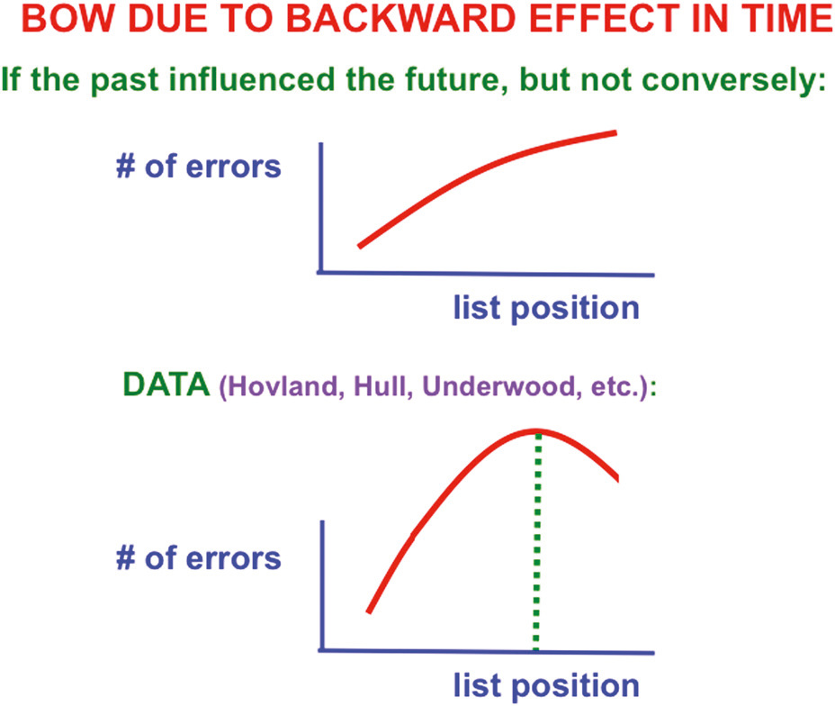

### 수학적 모델링

Grossberg는 이 bow 곡선을 다음과 같은 동적 시스템으로 모델링합니다:

$$\frac{dx_i}{dt} = -A_i x_i + f(\sum_{j<i} x_j) I_i - g(\sum_{j>i} x_j) I_i$$

여기서:
- $x_i$: $i$번째 항목의 활성 강도
- $A_i$: 자연적 감소율
- $f(\cdot)$: 앞 항목들의 영향 함수
- $g(\cdot)$: 뒤 항목들의 영향 함수
- $I_i$: 외부 입력 강도

> **직관적 이해**: 각 항목은 앞에서 오는 흥분과 뒤에서 오는 억제 사이의 균형에서 결정됩니다. 이 경쟁 구조가 자연스럽게 bow 곡선을 생성합니다.

---

## 3. Hovland의 실험: 실험 내 간격 vs 실험 간 간격

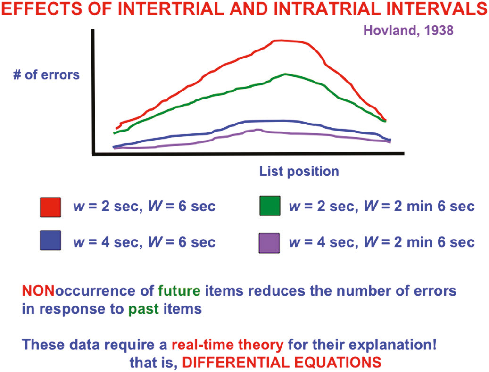

### 실험 배경

1940년대, **Carl Hovland**는 연속 학습에서 시간적 간격의 영향을 연구했습니다. 그는 두 가지 유형의 간격을 구분했습니다:

#### 1. 실험 내 간격 (Intra-trial Interval)

**정의**: 하나의 학습 세션 내에서 항목 간의 시간 간격

```
학습 세션 1: 항목1 --- [간격] --- 항목2 --- [간격] --- 항목3
학습 세션 2: 항목4 --- [간격] --- 항목5
...
```

- **간격 증가** → 기억 정확도 증가 (항목 간 차이가 커짐)
- 적절한 간격은 각 항목을 분리하여 인지 부하 감소

#### 2. 실험 간 간격 (Inter-trial Interval)

**정의**: 학습 세션 사이의 시간 간격

```
세션 1 (날짜): 항목1, 항목2, 항목3
                  ↓ [24시간]
세션 2 (날짜): 항목4, 항목5, 항목6
```

- **간격 증가** → 장기 기억 향상 (시간적 분리가 안정화)
- 지나치게 긴 간격 → 새로운 세션 시작 시 이전 내용 망각

### Grossberg의 해석

Hovland의 발견을 Grossberg의 네트워크로 설명:

```
실험 내 간격 (Intra-trial)
  ↓
앞 항목의 잔류 활동 → 뒤 항목 억제 → 경쟁 증대
  ↓
적절한 간격: 억제 감소 → 각 항목 명확화

실험 간 간격 (Inter-trial)
  ↓
세션 간 휴식 → 잔류 활동 소멸 → 새로운 패턴 저장 가능
  ↓
적절한 간격: 장기 기억 강화, 새 패턴 방해 요소 제거
```

### 최적 간격의 상호작용

두 간격은 서로 다른 방향으로 작용하며, **최적 학습**을 위해 균형이 필요합니다:

| 간격 타입 | 너무 짧은 영향 | 너무 긴 영향 | 최적 조건 |
|-----------|---------------|---------------|-----------|
| **실험 내** | 항목간 간섭 ↑, 혼란 ↑ | 패턴 연결성 ↓ | 분리 가능한 정도의 간격 |
| **실험 간** | 장기 기억 형성 ↓ | 학습 연속성 ↓ | 소멸 방지 + 새 패턴 위한 시간 |

---

## 4. 예상 오류 경사 (Anticipatory Error Gradients)

### 개념 정의

**예상 오류 경사**는 현재 상태와 목표 상태 사이의 차이를 예측하여 미리 조정하는 메커니즘입니다. 이는 단순한 오류 수정(backpropagation)을 넘어, **미래 오류를 예측하여 사전 조정**하는 능력입니다.

#### 오류 수정의 두 가지 유형

| 유형 | 설명 | 시간적 특징 | 예시 |
|------|------|-------------|------|
| **사후 오류 수정** | 실제 오류 발생 후 수정 | 반응적, 느림 | 문제 풀고 답 확인 후 수정 |
| **예상 오류 수정** | 예상 오류를 사전 조정 | 선제적, 빠름 | 문제 풀기 전 방향 예측 |

### 수학적 표현

Grossberg의 네트워크에서 예상 경사는 다음과 같이 표현됩니다:

$$\frac{dx_i}{dt} = -A_i x_i + \alpha \sum_j w_{ij} (y_j^* - y_j) - \beta \sum_k v_{ik} \frac{dz_k}{dt}$$

여기서:
- $(y_j^* - y_j)$: 실제 오류 (현재 vs 목표)
- $\frac{dz_k}{dt}$: **예상 오류 변화율** (미래 오류 예측)
- $\alpha, \beta$: 각 오류의 중요도 가중치

### 역학적 의미

이 방정식에서 핵심은 마지막 항인 **$\beta \sum_k v_{ik} \frac{dz_k}{dt}$** 입니다:

1. $\frac{dz_k}{dt}$: 다음 시점의 예상 오류 변화율
2. $v_{ik}$: 예상 오류 현재 활동에 대한 영향 강도
3. $\beta$: 예상 오류의 중요도

> **직관**: 운전 시 차간 거리를 보며 미리 브레이크를 밟는 것처럼, 네트워크는 미래 오류를 예측하여 현재 활동을 조절합니다.

---

## 5. "시간 역방향" 영향의 역설

### 현상

연속 학습에서 **미래의 정보가 과거의 학습에 영향을 미치는** 것처럼 보이는 현상이 관찰됩니다:

- 후반 항목 학습이 전반 항목 기억에 영향
- 예상된 패턴이 실제 학습 효율 변경
- 순서가 바뀌면 전체 학습 효과 극적으로 변화

### 역설의 정의

이 현상은 **"과거는 미래에 영향을 미치는데, 미래가 과거를 결정한다"** 는 역설을 보입니다. 이는 인과율의 기본 원리에 도전하는 것처럼 보입니다.

### Grossberg의 해석: 순환적 인과관계

Grossberg는 이 역설을 **순환적 인과관계(recursive causality)** 로 설명합니다:

```
시간 흐름: 과거 → 현재 → 미래

실제 메커니즘:
과거 활동 → 현재 활동에 영향
  ↓
현재 활동 → 미래 활동 예측
  ↓
예측된 미래 → 현재 활동 수정
  ↓
수정된 현재 → 과거 활동 재해석
```

#### 수학적 설명

$$x_i(t) = f\left(\sum_{j<i} w_{ji} x_j(t), \sum_{k>i} v_{ki} \frac{dx_k}{dt}(t+\tau)\right)$$

여기서:
- 첫 번째 합: **과거 영향** (이미 발생한 활동)
- 두 번째 합: **미래 영향** (미래 활동 변화율의 예측)
- $\tau$: 시간 지연 (예측에 필요한 시간)

### 철학적 의미

이 역설은 우리의 시간에 대한 직관을 확장합니다:

1. **선형 시간 vs 순환 시간**
   - 직관: 과거 → 현재 → 미래 (일방향)
   - 실제: 현재가 과거와 미래를 재구성 (상호작용)

2. **인지의 동적 특성**
   - 정보는 순차적이지만, 의미는 재구성됨
   - 새 정보가 이전 정보의 해석을 바꿈

---

## 6. 리스트 청킹 (List Chunks)와 작업 기억 (Working Memory)

### 리스트 청킹의 개념

인간은 긴 리스트를 단순히 순서대로 기억하지 않습니다. 대신 **의미적 그룹화**를 통해 정보를 청킹합니다:

```
원본 리스트: A-B-C-D-E-F-G-H-I-J

청킹 전: 개별 10개 항목
청킹 후: [A-B-C] [D-E-F] [G-H-I] [J] (4개 청크)
```

#### 청킹의 장점

| 장점 | 설명 |
|------|------|
| **인지 부하 감소** | 단기 기억 용량(7±2) 초과 방지 |
| **의미적 처리** | 관련성 기반 구조화 |
| **학습 효율성** | 그룹 단위로 학습 가능 |
| **오류 감소** | 그룹 내 오류 전파 제한 |

### 작업 기억의 구조

Grossberg의 이론에서 작업 기억은 단순한 저장소가 아니라 **동적 처리 시스템**입니다:

#### 작업 기억의 요소

1. **감각 기억 (Sensory Memory)**
   - 시각: 아이코닉 메모리(iconic memory) (0.5초)
   - 청각: 에코익 메모리(echoic memory) (3-4초)

2. **단기 기억 (Short-Term Memory)**
   - 약 7±2 개 항목
   - 약 20-30초 보존
   - 반복 유지 가능

3. **장기 기억 (Long-Term Memory)**
   - 거의 무제한 용량
   - 반복 없이 영구 보존
   - 의미적 연결 기반 검색

### Grossberg의 네트워크 모델

작업 기억을 위한 Grossberg의 아키텍처:

```
입력층 → 감각 기억 버퍼 → 단기 기억 핵심 → 장기 기억 연결
  ↓        ↓             ↓           ↓
감각 처리  임시 저장      활성 처리   의미적 저장
```

#### 핵심 수식

$$\frac{dS_i}{dt} = -\alpha S_i + \sum_j W_{ij} I_j + \sum_k V_{ik} L_k$$

여기서:
- $S_i$: 단기 기억 $i$번째 노드 활성
- $I_j$: 감각 입력
- $L_k$: 장기 기억에서의 활성
- $W_{ij}$: 감각 → 단기 연결
- $V_{ik}$: 장기 → 단기 연결

### 청킹의 생물학적 기초

청킹 현상은 뇌의 해부학적 구조와 일치합니다:

1. **전두엽 (Prefrontal Cortex)**
   - 작업 기억의 주요 공간
   - 정보 유지 및 조작 기능

2. **해마 (Hippocampus)**
   - 새로운 청크 형성 지원
   - 의미적 연결 생성

3. **상향 피질 (Cortex)**
   - 청크 내 세부 정보 저장
   - 장기 기억과의 통합

### 청킹 최적화 원리

최적의 청킹을 위한 원칙들:

1. **의미적 유사성**
   - 관련된 항목 그룹화
   - 의미적 인접성 ↑ → 청킹 효율 ↑

2. **크기 균형**
   - 각 청크 크기 4-7개 항목
   - 크기 불균형 → 일부 청크 과부하

3. **계층적 구조**
   - 대형 청크 하위 청크 포함
   - 3단계 이상은 인지 부하 ↑

4. **시간적 경계**
   - 자연스러운 휴식 지점 활용
   - 새 세션 시작 = 자연스러운 청킹 지점

---

## 결론: 연속 학습의 통합적 이해

Grossberg의 연속 학습 이론은 단순한 기억 효과를 넘어, **시간과 의미의 동적 상호작용**으로 설명합니다:

1. **시리즈 포지션 효과**: 경쟁과 협력의 동적 균형
2. **시간적 간격**: 흥분-억제 네트워크의 필수 조건
3. **예상 오류 경사**: 미래 지향적 적응 메커니즘
4. **역설적 인과관계**: 순환적 인과의 실제 작동
5. **청킹**: 작업 기억의 자연스러운 발현

이 이론은 인간 인지의 복잡성을 단순한 수학적 원리로 설명하는 동시에, 실제 학습 전략을 위한 구체적인 가이드라인을 제공합니다.

---

## STM과 LTM의 발견 (pp. 62-65)

---

## 개요: STM과 LTM의 분리

### HM 환자 사례 (Scoville와 Milner, 1957)

**핵심 발견**: STM과 LTM의 특성은 분리될 수 있다.

1957년, William Scoville와 Brenda Milner는 뇌의 해마(hippocampus)와 인근 구조를 양측적으로 제거한 HM 환자에 대한 획기적인 연구를 발표했습니다. 이 수술은 27세의 Henry Molaison(HM이라는 가명으로 알려짐)의 통제 불가능한 간질을 치료하기 위해 시행되었습니다.

**수술의 결과**:
- **인지 기능**: Henry의 많은 인지 기능은 수술 후에도 보존되었습니다
- **기억 결손**: 새로운 명시적 의식적 기억(explicit conscious memories)의 장기 기억 저장에 심각한 결함이 발생했습니다
- **STM 유지**: Henry는 최근 사건들을 STM에 저장할 수 있었지만
- **주의 산만**: 만약 주의가 산만해지면, 사건들의 모든 흔적이 사라졌습니다

**대표적 예시**:
- Henry에게 소개를 받으면 따뜻한 환영을 보내지만
- 방을 나갔다가 다시 들어오면 다시 소개받음
- 이전 만남에 대한 기억이 없음

### 프로시저럴 기억의 보존

흥미롭게도, Henry의 **프로시저럴 기억(procedural memory)** 는 온전히 보존되었습니다:
- 운동 기술 학습 및 기억 능력 유지
- 기술 연습에 대한 의식적 기억이 없음에도 불구하고 기술 습득 가능

이러한 선천성과 후천성 기억의 다른 특성은 뇌의 **계산적 보완 피질 처리 스트림**을 보여줍니다. Table 1.1에서 설명된 것처럼, 선천성과 후천성 기억의 다른 특성들은 뇌의 조직화 방식을 설명합니다.

---

## STM과 LTM의 상호작용 문제

### 역사적 맥락

1957년, Grossberg가 자신의 STM-LTM 모델에 대한 법칙을 파생시킬 때, STM과 LTM 사이의 강력한 상호작용으로 인해 이 두 과정이 혼합되거나 함께 묶일 수 있다는 불확실성이 존재했습니다. 바로 같은 해, Scoville와 Milner의 연구가 발표되었습니다.

### 학습의 기능적 단위

1960년대 Grossberg의 네트워크 개념적 및 수학적 분석은 학습의 기능적 단위가 개별 세포 쌍 간의 흔적이 아닌, 네트워크 전반에 걸쳐 분산된 **패턴(patterns) 또는 벡터(vectors)** 의 LTM 흔적이라는 것을 보여주었습니다.

**시리얼 러닝 데이터 분석**:
- 분배된 LTM 패턴이 STM 패턴과 일치하기 위해 어떻게 학습하는지 이해
- 활 곡선 형태의 시리얼 포지션 곡선(serial position curve) 설명
- 어떤 LTM 흔적은 증가해야 하고, 다른 것들은 감소해야 함

### LTM 법칙의 이중 성격

LTM 법칙은 나중에 과학자들이 **헤비안(Hebbian)** 과 **반-헤비안(anti-Hebbian)** 성질이라고 부를 것을 결합했습니다:

- 증가: LTM 흔적이 큰 STM 활동과 일치할 때 (헤비안)
- 감소: LTM 흔적이 작은 STM 활동과 일치할 때 (반-헤비안)

**수학적 표현**:
- LTM 흔적 $z_{AB}$는 후신경 STM 신호 $x_B$ 값을 추적하고 접근
- 방향: **경사하강(steepest descent)**

---

## 헵스 가설의 한계

### 헵스의 기본 가설 (1949)

헵은 1949년 다음과 같이 기술했습니다:
> "세포 A의 축삭(axon)이 세포 B를 흥분할 만큼 가까이에 있을 때... B를 발화시키는 세포들 중 하나로서 A의 효능은 증가한다"

헵 가설의 문제점:

1. **잘못된 계산 단위 선택**:
   - 헵은 단일 경로를 계산 단위로 선택
   - 실제 계산 단위는 네트워크 전반에 걸쳐 분산된 LTM 패턴

2. **유한한 상한 문제**:
   - LTM 흔적이 상한값에 도달하면
   - 추가 학습이 불가능
   - 세상이 변해도 적응 불가능

### 게이트드 경사하강 학습

**개념**: 학습은 전신경 STM "샘플링" 신호가 충분히 활성화될 때만 발생

**수학적 표현**:
$$\frac{dz_{ki}}{dt} = \begin{cases}
0 & \text{if } f_k^{sample}(x) \leq 0 \\
-f_k^{sample}(x) [h_i(x) - z_{ki}] & \text{if } f_k^{sample}(x) > 0
\end{cases}$$

**작동 원리**:
- **게이트(장벽)**: $f_k^{sample}(x) > 0$일 때만 학습 가능
- **경사하강**: $h_i(x) - z_{ki}$를 따라 LTM 흔적이 STM 신호 값에 수렴
- **비대칭**: LTM 흔적이 증가하거나 감소할 수 있음

**실험적 확인**:
- 20년 후, Wolf Singer와 William Levy가 신경생리학적으로 확인
- 뇌의 LTM 흔적이 게이트드 경사하강 특성을 보임

---

## 션팅 모델 (Shunting Model)의 도출

### 문제의 제기

Grossberg는 막 방정식(membrane equations)을 모르는 상태에서 순수한 사고 실험을 통해 션팅 모델을 도출했습니다. 이 모델은:

1. **자동 이득 제어(automatic gain control, AGC)**
2. **비율(패턴) 보존**
3. **무한 동적 범위 처리**

### 막 방정식과 션팅 모델의 일치

막 방정식:
$$C\frac{\partial V}{\partial t} = (V^+ - V)g^+ + (V^- - V)g^- + (V^p - V)g^p$$

- 각 항은 "전압 차이 × 전도도" 형태
- 곱셈적(shunting) 구조, 덧셈적이 아님
- 생물물리학적 구조와 일치

### Additive Model vs Shunting Model

**Additive Model**:

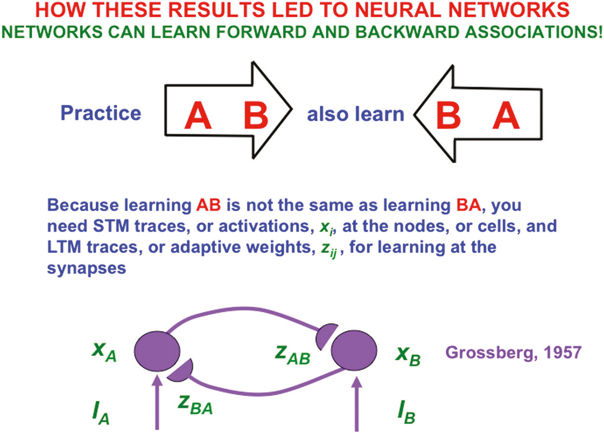

$$\frac{dx_i}{dt} = -A_i x_i + \sum_j f_j(x_j) z_{ji} + I_i$$

- 모든 영향력이 단순히 더해짐
- 활동 $x_i$에 상한/하한이 없음

**Shunting Model**:

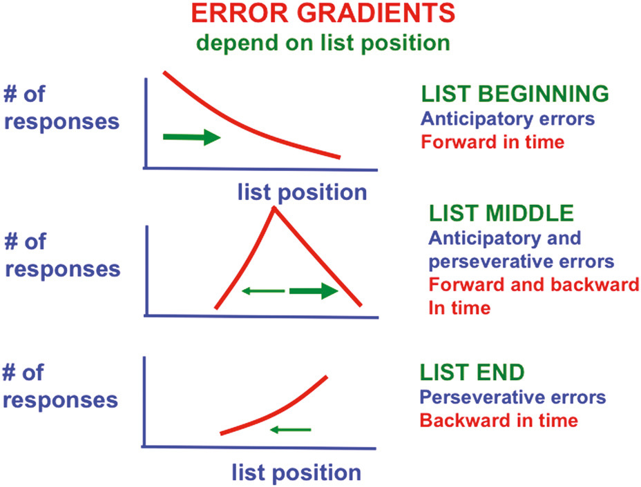

$$\frac{dx_i}{dt} = -A_i x_i + (B_i - C_i x_i)[\cdots] - (E_i x_i + F_i)[\cdots]$$

- 흥분 입력이 $(B_i - C_i x_i)$와 곱해짐
- 억제 입력이 $(E_i x_i + F_i)$와 곱해짐
- 활동이 자동으로 $[-F_i/E_i, B_i/C_i]$ 범위에 묶임

---

## MTM (Medium-Term Memory)과 습관화 게이트

### MTM과 LTM의 시간적 차이

- **STM**: 가장 빠른 변화
- **MTM**: STM보다 더 느리게 변화
- **LTM**: MTM보다 더 느리게 변화

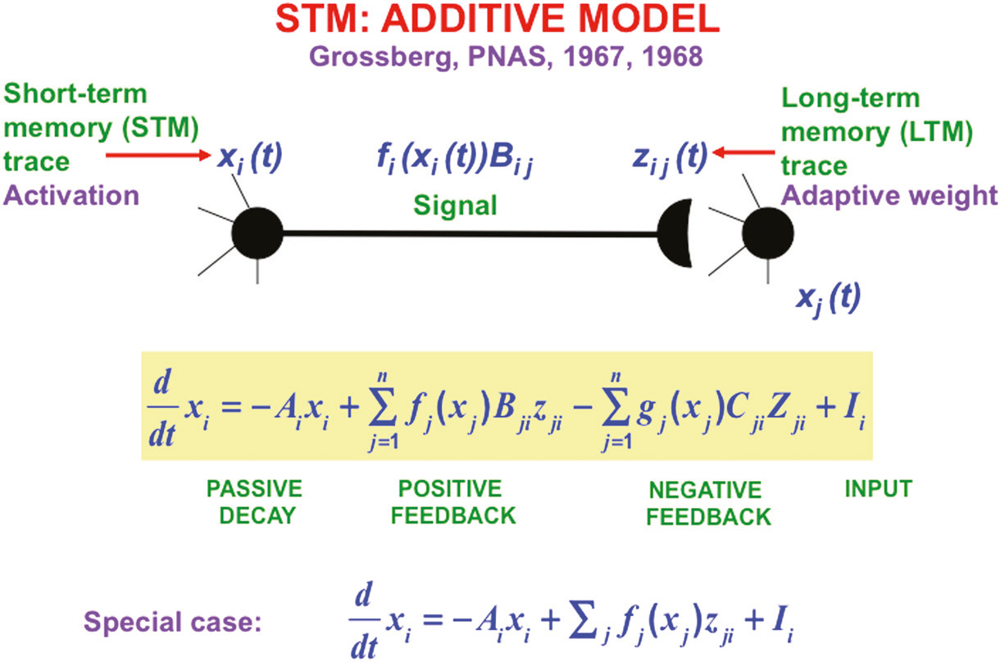

### MTM의 수학적 표현

$$\frac{dy_{kj}}{dt} = -D_{kj} y_{kj} + D_{kj} f_j(x_j) z_{kj}$$

**전달자 게이트(transmitter gate)**:
- $f_j(x_j) z_{kj}$에 의해 활성화된 신호를 곱함
- **습관적(habituative)**: 신호의 방출 또는 비활성화로 신호 경로의 효과 감소

### LTM의 수학적 표현

$$\frac{dz_{ki}}{dt} = \begin{cases}
0 & \text{if } f_k^{sample}(x) \leq 0 \\
-f_k^{sample}(x) [h_i(x) - z_{ki}] & \text{if } f_k^{sample}(x) > 0
\end{cases}$$

**학습 게이트**:
- 학습 게이트가 열릴 때만 LTM 조정 가능
- LTM이 학습 내용을 유지하다가 게이트가 다시 열리면 조정됨

### 수학적 구조의 중요성

이 모든 방정식들은:
- 뇌에서 발견되는 다양한 데이터를 설명하고 예측
- 신경망의 STM과 LTM 상호작용이 심리적 및 신경생물학적 데이터를 설명하고 예측
- 적은 수의 기본 방정식이 중요하고 흥미로운 데이터를 설명할 수 있음

---

## 세 가지 신경망 연구의 근원

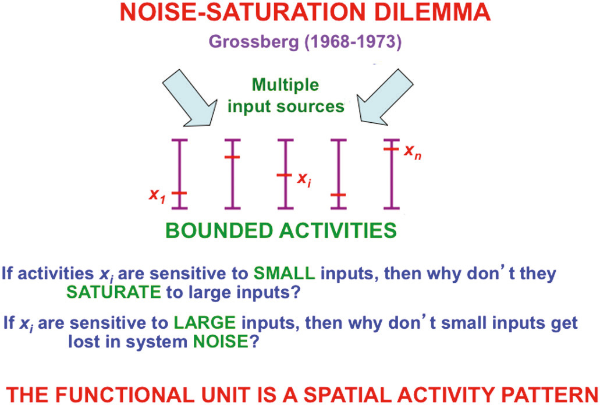

### 1. 이진 모델 (Binary Models)

**McCulloch-Pitts 모델** (1943):
- 이진 시스템
- 뉴런 신호들이 모두 또는 없는 스파이크로 전달
- 활동이 발화 임계값을 초과하면 스파이크 생성
- 시그넘 함수(sgn) 사용: +1 (양수 활동), 0 (제로), -1 (음수 활동)

**영향**: John Von Neumann의 디지털 컴퓨터 개발에 큰 영향

### 2. 선형 모델 (Linear Models)

**Perceptron** (Rosenblatt, 1958):
- 연속 시간에서 진화
- 활동이 자연스럽게 감쇠
- 비제로 임계값에서 이진 신호 생성

**학습 문제**:
- STM과 LTM 상호작용이 분리되어 분석 단순화
- 먼저 STM 변화, 그다음 LTM 조정, 반복
- 자율적인 실시간 작동 불가능

### 3. 연속 비선형 모델 (Continuous and Nonlinear)

Grossberg의 작업은 주로 이 분야에 기여했습니다:
- 비순환(feedforward)과 순환(recurrent) 네트워크
- 실시간 자율 작동
- STM과 LTM이 변화하는 환경에 동시에 적응

---

## 결론: 학습 이해의 진보

Grossberg의 1957-58년 Dartmouth 대학 1학년 때의 수학적 분석은:

1. **STM과 LTM 상호작용의 패러다임**을 제시
2. **비선형 미분 방정식 시스템**으로 신경망 설명
3. **심리적 및 신경생물학적 데이터** 설명 및 예측

이러한 초기 모델(Additive Model과 Shunting Model)은 오늘날 거의 모든 생물학적 모델러들에게 사용되고 있습니다. MTM과 LTM 법칙은 이러한 STM 방정식과 함께 작동하여 인간과 동물에서 관찰되는 다양한 학습 현상을 설명합니다.

---

**핵심 개념 정리**:
- STM과 LTM은 분리 가능한 독립적 과정
- 헵 가설은 계산 단위 선택 오류와 유한 상한 문제로 불완전
- 게이트드 경사하강 학습은 실제 데이터를 더 잘 설명
- 션팅 모델은 막 방정식과 일치하는 자동 이득 제어 구조
- MTM은 습관화 게이트를 통해 중간 시간 척도 기억 구현

---

## 이진 모델에서 연속 모델로 (pp. 65-68)

---

## 4.3 역전파(Backpropagation)의 역사와 한계

### 역전파 알고리즘의 독립적 발견

역전파 알고리즘은 여러 연구자에 의해 독립적으로 발견되었습니다:

- **1972년**: Shun-Ichi Amari (일본)
- **1974년**: Paul Werbos (하버드 박사 학위 논문)
- **1982년**: David Parker (캘리포니아)
- **1986년**: Rumelhart, Hinton, Williams - 이 논문이 너무 자주 인용되어 역전파의 진정한 원천이 가려짐

**Paul Werbos**가 현대적 형태의 알고리즘을 처음 발표하고 성공적으로 응용한 것으로 평가받습니다.

### 역전파의 기술적 기원: 최급하강법

역전파는 수학의 오래된 아이디어인 **최급하강법(steepest or gradient descent)** 을 사용합니다:

- **Carl Friedrich Gauss(1814)** 까지 거슬러 올라가거나 더 오래된 역사
- 학습 과정에서 적응 가중치를 목표 값으로 끌어당김
- **핵심 문제**: 학습된 가중치(LTM traces)가 알고리즘의 한 지점에서 계산되어 다른 지점으로 이동됨
- **물리적 분리**: 학습과 기억(데이터 필터링)의 기능적 분리가 아닌 물리적 분리

**생물학적 문제점**: 뇌에서와 달리 **비국소적 가중치 이동(non-local transport of weights)** 이 발생

### 역전파와 딥러닝의 한계

역전파는 다음과 같은 심각한 한계를 가집니다:

1. **계산적 한계**:
   - 1988년 Grossberg가 지적한 17가지 주요 한계
   - **Adaptive Resonance Theory(ART)** 에서 이 문제들을 해결

2. **실제 적용의 문제점**:
   - **재앙적 잊어버림(catastrophic forgetting)**
   - **일반화 성능 부족(poor generalization)**
   - **설명 가능한 AI 문제(Explainable AI)**: 모델이 환경을 이해하는지 여부 불명확

3. **Hinton의 자기 비판(2017)**:
   - "역전파에 대해 심각히 의심스럽다"
   - "뇌가 그렇게 작동하는 것 같지 않다"
   - "모든 레이블링된 데이터가 필요한 것은 아니다"
   - "모든 것을 버리고 다시 시작하라"

### 딥러닝의 성공과 한계

**성공 요인**:
- 월드 와이드웹으로부터 거대한 데이터베이스 활용
- 엄청나게 빠른 컴퓨터 네트워크 활용
- **느린 학습(slow learning)**: 각 학습 시행에서 적응 가중치가 거의 변화하지 않음
- 많은 수의 감독 학습 시행

**기본적인 한계**:
- 뇌의 작동 방식과는 본질적으로 다름
- 뇌 데이터를 지원하는 아키텍처가 아님
- 동물 지능과 관련된 일반적인 목적의 유연한 능력 구현 불가능

---

## 4.4 Anderson의 Brain-State-in-a-Box (BSB)

### James Anderson의 패턴 인식 모델

James Anderson(Brown University)은 **선형 시스템 이론**에서 영감을 받아 신경 패턴 인식 모델을 제시했습니다:

- **선형 방정식(linear equation)** 에서 활동이 결정됨
- **연속적이고 이진적 특성을 결합한 출력**:
  - 주어진 중간 범위에서는 출력이 활동과 선형적으로 증가
  - 활동이 매우 작거나 크면 양/음의 상수 값으로 포화(saturate)

### BSB 모델의 이름의 유래

모델의 이름은 출력 함수의 특성을 잘 설명합니다:

> **"Brain-State-in-a-Box"**
>
- 뇌 상태가 상자 안에 담긴 듯한 개념
- 상자 벽(포화)에 도달할 때까지 활동이 변함
- 다양한 패턴 분류 응용에 사용됨

### BSB 모델의 개념적 문제점

1. **노이즈 증대 문제**: 활동이 노이즈를 억제하기보다 증대시킬 수 있음
2. **Grossberg의 해결책**: 1973년 논문 "Contour Enhancement, Short-Term Memory, and Constancies in Reverberating Neural Networks"에서 노이즈 증대 문제의 수학적 해결 제시
3. **핵심 통찰**: **시그널 함수(signal functions)** 의 적절한 선택으로 노이즈 증대 회피 가능 (Figure 1.7 참조)

---

## 4.5 Kohonen의 Self-Organizing Maps (SOM)

### Teuvo Kohonen의 전이: 선형대수에서 생물학적 모델로

Teuvo Kohonen(헬싱키 대학교)은 다음과 같은 전이를 겪었습니다:

- **Moore-Penrose 유사역행렬(Moore-Penrose Pseudoinverse)** 같은 선형대수 개념
- **비선형 상호작용을 포함한 생물학적 모델**로의 전환

### SOM의 작동 원리

Self-Organizing Map (SOM) 모델은 다음과 같은 특징을 가집니다:

1. **적응 필터(adaptive filter)** 출력의 경쟁:
   - 가장 큰 총 입력을 받는 셀 또는 소규모 셀 집합이 승자로 선택됨
2. **카테고리 분류**: 승자 카테고리가 들어오는 데이터를 분류하는 데 사용됨

### SOM의 역사적 정정

Grossberg는 자신이 SOM의 더 조기 기여를 했다고 주장합니다:

- **1970년대 초**: 케임브리지와 보스턴에서의 연구
- **Christoph von der Malsburg** (뒤데몰트 슐레)과의 협업
- **1960년대부터**: SOM의 학습 법칙과 경쟁 네트워크 수학적 분석 시작

### SOM의 한계와 개선된 생물학적 모델

Kohonen의 단순화된 SOM에는 여러 한계가 있습니다:

- **매우 단기 기억(Short-Term Memory, STM)** 부재
- **중기 기억(Medium-Term Memory, MTM)** 결여
- **생물학적 SOM의 중요성**:
  - 음성(speech), 감정-인지 상호작용(cognitive-emotional interactions), 공간 항법(spatial navigation) 등 광범위한 뇌 과정에 사용
  - **Adaptive Resonance Theory(ART)** 내에서 작동 시 **안정성-가소성 딜레마(stability-plasticity dilemma)** 해결
  - 재앙적 잊어버림(catastrophic forgetting) 방지

---

## 뇌에서 마음으로: 분산 패턴의 중요성 (pp. 65-68)

### 뇌-마음 연결의 패러다임 전환

1957-58년, Grossberg는 다음과 같은 혁신적인 패러다임 제시:

- **비선형 신경망**을 사용해 뇌 메커니즘을 심리학적 기능과 연결
- **행동 성공을 지배하는 기능적 단위는 단일 스파이크가 아닌**:
  - **네트워크 수준의 분산 패턴**
  - **시스템 수준의 분산 패턴**

### 진화의 압력: 협력과 경쟁

Gedanken Experiment(사고 실험)는 다음과 같은 심오한 통찰을 제공:

- **세포 수준에서 경쟁이 보편적인 이유**
- **무한(infinity)이 생물학에 존재하지 않음**
- **유한한 흥분 가능한 위치**를 가진 세포의 필수적 조건이 **경쟁 메커니즘**을 요구

### 다중 규모 비선형 피드백 네트워크의 필요성

뇌의 주요 특징:

1. **비선형성(nonlinearity)**:
   - "전체는 부품의 합"이 아님
   - 뇌에서는 곱셈과 나눗셈이 널리 사용됨

2. **피드백(feedback)**:
   - 상향식(bottom-up)과 하향식(top-down) 상호작용
   - 재귀적(recurrent) 처리
   - 뇌-환경 상호작용

3. **다중 시간적 규모**:
   - **STM**: 밀리초 단위
   - **MTM**: 수십~수백 밀리초
   - **LTM**: 초부터 일생까지

4. **다중 공간적 규모**:
   - 객체 부분과 전체 처리
   - 다양한 길이의 단어 분류
   - 다중 규모는 요약 기호 $\sum$으로 표현

### 비선형 피드백의 예

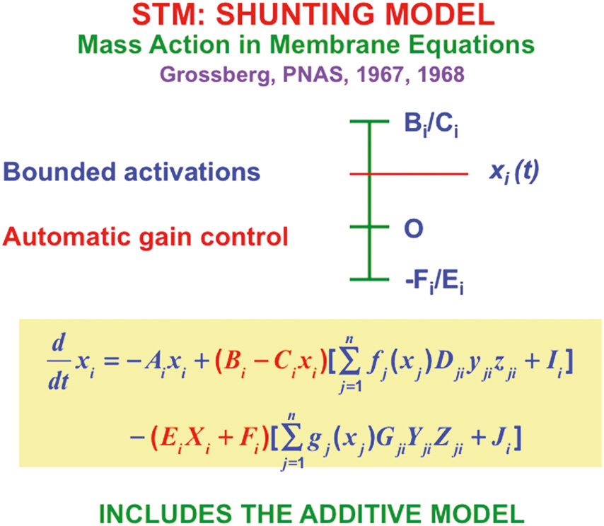

Shunting STM 방정식(Figure 2.10)에서 볼 수 있는 비선형성:

- $f(x)yz$와 $g(x)YZ$ 같은 곱셈 항
- MTM($y$)과 LTM($z$)이 세포 간 STM 신호($f(x)$)를 곱셈적으로 게이팅(gating)
- 이 비선형성은 기능적 요구사항을 달성하는 최소한의 비선형 방정식들

---

## 결론: 비선형성의 중요성

1957-58년에 발견된 비선형 신경망의 법칙들은 오늘날의 기초적이고 고전적이지만, 당시에는 심리학과 뇌과학 연구의 중요한 패러다임 전환을 의미했습니다. 이러한 발견들은:

- 실시간으로 자율적으로 적응하는 개인 학습자 분석에서 파생
- 생물학적 데이터와 심리학적 기능을 연결하는 강력한 프레임워크 제공
- 딥러닝으로 대표되는 현대 AI 기술의 한계를 극복하는 새로운 가능성을 열었음

이것이 바로 **"Conscious MIND Resonant BRAIN"** 이 이야기하려는 핵심 메시지입니다: 비선형성, 다중 규모, 피드백 네트워크를 통해 뇌는 마음을 만들어냅니다.

---

## 왜 신경망인가? (pp. 68-71)

---

## Hartline-Ratliff-Miller 모델: 투구게 망막에서 시작되는 이야기

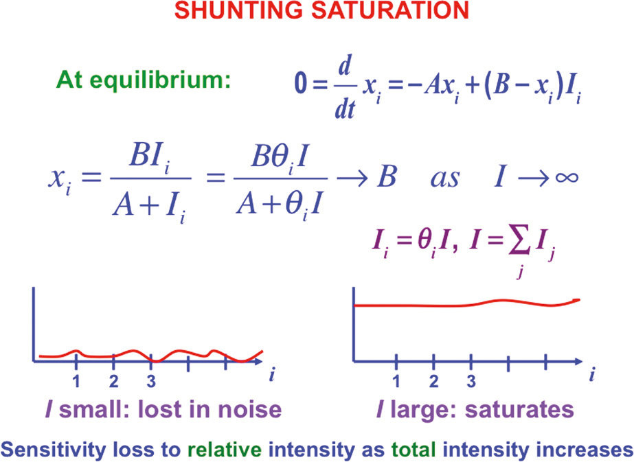

### 역사적 사실의 놀라운 일치

1967년, Hartline이 노벨 생리의학상을 수상한 해와 정확히 동일한 시기에 저는 록펠러 대학교에서 수학 박사 학위를 받았습니다. 박사 학위 논문의 주제는 1957-58년에 발견한 신경망에 대한 **전역 한계 정리(global limit theorems)** 증명이었습니다. 놀라운 시간적 일치 이면에는 더 깊은 의미가 숨어 있습니다.

**Hartline-Ratliff-Miller 모델**은 제가 발견한 신경망 네트워크의 **특수 사례**였습니다. 투구게(limulus) 망막에서 관찰된 감산적 측면 억제(subtractive lateral inhibition) 패턴은 제가 개발한 비선형 신경망의 한 형태를 설명했습니다.

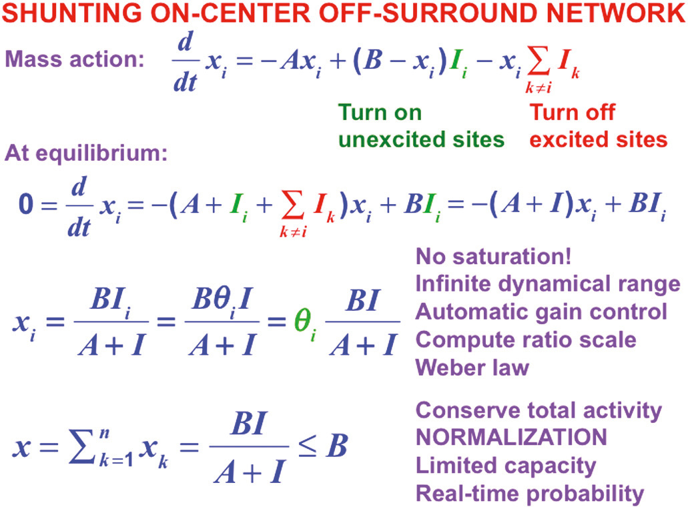

### 투구게 망막의 중요성

투구게는 현생 배지동물과 가장 가까운 갑각류로, 그 망막 구조가 진화적으로 중요합니다.

- **해부학적 특징**: 하나의 광수용체 주변에 다른 광수용체들이 배열
- **억제 패턴**: 주변 광수용체의 활동이 중심 광수용체를 억제
- **수학적 표현**: $r_i = e_i - \sum_{j \neq i} k_{ij} r_j$

> **Figure 2.10**: Hartline-Ratliff-Miller 모델의 수학적 표현. 이 모델은 제가 증명한 전역 한계 정리의 적용 사례입니다. 이 수학 구조는 유한한 뉴런들로 구성된 네트워크가 어떻게 안정적인 상태로 수렴하는지를 설명합니다.

---

## 전역 한계 정리: 수학적으로 보안된 안정성

### 진정한 수학적 업적

제가 증명한 정리들은 단순한 시뮬레이션이 아니라 엄격한 수학적 보장을 제공합니다. 이 정리들은 임의로 큰 수의 뉴런을 가진 네트워크에 적용할 수 있었으며, 당시 응용수학에서는 매우 드문 종류의 정리였습니다.

**정리 내용**:
1. **수렴성**: 모든 초기 조건 하에서 시간이 지나도 활동 값이 유한한 상태로 수렴
2. **유일성**: 특정 조건 하에는 단일 안정 평형 상태 존재
3. **진동 분석**: 어떤 조건에서 진동이 발생하는지, 진동의 주기와 진폭 분석

### 수학적 증명의 의미

이 정리들은 신경망이 왜 "무한한 입력 범위"를 처리할 수 있는지를 수학적으로 설명합니다:

$$\lim_{t \to \infty} \| \mathbf{x}(t) \| < \infty$$

여기서 $\mathbf{x}(t)$는 시간 $t$에서의 전체 활동 벡터입니다. 이는 신경망이 시간이 지나도 폭주하지 않고 안정된 상태를 유지함을 보장합니다.

### 실제 적용 예시

이 수학적 업적은 다음과 같은 실제 문제 해결에 적용됩니다:

- **인공지능**: 안정적인 신경망 설계
- **제어 이론**: 비선형 시스템의 안정성 보장
- **뇌 모델링**: 생물학적 뉴런 집단의 거동 예측

---

## 기능적 단위: 단일 스파이크가 아닌 분산된 패턴

### 인식의 패러다임 전환

Chapter 1에서 설명한 시각 및 청각의 사실들은 우리에게 중요한 교훈을 줍니다: **개별 뉴런의 활동이 아니라 네트워크 전체에 걸쳐 분산된 활동 패턴이 기능적 단위입니다.**

#### 단일 뉴런 관점의 한계

- **발화율(firing rate)** 만으로는 인식의 복잡성 설명 불가
- **단일 뉴런**은 너무 단순한 계산 단위
- **스파이크 패턴**만으로는 환경 적응성 설명 불가

#### 분산 패턴의 우월성

**분산된 활동 패턴(distributed patterns of activation)** 은 다음과 같은 장점을 가집니다:

1. **정보 병렬 처리**: 여러 뉴런이 동시에 다양한 정보 처리
2. **내성**: 일부 뉴런 손상 시 전체 시스템 기능 유지
3. **표현력**: 기하급수적으로 증가하는 정보 인코딩 용량
4. **유연성**: 환경 변화에 대한 빠른 적응 능력

> **중요한 발견**: "기능적 성공을 지배하는 단위는 개별 뉴런의 단일 스파이크, 스파이크 시계열, 또는 스파이크 폭발이 아닌, 네트워크 및 시스템 수준의 분산된 패턴입니다."

---

## 다중 스케일 피드백 네트워크: 진화의 지혜

### 생물학적 진실의 발견

환경 변화에 대한 적응 과정을 연구하는 동안 새로운 기능적 통찰이 나타났습니다. 이 발견은 모든 세포 유기체의 모든 조직 수준에서 **분산 패턴 처리를 지원하는 경쟁의 존재**와 관련이 있습니다.

#### 다중 스케일의 의미

**다중 스케일(multiple-scale)** 이란 무엇을 의미할까요?

1. **미시적 스케일 (Micro-scale)**:
   - 개별 뉴런과 시냅스
   - 수 밀리초 시간 단위
   - 이온 채널의 열역학

2. **중간 스케일 (Meso-scale)**:
   - 뉴런 회로 및 기능적 그룹
   - 밀리초에서 초 단위
   - 발화 패턴 및 동기화

3. **거시적 스케일 (Macro-scale)**:
   - 전체 시스템 및 네트워크
   - 초에서 분 단위
   - 동적 행동 및 학습

#### 피드백의 중요성

**피드백(feedback)** 은 다중 스케일에서 다음과 같은 역할을 합니다:

- **자기 조절**: 시스템 내부의 상태를 감시하고 조절
- **예측 오류 보정**: 기대치와 실제 입력 간의 불일치 조정
- **적응적 학습**: 경험에 따라 구조적 변화 발생

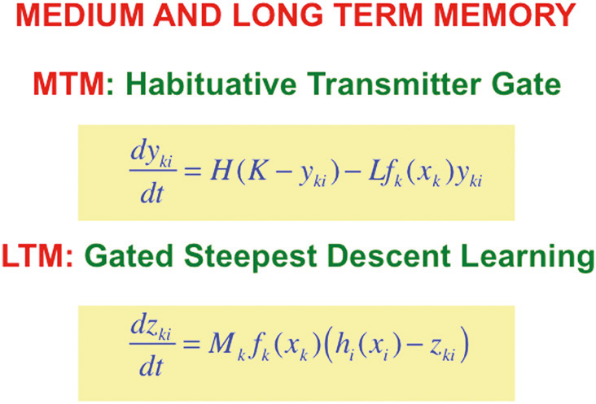

> **Figure 2.11**: 다중 스케일 피드백 네트워크의 구조. 각 스케일에서의 활동 패턴이 다른 스케일과 상호작용하며 전체 시스템의 동적 행동을 생성합니다.

### 진화적 관점에서의 의미

이러한 다중 스케일 구조는 **보편적 발달 코드(universal developmental code)** 의 일부입니다. 이 코드는 다음과 같은 특징을 가집니다:

1. **공유성**: 모든 생물학적 시스템에서 발견
2. **적응성**: 환경 변화에 유연하게 대응
3. **효율성**: 에너지와 자원을 최적화 사용
4. **안정성**: 외부 충격에도 기능 유지

---

## 왜 신경망인가? 종합적인 답변

### 복잡성을 단순화하는 능력

신경망이 뇌의 기본 구조인 이유는 복잡한 세계를 **수학적으로 단순화**할 수 있기 때문입니다:

1. **다루기 쉬운 입력 처리**: 무한한 입력 범위를 유한한 출력으로 변환
2. **비선형적 표현**: 선형 모델로 설명 불가능한 현상 설명
3. **적응적 학습**: 데이터와 환경의 변화에 자동 대응
4. **창발적 특성**: 단순한 규칙에서 복잡한 행동 자발적 발생

### 뇌와 기술의 연결점

이 이론은 단순히 학문적 호기심을 넘어 **실제 기술 응용**으로 이어집니다:

- **인공지능**: 뇌의 처리 방식을 모방한 알고리즘 개발
- **로보틱스**: 환경 적응형 시스템 설계
- **데이터 분석**: 복잡한 패턴 인식 및 예측

### 미래 전망

Grossberg의 이론은 단순히 과거의 업적이 아니라 **미지의 영역으로 나아가는 지침서**입니다:

> "신경망 이론은 이미 알려진 사실을 설명하는 것을 넘어, 우리가 아직 이해하지 못하는 뇌의 기능을 예측하고 새로운 실험 가설을 제시하는 도구입니다."

---

## 요약: 왜 신경망인가?

1. **역사적 근거**: Hartline-Ratliff-Miller 모델을 포함하는 수학적 업적
2. **이론적 토대**: 전역 한계 정리로 증명된 안정성
3. **기능적 단위**: 분산된 패턴이 개별 스파이크보다 훨씬 효율적
4. **구조적 특성**: 다중 스케일 피드백이 진화적 최적해
5. **실용적 가치**: 뇌 이론에서 기술 응용으로의 확장성

신경망은 단순한 계산 모델이 아니라, 수억 년의 진화를 통해 검증된 **생물학적 지혜의 수학적 표현**입니다.

---

## 7. 노이즈-포화 딜레마와 그 해결

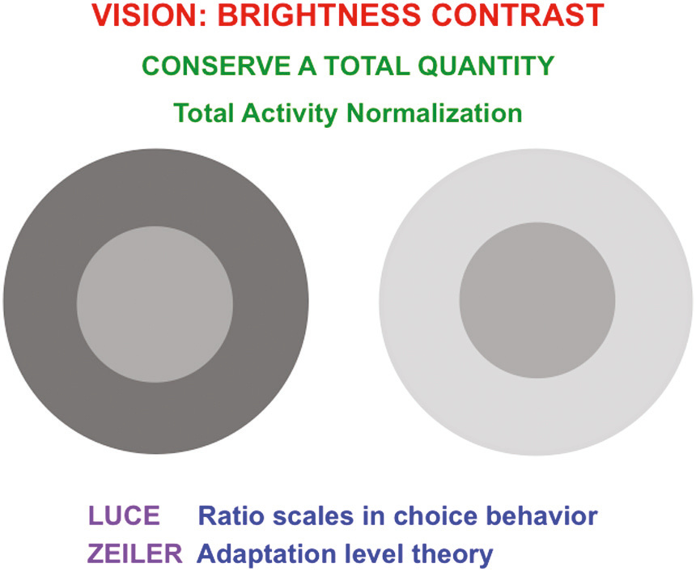

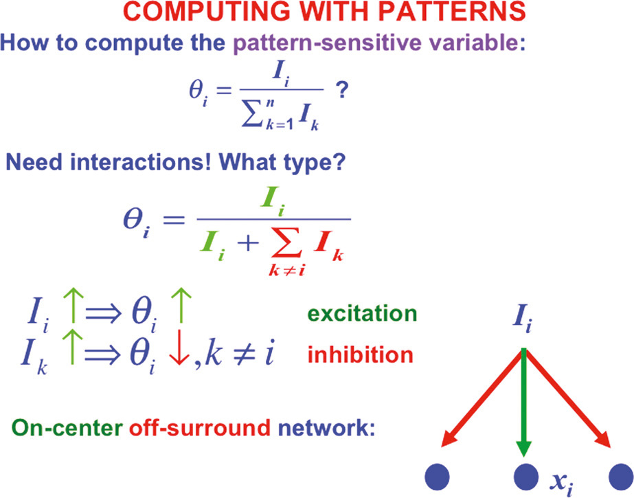

### 문제: 무한 입력 범위의 딜레마

뇌의 뉴런은 다음과 같은 기본적 딜레마에 직면:

1. **작은 입력**: 노이즈에 묻혀서 감지되지 않음
2. **큰 입력**: 시스템이 포화(saturation)되어 패턴 정보 소실

이것이 바로 **노이즈-포화 딜레마(Noise-Saturation Dilemma)**입니다.

---

### 전통적 해결책의 한계

#### 1. 시그모이드 함수

$$\text{output} = \frac{1}{1 + e^{-x}}$$

- **문제**: 모든 뉴런이 포화될 때 패턴 정보 완전 소실

#### 2. 감마 보정

$$\text{output} = \text{input}^\gamma$$

- **문제**: 입력 간 비율이 왜곡됨 (상대적 관계 보존 불가)

---

### 해결책: 곱셈적 제어와 자동 이득 제어

Grossberg의 핵심 통찰: 입력이 활동을 **덧셈적으로**가 아니라 **곱셈적으로** 제어해야 한다!

**Shunting 모델**:

$$\frac{d}{dt}x_i = -A_i x_i + (B_i - C_i x_i)[\cdots] - (E_i x_i + F_i)[\cdots]$$

- 흥분 입력이 $(B_i - C_i x_i)$와 **곱해짐**
- 억제 입력이 $(E_i x_i + F_i)$와 **곱해짐**

**자동 이득 제어(AGC)의 원리**:
- 활동이 작을 때: $(B - x_i)$가 큼 → **높은 게인**
- 활동이 클 때: $(B - x_i)$가 작음 → **낮은 게인**

---

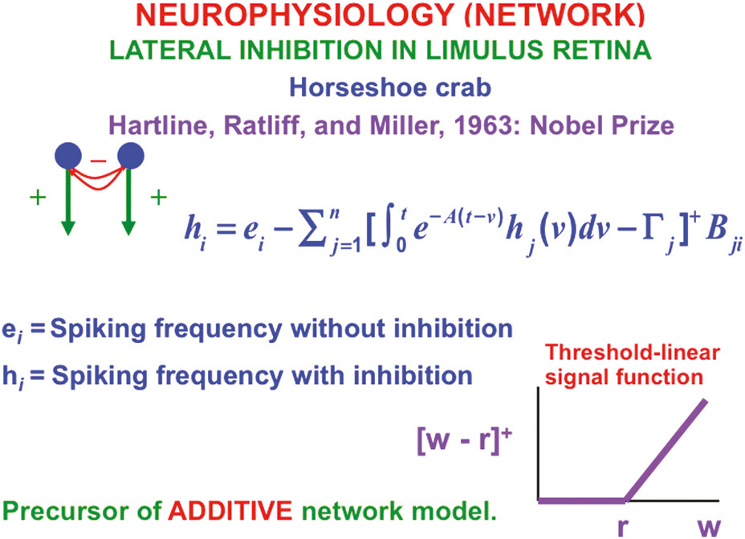

### 상호작용 없는 shunting의 문제

$$\frac{d}{dt}x_i = -A x_i + (B - x_i) I_i$$

평형 해석: $x_i = \frac{B I_i}{A + I_i}$

**문제**: 입력 $I$가 커지면 $x_i \approx B$ → **모든 뉴런이 포화**, 패턴 정보 완전 소실

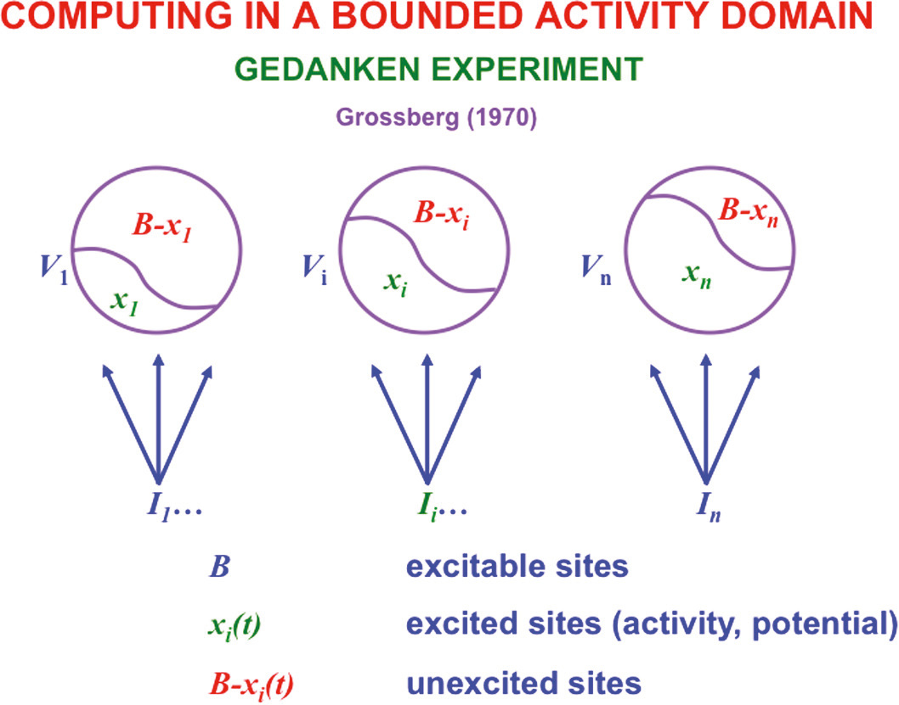

---

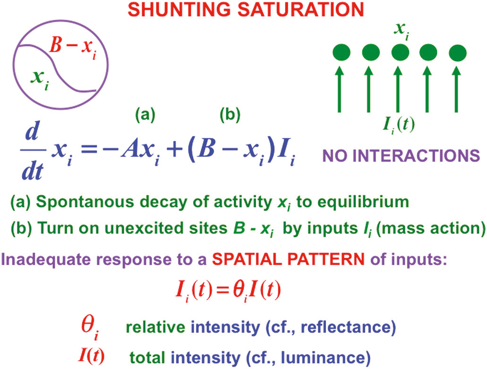

### 진정한 해결: On-center Off-surround 해부학

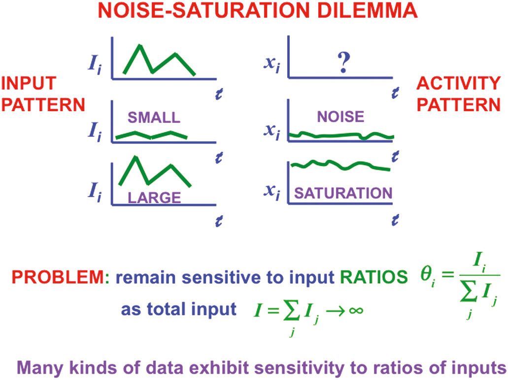

패턴 정보를 보존하려면 **셀 간의 상호작용**이 필요합니다:

$$\frac{d}{dt}x_i = -A x_i + (B - x_i) I_i - x_i \sum_{k \neq i} I_k$$

**평형 해석**:

$$x_i = \frac{B I_i}{A + \sum_k I_k} = \frac{B I_i}{A + I}$$

**결과의 의미**:
1. **비율 보존**: $x_i = \frac{B I}{A + I} \cdot \theta_i$ (여기서 $\theta_i = I_i/I$)
2. **포화 방지**: $I$가 아무리 커도 $x_i \to B \theta_i$ (패턴 유지)
3. **자동 정규화**: 총 활동 $\sum x_i \leq B$

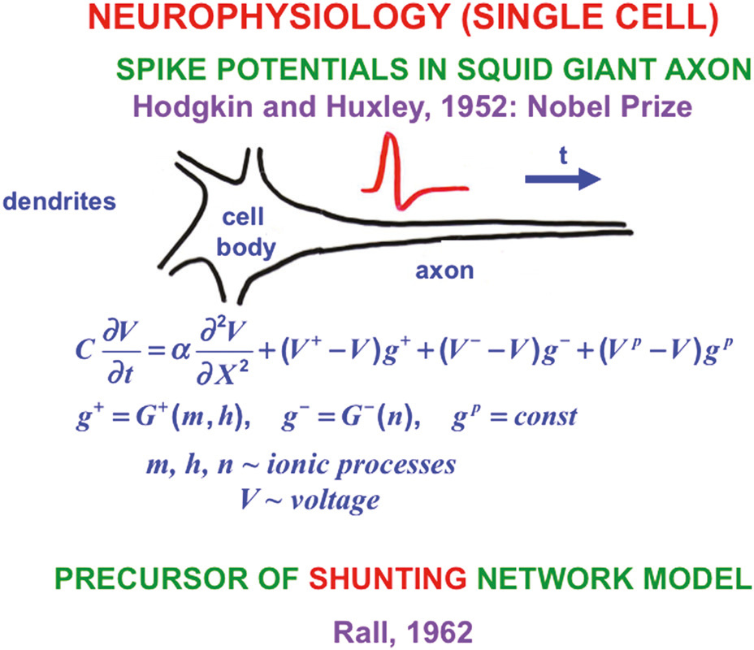

---

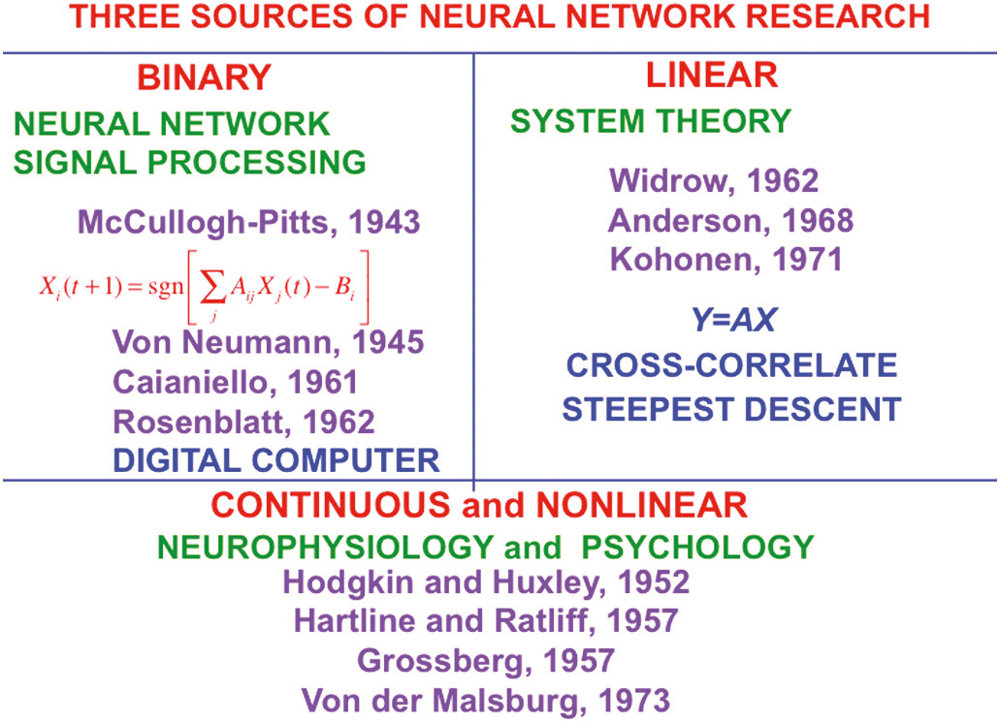

### Brightness Constancy와 Reflectance

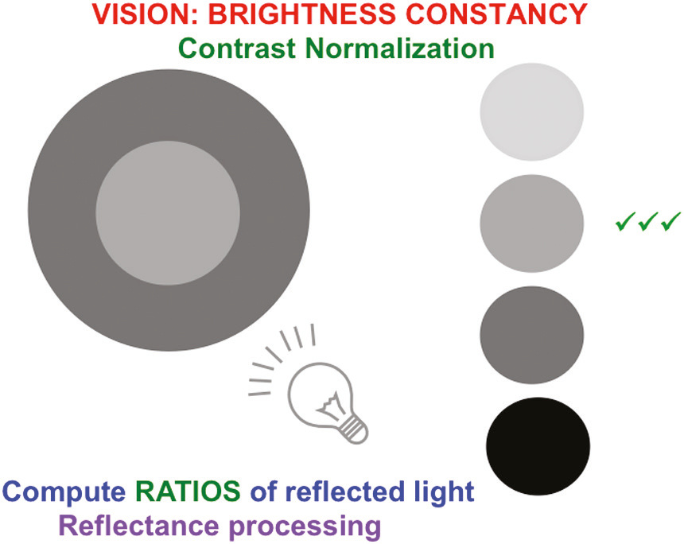

On-center off-surround 구조는 **반사율(reflectance)**을 계산:

$$\theta_i = \frac{I_i}{\sum_j I_j}$$

이것이 **밝기 일관성(Brightness Constancy)** 원리입니다:
- 물체의 실제 반사율은 조명 조건에 무관
- 우리는 $\theta_i$ 값을 계산하여 일관된 지각

**Weber 법칙의 자연스러운 결과**:
- 배경 조명이 바뀌어도 상대적 민감도 유지
- 이동 특성(shift property) 발생

---

### Simultaneous Contrast (동시 대비)

같은 회색 점이:
- 밝은 배경에서는 어둡게 보임
- 어두운 배경에서는 밝게 보임

수학적 설명:

$$x_i = \frac{B I_i}{A + I}$$

- 밝은 배경 ($I$ 큼): 분모 큼 → $x_i$ 작음
- 어두운 배경 ($I$ 작음): 분자 작음 → $x_i$ 큼

---

# 후반부 (pp. 74-85)

---

## 8. 막 방정식과 신경생리학의 일치

> **"사고 실험으로부터 신경생리학의 막 방정식을 도출하기"**

앞서 다룬 shunting(질량 작용) 역학이 실제로 **신경생리학의 막 방정식(membrane equations)** 과 동일하다는 것이 이 절의 핵심입니다. Grossberg는 순수한 사고 실험 — noise-saturation 딜레마를 해결하려는 수학적 추론 — 에서 출발했는데, 그 결과로 얻어진 방정식이 이미 신경생리학에서 실험적으로 확립된 막 방정식과 정확히 같은 형태임을 보여줍니다. 이론과 실험이 독립적으로 같은 결론에 도달한 것입니다.

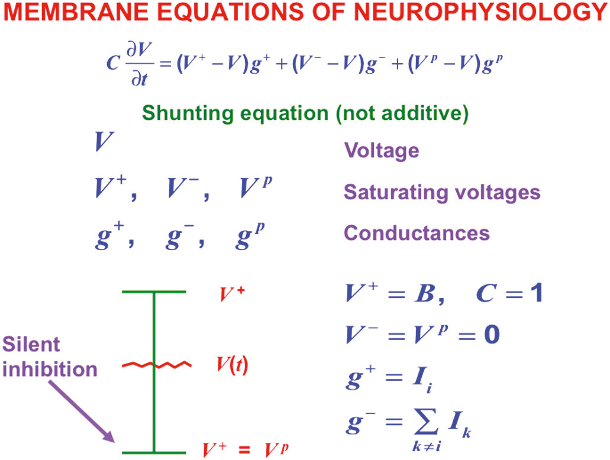

### 핵심 수식: 막 방정식

$$C\frac{\partial V}{\partial t} = (V^+ - V)g^+ + (V^- - V)g^- + (V^p - V)g^p$$

#### 변수 설명

| 기호 | 의미 | 역할 |
|------|------|------|
| $V$ | 세포막 전압 (voltage) | 뉴런의 현재 활동 수준 |
| $C$ | 막 커패시턴스 (capacitance) | 전압 변화의 시간 상수 결정 |
| $V^+$ | 흥분성 포화 전압 | 전압이 올라갈 수 있는 최대값 |
| $V^-$ | 억제성 포화 전압 | 전압이 내려갈 수 있는 최소값 |
| $V^p$ | 수동 포화 전압 | 입력 없을 때의 안정 전압 |
| $g^+$ | 흥분성 전도도 | 흥분 채널의 "열린 정도" |
| $g^-$ | 억제성 전도도 | 억제 채널의 "열린 정도" |
| $g^p$ | 수동 전도도 | 누출 채널의 "열린 정도" |

#### 직관적 이해

이 방정식의 각 항은 **"전압 차이 × 전도도"** 형태입니다:
- $(V^+ - V)g^+$: 현재 전압이 $V^+$보다 낮으면 위로 끌어올림 (흥분)
- $(V^- - V)g^-$: 현재 전압이 $V^-$보다 높으면 아래로 끌어내림 (억제)
- $(V^p - V)g^p$: 현재 전압을 수동 안정점으로 되돌림 (누출)

전도도($g$)가 **입력에 의해 조절**되므로, 이 방정식은 본질적으로 **곱셈적(shunting)** 입니다. 단순한 덧셈(additive)이 아닙니다.

> **용어 참고 — "shunting"의 어원**: 전기공학에서 shunt는 **병렬로 연결된 우회 경로(분류기)** 를 뜻합니다. 막 방정식의 등가 회로에서 흥분·억제·수동 이온 채널이 세포막에 **병렬로** 연결되어 있고, 각 채널(전도도 $g$)이 전류를 자기 쪽으로 **분류(shunt)** 합니다.

### Feedforward shunting on-center off-surround 네트워크로의 단순화

Figure 2.24 우측 하단에서, 특수한 값을 대입합니다:

| 설정 | 값 |
|------|-----|
| $V^+ = B$ | 흥분 포화 전압 |
| $C = 1$ | 커패시턴스 정규화 |
| $V^- = V^p = 0$ | 억제·수동 포화 전압 = 0 (**침묵 억제**) |
| $g^+ = I_i$ | on-center 입력 |
| $g^- = \sum_{k \neq i} I_k$ | off-surround 입력 |

이 대입을 통해 막 방정식은 곧바로 **feedforward shunting on-center off-surround 네트워크** 방정식이 됩니다. 즉, 사고 실험에서 도출한 수학적 구조가 실제 신경 세포의 물리 법칙과 **정확히 일치**합니다.

> **핵심 메시지**: 막 방정식과 on-center off-surround 해부학은 진화 과정에서 **공동 진화(co-evolve)** 했을 가능성이 높습니다. 이는 세포 수준의 가장 초기 단계부터 분산 패턴 처리를 가능하게 한 보편적 발달 코드(universal developmental code)의 일부입니다.

---

## 9. Weber 법칙과 이동 특성

> **"Weber 법칙, 적응, 그리고 이동 특성"**

Grossberg는 가장 단순한 feedforward shunting on-center off-surround 네트워크에도 뇌에서 발견되는 중요한 성질들이 이미 내재해 있음을 보여줍니다. 그 중 하나가 **이동 특성(shift property)** 이며, 이를 통해 네트워크가 입력 범위의 변화에도 민감도를 유지하는 원리를 설명합니다.

> **용어 참고 — Weber 법칙 vs Fechner 법칙**: 심리물리학에서 **Weber 법칙**은 "최소 식별 차이(JND)가 자극 강도에 비례한다"($\Delta I / I = \text{const}$)는 것이고, **Fechner(Weber-Fechner) 법칙**은 이를 적분하여 "감각 = $k \cdot \ln(I)$"로 대수적 관계를 도출한 것입니다. Grossberg가 여기서 "Weber 법칙"이라 부르는 것은 더 넓은 의미로, on-center off-surround 네트워크가 **on-center 입력의 민감도를 off-surround 총 입력으로 나눗셈적으로 조절**하는 성질을 가리킵니다.

### On-center off-surround 평형에서 Weber 법칙으로

이 절의 수식은 갑자기 등장하는 것이 아니라, 앞 절(Figure 2.23)의 **feedforward shunting on-center off-surround 네트워크 평형 활동**에서 직접 출발합니다:

$$x_i = \frac{BI_i}{A + I}$$

여기서 $I = I_i + \sum_{k \neq i} I_k$, 즉 on-center 입력($I_i$)과 off-surround 입력($J = \sum_{k \neq i} I_k$)의 합입니다. 이를 $I_i$와 $J$로 분리하면:

$$x_i = \frac{BI_i}{A + I_i + J}$$

이 수식의 구조를 더 잘 보기 위해, 대수 좌표로 변환합니다:

$$K = \ln(I_i), \quad I_i = e^K, \quad J = \sum_{k \neq i} I_k$$

- $K$: on-center 입력의 로그값 (가로축)
- $J$: off-surround 총 입력 (배경 조명에 해당)

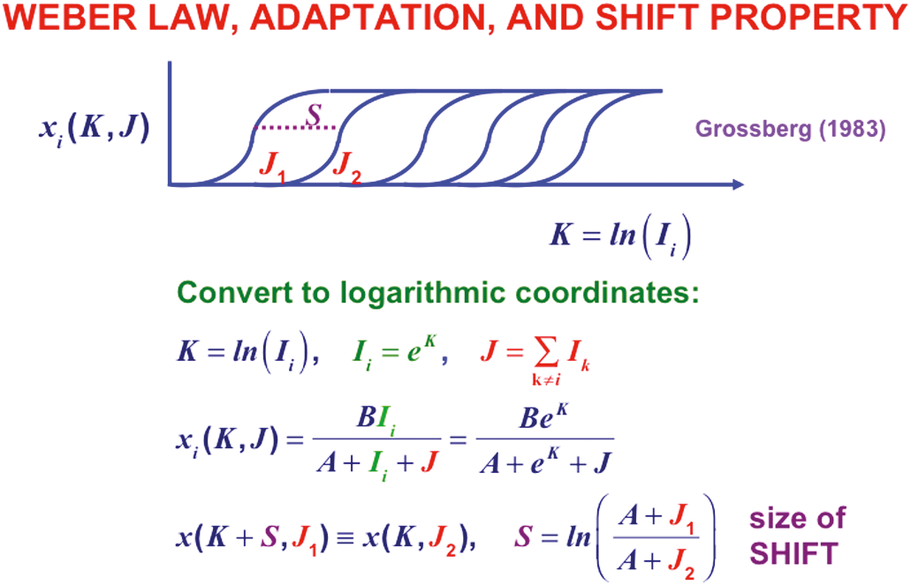

### 대수 좌표에서의 평형 활동

$$x_i(K, J) = \frac{BI_i}{A + I_i + J} = \frac{Be^K}{A + e^K + J}$$

이 수식에서 off-surround 총 입력 $J$가 분모에 있으므로, $J$가 커지면 같은 on-center 입력 $I_i$에 대한 반응이 줄어듭니다 — **나눗셈적 정규화**입니다. 이것이 바로 Grossberg가 "Weber 법칙"이라 부르는 성질의 수학적 실체입니다.

### 이동 특성 (Shift Property) — Weber 법칙의 핵심

$$x(K + S, J_1) = x(K, J_2), \quad S = \ln\left(\frac{A + J_1}{A + J_2}\right)$$

이 수식이 말하는 것:

> **배경($J$)이 바뀌면, 활동 곡선이 $K$ 축을 따라 수평 이동할 뿐, 형태나 최대값은 변하지 않는다.**

이것이 바로 **Weber 법칙**입니다. off-surround가 on-center 입력의 효과를 **나눗셈적으로** 조절하기 때문에 발생합니다.

- $J$가 커지면 ($J_1 < J_2$로) → 곡선이 오른쪽으로 이동 (더 큰 입력이 필요)
- $J$가 작아지면 → 곡선이 왼쪽으로 이동 (작은 입력에도 반응)
- **압축(compression)이 일어나지 않음**: 최대 활동값 $B$는 $J$에 무관

> **일상적 비유**: 어두운 방에서는 작은 촛불도 밝게 느껴지고, 밝은 낮에는 같은 촛불이 보이지 않습니다. 하지만 밝은 낮에도 태양 대비 다른 물체의 **상대적** 밝기 차이는 여전히 감지할 수 있습니다. 이것이 이동 특성입니다.

### Mudpuppy 망막에서의 실험적 검증 (Figure 2.26)

> **"Mudpuppy 망막에서의 이동 특성과 shunting on-center off-surround 네트워크"**

이론적으로 예측된 이동 특성이 실제 생물학적 망막에서도 관찰되는지를 검증한 핵심 실험입니다. 중요한 것은 일어나지 *않은* 일입니다 — 세포 반응의 동적 범위가 줄어들지(압축되지) 않았다는 것입니다.

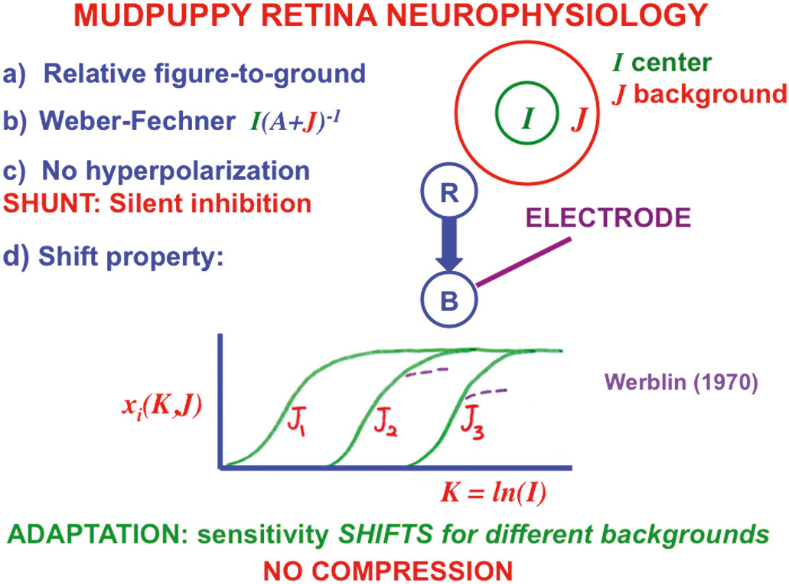

1971년 Frank Werblin은 수생 도롱뇽인 **Mudpuppy**(*Necturus maculosus*)의 망막에서 이 이동 특성을 실험적으로 관찰했습니다 (Werblin, 1971).

"압축이 일어나지 않았다"는 것만으로는 shunting 모델의 근거가 약합니다. 다른 메커니즘도 비슷한 결과를 낼 수 있기 때문입니다. Figure 2.26은 실제로 **여러 대안 가설을 동시에 검증**합니다:

| 관찰 사실 | 배제되는 대안 | 이유 |
|----------|------------|------|
| **(a) 상대적 figure-to-ground 계산** | 절대값 기반 모델 (시그모이드, 감마) | 각 셀 독립 처리로는 상대 대비 계산 불가 |
| **(b) 반응이 $I(A+J)^{-1}$ 형태** | Fechner 대수 압축 ($k \cdot \ln I$) | Fechner는 배경 $J$에 의한 나눗셈이 없음. Shunting 모델만이 $\frac{BI_i}{A+I_i+J}$ 형태를 예측 |
| **(c) 과분극 없음 (침묵 억제)** | 과분극 기반 억제 모델 | 억제가 수동 전압 이하로 내려가지 않음 → $V^- = V^p$ |
| **(d) 이동 특성 + 압축 없음** | Hartline-Ratliff 감산적 측면 억제 | 감산 모델은 배경이 커지면 반응 범위가 **압축됨**. Shunting은 이동만 함 |

또한 이 데이터가 설득력을 가지는 이유는, 이전 연구(Werblin, Dowling et al. 1969+)에서 mudpuppy 망막의 **해부학적 on-center off-surround 구조**(R→B 흥분, R→H→B 억제)가 이미 **독립적으로** 확인되었기 때문입니다. 즉:
- **이론**: shunting on-center off-surround 모델이 이동 특성을 예측
- **해부학**: 해당 구조가 실제로 존재함을 독립 확인
- **생리학**: 예측된 반응 패턴(이동, 무압축, 침묵 억제)이 관찰됨

이 세 가지의 수렴이 단순한 "일어나지 않은 일" 이상의 근거를 제공합니다.

---

## 10. 협력-경쟁 역학과 Mudpuppy 망막

### 역사적 맥락

| 연구자 | 연도 | 발견 |
|--------|------|------|
| Kuffler | 1953 | 고양이 망막에서 on-center off-surround 수용장 발견 |
| Hartline & Ratliff | 1956/57+ | 투구게(limulus) 망막에서 **감산적(subtractive)** 측면 억제 발견 |
| Werblin, Dowling et al. | 1969+ | Mudpuppy 망막에서 **shunting** 협력-경쟁 역학 발견 |

### Mudpuppy 망막의 구조 (Figure 2.27)

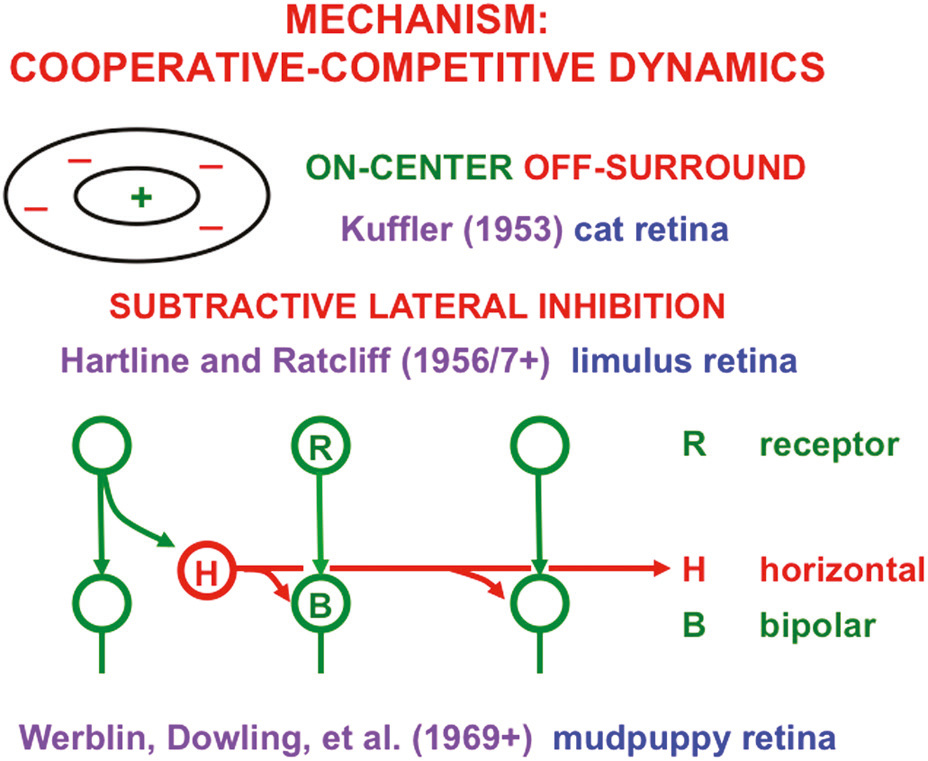

Mudpuppy 망막에는 세 가지 핵심 세포 유형이 있습니다:

1. **수용체(R, Receptor)**: 빛을 감지하는 광수용체
2. **수평 세포(H, Horizontal cell)**: 인접 광수용체들로부터 신호를 모아 off-surround 억제 신호를 전달
3. **양극 세포(B, Bipolar cell)**: on-center 흥분 신호를 받는 세포

신호 흐름:
- **R → B** (흥분, on-center): 광수용체가 양극 세포를 직접 흥분
- **R → H → B** (억제, off-surround): 광수용체 → 수평 세포 → 양극 세포로 이어지는 억제 경로

> 이 구조 덕분에 양극 세포 층에 도달할 때이면 이미 noise-saturation 딜레마가 해결되어 있습니다.

---

## 11. 침묵 억제에서 과분극과 적응 수준으로

> **"침묵 억제에서 과분극과 적응 수준으로"**

이동 특성은 가장 단순한 shunting on-center off-surround 네트워크의 성질이었습니다. Grossberg는 이 네트워크를 **단순한 단계적 정교화(simple stages of refinement)** 를 통해 발전시킵니다. 첫 번째 정교화는 "침묵 억제"를 "과분극"으로 대체하는 것이며, 이를 통해 **적응 수준(adaptation level)** 이라는 중요한 개념이 등장합니다.

### 모델 계층 구조: 제약 완화의 단계

막 방정식이 가장 일반적인 형태이고, 그 아래 단계들은 점점 더 강한 제약을 가합니다:

**① 막 방정식 (가장 일반적)**

$$C\frac{\partial V}{\partial t} = (V^+ - V)g^+ + (V^- - V)g^- + (V^p - V)g^p$$

↓ $V^- = V^p = 0$, $V^+ = B$, $C = 1$, $g^+ = I_i$, $g^- = \sum_{k \neq i} I_k$ 대입

**② Feedforward shunting on-center off-surround (침묵 억제)**

$$\frac{d}{dt}x_i = -Ax_i + (B - x_i)I_i - x_i \sum_{k \neq i} I_k$$

↓ $V^- < V^p$ 허용 (억제 포화 전압을 안정점 아래로)

**③ 과분극 포함 버전 (이 절의 주제)**

$$\frac{d}{dt}x_i = -Ax_i + (B - x_i)I_i - (x_i + C)\sum_{k \neq i} I_k$$

즉, 막 방정식의 특수 조건 $V^- = V^p$("억제가 안정점 이상으로 내려가지 못함")를 **풀어주면**, $x_i + C$ 항이 등장하고 이로부터 적응 수준이 나타납니다. 추상적인 모델 단계마다 생물물리학적 파라미터 하나씩을 조정하여 새로운 기능이 열리는 구조입니다.

### 침묵 억제 (Silent Inhibition)

가장 단순한 경우인 $V^- = V^p = 0$ 설정을 **침묵 억제**라 합니다.

**의미**: 억제가 아무리 강해져도, 활동($x_i$)을 수동 포화 전압(0) **이하로** 끌어내릴 수 없습니다. 억제는 활동을 **줄일** 수는 있지만, **음수로 만들지는 못합니다**.

### 수동 포화 전압이란 무엇인가?

막 방정식을 다시 봅시다:

$$C\frac{\partial V}{\partial t} = (V^+ - V)g^+ + (V^- - V)g^- + (V^p - V)g^p$$

**수동 포화 전압** $V^p$는 모든 입력이 꺼졌을 때($g^+ = g^- = 0$) 세포가 자연스럽게 안정되는 전압입니다. 이것이 뉴런의 **안정 전위(resting potential)** — 아무 자극이 없을 때의 "기본값"입니다.

세 포화 전압의 크기 관계:

```
V⁺ (흥분 포화)     ──── 전압이 올라갈 수 있는 최대값
  │
  │  ← 흥분 입력이 V를 여기로 끌어올림
  │
V^p (수동 포화)     ──── 아무 입력 없을 때의 안정점 (resting)
  │
  │  ← 억제 입력이 V를 여기로 끌어내림
  │
V⁻ (억제 포화)     ──── 전압이 내려갈 수 있는 최소값
```

각 입력은 현재 전압 $V$를 자기 쪽 포화 전압으로 **끌어당기는** 역할을 합니다. 전도도($g$)가 클수록 더 강하게 끌어당깁니다.

### 침묵 억제 vs 과분극: 무엇이 다른가?

핵심 질문은 **$V^-$와 $V^p$의 관계**입니다:

**① 침묵 억제** ($V^- = V^p$):

```
V⁺ ─────────── 흥분 포화
  │
  │  ↑ 흥분이 끌어올림
  │
V^p = V⁻ ───── 수동 = 억제 포화 (같은 지점!)
```

억제가 끌어내리는 목표 지점($V^-$)이 안정점($V^p$)과 **같으므로**, 억제는 $V$를 안정점까지만 내릴 수 있습니다. 비유하면 자동차의 **엔진 브레이크** — 속도를 줄일 수는 있지만 후진시킬 수는 없습니다.

- 입력 있음 → $V$가 $V^p$와 $V^+$ 사이 어딘가
- 억제 → $V$를 $V^p$ 쪽으로 당김 (더 이상 안 내려감)
- 결과: 활동이 항상 $\geq 0$ → **양수/영(0)만 가능**, 음수 불가

**② 과분극** ($V^- < V^p$):

```
V⁺ ─────────── 흥분 포화
  │
  │  ↑ 흥분이 끌어올림
  │
V^p ──────────  수동 포화 (안정점)
  │
  │  ↓ 억제가 안정점 아래로 끌어내림!
  │
V⁻ ─────────── 억제 포화 (안정점보다 아래)
```

억제가 끌어내리는 목표($V^-$)가 안정점($V^p$)보다 **낮으므로**, 억제가 충분히 강하면 $V$를 안정점 **아래로** 끌어내릴 수 있습니다. 비유하면 **후진 기어** — 정지 상태를 넘어 반대 방향으로 움직일 수 있습니다.

- 억제 약함 → $V$가 $V^p$ 근처 (안정 상태)
- 억제 강함 → $V$가 $V^p$ 아래로 → **과분극(hyperpolarization)**
- 결과: 활동이 **음수 가능** → 양수/영/음수 모두 가능

### 왜 이 구분이 중요한가?

**침묵 억제**에서는 활동이 0 아래로 내려갈 수 없으므로, 평균보다 약한 입력과 아예 입력이 없는 경우를 **구분할 수 없습니다** — 둘 다 활동 = 0입니다.

**과분극**에서는 활동이 음수가 될 수 있으므로:
- $x_i > 0$: "이 특징은 평균보다 **강하다**" (흥분)
- $x_i = 0$: "이 특징은 평균과 **같다**" (적응 수준)
- $x_i < 0$: "이 특징은 평균보다 **약하다**" (과분극)

이 양수/영/음수 구분이 바로 **적응 수준(adaptation level)** 을 만들어내며, 이것이 다음에 나올 **노이즈 억제**와 **패턴 매칭**의 수학적 전제 조건입니다.

> **"활동이 음수"란 무슨 뜻인가?**
>
> 여기서 $x_i$는 **발화율(firing rate)** 이 아니라 **막 전압(membrane voltage)** 입니다. 발화율은 음수가 될 수 없지만, 전압은 안정점 아래로 내려갈 수 있습니다:
>
> - $x_i > 0$: 안정점보다 전압이 **높음** (탈분극) → 발화하기 쉬운 상태
> - $x_i = 0$: 안정점 그대로
> - $x_i < 0$: 안정점보다 전압이 **낮음** (과분극) → 발화하기 어려운 상태
>
> 실제 발화율 출력이 필요하다면 별도로 $[x_i]^+ = \max(x_i, 0)$ 처리를 합니다. 모델이 음수 전압을 내부적으로 유지하는 이유는, 그것이 "이 입력은 배경 평균보다 **약하다**"는 정보를 네트워크 계산에서 활용하기 위해서입니다.

### 과분극 (Hyperpolarization): 더 정교한 모델

실제 뇌에서는 억제가 활동을 안정점 아래로 끌어내릴 수 있습니다. 이를 위해 $V^- < V^p$로 설정합니다 (Figure 2.28).

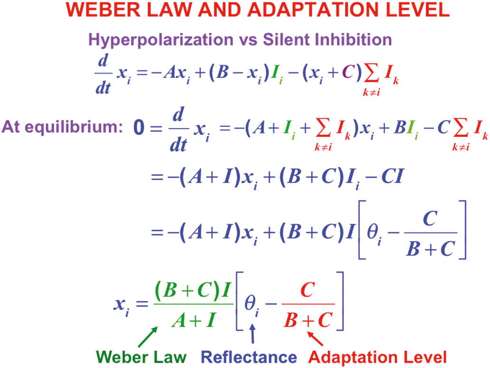

수학적으로, 억제 포화 전압 $V^-$를 수동 포화 전압 $V^p$보다 작게 잡고, 이 차이를 $C > 0$으로 표현합니다:

$$\frac{d}{dt}x_i = -Ax_i + (B - x_i)I_i - (x_i + C)\sum_{k \neq i} I_k$$

여기서 $C$는 억제 포화 전압이 수동 포화 전압보다 낮은 정도를 나타냅니다.

### 핵심 수식: 적응 수준을 포함한 평형 활동

평형($\frac{d}{dt}x_i = 0$)에서 도출 과정:

$$0 = -Ax_i + (B - x_i)I_i - (x_i + C)\sum_{k \neq i} I_k$$

$J = \sum_{k \neq i} I_k$, $I = I_i + J$로 놓고 전개합니다:

$$0 = -Ax_i + BI_i - x_i I_i - x_i J - CJ = BI_i - CJ - x_i(A + I)$$

$$x_i = \frac{BI_i - CJ}{A + I}$$

여기서 $J = I - I_i$이므로 $BI_i - CJ = BI_i - C(I - I_i) = (B+C)I_i - CI$를 대입하면:

$$x_i = \frac{(B+C)I_i - CI}{A+I} = \frac{(B+C)I}{A+I}\left[\frac{I_i}{I} - \frac{C}{B+C}\right]$$

최종 결과:

$$x_i = \frac{(B+C)I}{A+I}\left[\theta_i - \frac{C}{B+C}\right]$$

#### 각 부분의 의미

| 부분 | 의미 | 역할 |
|------|------|------|
| $\frac{(B+C)I}{A+I}$ | **Weber 법칙 항** | 총 입력 $I = \sum I_k$에 대한 정규화 |
| $\theta_i = \frac{I_i}{I}$ | **반사율 (reflectance)** | 전체 입력 중 $i$번째 셀의 비율 |
| $\frac{C}{B+C}$ | **적응 수준 (adaptation level)** | 활동이 양수가 되려면 넘어야 할 문턱값 |

> **해석**: 활동 $x_i$는 "Weber 법칙에 의한 크기 조절" × "[반사율 − 적응 수준]"로 분해됩니다.
> - $\theta_i > \frac{C}{B+C}$이면: 활동 양수 (흥분)
> - $\theta_i < \frac{C}{B+C}$이면: 활동 음수 (과분극, hyperpolarization)
> - $\theta_i = \frac{C}{B+C}$이면: 활동 = 0

이 구조는 심리물리학의 **적응 수준 이론(Adaptation Level Theory, Helson 1964)** 과 수학적으로 대응됩니다. Helson은 실험 데이터에서 귀납적으로, 인간이 자극을 절대값이 아니라 **최근 경험의 가중 평균**을 기준으로 지각한다는 것을 발견했습니다 — 예컨대 같은 무게도 이전에 들었던 물체에 따라 다르게 느껴집니다. Grossberg의 네트워크는 그 "기준"이 단순히 심리적 경향이 아니라, $V^- < V^p$라는 생물물리학적 비대칭에서 수학적으로 도출됨을 보여줍니다.

### 깨진 대칭 (Broken Symmetry): B ≫ C (Figure 2.29)

> **"적응 수준은 흥분과 억제 사이의 깨진 대칭을 요구한다"**

적응 수준이 존재한다는 사실은 즉각적으로 중요한 질문을 제기합니다: 충분히 많은 비율($\theta_i$)이 적응 수준보다 커서 양수 활동을 가지려면 어떤 조건이 필요한가? 이 질문의 답이 바로 흥분과 억제 사이의 **깨진 대칭(broken symmetry)** — 흥분이 억제보다 유리한 비대칭 구조 — 입니다.

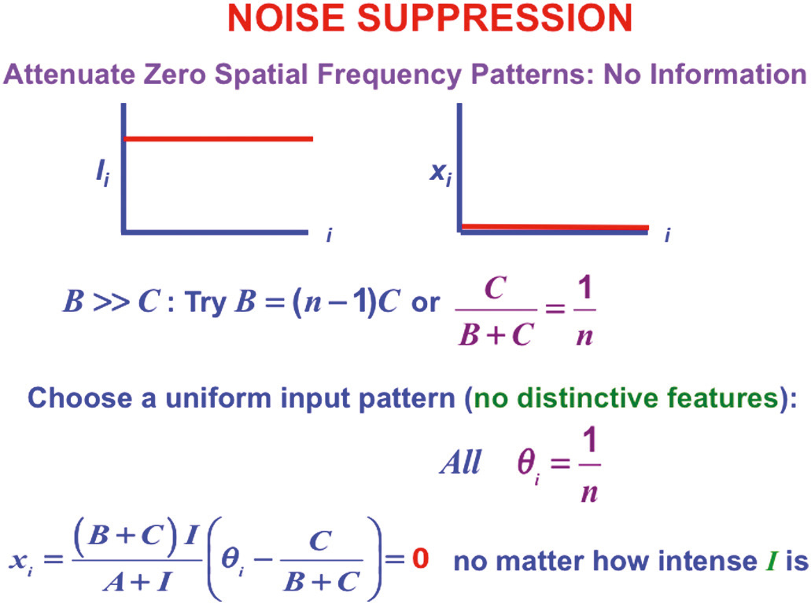

$\theta_i$는 정의상 1보다 작고, 모든 비율의 합은 1입니다. 적응 수준 $\frac{C}{B+C}$도 1보다 작아야 하며, 충분히 많은 비율이 양수 활동을 가지려면 $B \gg C$이어야 합니다.

이는 **흥분-억제 간의 대칭이 깨진(broken symmetry)** 상태입니다:
- 흥분 범위: $[0, B]$ — **넓음**
- 억제 범위: $[-C, 0]$ — **좁음**
- $V^+ \gg V^-$이므로 흥분이 유리

### 깨진 대칭이 조절하는 것: 동시에 켜지는 셀의 수

깨진 대칭을 "모든 셀이 전부 켜지거나 꺼진다"는 뜻로 오해하기 쉽습니다. 하지만 이것은 winner-take-all 현상으로, 별개의 이야기입니다. 깨진 대칭이 실제로 조절하는 것은 **적응 수준의 위치** — 즉 "몇 개의 셀이 동시에 양수 활동을 가질 수 있느냐"입니다.

적응 수준 $\frac{C}{B+C}$가 어디 있느냐에 따라 결과가 달라집니다:

| $B$와 $C$의 관계 | 적응 수준 | 결과 |
|-----------------|----------|------|
| $B = C$ (대칭) | $1/2$ | $\theta_i > 1/2$인 셀만 양수. $\sum \theta_i = 1$이므로 보통 **1개 셀**만 활성 → winner-take-all |
| $B \gg C$ (깨진 대칭) | $\approx 0$ | 평균 이상인 셀 다수가 양수 → **분산 표현(distributed representation)** |
| $B = (n-1)C$ (노이즈 억제 최적) | $1/n$ | 균일 패턴만 소거, 나머지 패턴은 살아남음 |

정리하면:
- 대칭($B = C$): 네트워크가 하나의 승자만 선택 → **경쟁(competition)** 극대화
- 비대칭($B \gg C$): 많은 셀이 동시에 활성 → **협력(cooperation)** 허용
- 최적값($B = (n-1)C$): 그 중간 — 균일한 노이즈는 억제하되, 의미있는 패턴은 유지

> 이 깨진 대칭은 뇌 전체에 편재하며, 다음 절에서 설명할 **노이즈 억제** 등 중요한 기능적 결과를 낳습니다.

---

## 12. 정보적 노이즈 억제

> **"정보적 노이즈 억제와 잠재적으로 유의미한 활동 패턴의 선별"**

깨진 대칭에서 즉각적으로 도출되는 매우 중요한 성질이 있습니다. 그것은 **노이즈가 유용한 정보 처리를 오염시키기 전에 억제된다**는 것입니다. Grossberg는 이미 순환 shunting off-surround 네트워크에서의 노이즈 억제(작은 준랜덤 내생 활성화 억제)를 언급한 바 있지만, 여기서는 또 다른 잠재적으로 재앙적인 종류의 노이즈 — **정보적 노이즈(informational noise)** — 를 소개합니다.

### 문제: 정보 없는 균일 입력

만약 네트워크의 모든 셀에 **동일한 총 입력**이 들어온다면 (균일 패턴, 공간 주파수 = 0), 이 입력은 **정보가 없습니다**. 어떤 특징도 다른 특징보다 우세하지 않기 때문입니다.

이런 무정보 입력이 학습을 촉발한다면 재앙적입니다 — 기존에 학습된 모든 특징 선택적 LTM(장기 기억) 흔적이 지워질 수 있습니다.

### 해결: 적응 수준을 통한 자동 소거

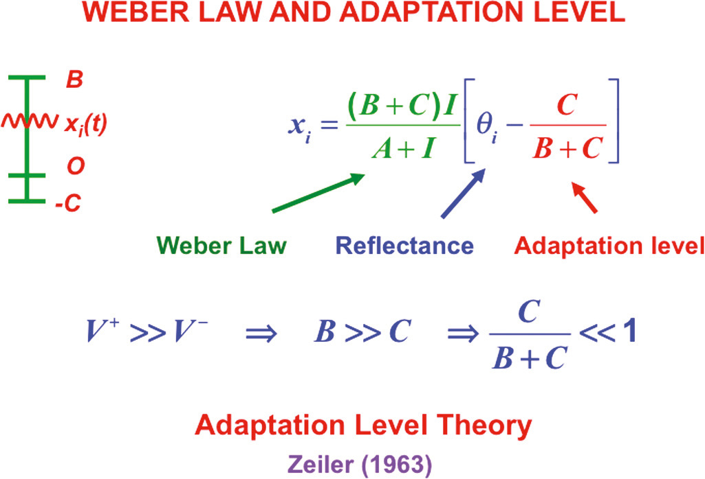

깨진 대칭이 이 문제를 우아하게 해결합니다. $n$개의 셀이 있는 네트워크에서:

**적응 수준 설정**: $B = (n-1)C$, 즉 $\frac{C}{B+C} = \frac{1}{n}$

**균일 입력 패턴 선택**: 모든 $\theta_i = \frac{1}{n}$ (각 셀이 전체의 $1/n$씩 동일하게 받음)

수식에 대입하면:

$$x_i = \frac{(B+C)I}{A+I}\left[\frac{1}{n} - \frac{1}{n}\right] = 0$$

> **결론**: 입력이 아무리 강해도, 균일 패턴이면 모든 셀의 활동이 **정확히 0**이 됩니다. 입력 강도($I$)에 전혀 무관합니다!

반면, 균일하지 않은 패턴($\theta_i \neq 1/n$인 셀이 존재)에서는:
- $\theta_i > 1/n$인 셀: 양수 활동 (해당 특징이 평균보다 강함)
- $\theta_i < 1/n$인 셀: 과분극 (해당 특징이 평균보다 약함)

이것이 **정보적 노이즈 억제(informational noise suppression)** 입니다.

> **AGC만으로는 부족하다**: "균일 패턴 소거"는 자동 이득 제어(shunting)만으로는 나타나지 않습니다. Section 1-3의 침묵 억제 네트워크($C = 0$)에서 균일 입력을 넣으면:
> $$x_i = \frac{BI_i}{A+I} = \frac{B}{n} \cdot \frac{I}{A+I} \neq 0$$
> 출력이 있습니다. AGC는 비율을 보존하고 스케일을 정규화할 뿐, 균일 패턴을 소거하지 않습니다. 소거가 가능해지려면 반드시 **과분극($C > 0$)** — 즉 $V^- < V^p$ — 이 필요합니다. 과분극이 적응 수준이라는 문턱값을 만들고, 그 문턱값이 균일 패턴과 정확히 일치할 때 소거가 일어납니다.

---

## 13. 노이즈 억제에서 패턴 매칭으로

> **"정보적 노이즈 억제와 상향/하향 패턴 매칭"**

### 왜 갑자기 "상향/하향"이 등장하는가?

지금까지 네트워크는 감각 입력($I_i$, 상향) 하나만 받았습니다. 그런데 실제 뇌에는 감각 경로와 거의 같은 수의 **하향(top-down) 피드백 연결**이 있습니다 — 고차 영역이 저차 영역으로 신호를 되돌려 보냅니다. 이 하향 신호는 뇌가 현재 갖고 있는 **기대(expectation)** 또는 **예측**을 나타냅니다.

"기대와 실제 입력이 만났을 때 어떤 일이 일어나야 하는가?"가 이 절의 질문입니다. 별도의 매칭 메커니즘이 필요할까요? Grossberg의 발견은 그렇지 않다는 것입니다 — 이미 확립된 노이즈 억제 원리가 그 역할을 그대로 수행합니다.

앞 절에서 밝힌 것은 이것입니다: **균일한 패턴($\theta_i = 1/n$)은 자동으로 억제된다.** 이제 한 가지 질문을 던져봅시다:

> 두 패턴이 동시에 들어올 때, 어떤 경우에 그 합이 균일해지고, 어떤 경우에 균일하지 않게 될까?

- 합이 **균일** → 억제 → 두 패턴이 **불일치(mismatch)**
- 합이 **불균일** → 생존 → 두 패턴이 **일치(match)**

이것이 노이즈 억제에서 패턴 매칭으로의 핵심 도약입니다. "균일한 것은 억제한다"는 규칙이 그대로 "불일치하는 쌍은 억제하고, 일치하는 쌍은 증폭한다"는 매칭 원리로 작동합니다. 별도의 메커니즘이 필요하지 않습니다 — 같은 수학이 두 역할을 동시에 합니다.

### 위상 불일치 = 노이즈 억제

Figure 2.31 상단: 두 입력 패턴이 서로 **위상이 반대(out of phase)** 인 경우를 생각합니다.
- 패턴 A: 왼쪽이 크고 오른쪽이 작음
- 패턴 B: 왼쪽이 작고 오른쪽이 큼

이 둘을 더하면? → **균일한 패턴** → 정보적 노이즈로서 **억제됨**!

> **의미**: 서로 불일치하는(mismatched) 패턴들은 합쳐졌을 때 자동으로 소거됩니다.

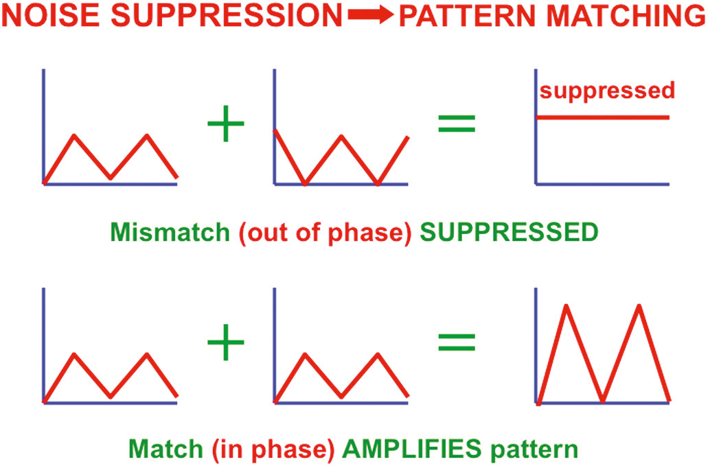

### 위상 일치 = 패턴 증폭

Figure 2.31 하단: 두 입력 패턴이 서로 **위상이 같은(in phase)** 경우.
- 패턴 A: 왼쪽이 크고 오른쪽이 작음
- 패턴 B: 역시 왼쪽이 크고 오른쪽이 작음

이 둘을 더하면? → **원래 패턴이 더 강화됨** → shunting 역학에 의해 **자동 이득 제어로 증폭**!

### 핵심 수식: 상향(bottom-up) + 하향(top-down) 입력 결합 (Figure 2.32)

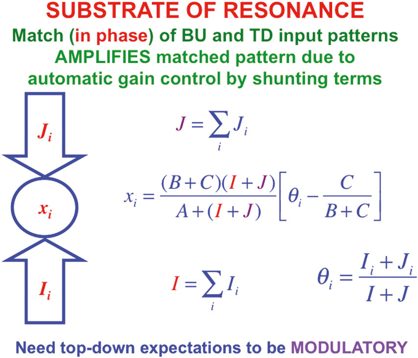

상향 입력 $I_i$와 하향 입력 $J_i$가 동시에 들어올 때:

$$x_i = \frac{(B+C)(I+J)}{A+(I+J)}\left[\theta_i - \frac{C}{B+C}\right]$$

여기서:
- $I = \sum_i I_i$: 상향 입력의 총합
- $J = \sum_i J_i$: 하향 입력의 총합
- $\theta_i = \frac{I_i + J_i}{I + J}$: **결합된 반사율** (상향 + 하향 입력의 비율)

> **ART Matching Rule의 기초**: 이 수식은 나중에 **적응 공명 이론(Adaptive Resonance Theory, ART)** 의 패턴 매칭 규칙으로 발전합니다.
>
> - 하향 기대(top-down expectation)와 상향 입력(bottom-up input)이 일치하면 → 공명(resonance) → 학습
> - 불일치하면 → 억제 → 새로운 카테고리 탐색

하향 기대는 **조절적(modulatory)** 이어야 합니다 — 단독으로 셀을 완전히 활성화하지는 못하지만, 감작(sensitize)하거나 준비(prime)시킬 수 있습니다.

---

## 14. 다중 채널 네트워크와 윤곽 검출

> **"전역적 off-surround에서 노이즈 억제를 보존하는 거리 의존적 off-surround로"**

지금까지의 on-center off-surround는 수학적으로 편리한 이상적 모델이었습니다 — 하나의 셀이 **나머지 모든 셀**을 동등하게 억제합니다. 그런데 실제 뇌의 시각 피질이나 망막을 보면, 연결은 거리에 따라 감소합니다. 바로 옆 셀은 강하게 억제하고, 멀리 있는 셀은 약하게 억제합니다.

이 현실적 구조로 바꿨을 때 **노이즈 억제가 유지되는가?** 그리고 유지된다면 어떤 새로운 기능이 생겨나는가? 이 두 질문이 14절의 내용입니다. 결론을 미리 말하면: 거리 의존적(가우시안) 연결도 노이즈 억제를 보존하며, 그 결과로 **윤곽 검출(contour detection)** 이라는 새로운 기능이 자동으로 나타납니다.

지금까지 다룬 네트워크(Figure 2.23)는 on-center가 하나의 셀, off-surround가 나머지 **모든 셀**을 동등하게 억제하는 극단적 경우였습니다. 이는 실제 뇌에서 발견되는 연결 구조의 **극한 사례(limiting case)** 입니다. 이제 더 현실적인 구조로 발전시킵니다.

### 단일 채널에서 다중 채널로

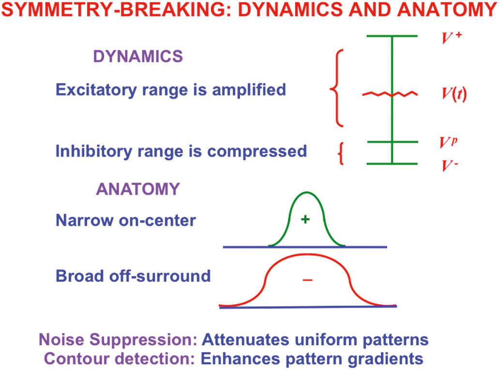

지금까지는 한 셀이 나머지 **모든** 셀을 억제하는 "전역적" 네트워크를 다루었습니다. 실제 뇌에서는 연결이 **거리에 따라 감소**합니다:

- **On-center**: 좁은 가우시안(Gaussian) — 가까운 셀을 흥분시킴
- **Off-surround**: 넓은 가우시안 — 더 넓은 범위의 셀을 억제

이것이 **다중 채널(multiple channel)** 네트워크입니다 (Figure 2.34).

### 핵심 수식: DOG와 SOG (Figure 2.35)

가우시안 커널을 정의합니다:

$$C_{ki} = Ce^{-\mu(k-i)^2}, \quad E_{ki} = Ee^{-\nu(k-i)^2}$$

- $C_{ki}$: on-center 가우시안 커널 (좁음, $\mu > \nu$이면)
- $E_{ki}$: off-surround 가우시안 커널 (넓음)

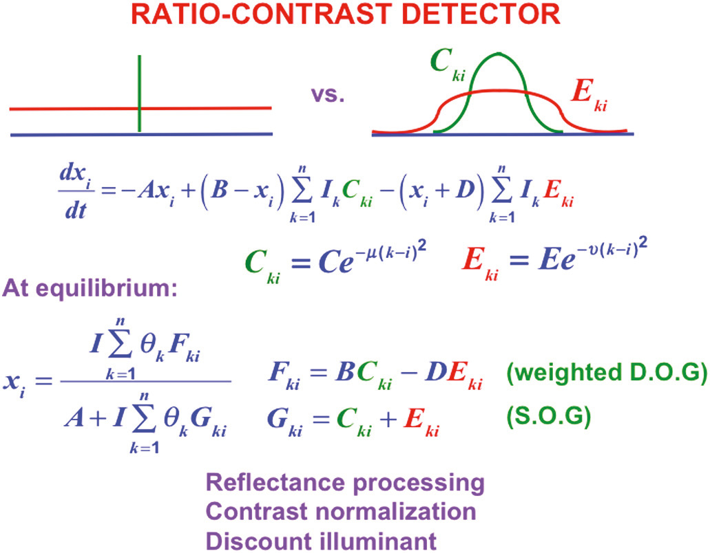

평형 활동:

$$x_i = \frac{I\sum_{k=1}^{n}\theta_k F_{ki}}{A + I\sum_{k=1}^{n}\theta_k G_{ki}}$$

여기서:
- $F_{ki} = BC_{ki} - DE_{ki}$ — **가중 가우시안 차(weighted Difference Of Gaussians, DOG)**
- $G_{ki} = C_{ki} + E_{ki}$ — **가우시안 합(Sum Of Gaussians, SOG)**

#### DOG / SOG의 역할

| 연산 | 위치 | 기능 |
|------|------|------|
| DOG ($F_{ki}$) | 분자 | 입력의 **대비(contrast)** 를 계산 — 가장자리(edge) 검출 |
| SOG ($G_{ki}$) | 분모 | 대비를 **정규화** — 비율 대비(ratio contrast) 실현 |

### 윤곽 검출 조건 (Figure 2.36)

> **"정보적 노이즈 억제는 다중 스케일 네트워크에서 윤곽 검출을 함축한다"**

DOG를 SOG로 나누면 각 위치에서의 입력 **대비(contrast)** 를 계산합니다. 네트워크가 정보적 노이즈도 억제하도록 보정하면, 입력 크기가 공간적으로 충분히 빠르게 변하는 위치에서만 셀이 선택적으로 반응합니다. 이는 시각 이미지에서 충분히 강한 밝기 경계, 텍스처, 음영이 있는 위치에 해당합니다. 이 성질은 3장 이후의 모든 시각 설명을 이해하는 데 필수적입니다.

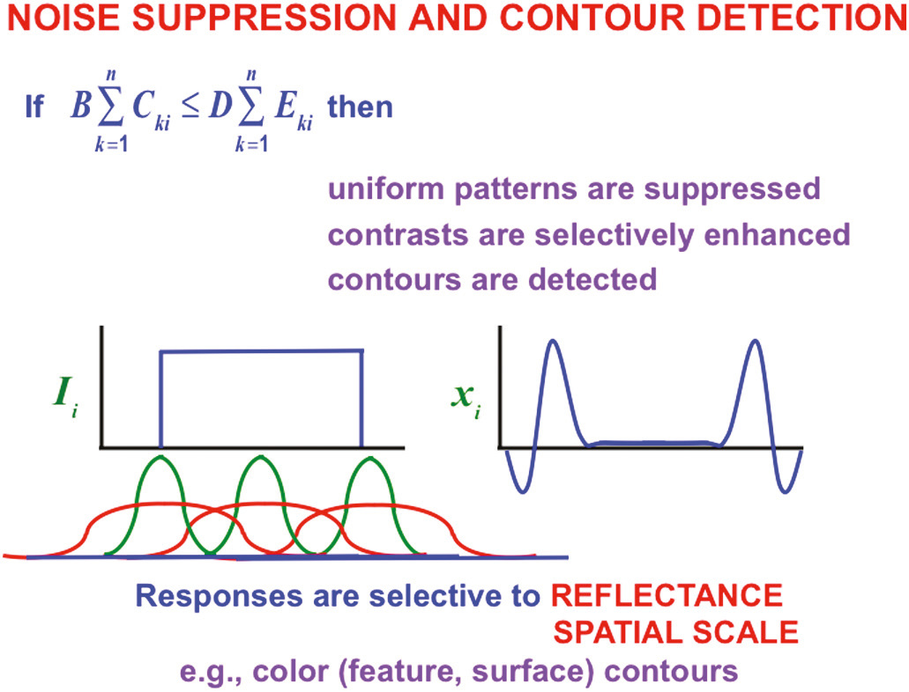

정보적 노이즈 억제가 다중 채널에서도 작동하려면:

$$B\sum_{k=1}^{n} C_{ki} \leq D\sum_{k=1}^{n} E_{ki}$$

이 부등식이 성립하면:
- **균일 패턴** ($\theta_k = 1/n$ for all $k$) → $x_i \leq 0$ → **억제됨**
- **입력이 급변하는 위치** (가장자리, 텍스처, 음영 경계) → $x_i > 0$ → **선택적 활성화**

> **결과**: 이 네트워크는 **비율 대비 검출기(ratio contrast detector)** 로 기능합니다:
> - **반사율(reflectance)**: 물체 표면의 고유 밝기
> - **색상(color)**: 파장별 반사 비율
> - **표면 윤곽(surface contour)**: 깊이나 방향 변화
>
> 조명(illuminant)이 바뀌어도 비율은 보존되므로, 조명 할인(discount the illuminant) 효과가 자동으로 실현됩니다.

Figure 2.36의 예시:
- 직사각형 입력 $I_i$ → 입력이 0인 곳과 상수인 곳 모두 $x_i = 0$
- 입력이 **급변하는 경계**에서만 $x_i > 0$ → 윤곽만 검출

---

## 15. 뇌를 진화시키는 방법: 모델링 방법론

> **"뇌를 진화시키는 방법: 모델링 방법론"**

9절까지의 내용은 모두 **하나의 출발점**에서 시작했습니다: "유한한 뉴런으로 무한한 입력 범위를 어떻게 처리하는가?" 이 질문 하나에서 막 방정식, Weber 법칙, 과분극, 노이즈 억제, 패턴 매칭, 윤곽 검출이 연쇄적으로 도출되었습니다. Grossberg는 이제 메타 수준의 질문을 던집니다: **어떻게 이런 연쇄가 가능했는가?** 그리고 이 방법을 체계화하면 다른 뇌 기능에도 같은 방식으로 접근할 수 있지 않을까?

### 모델링 사이클

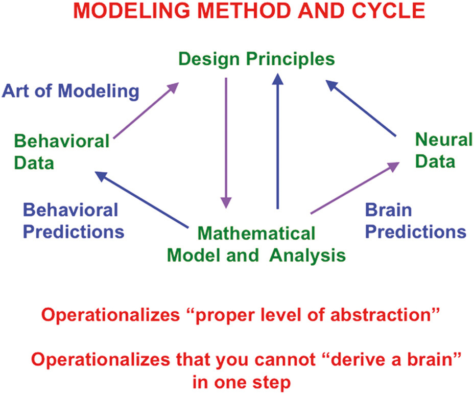

Grossberg의 이론적 방법론은 1957년부터 사용해 온 **순환적 모델링 과정**입니다:

```
행동 데이터 (Behavioral Data)
    ↓ Art of Modeling (정적 데이터에서 실시간 역학 추론)
설계 원리 (Design Principles)
    ↓ Method of Minimal Anatomies (Occam's Razor)
수학 모델 (Mathematical Model and Analysis)
    ↓ 시뮬레이션 및 분석
예측 (Brain Predictions + Behavioral Predictions)
    ↓ 실험 데이터로 검증
행동 데이터 (더 큰 데이터베이스) → ... 반복
```

### 핵심 방법론 원칙

#### 1. Art of Modeling (모델링의 기술)

"정적 데이터에서 실시간 역학을 추론한다"는 것이 구체적으로 무슨 뜻인가? 예를 들어, 실험자가 여러 배경 조명 수준에서 셀의 반응 곡선을 측정했다고 합시다 — 이것은 **정적(static) 입출력 데이터**입니다. 그런데 Grossberg는 이 곡선이 평형 상태의 스냅샷이라는 것을 알고 있습니다. 평형이란 $\frac{d}{dt}x_i = 0$이므로, 관찰된 곡선의 형태로부터 어떤 미분 방정식이 그 평형을 만들어내는지를 **역산(infer)** 할 수 있습니다. 즉, 정적 측정 → 동적 방정식의 형태를 결정 → 방정식의 실시간 거동을 예측. 이것이 "시간 속에서 생각하는 기술"입니다.

#### 2. Method of Minimal Anatomies (최소 해부학 방법)

이 장에서 우리가 실제로 사용한 방법입니다. 각 구성 요소를 제거하면 무슨 일이 생기는지를 보면 "왜 필요한가"가 명확해집니다:

| 제거 대상 | 결과 |
|-----------|------|
| Off-surround | 포화 문제 재발, 비율 계산 불가 |
| 과분극 ($C=0$) | 적응 수준 없음, 노이즈 억제 불가 |
| 깨진 대칭 ($B=C$) | 대부분의 셀이 과분극, winner-take-all로 붕괴 |
| 가우시안 거리 의존성 | 윤곽 검출 불가, 공간 정보 손실 |

각 요소가 제거되면 설명할 수 없는 현상이 생기므로 모두 "최소"에 해당합니다. 더 추가할 이유가 없는 한 추가하지 않습니다.

#### 3. 왜 행동 데이터에서 출발하면 항상 뇌처럼 보이는가?

> 행동 데이터에서 출발하여 도출된 모델은 **항상 뇌처럼 보인다.**

이것이 우연이 아닌 이유: 뇌는 수억 년간 실세계 문제(noise-saturation, 패턴 인식, 적응)를 해결하기 위해 진화했습니다. Grossberg는 같은 문제를 수학적으로 해결하려 합니다. **같은 문제에 대한 최소 해는 같을 수밖에 없습니다.** 행동 데이터 → 설계 원리 → 최소 모델의 경로가 진화 → 자연선택 → 신경 구조의 경로와 평행하게 수렴합니다.

---

## 16. 임베딩, 언럼핑, 대응 원리

모델링 사이클을 계속 돌리면 모델이 점점 정교해집니다. 그런데 이 정교화 과정에는 규칙이 있어야 합니다 — 새 모델이 기존 모델과 단절되면 과거의 설명력이 날아가고, 누적이 되지 않습니다. 물리학에서 뉴턴 역학 → 상대성이론 → 양자역학으로 넘어갈 때 각 이론이 이전 이론을 **극한 사례로 포함**했듯이, 뇌 이론도 같은 원칙이 필요합니다.

### 세 가지 모델 진화 원리

모델이 점진적으로 정교해지는 과정을 세 가지 상호 보완적 원리로 설명합니다:

#### 1. 임베딩 원리 (Embedding Principle)

> 새로운 모델은 이전 모델을 **포함(embed)** 해야 한다.

이 장에서 실제로 일어난 것을 보면 바로 이해됩니다:

- 과분극 모델($C > 0$)에서 $C = 0$으로 놓으면 → 침묵 억제 모델이 그대로 나옴
- 가우시안 on-center off-surround에서 $\mu \to \infty$, $\nu \to \infty$ 극한 → 단일 셀 모델로 수렴
- 13절의 상향+하향 결합 수식에서 $J_i = 0$으로 놓으면 → 5절의 단독 상향 입력 수식이 나옴

새 파라미터를 특정 값으로 설정하면 이전 모델이 **특수 사례**로 나와야 합니다. 만약 그렇지 않다면, 이전 모델이 틀린 것이거나 새 모델이 잘못 설계된 것입니다. Grossberg의 1957년 이래 모든 모델이 이 원리를 만족했습니다(한 번도 폐기된 적 없음).

Grossberg는 자신의 초기 모델을 **Embedding Fields**라 명명했습니다 (Grossberg, 1964). "Embedding"은 임베딩 제약을, "Fields"는 신경망 내 상호작용이 행동에 매핑되는 창발적 특성을 의미합니다.

#### 2. 언럼핑 (Unlumping)

> 뭉쳐진(lumped) 변수를 더 세분화된(finer) 변수로 풀어놓는 과정

이 장에서의 구체적 예시:

- **침묵 억제 → 과분극**: 단일 파라미터 $g^-$가 실제로는 $V^-$와 $V^p$의 관계를 숨기고 있었음. 이를 분리하자 적응 수준이 등장
- **단일 입력 → 상향+하향**: 초기 모델의 $I_i$가 실제로는 $I_i$(감각) + $J_i$(피드백)의 합이었음. 분리하자 패턴 매칭이 등장
- **전역 off-surround → 가우시안**: 단일 억제 강도 $n$이 실제로는 거리에 따라 달라지는 함수였음. 분리하자 공간적 윤곽 검출이 등장

언럼핑할 때마다 새로운 기능이 나타납니다. 이것이 Grossberg가 "단계적 정교화"라 부르는 과정의 실체입니다.

#### 3. 대응 원리 (Correspondence Principle)

> 뭉쳐진 모델의 변수가 세분화된 모델의 변수로 어떻게 변환되는지를 명시

언럼핑 후에는 반드시 "옛 변수 = 새 변수들의 어떤 조합"인지를 보여야 합니다. 예를 들어:

$$I_i^{\text{(lumped)}} = I_i + J_i \quad \text{(상향 + 하향의 합)}$$

이것이 성립하지 않으면 두 모델은 실제로 **다른 것**을 설명하고 있는 겁니다. 많은 신경과학 이론들이 이 검증을 통과하지 못합니다 — 새 이론을 제안할 때 기존 이론이 어디에 해당하는지 보여주지 않는 것입니다.

물리학의 유비:
- **Bohr**: 양자수 $n \to \infty$ 극한에서 고전 전자기학으로 수렴
- **Einstein**: $v \ll c$ 극한에서 뉴턴 역학으로 수렴

### 모델 진화의 일관성

> 이 세 원리가 함께 작동하여, 모델의 **개념적 진화(conceptual evolution)** 가 뇌의 **생물학적 진화**를 반영하도록 보장합니다. 최소 해부학 방법은 진화 과정에서 점점 더 복잡한 환경 압력이 뇌에 반영되는 방식을 이해하는 도구입니다.

---

## 17. 뇌 이론에서 기술 응용으로

> **"모델링 사이클의 모든 단계에서, 자율 지능 시스템을 필요로 하는 엔지니어와 기술자에게 유용한 응용이 파생됩니다."**

지금까지의 모든 논의는 "뇌를 이해하기 위한" 이론이었습니다. 그런데 Grossberg는 이 이론이 단순히 뇌과학의 학문적 성과로 끝나지 않는다고 주장합니다. 모델링 사이클의 **매 단계** — 행동 데이터를 설계 원리로 변환할 때, 설계 원리를 수학 모델로 만들 때, 모델에서 예측을 도출할 때 — 마다 실제 공학 문제에 적용할 수 있는 기술이 파생됩니다. 뇌 이해와 기술 개발이 같은 사이클 안에 있다는 주장입니다.

### 모델링 사이클의 모든 단계에서 기술이 파생된다

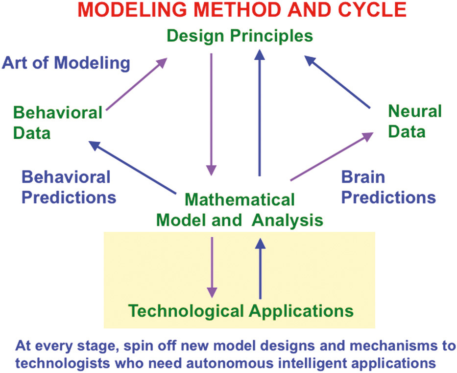

Figure 2.38은 Figure 2.37의 모델링 사이클에 **기술 응용(Technological Applications)** 이 추가된 확장판입니다:

```
        Design Principles
       ↗                ↘
Behavioral Data    Neural Data
       ↑                ↓
Behavioral        Brain
Predictions      Predictions
       ↖                ↙
    Mathematical Model
           ↓
  Technological Applications
```

> 모델링 사이클의 **매 단계**에서, 자율 지능 시스템을 필요로 하는 엔지니어와 기술자에게 유용한 응용이 파생됩니다.

### 기술 응용의 세 요소

| 요소 | 유래 | 의미 |
|------|------|------|
| **기능 (Function)** | 행동 분석 → 설계 원리 | 응용이 해결해야 할 **문제** |
| **메커니즘 (Mechanism)** | 설계 원리 → 신경망 모델 | 문제를 해결하는 **방법** |
| **자율성 (Autonomy)** | 신경망의 실시간 적응 설계 | 변화하는 환경에 **스스로 적응** |

### Deep Learning vs. ART: 파국적 망각 문제

이 장의 전체 내용이 사실 이 대비를 이해하는 배경입니다. 핵심 문제는 **안정성-가소성 딜레마(stability-plasticity dilemma)** 입니다:

> 새로운 것을 학습하려면 가소성(plasticity)이 필요하지만, 가소성이 너무 높으면 새 학습이 기존 학습을 덮어씁니다. 반대로 안정성(stability)이 너무 높으면 새로운 환경에 적응하지 못합니다.

**딥러닝이 파국적 망각을 겪는 이유**: 딥러닝은 가중치를 전체 예제에 걸쳐 공유합니다. 새로운 카테고리의 데이터로 역전파를 실행하면, 경사하강법이 **기존 가중치를 덮어써서** 이전에 학습한 카테고리의 성능이 붕괴합니다. 이를 피하려면 전체 데이터를 처음부터 다시 학습해야 합니다.

**ART가 이를 방지하는 이유**: 바로 이 장에서 다룬 패턴 매칭 메커니즘 덕분입니다. 새 입력이 들어왔을 때:
- 기존 카테고리와 **충분히 일치(match)** → 기존 가중치를 소폭 업데이트 (안정성 유지)
- 기존 카테고리와 **불일치(mismatch)** → 기존 가중치 건드리지 않고 **새 카테고리 생성** (가소성 발휘)

이 결정은 13절의 패턴 매칭 원리, 즉 "위상 불일치 → 억제, 위상 일치 → 증폭"과 동일한 수학에 기반합니다. 노이즈 억제 → 패턴 매칭 → 안정적 학습이 하나의 연속된 구조입니다.

| | Deep Learning | ART |
|---|---|---|
| 기반 | 역전파(backpropagation), 경사하강법 | 적응 공명 이론 |
| 수학적 뿌리 | Gauss 이래의 고전적 최적화 ("neo-classical") | 뇌에서 영감받은 비선형 역학 |
| 뇌와의 일관성 | 뇌의 메커니즘과 **불일치** | 뇌 메커니즘을 **반영** |
| 파국적 망각 | **발생** — 새 학습이 기존 학습을 덮어씀 | **방지** — 불일치 시 새 카테고리 생성 |
| 새 카테고리 | 전체 재학습 필요 | 실시간 온라인 학습 가능 |
| 적합 환경 | 통계가 안정적인 대규모 데이터셋 | 빠르게 변화하는 실세계 환경 |

> **Grossberg의 전망**: 기술 기업들이 빠르게 변화하는 빅데이터 환경에서 적응적 자율 지능을 실현해야 할 때, Deep Learning에서 ART 같은 모델로 전환하게 될 것이다.

---

## 최종 요약: 전체 서사 흐름과 통합

```
역사적 분열 (물리학 ↔ 심리학)
    ↓ 세 개의 N의 발견
비선형, 비국소적, 비정상적 수학의 필요성
    ↓
뇌가 마음을 만드는 방식 발견
    ↓ 행동 데이터에서 출발
STM, LTM, MTM의 상호작용
    ↓ 게이트드 경사하강 학습
이진 모델 → 연속 비선형 모델
    ↓
신경망의 필요성: 분산 패턴 처리
    ↓ 다중 스케일 피드백
노이즈-포화 딜레마의 해결
    ↓ On-center Off-surround
자동 이득 제어, 비율 보존, Weber 법칙
    ↓ 수학적 형식화
막 방정식과 신경생리학의 일치
    ↓ 대수 좌표 변환
Weber 법칙 + 이동 특성
    ↓ 과분극 도입
적응 수준 + 깨진 대칭
    ↓ 균일 패턴 소거
정보적 노이즈 억제
    ↓ 상향+하향 패턴 결합
패턴 매칭 → ART의 기초
    ↓ 가우시안 커널 도입
다중 채널 윤곽 검출 (DOG/SOG)
    ↓ 메타 수준
모델링 방법론 (임베딩, 언럼핑, 대응)
    ↓ 실세계 적용
뇌 이론 → 기술 응용
```

이 전체 서사는 하나의 단순한 문제(noise-saturation dilemma)에서 출발하여, 각 단계마다 **하나의 작은 변형**을 추가함으로써, 뇌의 근본적인 계산 원리를 점진적으로 밝혀가는 과정입니다. Grossberg는 이 방법론 자체가 뇌의 진화 과정을 반영한다고 주장합니다.

---

## 결론: 수학적 이론에서 실용 응용까지

Grossberg의 2장은 **수학적 이론**에서 **실제 기술 응용**까지의 완벽한 사이클을 보여줍니다:

1. **이론적 출발**: 역사적 지적 위기 → 새로운 수학적 언어(세 개의 N)의 필요성 발견
2. **수학적 형식화**: 사고 실험 → shunting 방정식 → 막 방정식과의 일치
3. **실험적 검증**: Mudpuppy 망막 등에서 이론적 예측의 생물학적 확인
4. **메타 분석**: 모델링 방법론을 체계화하고 임베딩, 언럼핑, 대응 원리 정립
5. **실용 응용**: ART, 알고리즘, 딥러닝 비판 등 기술 응용

이것이 뇌와 기술을 잇는 교량입니다: **수학적 이해가 실제 응용으로 이어진다.** 뇌의 진화적 지혜를 수학적 언어로 포착하고, 그 언어에서 기술 혁신을 달성하는 것이 Grossberg가 보여주는 "뇌-기술 연결"의 본질입니다.

---

> **"이론과 실천의 일치: 뇌의 수학적 구조와 실제 뇌의 해부학적 구조가 독립적으로 도달되고 서로 강화한다는 놀라운 사실입니다."**

---

*문서 끝*
