# Grossberg *Conscious MIND Resonant BRAIN* 3장 완전 해설

> 원문: Stephen Grossberg, Conscious MIND Resonant BRAIN, Chapter 3 (pp. 86–121)
> 이 문서는 원문의 서사적 흐름을 따라, 수식·그림·이론을 한국어로 친절하게 풀어 설명합니다.

---

## 목차

### 전반부 (pp. 86-103)
1. [왜 보는가? (Why do we bother to see?)](#1-왜-보는가-why-do-we-bother-to-see)
2. [콸리아 없는 의식: 왜 보는가?](#2-콸리아-없는-의식-왜-보는가-consciousness-without-qualia)
3. [모든 경계는 비가시적: Kanizsa 사각형에서 전경-배경 분리까지](#3-모든-경계는-비가시적-kanizsa-사각형에서-전경-배경-분리까지)
4. [맹점과 함께 살기](#4-맹점과-함께-살기-living-with-your-blind-spot)
5. [흔들리는 눈과 가려진 물체](#5-흔들리는-눈과-가려진-물체-jiggling-eyes-and-occluded-objects)
6. [착시는 현실을 표현할 수 있다](#6-착시는-현실을-표현할-수-있다-how-illusions-may-represent-reality)
7. [경계 완성과 표면 채움의 상보적 특성](#7-경계-완성과-표면-채움의-상보적-특성)
8. [네온색 확산](#8-네온색-확산-neon-color-spreading)
9. [경계와 표면의 상보적 계산](#9-경계와-표면의-상보적-계산)
10. [특수 모듈인가 범용 모달 시스템인가?](#10-특수-모듈인가-범용-모달-시스템인가)
11. [새로운 기하학: 공간과 방위에 걸친 협력과 경쟁](#11-새로운-기하학-공간과-방위에-걸친-협력과-경쟁)
12. [음영, 텍스처, 위장 그루핑과 3D 지각](#12-음영-텍스처-위장-그루핑과-3d-지각)

### 후반부 (pp. 104-121)
13. [인상파 화가와 시각 뇌: 예술에서의 경계 그루핑](#13-인상파-화가와-시각-뇌)
14. [3D 표면 지각과 전경-배경 분리](#14-3d-표면-지각과-전경-배경-분리)
15. [T-접합과 깊이 지각](#15-t-접합과-깊이-지각)
16. [양안 시각과 다빈치 입체시](#16-양안-시각과-다빈치-입체시)
17. [FACADE 이론: 형태, 색, 깊이의 통합](#17-facade-이론)
18. [시각 피질의 층 구조와 기능적 연결](#18-시각-피질의-층-구조)
19. [주의와 의식: 표면-수축-공명 가설](#19-주의와-의식)
20. [예술과 시각 과학의 융합](#20-예술과-시각-과학의-융합)

---

# 전반부 (pp. 86-103)

---

## 1. 왜 보는가? (Why do we bother to see?)

### 시각의 중요성과 시각 지능

시각(seeing)은 외부 세계에 대한 가장 핵심적인 정보원 중 하나입니다. 영장류 뇌의 절반 이상이 시각 정보 처리에 전담되어 있으며, 시각 지능(visual intelligence)은 수학, 과학, 기술의 모든 영역에 스며들어 있습니다.

**시각이 기하학을 낳았다:**
- 눈, 팔, 다리의 움직임과 결합된 시각은 기하학적 개념과 공리를 발명하는 직관적 기반을 제공합니다
- 아인슈타인은 일반 상대성 이론의 방정식을 리만(Riemannian) 기하학, 즉 곡선 기하학적 시공간 표현으로 표현했습니다
- 시각이 기하학적 사고를 지배하는 과정에 대한 이해는 이 능력의 활용에 비해 훨씬 뒤처져 있습니다

**시각 연구의 새로운 지평:**
- 지난 30년간 시각 지각을 지배하는 뇌 과정에 대해 수많은 새로운 아이디어가 등장했습니다
- 고전 기하학의 공리는 우리가 세상을 보고 행동하는 뇌 과정을 정확히 기술하지 못합니다
- 새로운 유형의 **비선형 동역학 시스템**, 새로운 **기하학적 개념**, 새로운 **통계적 결정 이론**, 새로운 **상전이(phase transition) 사례**, 새로운 **불확실성 원리** 등이 도입되었습니다

### Seeing vs. Knowing 구분

Grossberg는 시각의 고전적 구분인 **"보는 것(seeing)"과 "아는 것(knowing)"** 의 차이에서 논의를 시작합니다. 이 구분은 더 정확하게는 **seeing과 recognizing**의 구분으로 재진술할 수 있습니다.

| 개념 | 정의 | 예시 |
|------|------|------|
| **Seeing (보기)** | 밝기, 색상 등 가시적 콸리아를 동반하는 지각 | Ehrenstein 원에서 밝은 원반을 "보는" 것 |
| **Recognizing (인식하기)** | 대상이 거기 있음을 의식적으로 아는 것 | 오프셋 격자에서 수직 경계를 "인식하는" 것 |
| **Knowing (앎)** | 의식적 인식 전체 (보기 + 인식하기) | 두 과정 모두를 포함하는 상위 개념 |

> **핵심 질문**: "우리는 왜 시각을 사용하는가?" 라는 질문에 대한 직관적 답변은 "인식하기 위해 본다"입니다. 그러나 오프셋 격자의 예시는 **보지 않고도 인식할 수 있음**을 보여줍니다. 그렇다면 우리는 왜 굳이 "보는" 것일까요?

### Figure 3.1: 시각 처리의 매크로회로 (WHAT/WHERE 스트림)

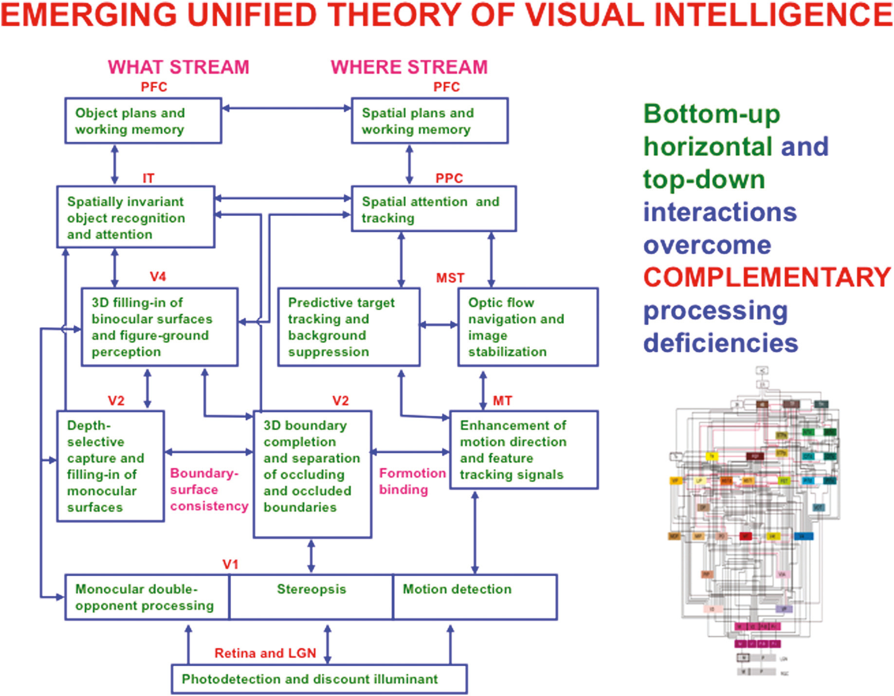

Figure 3.1은 핵심 시각 과정과 이들이 주로 발생하는 피질 영역을 망막에서 전전두피질(PFC)까지 요약한 **매크로회로(macrocircuit)** 입니다.

```
┌─────────────────────────────────────────────────────┐
│                  전전두 피질 (PFC)                      │
│         WHAT 스트림          WHERE 스트림              │
│     (물체 계획 & 작업기억)    (공간 계획 & 작업기억)      │
├────────────┬────────────────┬───────────────────────┤
│     IT     │                │         PPC           │
│ 공간불변 물체│                │    공간 주의 & 추적     │
│ 인식 & 주의 │                │                       │
├────────────┤                ├───────────────────────┤
│     V4     │                │         MST           │
│ 3D 양안 표면│  예측 추적 &    │    광학 흐름 탐색 &    │
│ 채움 & 전경-│  배경 억제      │    영상 안정화         │
│ 배경 지각   │                │                       │
├────────────┤                ├───────────────────────┤
│     V2     │                │         MT            │
│ 깊이 선택적 │  3D 경계 완성  │    운동 방향 향상 &    │
│ 채움 & 단안 │  & 가림 경계   │    특징 추적 신호      │
│ 표면       │  분리          │                       │
├────────────┴────────────────┴───────────────────────┤
│                      V1                              │
│          단안 이중-대립 처리 / 입체시 / 운동 감지        │
├─────────────────────────────────────────────────────┤
│               망막 & LGN                              │
│          광검출 및 조명 할인(discount illuminant)       │
└─────────────────────────────────────────────────────┘
```

**두 가지 피질 스트림:**

| 스트림 | 경로 | 기능 |
|--------|------|------|
| **WHAT 스트림** (복측) | V1 → V2 → V4 → IT → PFC | 물체가 **무엇**인지 인식 (형태, 색, 질감) |
| **WHERE 스트림** (배측) | V1 → MT → MST → PPC → PFC | 물체가 **어디**에 있는지 파악 (위치, 운동) |

> **핵심 통찰**: 상향식(bottom-up), 수평(horizontal), 하향식(top-down) 상호작용이 이 과정들 각각의 **상보적 처리 결핍(complementary processing deficiencies)** 을 극복하도록 돕습니다. 또한 하향식 기대를 읽어냄으로써 학습을 안정화하고 현저한 물체와 위치에 주의를 집중시킵니다.

---

## 2. 콸리아 없는 의식: 왜 보는가? (Consciousness without qualia)

### 오프셋 격자(Offset Grating)와 아모달(Amodal) 지각

Figure 1.1의 오른쪽 패널에 있는 **오프셋 격자(offset grating)** 는 **인식할 수 있지만 볼 수 없는** 지각의 간단한 예입니다.

- 이 이미지를 볼 때, 수평 파란 선들의 끝을 연결하는 **수직 경계**를 인식할 수 있습니다
- 이 경계가 거기에 있다는 것을 쉽게 **인식(recognize)** 할 수 있지만, 쉽게 **볼(see)** 수는 없습니다
- 수직 경계의 현저성(salience)은 밝기나 색상의 미세한 차이보다 훨씬 큽니다
- 이것은 **인식할 수 있지만 볼 수 없는** 지각입니다 — 그것이 거기 있다는 것을 **알고**, 이를 의식하지만, 그것은 **비가시적(invisible)** 입니다

### 아모달(Amodal)과 모달(Modal) 지각의 구분

| 지각 유형 | 특성 | 예시 |
|-----------|------|------|
| **모달(Modal) 지각** | 밝기, 색상 등 가시적 콸리아를 동반 | Kanizsa 사각형에서 밝은 표면을 "보는" 것 |
| **아모달(Amodal) 지각** | 콸리아 없이 경계만 형성 | 오프셋 격자의 수직 경계를 "인식하는" 것 |

### 콸리아(Qualia)란 무엇인가?

스탠퍼드 철학 백과사전의 정의:

> "감정과 경험은 널리 다양합니다. 예를 들어, 사포 위에 손가락을 굴리거나, 스컹크 냄새를 맡거나, 손가락에 날카로운 통증을 느끼거나, 밝은 보라색을 보는 것처럼 느끼거나, 극도로 화가 나는 것. 이러한 각 경우에서 나는 매우 독특한 주관적 특성을 가진 정신 상태의 주체입니다."

**Grossberg의 입장:**
- 콸리아 없이도 의식적으로 인식할 수 있다는 사실은 John Searle의 "의식의 문제는 콸리아의 문제와 동일하다"는 주장을 반박합니다
- Grossberg는 "보기", "듣기", "느끼기", "알기"와 같은 현상을 직접적으로 기술하는 방식을 채택합니다

### Seeing과 Recognizing의 구분이 왜 중요한가

"왜 우리는 보는가?"에 대한 직관적 답변 — "인식하기 위해 본다" — 는 오프셋 격자의 예에 의해 반박됩니다:

```
전통적 견해:  보기(seeing) → 인식하기(recognizing)
                ↑ 필수적

반례:          오프셋 격자 — 보지 않고도 인식 가능!

수정된 견해:  보기와 인식하기는 독립적인 과정
              둘 다 의식적이지만, 다른 뇌 메커니즘에 기반
```

> **핵심 메시지**: Table 1.3에서 논의된 바와 같이, 보기(seeing), 듣기(hearing), 느끼기(feeling) 같은 의식적 경험은 효과적인 행동을 제어할 수 있는 뇌 표상을 구현합니다. 보기(seeing)는 행동 제어를 위한 가시적 표상을 제공하는 특수한 의식적 과정입니다.

---

## 3. 모든 경계는 비가시적: Kanizsa 사각형에서 전경-배경 분리까지

### Figure 3.2: 체커보드와 회색 원반

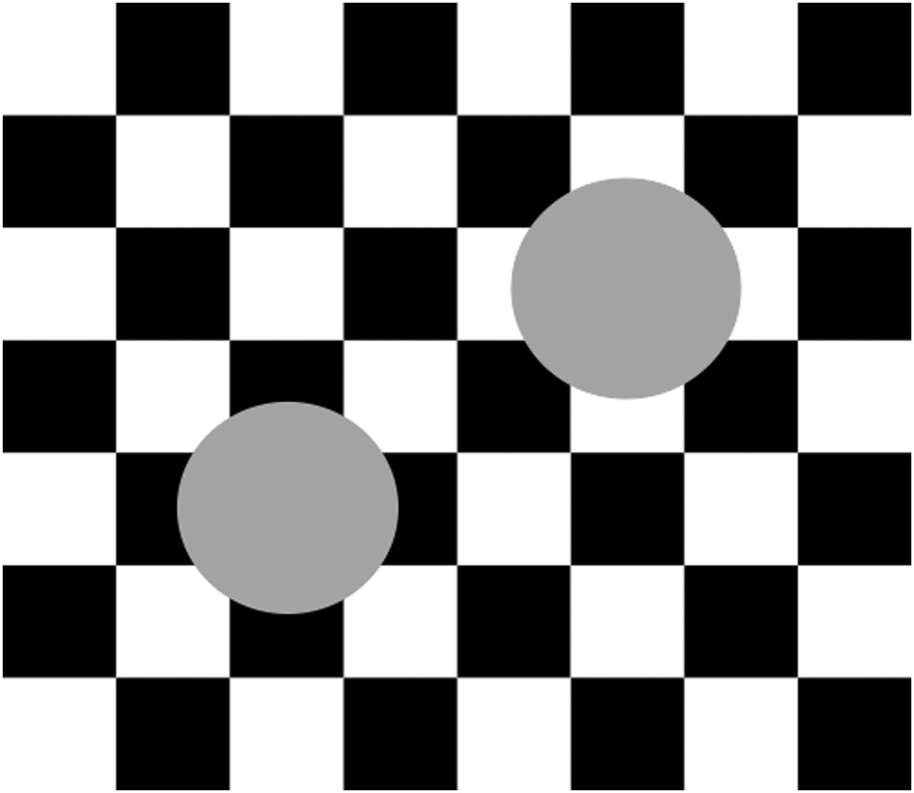

Kanizsa가 도입한 이 이미지는 헬름홀츠의 "모든 시각은 지식 기반 가설 검증에 기반한다"는 입장에 반대하는 또 하나의 예입니다.

**지식 기반 예측 vs. 실제 지각:**
- 일반적인 흑백 체커보드 경험에 기반하면, 왼쪽 아래 회색 원반 아래에는 **흰 사각형**, 오른쪽 위 원반 아래에는 **검은 사각형**이 가려져 있다고 예상해야 합니다
- 그러나 실제 지각: 왼쪽 아래에는 **검은 십자가**가, 오른쪽 위에는 **흰 십자가**가 아모달로 완성됩니다
- 이는 지각이 단순한 지식 기반 추론이 아님을 보여줍니다

### 대비 극성 무감각성 (Insensitivity to Contrast Polarity)

Figure 3.2의 왼쪽 아래 회색 원반의 원형 경계를 따라 눈을 이동시키면:

| 위치 | 인접 사각형 | 대비 방향 |
|------|-----------|----------|
| 흰 사각형 옆 | 흰색 → 회색 | 밝음 → 어두움 (light-to-dark) |
| 검은 사각형 옆 | 검정 → 회색 | 어두움 → 밝음 (dark-to-light) |

대비 방향이 계속 뒤바뀌지만, 우리는 회색 원반 주위에 **단일한 연속적 경계**를 지각합니다. 이것은 두 세트의 네 개의 경계 조각으로 쪼개지지 않습니다!

> **핵심 원리**: 뇌는 반대 방향의 대비 신호를 **풀링(pooling)** 하여 하나의 완전한 경계를 형성합니다. 이는 경계가 밝음-어두움의 차이를 전달할 수 없음을 의미하며, 따라서 **모든 경계는 비가시적(invisible)** 입니다.

### Figure 3.3: Kanizsa 사각형과 역대비 Kanizsa


**(a) 표준 Kanizsa 사각형:**
- 네 개의 검은 팩맨(pac-man) 모양이 흰 종이 위에 놓여 있습니다
- 팩맨들이 만드는 사각형의 지각은 **시각적 착시**입니다
- 사각형의 향상된 밝기(enhanced brightness) 또한 착시입니다

**(b) 역대비(Reverse-contrast) Kanizsa 사각형:**
- 사각형 경계를 **인식(recognize)** 할 수 있습니다
- 그러나 회색 배경에 대한 흰색/검은 팩맨의 대비가 적절히 선택되면, 사각형이 배경보다 밝거나 어두운 것을 **보지(see)** 못합니다
- 사각형 내부와 외부가 같은 회색으로 보입니다

**(c) 콜리니어 에지와 수직 선 끝 유도:**
- Kanizsa 사각형의 경계는 콜리니어 에지(collinear edges) 또는 수직 선 끝(perpendicular line ends) 중 어느 것으로도 유도될 수 있습니다
- 두 종류의 유도자가 협력하면 더 강한 경계가 생성됩니다

**(d) 경계 억제:**
- 수직선이 착시 윤곽의 위치를 교차하면, **방위 경쟁(orientational competition)** 에 의해 윤곽의 강도가 억제됩니다

### Proximity-Contrast Covariance (근접-대비 공변성)

Kanizsa 사각형 이미지는 또 다른 중요한 시각 과정을 보여줍니다:

- Figure 3.3c로 유도된 Kanizsa 사각형은 Figure 3.3a보다 **더 밝게** 보입니다
- 이는 Figure 3.3c의 네 개의 추가 선이 팩맨과 협력하여 경계를 더 강하게 유도하기 때문입니다
- **더 밝은 Kanizsa 사각형은 또한 더 가까이** 보입니다

> **Proximity-contrast covariance**: 이미지의 한 부분의 휘도를 높이면 더 가까이 보이게 됩니다. Dosher, Sperling, Wurst (1986)가 이 개념을 도입했습니다. Kanizsa 사각형에서 밝기를 높이는 것은 출현하는 사각형의 배경에 대한 **대비(contrast)** 의 속성이지, 휘도 자체의 속성이 아닙니다.

### 경계의 대비 극성 무감각성 — 세 가지 핵심 속성

경계 완성의 세 가지 핵심 속성:

| 속성 | 설명 |
|------|------|
| **내향적(Inward)** | 경계는 쌍(pair) 이상의 유도자 사이에서 **안쪽으로** 완성됨 |
| **방위 지향적(Oriented)** | 경계는 콜리니어 또는 거의 콜리니어한 유도자 사이에서 **방위를 가지고** 형성됨 |
| **대비 극성 무감각(Insensitive to contrast polarity)** | 같은 방향과 반대 방향의 대비 극성 모두를 풀링하여 경계를 완성함 |

---

## 4. 맹점과 함께 살기 (Living with your blind spot)

### 경계와 표면은 초기 시각 처리부터 중요하다

지각적 경계와 표면은 물체 인식과 같은 고수준 처리뿐 아니라, 시각 처리의 가장 초기 단계인 **눈 자체**에서부터 중요한 역할을 합니다.

### Figure 3.4: 눈의 단면과 망막

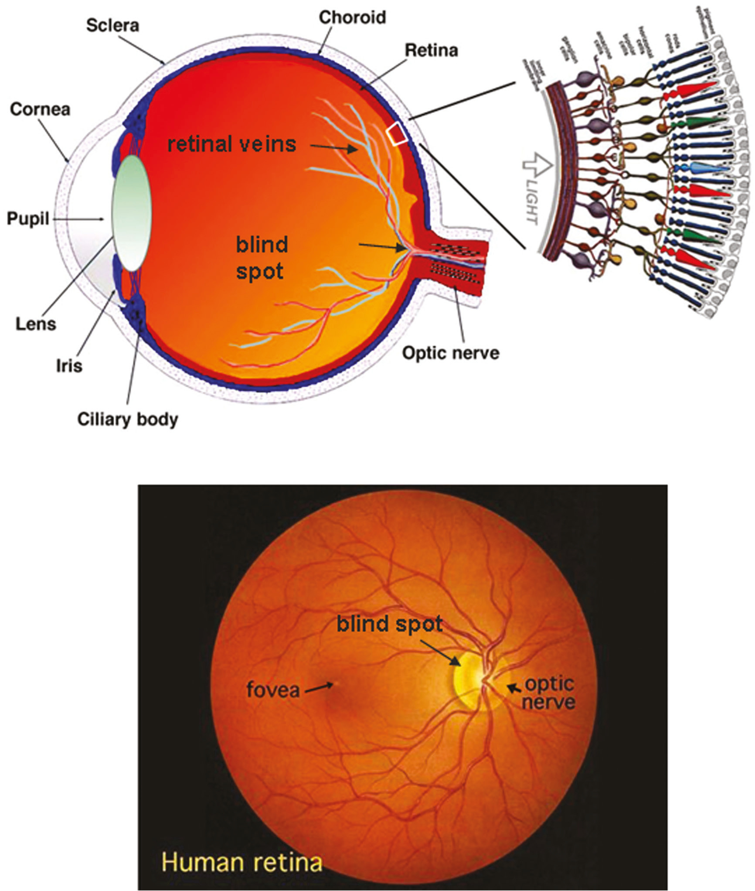

**눈의 구조:**

| 구조 | 기능 |
|------|------|
| **각막(Cornea)** | 빛을 굴절시켜 렌즈로 전달 |
| **수정체(Lens)** | 빛을 망막에 초점 맞춤 |
| **망막(Retina)** | 빛을 전기 신호로 변환 |
| **중심와(Fovea)** | 최고 해상도의 시각 처리 영역 (~1도 시야) |
| **맹점(Blind spot)** | 시신경이 모이는 곳, 광수용체 없음 |
| **시신경(Optic nerve)** | 처리된 신호를 뇌로 전달 |

**맹점의 특성:**
- 맹점은 **중심와만큼 크거나 더 큽니다**
- 그럼에도 대부분의 사람은 평생 맹점의 존재를 인식하지 못합니다
- 우리는 세상을 스캔할 때 떠돌아다니는 구멍을 보지 않습니다

### Figure 3.5: 망막 층의 역전 구조

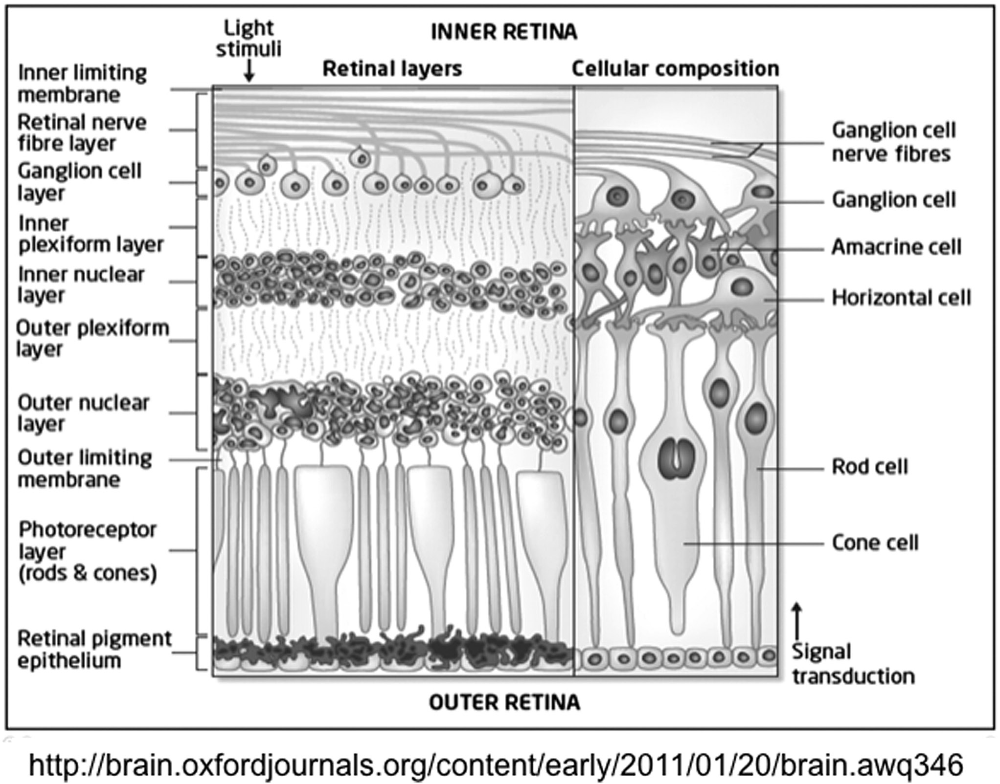

망막은 그 자체로 **복잡한 기관**입니다:

```
빛의 경로 (위에서 아래로):
─────────────────────────────
내부 제한막
↓
신경절 세포층 (Ganglion cells)
↓
내부 망상층 (Inner plexiform layer)
↓
내부 핵층 (Inner nuclear layer) — 무축삭 세포, 수평 세포
↓
외부 망상층 (Outer plexiform layer)
↓
외부 핵층 (Outer nuclear layer)
↓
광수용체층 (Photoreceptor layer) — 간상세포(rods), 원추세포(cones)
↓
망막 색소 상피 (Retinal pigment epithelium)
─────────────────────────────
```

**역전(Inversion) 구조의 문제:**
- 빛은 **모든 망막 층을 통과**해야 비로소 광수용체에 도달합니다
- 이 층들은 빛을 흡수하고 산란시킵니다
- Richard Feynman도 이 사실에 당혹해했으며, 뇌가 이렇게 소음이 많은 망막으로 어떻게 잘 보는지 직관적으로 설명할 수 없다고 느꼈습니다

### 망막의 노이즈 문제

| 노이즈 원인 | 설명 |
|------------|------|
| **맹점** | 시신경이 모이는 곳에 광수용체 없음 |
| **망막 정맥** | 빛의 경로에 놓인 혈관들이 빛을 차단 |
| **역전 구조** | 빛이 여러 세포층을 통과하며 산란/흡수됨 |

> **설계 원리 — 불확실성의 계층적 해소(Hierarchical Resolution of Uncertainty):** 물리적·발달적 제약에 의해 한 단계(망막)에서 발생하는 이미지 처리 결핍은, 더 높은 단계의 뇌 조직에서 보상됩니다. 노이즈가 많고 빠르게 대사하는 살덩어리가 시각 형태의 플라톤적 세계를 낳을 수 있는 것은 이 원리 덕분입니다.

---

## 5. 흔들리는 눈과 가려진 물체 (Jiggling eyes and occluded objects)

### 안구 미세 진동 (Eye jiggle)과 안정화된 이미지

뇌는 어떻게 맹점과 망막 정맥을 "보지 않을" 수 있을까요? 그 핵심 요인 중 하나가 **안구 미세 진동(eye jiggle)** 입니다.

**안구 미세 진동의 원리:**
- 우리 눈이 고정된 물체를 응시할 때도, 눈은 궤도 내에서 빠르게 앞뒤로 **미세하게 진동**합니다
- 이 진동은 너무 작아서 의식적으로 인식되지 않습니다
- 이 진동은 "새로고침(refresh)" 작동처럼, 정지 시각 대상에 대한 시각 신경세포의 감도를 유지합니다
- 물체와 망막 사이에 작은 상대적 운동을 만들어, 시각 세포가 이 운동 **순간변화(transients)** 에 반응하게 합니다

**안정화된 이미지(Stabilized images):**
- 진동하는 망막에 대해 상대적으로 움직이지 않는 이미지는 **안정화되었다(stabilized)** 고 합니다
- 안정화된 이미지의 지각은 **사라집니다** — 잠시 후 보이지 않게 됩니다
- 망막 정맥과 맹점은 망막에 **부착**되어 있으므로 자연적으로 안정화되어 있습니다
- 따라서 보통의 시각 조건에서 보이지 않습니다!

### T. Rex와 움직임 감지

영화 *Jurassic Park*에서 인간이 티라노사우루스 앞에서 멈추라는 지시를 받는 장면을 기억하실 것입니다:

- T. Rex는 아마도 정지한 물체를 볼 수 없었을 것입니다
- 이 요청은 눈이 움직이지 않으면 이미지가 안정화되어 사라진다는 원리에 기반합니다
- 그러나 T. Rex를 멈추지 못했고, 눈에 대한 **상대적** 운동이 시각적으로 민감한 세포를 자극했을 것입니다

### 단순한 이미지의 불연속적 조각화

안구 미세 진동이 망막 정맥과 맹점을 할인하는 데 도움이 되지만, 우리가 매일 당연히 여기는 **연속적 물체의 세계**를 보기 위해서는 더 많은 것이 필요합니다.

예를 들어, 두꺼운 직선 에지 하나가 맹점과 망막 정맥을 포함하는 영역에 걸쳐 있다고 상상해 봅시다:

```
원래 이미지:  ████████████████████████
                    (연속적 에지)

망막에 등록된 이미지:
              ████   ███   ████  ███
              (맹점/정맥에 의해 불연속적 조각)
```

> **핵심 질문**: 뇌는 어떻게 이 불연속적 조각들을 **연속적 에지**의 지각으로 변환하는가? 이 질문의 답이 바로 **경계 완성(boundary completion)** 과 **표면 채움(surface filling-in)** 입니다.

---

## 6. 착시는 현실을 표현할 수 있다 (How illusions may represent reality)

### Figure 3.6: 모든 직선은 착시

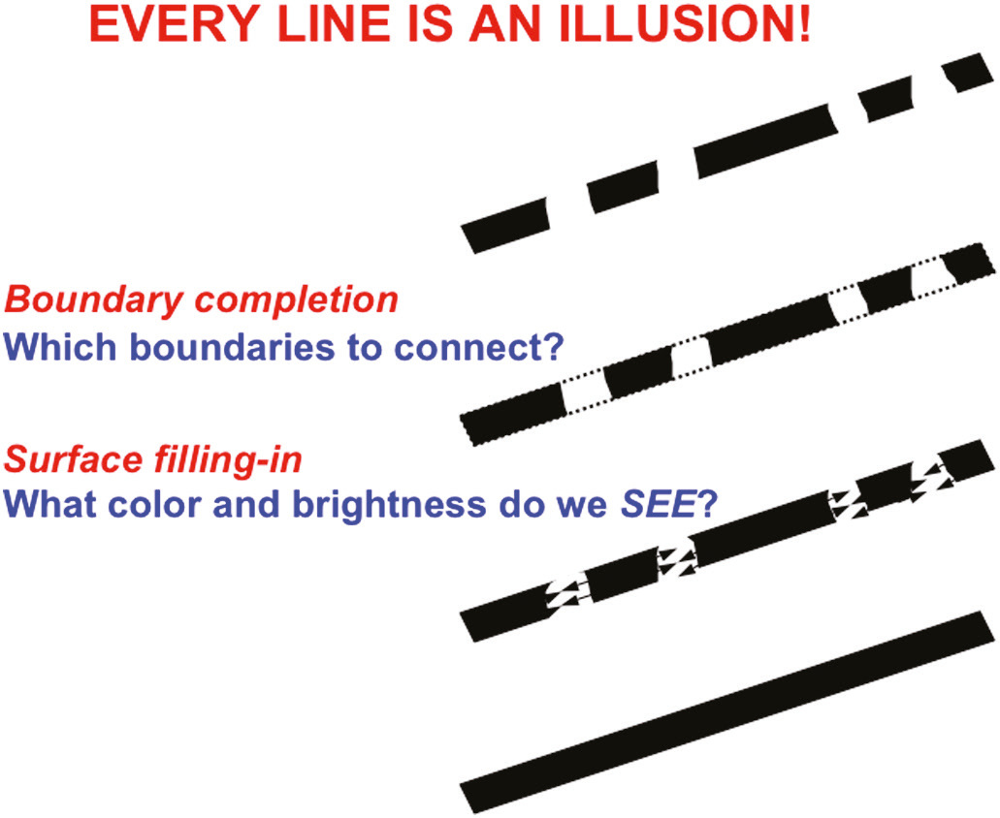

Figure 3.6은 뇌가 불연속적 에지 조각들을 어떻게 완전한 에지로 변환하는지 보여줍니다:

**경계 완성 (Boundary Completion):**
- 뇌에는 콜리니어(collinear) 또는 거의 콜리니어한 **쌍(pair)** 이상의 대비 사이에서 **안쪽으로(inwardly)** 경계를 형성할 수 있는 세포가 있습니다
- 자체 입력이 없는 영역에서도, 양쪽에 콜리니어한 유도자가 있으면 경계가 형성될 수 있습니다
- 이로써 가려진 모든 경계가 완성될 수 있습니다

**경계가 왜 쌍에서만 안쪽으로 형성되는가:**
- 만약 단일 유도자에서 **바깥쪽으로(outwardly)** 경계가 형성된다면?
- 그러면 이미지의 모든 대비 점이 경계의 확장하는 그물을 유도하여 시야를 가득 채울 것입니다
- 이는 세상의 물체를 정확히 표현하기보다 우리를 미치게 만들 것입니다

**표면 채움 (Surface Filling-in):**
- Figure 3.6 세 번째 이미지: 에지의 가려지지 않은 부분의 밝기와 색상이 **바깥쪽으로 흘러나와(flow outward)** 가려진 부분으로 확산됩니다
- 안정화된 맹점과 정맥이 사라진 후, 밝기와 색상이 확산되어 가려진 위치의 에지 지각을 복원합니다
- 이 밝기와 색상의 흐름은 원천에서 확산되는 유체와 비슷하게 작동하며, 이를 **표면 채움(surface filling-in)** 이라 부릅니다

> **놀라운 함의: "모든 직선은 착시이다(Every line percept is an illusion)."** 맹점과 망막 정맥에 의해 가려진 부분은 뇌가 적극적으로 구성한 것이며, 가려지지 않은 "실제" 부분과 구별할 수 없습니다. 따라서 단순한 직선의 지각조차도 "실제" 부분과 "착시" 부분의 연속입니다.

---

## 7. 경계 완성과 표면 채움의 상보적 특성

### Figure 3.7: Boundary Completion vs. Surface Filling-in


경계 완성과 표면 채움은 **계산적으로 상보적(computationally complementary)** 입니다:

| 속성 | 경계 완성 (Boundary Completion) | 표면 채움 (Surface Filling-in) |
|------|------|------|
| **방향** | 안쪽으로(Inward) | 바깥쪽으로(Outward) |
| **방위** | 방위 지향적(Oriented) | 비방위적(Unoriented) |
| **대비 극성** | 무감각(Insensitive) | 민감(Sensitive) |

**왜 상보적이어야 하는가:**
- 표면 채움이 전체 표면을 커버하려면 **비방위적(unoriented)** 이어야 합니다
- 반면, 비방위적 밝기/색상의 흐름은 **방위 지향적(oriented)** 경계에 의해서만 효율적으로 담길 수 있습니다
- 경계가 표면 채움에 대한 **댐(dam)** 역할을 합니다
- 열쇠와 자물쇠처럼, **음과 양**처럼 서로 꼭 맞습니다

### Figures 3.8, 3.9: Kanizsa 사각형의 시뮬레이션

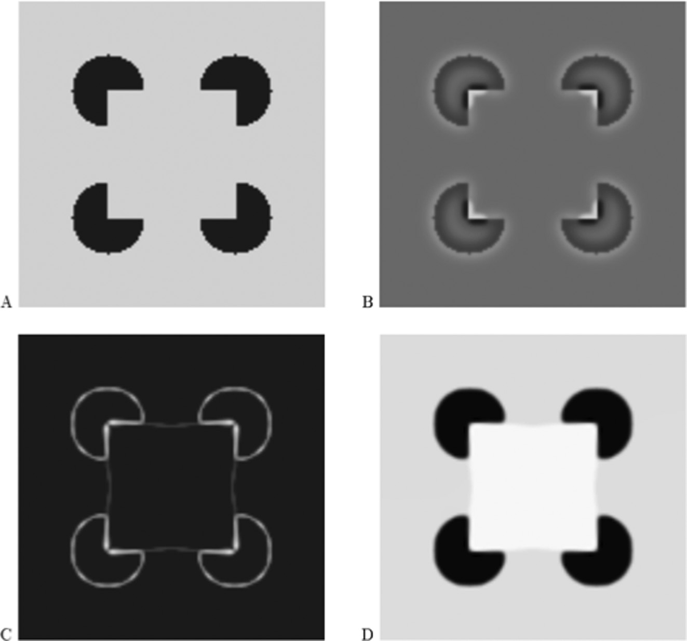

**Figure 3.8 — 표준 Kanizsa 사각형 시뮬레이션:**
- (A) 입력 이미지: 네 개의 팩맨
- (B) 팩맨 경계 바로 안쪽에 유도되는 **특징 윤곽(feature contours)**
- (C) 특징 윤곽이 사각형 경계 안에서 채워져(fill in) 사각형 전체에 걸쳐 **향상된 밝기** 지각을 생성
- (D) 우리가 실제로 보는 것과 일치하는 시뮬레이션 결과

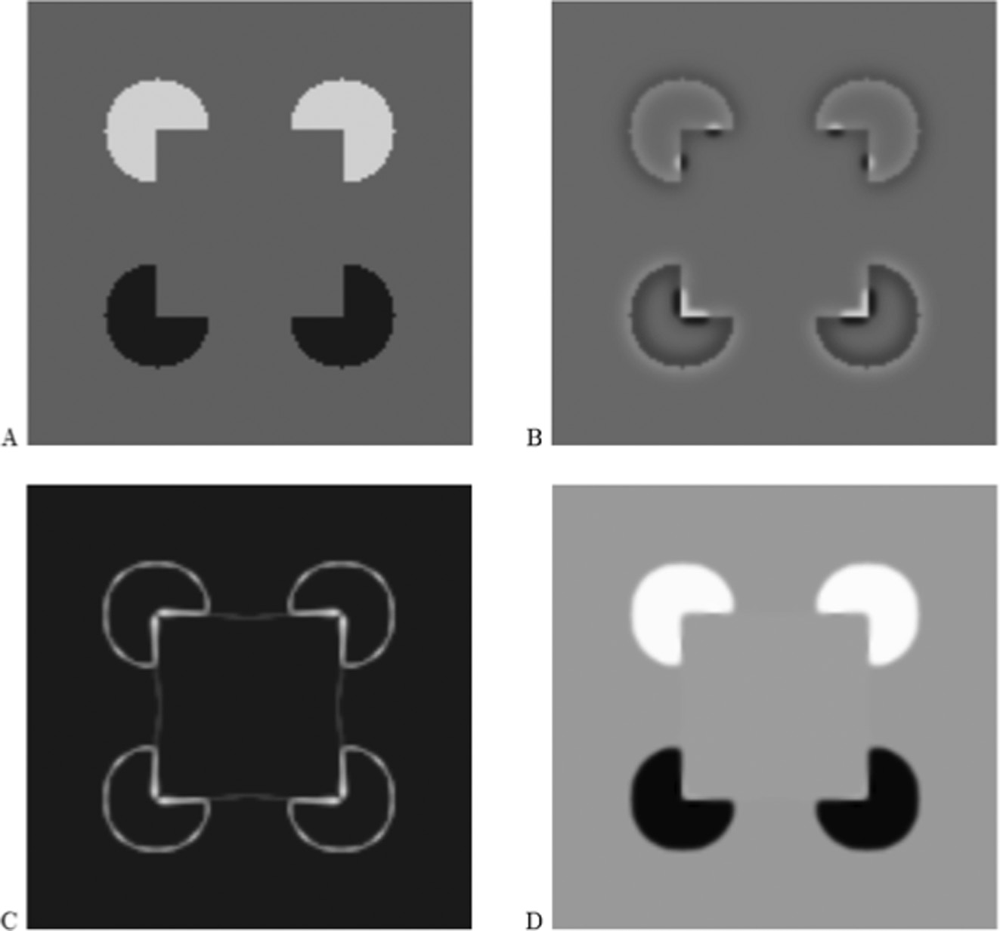

**Figure 3.9 — 역대비 Kanizsa 사각형 시뮬레이션:**
- (A) 입력 이미지: 흰색과 검은 팩맨
- (B) 아래쪽 검은 팩맨 경계 안에는 밝은 특징 윤곽, 위쪽 흰 팩맨 경계 안에는 어두운 특징 윤곽이 유도됨
- (C) 이 밝고 어두운 특징 윤곽이 대략 균형을 이루어, 사각형 내부의 채워진 표면 색상이 사각형 외부와 구별 불가능
- (D) 사각형은 경계 표상을 통해 **인식(recognized)** 되지만, **보이지(seen)** 않음

### 시각적 착시의 정의

> **시각적 착시(Visual Illusion)의 정의**: 경계와 표면의 조합이 익숙하지 않게 보이는 지각입니다.

예시:
- 오프셋 격자의 수직 경계: 밝기나 색상 없는 경계 → 익숙하지 않음 → 착시
- 맹점 위의 에지 부분: 직접적 망막 입력 없지만 보임 → 익숙함 → "실제" 지각
- 두 경우 모두 경계와 표면의 조합이지만, **익숙함의 정도**에 따라 "실제"와 "착시"로 구분됩니다

---

## 8. 네온색 확산 (Neon Color Spreading)

### Figures 3.10, 3.11: 네온색 확산의 시각적 착시


**네온색 확산(Neon color spreading)** 은 색상 채움(color filling-in)의 유명한 예입니다.

**Figure 3.10의 구조:**
- 오른쪽 패널: 원형 고리(circular annuli)들이 부분적으로 검은색, 부분적으로 파란색입니다
- 왼쪽 패널과 같은 검은 호만 있으면 네온색 확산이 없습니다
- 오른쪽 패널을 볼 때: 생생하고 환상적인 **파란색 사각형**이 채워져 보이지만, 이미지에서 파란색은 오직 파란 호에만 있습니다

### 네온색 확산의 세 가지 핵심 속성

이 착시는 색상 채움의 세 가지 핵심 속성을 잘 보여줍니다:

| 속성 | 설명 |
|------|------|
| **비방위적(Unoriented)** | 색상이 모든 방향으로 확산됨 |
| **바깥쪽으로(Outward)** | 색상이 원천에서 바깥으로 퍼짐 |
| **대비 극성 민감(Sensitive to contrast polarity)** | 색상의 효과를 볼 수 있음 — 밝기/색상 차이가 보임 |

### End Gaps와 색 확산 메커니즘


**End gaps 메커니즘:**
- 검은 호와 파란 호가 모두 경계를 형성합니다
- 경계가 합류하는 위치에서, 검은 호에 의한 경계가 파란 호에 의한 경계에 작은 틈을 만듭니다
- 이 틈을 **끝 간격(end gaps)** 이라 합니다
- 파란 호 안의 색상이 이 끝 간격을 통해 착시적 사각형으로 확산될 수 있습니다
- 색상은 **비방위적으로** 모든 끝 간격에서 바깥쪽으로 퍼지며, 착시적 사각형 경계에 도달하면 더 이상 퍼지지 않습니다

---

## 9. 경계와 표면의 상보적 계산

### 상보적 처리 스트림

1장에서 논의된 바와 같이, 뇌는 종종 **계산적으로 상보적인 속성**을 보이는 병렬 처리 스트림으로 조직되어 있습니다. 시각적 경계 완성과 표면 채움은 이러한 상보적 속성을 가진 과정의 탁월한 예입니다.

**Figure 3.7의 요약:**
- 경계는 **안쪽으로, 방위 지향적으로, 대비 극성에 무감각하게** 완성됩니다
- 표면은 **바깥쪽으로, 비방위적으로, 대비 극성에 민감하게** 채워집니다
- 이 속성들은 명백히 상보적입니다: 안쪽 vs. 바깥쪽, 방위 vs. 비방위, 무감각 vs. 민감
- 열쇠와 자물쇠처럼, 음과 양처럼 서로 맞물립니다

### 상보적 일관성 (Complementary Consistency)

경계와 표면 시스템의 상보적 속성을 우리가 통합된 시각적 지각으로 경험하는 의식적 지각의 **일관성(consistency)** 과 조화시키는 것이 시각 시스템의 과제입니다.

> **상보적 일관성(Complementary Consistency)**: 경계와 표면 속성의 **상보성(complementarity)** 을 의식적 지각의 **일관성(consistency)** 과 조화시키는 것입니다.

**경계가 표면 채움의 장벽 역할:**
- 경계가 표면 채움을 위한 장벽으로 작용하는 능력은, 경계와 표면 시스템 간의 상호작용이 어느 하나만으로는 달성할 수 없는 더 나은 결과를 이끌어내는 중요한 예입니다
- 두 과정 모두 서로의 상보적 결핍을 극복하기 위해 상호작용해야 합니다

### 시각 피질의 상보적 처리 스트림

Figure 1.21에서 보여진 바와 같이, 시각 신호는 LGN에서 V1으로, 그리고 병렬 처리 스트림으로 분기합니다:

| 스트림 | 경로 | 기능 |
|--------|------|------|
| **Blob → Thin stripe** | LGN → blob → thin stripe → V4 | **표면(surface)** 표상 생성 |
| **Interblob → Interstripe** | LGN → interblob → interstripe → V4 | **경계(boundary)** 표상 생성 |

### 다중 스케일 대칭 깨짐 (Multiple-Scale Symmetry Breaking)

이 상보적 스트림들은 어떻게 발생하는가? Grossberg는 뇌 발달 과정에서 **대칭 깨짐(symmetry-breaking)** 에 의해 발생한다고 예측합니다:

- 초기의 공유된 세포 집합이 발달적 특수화가 진행되면서 상보적 스트림으로 **분기(bifurcate)** 합니다
- 이 개념은 물리학과 생물학의 많은 분야에서 광범위한 현상인 대칭 깨짐의 한 사례입니다
- 뇌에서는 **다중 공간 스케일에서의 대칭 깨짐 연쇄(cascade)** 가 있습니다:
  - **스트림 간(inter-stream)** 상보성: WHAT 스트림 vs. WHERE 스트림
  - **스트림 내(intra-stream)** 상보성: blob vs. interblob (WHAT 스트림 내)
  - MT vs. MT+ (WHERE 스트림 내에서의 물체 추적 vs. 광학 흐름 탐색)

---

## 10. 특수 모듈인가 범용 모달 시스템인가?

### 독립 모듈 vs. 범용 시스템

고전적 시각 모델은 서로 다른 시각 과정이 각자의 전문 작업을 수행하는 **독립 모듈(independent modules)** 로 표현된다는 견해를 지지해 왔습니다. 그러나 이 접근에는 여러 문제가 있습니다.

### Figure 3.12: 아인슈타인 사진 (에지, 텍스처, 음영)

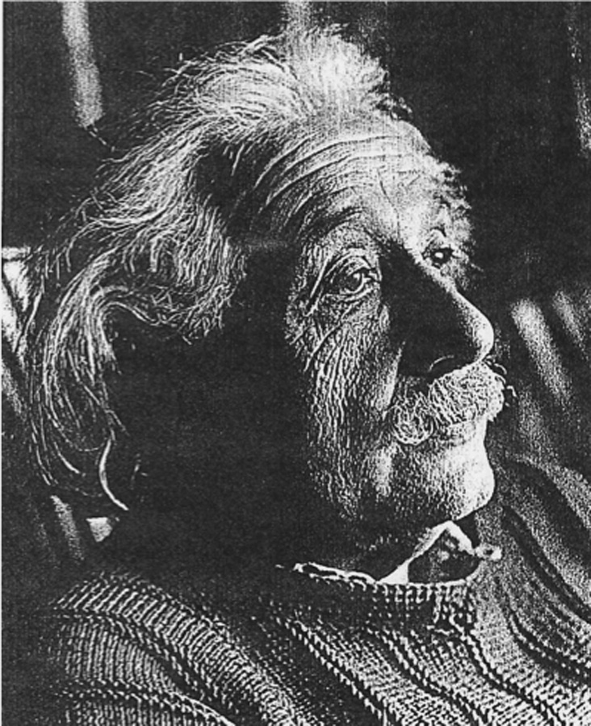

**독립 모듈의 문제점:**

1. **혼합된 특징**: 많은 자연 장면은 같은 위치에 에지, 텍스처, 음영 등 여러 장면 특성을 포함합니다
   - 아인슈타인의 유명한 사진에서 많은 에지가 텍스처와 음영 그래디언트의 일부입니다
2. **변하는 조명**: 장면의 조명이 시간, 위치, 관찰자의 시점에 따라 변할 수 있습니다
3. **스마트한 전처리기 필요**: 모듈을 사용하려면, 어떤 모듈을 사용할지 결정하는 "스마트한" 전처리기가 필요한데, 이 전처리기가 충분히 스마트하다면 왜 모듈이 필요한가?

### 아키텍처가 곧 알고리즘 (The architecture is the algorithm)

Grossberg는 뇌가 독립 모듈 대신 **범용 모달 시스템(general-purpose modal systems)** 을 사용한다고 제안합니다:

- 경계는 물체의 에지뿐 아니라, 에지·텍스처·음영·깊이 정보의 **형태에 민감한(form-sensitive) 조합**을 표현합니다
- 표면은 밝기·색상·깊이·형태·전경-배경 정보의 조합을 표현합니다
- 이러한 **다중 유형의 정보를 표현할 수 있는** 계산 단위를 가진 과정을 **멀티플렉스(multiplex)** 한다고 합니다

> **"아키텍처가 곧 알고리즘이다(The architecture is the algorithm)":** 주어진 모달 문제를 해결할 수 있는 창발적 속성은, 그 뇌 시스템의 해부학적 구조와 신경생물학이 발달과 학습을 통해 어떻게 특수화되었는지에 달려 있습니다.

**멀티플렉싱(Multiplexing)의 예:**
- 아인슈타인의 사진을 작은 구멍을 통해 보면, 에지·텍스처·음영의 뒤죽박죽만 보이며 아무 의미가 없습니다
- 그러나 **공간적 맥락(spatial context)** — 많은 세포에 걸친 정보의 **패턴화(patterning)** — 가 그 의미를 결정합니다
- Figure 3.7의 경계와 표면의 상보적 속성은 멀티플렉싱의 한 유형을 보여줍니다

---

## 11. 새로운 기하학: 공간과 방위에 걸친 협력과 경쟁

경계 완성과 표면 채움의 개념은 고전 기하학과의 근본적인 단절을 나타냅니다.

### 고전 기하학 vs. 지각적 기하학

| 고전 기하학 | 지각적 기하학 |
|-----------|-------------|
| 선(line)은 독립적 점들의 집합 | 경계(boundary)는 많은 세포 간 상호작용에서 발생하는 **창발적 속성** |
| 점은 독립적으로 선택 가능 | 경계는 **일관된 구조(coherent structure)** |
| 표면은 법선과 표면 요소로 정의 | 표면은 **다중 스케일 경계 웹 내의 채움** 으로 정의 |

### Figure 3.13: Ehrenstein 원

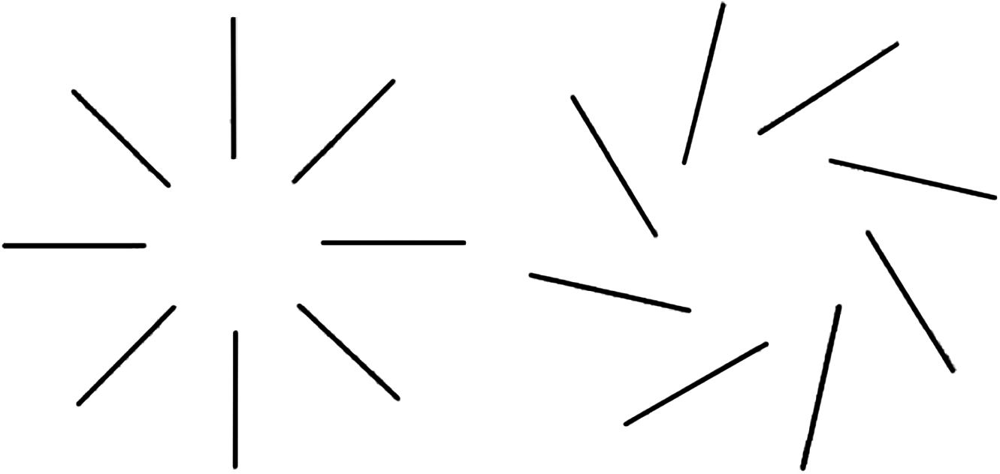

- 왼쪽 이미지: 밝은 원반을 둘러싸는 생생한 Ehrenstein 원을 정의하는 선들
- 선의 끝점 위치를 변경하지 않고 선의 **방위만 기울이면**, 원과 원반의 지각이 크게 약화됩니다
- Ehrenstein 원이 선의 끝점을 지나는 일련의 점에 불과하다면, 아무것도 변하지 않았을 것입니다
- 이는 경계가 점의 집합이 아니라, **협력과 경쟁**을 통한 창발적 구조임을 보여줍니다

**Kanizsa 사각형(Figure 3.3)과 Ehrenstein 원(Figure 3.13)이 함께 보여주는 것:**

경계 형성에서 협력과 경쟁이 **공간(space)** 과 **방위(orientation)** 에 걸쳐 작용합니다:
- 선의 끝에 **수직(perpendicular)** 이거나 거의 수직인 방위가 경계 형성에 가장 효과적
- 선의 끝에 **평행(parallel)** 한 에지는 팩맨과 협력하여 경계를 유도
- 수직인 선이 착시 윤곽과 교차하면 **방위적 경쟁(orientational competition)** 에 의해 경계가 억제됨

### Figure 3.14: 수직 유도와 경계 완성

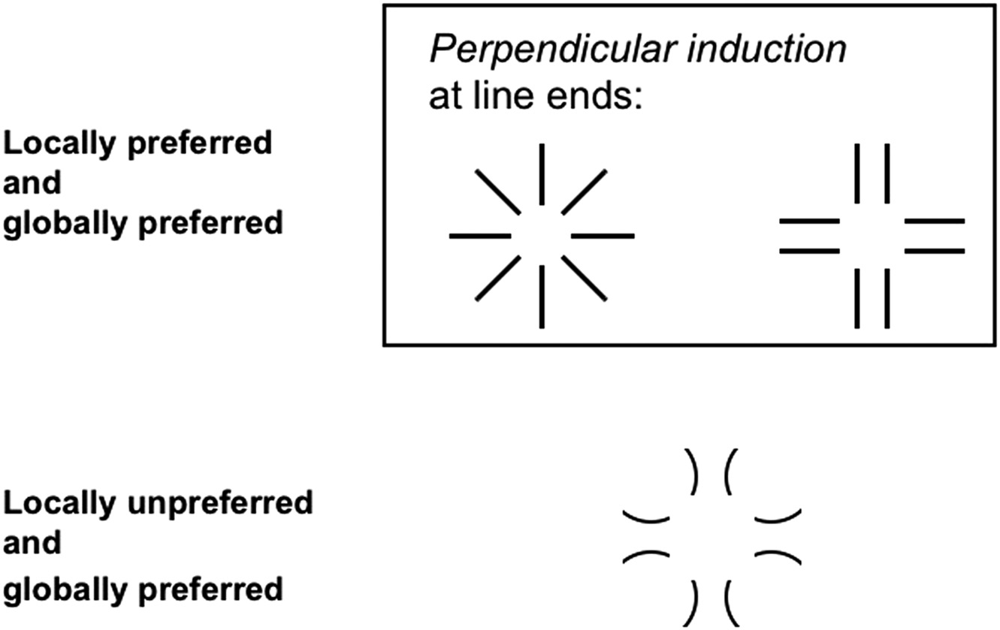

**Figure 3.14 상단:**
- 국소적으로 선호되고(locally preferred) **전역적으로도 선호되는(globally preferred)** 방위: 선의 끝에 수직인 방위가 원형 또는 사각형 경계를 유도
- 사각형 경계에서는 방위가 가장 가까운 유도자의 방위에 맞추기 위해 급격하게 변화

**Figure 3.14 하단:**
- 국소적으로 비선호이지만(locally unpreferred) **전역적으로 선호되는** 방위: 선의 끝에 수직이 아닌 방위가 전역적으로 선호되는 경계 형태를 형성하기 위해 선택됨

### Figure 3.15: 퍼지에서 선명한 그루핑

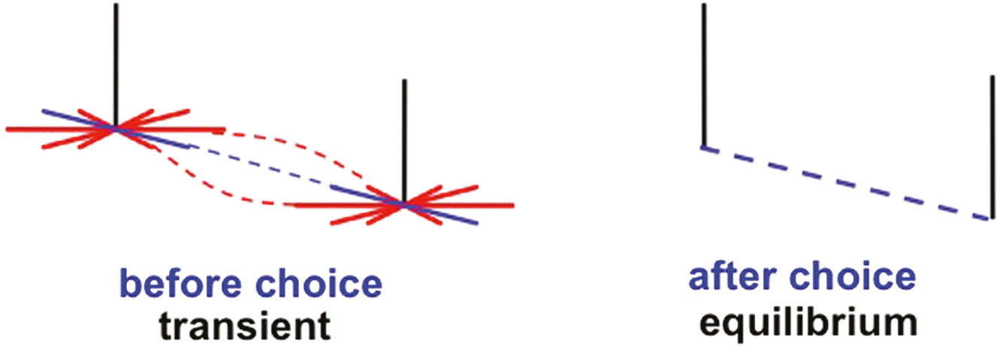

**불확실성의 계층적 해소 (Hierarchical Resolution of Uncertainty):**

경계 그루핑이 처음 시작될 때:
- 각 선의 끝에서 여러 가능한 방위가 그루핑에 참여할 수 있습니다
- 이로 인해 처음에는 **퍼지한(fuzzy) 가능한 그루핑의 웹**이 형성됩니다 (Figure 3.15, 왼쪽)
- 이 퍼지함은 피질 발달 중 거의 콜리니어하고 정렬된 시각 자극에 의한 수용장(receptive field) 경험의 구현으로 이해할 수 있습니다

**그러나 대부분의 의식적 그루핑은 공간적으로 선명합니다:**
- 경계 시스템 내의 **피드백(feedback)** 이 모든 유도자의 위치적·방위적 증거와 최대로 일관된 최종 그루핑을 빠르게 선택합니다
- 이 피드백은 **협력과 경쟁의 조합**을 사용합니다
- 가장 강한 그루핑이 선택되고, 덜 지지받는 경계는 억제됩니다
- 이 피드백 과정은 **불확실성의 계층적 해소**의 또 다른 예입니다

---

## 12. 음영, 텍스처, 위장 그루핑과 3D 지각

### 보이지 않는 경계 그루핑에 의한 인식 촉진

시각적 착시가 시각 뇌의 작동 방식을 이해하는 데 어떻게 도움이 되는지 더 잘 이해할 수 있습니다:

1. 착시는 그 **낯선 모습(unfamiliarity)** 으로 우리의 주의를 끌어, 평소에는 당연히 여기는 지각 과정에 주목하게 합니다
2. 많은 착시는 맹점과 망막 정맥에 의한 가림으로 인해 물체 에지의 지각이 착시적일 수 있다는 사실로 보여주듯, **생존에 중요**합니다
3. 눈에 보이는 텍스처 이미지의 달마시안 개(Dalmatian in snow)와 같은 경우, 경계 그루핑이 위장을 뚫고 인식을 도울 수 있습니다

### Figure 3.16: T와 L의 방위 기반 그루핑

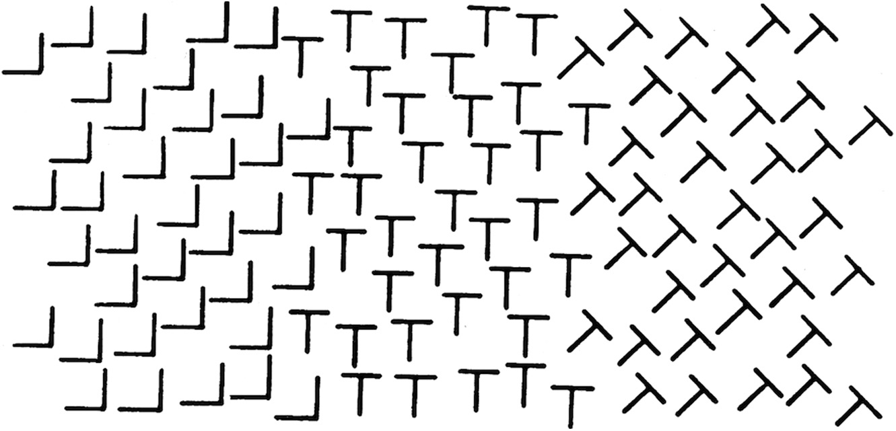

Jacob Beck (1966)의 유명한 이미지:
- 수직 T와 대각선 T가 인접해 있지만, 수직 T는 수직 L과 함께 그루핑됩니다
- 이유: 수직 T와 L 모두 **수직 및 수평 선**을 가지고 있어, 보이지 않는 수직/수평 창발적 경계가 이들을 연결할 수 있습니다
- 대각선 T는 대각선 방위를 가지므로 수직 T/L과 연결되지 않습니다
- 경계 그루핑은 이미지 대비의 **상대적 방위(relative orientations)** 에 민감합니다

### Figure 3.17: 사각형 배열의 대각선 그루핑

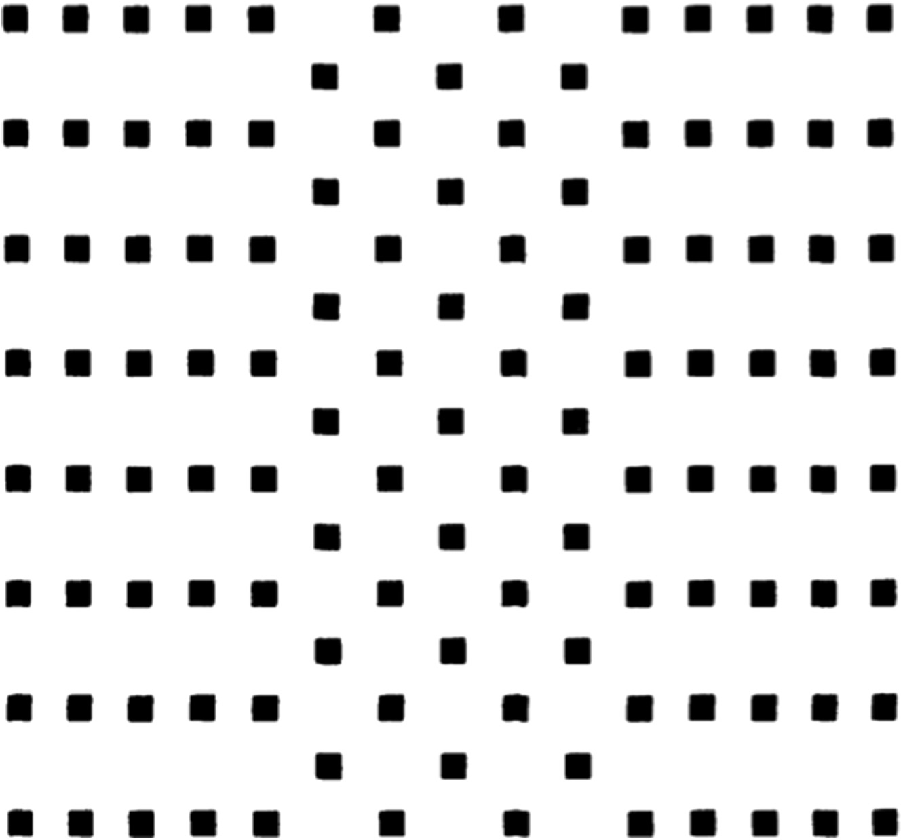

Beck, Sutter, Ivry (1987)의 텍스처:
- 흰 배경 위의 검은 사각형 전체가 **삼분(tripartite)** 텍스처를 형성
- 왼쪽과 오른쪽 영역의 사각형은 수평 방향으로 더 가깝게 위치
- 뇌는 사각형 상단/하단의 콜리니어한 경계를 연결하여 **수평 경계**를 형성, 사각형을 줄로 그루핑
- 중앙 영역에서는 대각선 방향의 사각형이 없음에도 **창발적 대각선 경계**가 지각됨
- 사각형 유도자들의 **전역적 공간 배열(global spatial arrangement)** 이 어떤 그루핑이 이길지 결정합니다

### Figures 3.18, 3.19: 경계 그루핑 시뮬레이션

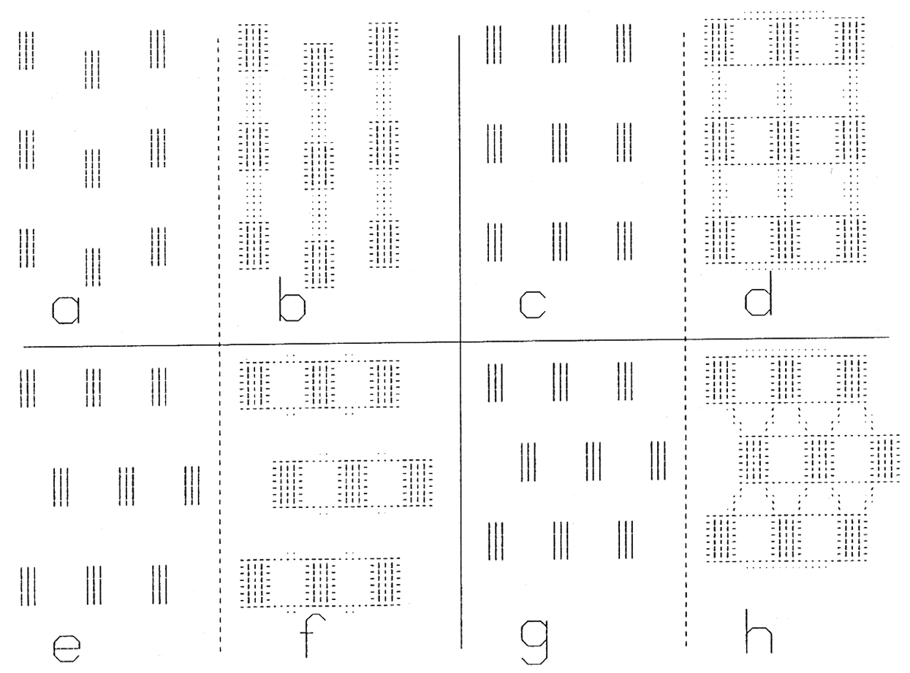

Grossberg와 Mingolla (1987)의 컴퓨터 시뮬레이션:
- (a), (c), (e), (g): 각각 3열 3행의 세 개 물체로 구성된 네 가지 입력 이미지, 각 물체는 6개의 짧은 수직 선분
- 공간적 배열만 다른데도, 놀랍도록 다른 지각이 생성됩니다:
  - (b): 수직 경계 그루핑
  - (d): 수평 경계 그루핑
  - (f): 수평 경계 그루핑
  - (h): 대각선 경계 그루핑

> 모든 유도자가 수직 방위만 가지고 있음에도, **전역적 배열**에 따라 수직/수평/대각선 경계가 창발합니다!

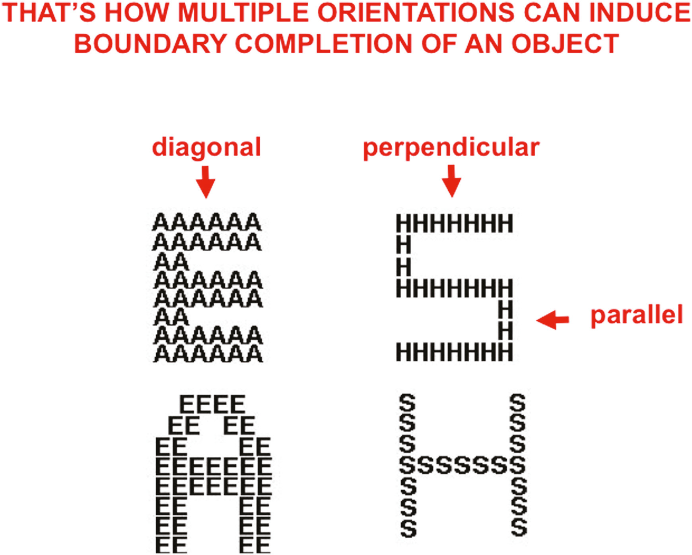

**Figure 3.19 — "숲은 나무보다 먼저 지각된다" (Forest before trees):**
- 구성 문자 A의 수평·수직 방위만 있지만, 전역적 문자 E의 윤곽에는 대각선 그루핑이 나타남
- 다양한 방위의 협력이 물체의 경계 완성을 유도할 수 있음을 생생하게 보여줍니다
- David Navon (1977)이 특히 강조한 전역적 "숲이 나무보다 먼저" 구조화

### Figure 3.20: Sean Williams 타이포그래피 초상화

이러한 그루핑 속성은 많은 예술가에게도 영감을 주었습니다. Figure 3.20은 예술가 Sean Williams의 **타이포그래피 초상화(Typography Portrait)** 를 보여줍니다:
- 다양한 방위의 문자들로 구성되어 있으며, 얼굴의 생생한 전역적 그루핑을 생성합니다
- 동시에 여러 내장된 문구도 철자로 나타냅니다

### Figures 3.21(a-d): 다양한 이미지에서의 경계 그루핑

**Figure 3.21a:** 다양한 방위의 짧은 선분 텍스처
- 거의 콜리니어한 선분이 아모달 경계에 의해 그루핑되어, 전체 창발적 경계가 빠른 인식을 위해 "pop out" 할 수 있습니다

**Figure 3.21b:** 얼룩말(zebra)의 전경-배경 분리
- 창발적 경계가 배경에서 얼룩말의 형태를 분리합니다
- Figures 3.18과 3.19에서처럼, 이 창발적 경계는 유도 대비에 수직인 위치도 있고 대각선인 위치도 있습니다
- 얼룩말과 배경이 같은 그림 평면에 있는데도, 얼룩말이 배경 앞에 있는 것처럼 보입니다 — 이는 **T-접합(T-junctions)** 때문입니다

**Figure 3.21c:** 2D 이미지에서 3D 지각이 발생하는 생생한 예
- 모든 영화와 회화 예술은 이 기본 사실을 활용합니다

---
# 후반부 (pp. 104-121)

---

## 13. 3D 곡면 형태와 다중 스케일 경계 웹

### Sean Williams의 타이포그래피 초상화와 3D 표면

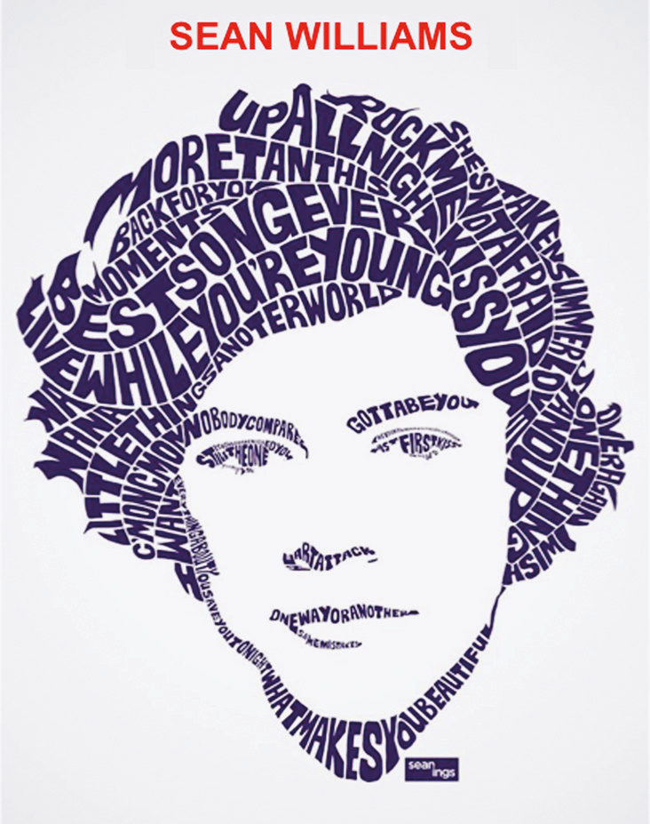

Sean Williams의 타이포그래피 초상화(Figure 3.20)는 공간적으로 분리된 검정 형태들로부터 구성됩니다. 이 이미지는 Figure 1.2의 눈 속 달마시안과 마찬가지로 분리된 형태들로 만들어졌지만, 이산적 형태들의 크기, 방향, 공간 배열이 다르기 때문에 **연속적으로 곡면화된 3D 표면**의 지각이 생성됩니다.

### 다중 스케일 경계 웹의 형성

이미지의 경계 윤곽선 근처에서는 형태들의 공간적 스케일이 더 작아집니다. 이러한 원근법적 효과는 **서로 다른 크기(스케일)의 경계 세포들**이 이미지의 각 부분에 반응하여 창발적 경계 그루핑을 형성할 수 있게 합니다.

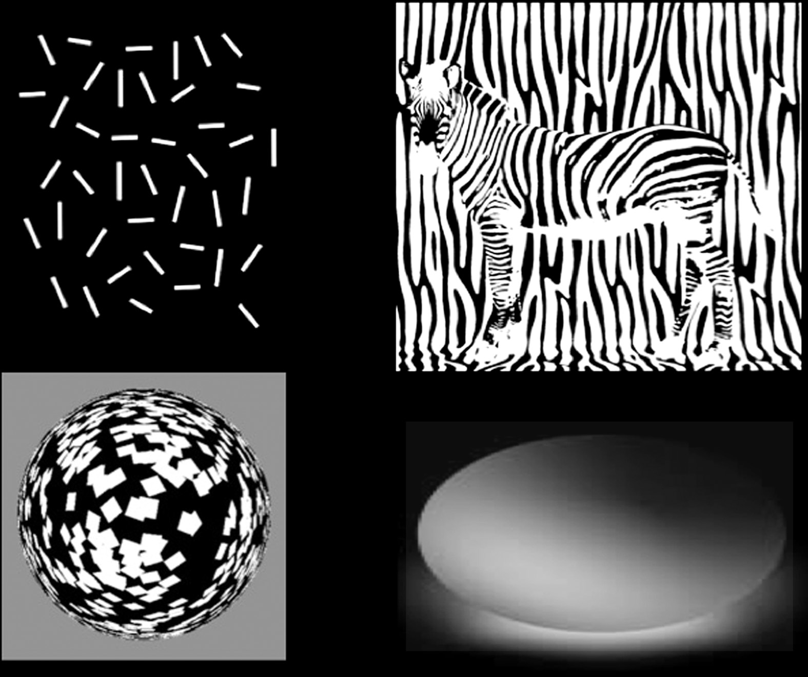

Figure 3.21은 창발적 경계가 형성되는 네 가지 핵심 사례를 보여줍니다:

| 패널 | 입력 유형 | 설명 |
|------|----------|------|
| **(a)** | 선(lines) | 선분들의 배열에서 경계 그루핑이 형성됨 |
| **(b)** | 텍스처(texture) | 얼룩말 이미지처럼 텍스처 패턴에서 경계가 자기 조직화 |
| **(c)** | 음영(shading) | 텍스처된 원형 디스크에서 경계 웹이 형성 |
| **(d)** | 음영 타원체 | 2D 이미지로부터 3D 타원체의 지각이 생성됨 |

> **핵심 포인트**: 네 가지 경우 모두에서 경계는 **비가시적(invisible)**이지만, 자신의 형태 민감(form-sensitive) 웹 내에서 표면 밝기와 색채의 채움(filling-in)을 지원함으로써 간접적으로만 드러납니다.

### 깊이 선택적 경계 웹과 FIDO

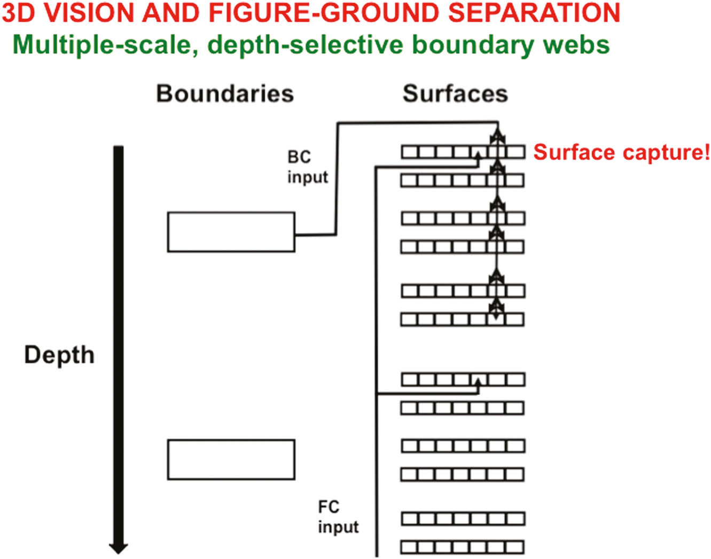

Figure 3.22는 3D 시각과 전경-배경 분리의 핵심 메커니즘을 보여줍니다:

```
3D 시각과 전경-배경 분리
다중 스케일, 깊이 선택적 경계 웹

      경계(Boundaries)          표면(Surfaces)
         │                        │
    BC ──┤                   ┌────┤ ← Surface capture!
   input │                   │    │
         ├── 깊이1 ──────────┤    │
         │                   │    │
         ├── 깊이2 ──────────┤    │
         │                   │    │
    FC ──┤                   │    │
   input └───────────────────┘    │
                                  │
                           FIDO (채움 도메인)
```

**경계 윤곽(Boundary Contour, BC)** 신호와 **특성 윤곽(Feature Contour, FC)** 신호는 서로 다른 역할을 합니다:

| 신호 유형 | 역할 | 특성 |
|----------|------|------|
| **BC (경계 윤곽)** | 표면의 밝기와 색채를 포착하는 경계 웹 형성 | 비가시적, 형태 민감 |
| **FC (특성 윤곽)** | FIDO 내에서 포착된 밝기/색채 신호 | 가시적, 색채/밝기 정보 전달 |
| **FIDO** | 채움 도메인(Filling-In Domain) | 깊이 선택적 표면 표상 생성 |

모든 깊이 선택적 채움 도메인에 걸친 총 채움 표면 표상이 연속적으로 곡면화된 3D 표면의 지각을 생성합니다.

### 음영 타원체에서의 3D 지각 (Figure 3.21d)

Figure 3.21d의 음영 타원체 사례는 특히 중요한 통찰을 제공합니다:

- 이 이미지에는 타원체를 둘러싸는 **단 하나의 경계선(edge)**만 존재
- 만약 경계가 단순한 에지라면, 타원체 내부의 회색 음영이 네온 색 퍼짐처럼 경계 밖으로 확산되어 **균일한 회색 2D 타원**의 지각을 생성해야 함
- 그러나 실제로 우리가 보는 것은 그것이 아님!

실제로 일어나는 것:
1. **다중 스케일 경계 세포들**이 형태 민감 경계 웹으로 그루핑됨
2. 텍스처 디스크와 마찬가지로, 가장 작은 세포들이 경계 윤곽 근처에서 우선적으로 그루핑
3. 모든 경계 웹이 각각의 **깊이 선택적 표면 채움 도메인**에 투사
4. 각 채움 도메인에 회색이 포획(trap)됨
5. 모든 채움 도메인에 걸친 총 표면 표상이 **3D 타원체의 지각**을 생성

> **"모든 경계는 비가시적이다"**: 우리가 보는 것은 경계 웹 자체가 아니라, FC 입력이 깊이 선택적 경계 웹 내에서 채워질 때 생기는 표면 밝기와 색채입니다.

---

### 인상파 회화와 경계 웹: 쇠라의 점묘법

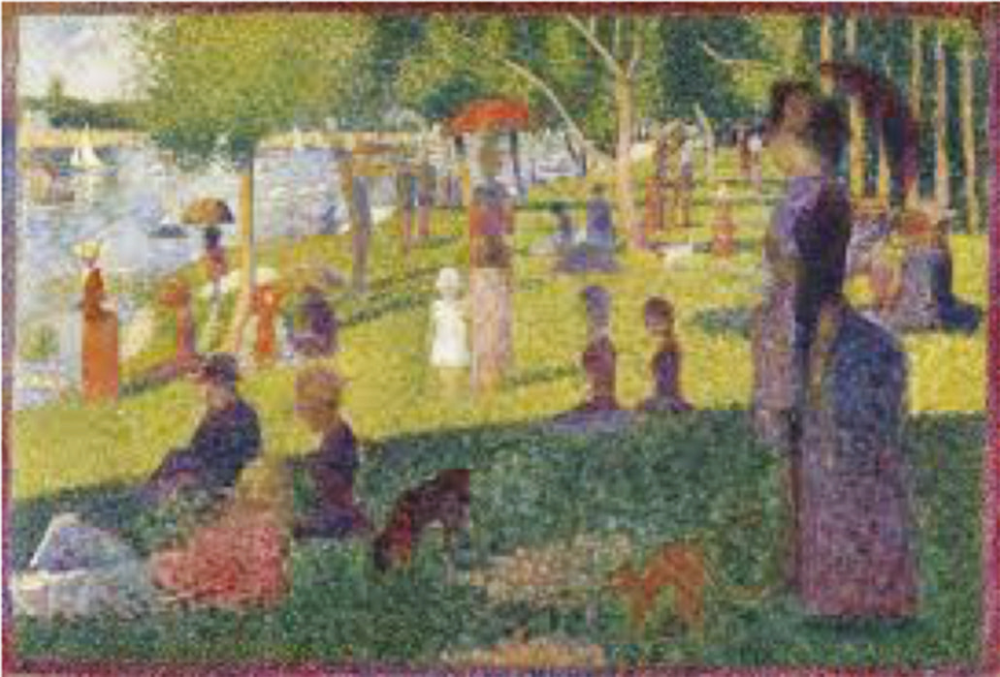

프랑스 인상파 화가들은 시각 지각의 이 속성을 활용하여 가장 아름다운 그림들을 창조했습니다. **점묘파(Pointillists)**인 Georges Seurat와 Paul Signac는 캔버스 위에 작은 색점("points")을 배열하는 데 능숙했습니다. 이 배열은 뇌에서 유도되는 그루핑과 채움 표면 영역이 세계의 대상으로 인식될 수 있도록 설계되었습니다.

Seurat의 유명한 그림 *그랑드 자트 섬의 일요일 오후(A Sunday on La Grande Jatte)* (Figure 3.23)가 이러한 숙달의 예입니다. 인상파 화가들은 직관적으로 다음을 이해했습니다:

- **"경계 위장을 깨뜨려(break camouflage)"** 미학적 목적으로 사용할 수 있음
- 붓질 내에 명시적으로 표현되지 않은 **창발적 형태를 유도**할 수 있음
- 밝기와 색채를 **맥락 민감적(context-sensitive)**으로 상호 영향하게 구성

### 점묘법에서 SAR까지

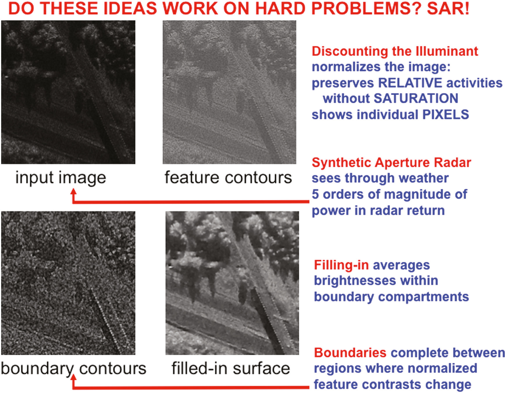

점묘화를 이해하는 데 도움이 되는 동일한 원리가 **합성 개구 레이더(Synthetic Aperture Radar, SAR)** 이미지의 효과적인 처리에도 활용될 수 있습니다. SAR 이미지의 픽셀들은 레이더 반사 전력의 크기에서 5자릿수(orders of magnitude) 차이가 날 수 있습니다.

1989년, Grossberg 연구팀은 MIT Lincoln Laboratories와 협력하여 SAR 이미지를 처리했습니다 (Mingolla, Ross, and Grossberg, 1999):

| 처리 단계 | 설명 |
|----------|------|
| **입력 이미지** | 뉴욕 주의 도로와 숲 지역 SAR 원본 |
| **특성 윤곽** | On-center off-surround 네트워크가 조도를 할인하여 정규화 |
| **경계 윤곽** | 정규화된 활동에 대한 다중 스케일 경계 형성 |
| **채움 표면** | 경계 내 특성 윤곽을 채워 최종 표면 표상 생성 |

> **핵심**: 이 모델은 도로 옆의 작은 기둥들, 나무의 대규모 구조, 그림자 등을 생생하게 복원할 수 있었습니다. 생물학적 모델링과 기술 응용의 공생 관계가 수년간 계속되었습니다.

---

## 14. Matisse는 "모든 경계는 비가시적"임을 알았는가?

### Fauvism과 "색으로 직접 그리기"

위대한 프랑스 화가 **앙리 마티스(Henri Matisse, 1869-1854)**는 경계와 표면 과정 사이의 상호작용을 활용하는 데 특별히 통찰력 있는 관찰자이자 혁신가였습니다.

마티스는 "그리기와 색채 사이의 영원한 갈등... 윤곽선을 그리고 색으로 채우는 대신... 나는 색으로 직접 그린다(I am drawing directly in color)"고 썼습니다 (Matisse, 1947/1992).

### 야수파(Les Fauves)의 혁신

**야수파(Les Fauves**, 프랑스어로 "야수들")는 선명한 색채와 회화적 품질의 사용을 강조했습니다. 마티스는 야수파의 선도적 실천가로서, "색으로 직접 그리기"라는 회화 기법을 개발했습니다:

- 명시적이고 다른 색의 윤곽선으로 색채를 둘러싸지 **않으면서** 색을 놓을 수 있음
- 여러 색채 영역을 **대상 표면의 표상으로 그루핑**하는 것이 목적

### 콜리우르의 지붕들 (1905)

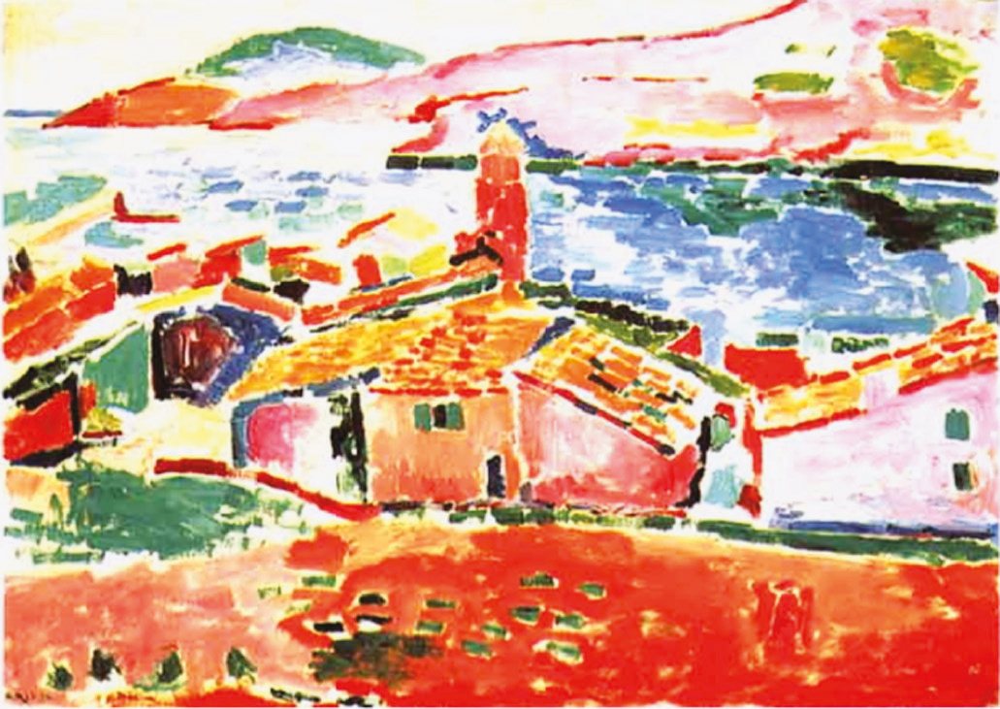

Figure 3.25의 *콜리우르의 지붕들(The Roofs of Collioure)* (1905)에서 마티스는 순수한 색 패치들이 캔버스 위에 적절히 놓이면, 가시적인 윤곽선 없이도 뇌에 의해 **창발적 경계**로 그루핑될 수 있음을 보여주었습니다.

### "색으로 직접 그리기"의 신경과학적 해석

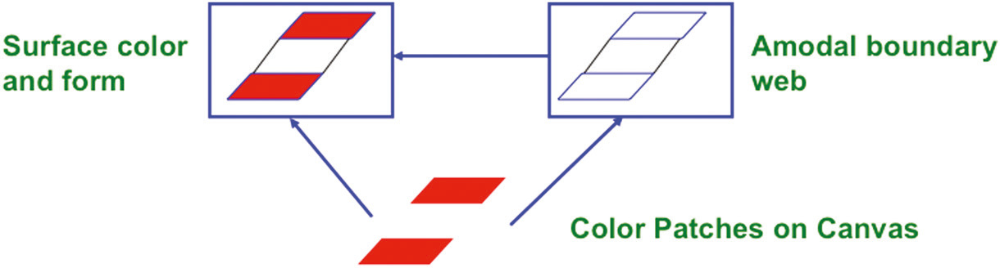

Figure 3.26은 이 과정의 신경과학적 해석을 보여줍니다:

```
캔버스 위의               비가시적(Amodal)
색 패치들    ──────→     경계 웹
   │                        │
   │                        ▼
   │                  색채 채움 제어
   │                        │
   └──────────────→   표면 색채와 형태
                      (Surface color and form)
```

**비가시적 경계의 마법**: 이 창발적 경계들은 비가시적이므로 표면 표상의 색채를 어둡게 만들지 않습니다. 마티스는 직관적으로 이 사실을 이해하고, "모든 경계는 비가시적"이라는 것을 숙달적으로 활용했습니다.

### 색 동화(Color Assimilation)

"색으로 직접 그리기"가 어떻게 회화의 모습을 변화시키는가? 마티스가 표면 주위에 가시적인 윤곽선을 그렸다면, 이 윤곽선들은 장면 전체의 표면 색채를 어둡게 만들었을 것입니다. **색 동화(color assimilation)**는 경계가 표면 색채의 채움을 제어하는 메커니즘 때문에 발생합니다.

마티스는 가시적으로 그린 윤곽선의 어둡게 만드는 효과와 기타 왜곡 효과를 방지하는 방법을 알아냄으로써, 야수파 운동 전체의 목표였던 **밝고 빛나는 표면 색채**를 만들어낼 수 있었습니다.

### 열린 창, 콜리우르 (1905)

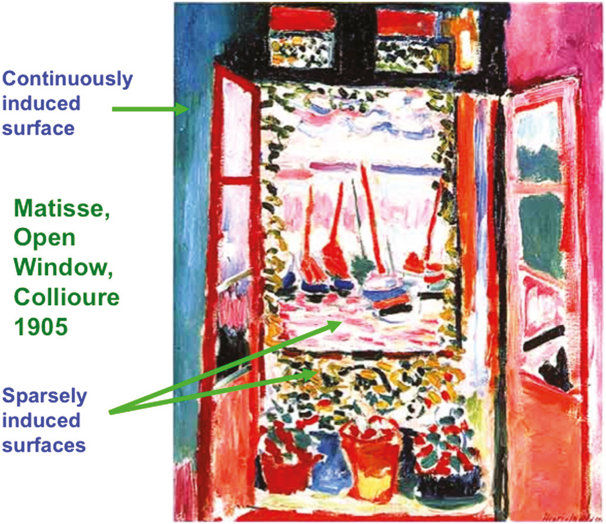

마티스의 1905년 그림들 중 *콜리우르의 지붕들*과 *열린 창(Open Window, Collioure)* (Figure 3.27)은 한 단계 더 나아갑니다:

- **이산적 색 패치**와 **연속적 색채 표면 영역**을 결합
- 두 유형의 붓질이 모두 비가시적 경계를 통해 통합
- 조화로운 회화적 지각을 생성

> 마티스는 이 문제에 대해 평생 관심을 가졌습니다. 1947년에 출판한 책 *Jazz*에서, 더 이상 그림의 엄격함을 감당할 수 없게 된 말년에 만든 종이 오려붙이기 작품(paper cutout maquettes)에 대해 "윤곽선을 그리고 색으로 채우는 대신... 나는 색으로 직접 그린다"는 유명한 문구를 남겼습니다.

### 경계와 표면의 동시 활성화

마티스의 예술이 보여주는 가장 미묘한 점 중 하나는 **동일한 시각적 특성이 경계와 표면 모두를 활성화**할 수 있다는 것입니다 (Figure 3.26):

- 망막에서 LGN을 거쳐 시각 피질의 **인터블롭(interblob)**과 **블롭(blob)** 경로 모두 활성화 (Figure 1.21)
- 경계와 표면은 **병렬적으로** 활성화되지만, 계산적으로 **상보적(complementary)**
- 네온 색 퍼짐(Figure 3.7)이 이를 생생하게 보여줌
- 따라서 비가시적 경계를 이를 가시화할 수 있는 표면 채움 속성과 분리하는 것이 종종 어려움

---

## 15. 경계 대비, 동화, 키아로스쿠로, 수채화 착시

### 수채화 착시 (Watercolor Illusion)

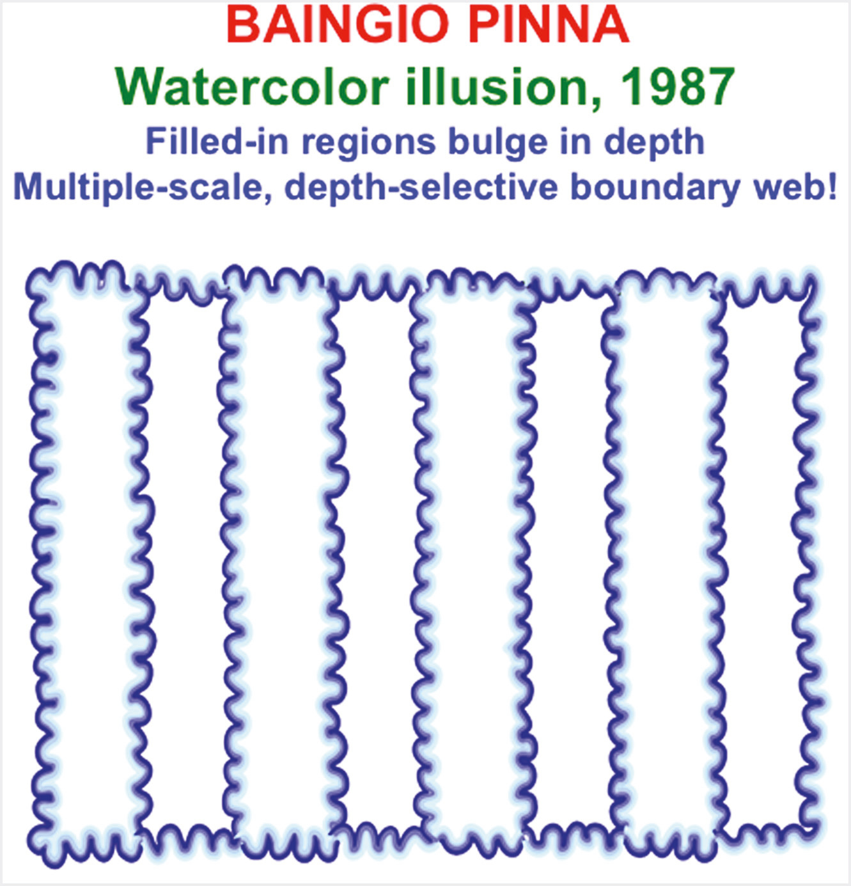

가시적 윤곽에 의한 **색 동화**의 놀라운 예는 **Baingio Pinna의 수채화 착시(watercolor illusion)** (Pinna, 1987; Figure 3.28)입니다. 이탈리아의 시각 과학자 Pinna는 Kanizsa의 합당한 후계자로 여겨집니다.

Figure 3.28에서:
- 짙은 파란색 물결선이 연한 파란색 물결선을 둘러쌈
- 결과 지각: 전체 영역이 **연한 파란색으로 채워짐**
- 연한 파란색 선의 색이 인접 흰색 영역으로 **"동화"**됨

### 수채화 착시의 신경과학적 설명

Grossberg는 이 착시를 다음과 같은 신경 메커니즘으로 설명합니다 (Pinna and Grossberg, 2005):

1. **공간적 경쟁(spatial competition)**: 같은 방향의 경계 신호 사이에서 발생
2. 이는 **First Competitive Stage** — 하이퍼컴플렉스 세포(endstopped complex cells)의 계산 단계
3. 더 강한 경계가 근처의 더 약한 경계를 **억제**
4. 연한 파란색 경계가 약화되면, 그것이 원래 포함하던 색이 약화된 경계를 넘어 **인접한 흰색 표면**으로 확산
5. 표면 채움을 통해 동화됨

### 3D 부풀어 오르는 효과

채워진 수채화 영역은 **3D로 부풀어 오르는(bulge)** 것처럼 보이기도 합니다. 이는 경계 웹이 경계 대비의 **공간적 기울기(spatial gradient)**에 반응하기 때문입니다:

| 경계 유형 | 강도 | 위치 |
|----------|------|------|
| 흰-짙은파랑 경계 | **가장 강함** | 외곽 |
| 짙은파랑-연한파랑 경계 | 중간 | 중간 |
| 연한파랑-흰 경계 | **가장 약함** | 내부 |

이 이산적 경계 기울기는 Figure 3.21d의 음영 타원체를 만드는 연속적 경계 웹의 **공간적으로 이산적인 유사체(analog)**입니다. 다중 스케일 경계 반응이 다중 깊이 경계 웹을 생성하여 서로 다른 깊이에서 표면 색을 포착하고 3D 표면 지각을 채웁니다.

### 키아로스쿠로와 트롱프뢰유

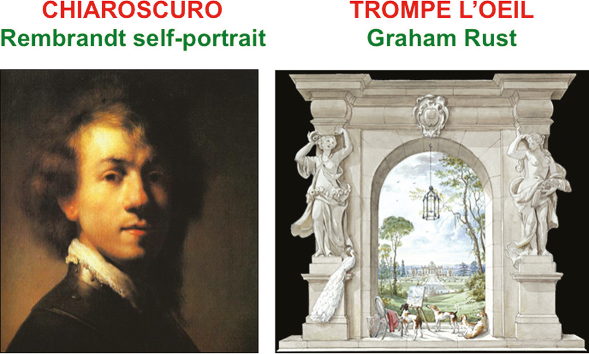

**키아로스쿠로(chiaroscuro)**는 빛과 어두운 물감을 기울기로 조직하여, 실제 2D 표면 대신 **3D 도형이 부풀어 오르는(bulging)** 지각을 만들어내는 회화 기법입니다:

- **레오나르도 다 빈치**: 키아로스쿠로를 최초로 숙달한 화가 중 한 명
- **렘브란트** (Figure 3.29 좌측): 23세에 그린 자화상에서 깊이감 있는 지각 생성
- **트롱프뢰유(trompe l'oeil)** (Figure 3.29 우측, Graham Rust): 키아로스쿠로와 같은 종류의 다중 스케일, 깊이 선택적 경계 웹을 이용

### Jo Baer의 수채화 착시적 회화

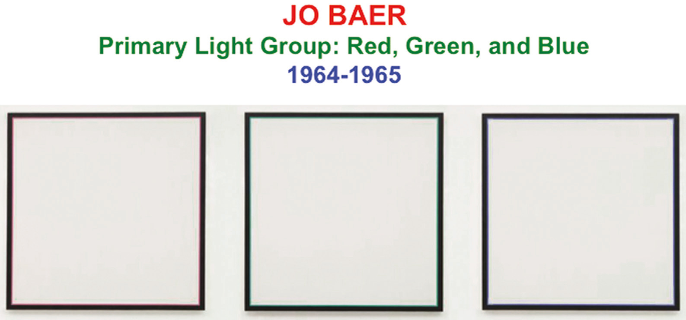

미니멀리스트 미국 작가 **Jo Baer**의 회화 (1960년대)에서도 수채화 착시가 나타납니다:

- Figure 3.30: *Primary Light Group: Red, Green, and Blue* (1964-65) 삼부작
- 캔버스 가장자리와 모서리: 두꺼운 검정 테두리
- 내부: 더 얇은 색 띠 (빨강, 초록, 라벤더, 파랑 등)
- 결과: 수채화 착시적 지각이 생성됨

> Jo Baer가 이전에 표면 색이 적용된 위치를 넘어 확산될 수 있다는 것에 관심을 가졌다는 점은 흥미롭습니다 — 마치 마티스가 윤곽선 없이 색으로 직접 그리는 것에 이끌린 것처럼.

---

## 16. Cape Cod 화파: Hawthorne과 Hensche, 야외 화법

### 명시적 경계 없이 표면을 표현하는 예술적 전통

많은 다른 화가들도 명시적 경계를 그리지 않고 대상 표면을 표현하는 방법으로 고군분투해 왔습니다. **케이프 코드 예술 학교(Cape Cod school of art)**의 주요 구성원들이 대표적입니다:

| 화가 | 역할 | 핵심 주장 |
|------|------|----------|
| **Charles Hawthorne** | 학교 설립자 | "색의 맛있는 음조를 서로 대비하여 놓는 것이 예술의 아름다움" |
| **Henry Hensche** | Hawthorne의 가장 유명한 제자 | Monet의 역할을 역사적 맥락에서 재해석 |

### Hawthorne의 가르침

Hawthorne (1938/1960)의 핵심 가르침:

> "색 점들을 놓아라... 각 색 점의 윤곽선과 크기를 그것이 닿는 모든 다른 색 점에 대비하여 놓는 것이 당신이 걱정해야 할 유일한 종류의 그리기이다... 색이 형태를 만들게 하라—형태를 만들고 색칠하지 마라... 드로잉에 대해 많이 걱정하지 마라. 나는 드로잉, 그리고 형태와 회화가 더 잘 분리된다고 생각한다. 첫 번째로 배울 것은 색을 보는 것이다." (pp. 18-42)

### Hensche와 모네의 영향

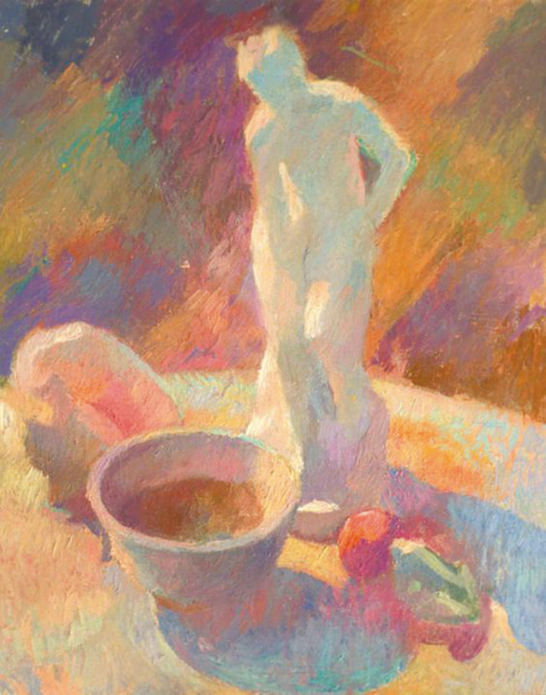

Hensche는 이러한 개념들을 더 발전시키고 **모네(Monet)**가 중추적 역할을 한 역사적 맥락에 놓았습니다 (Hensche, 1988):

> "모네가 왔을 때... 보는 예술을 혁명화한 것은 빛 속에서 색을 표현하는 방법이었다, 가치가 아닌... 자연이 명확하게 보여주는 열쇠를 허용하는 것."

> "훈련되지 않은 눈은 모델의 에지를 보고 형태를 생각하도록 속습니다... 눈을 에지 없이 형태를 보도록 속여라... 모든 형태 변화는 색 변화여야 한다."

Figure 3.31은 Hensche가 이러한 아이디어를 *목욕하는 사람(The Bather)* 정물화에서 빛으로 충만하게 적용한 예입니다.

---

## 17. 모네와 인상파 회화: 숲과 나뭇잎 함께 보기

### 약한 경계와 수채화 효과

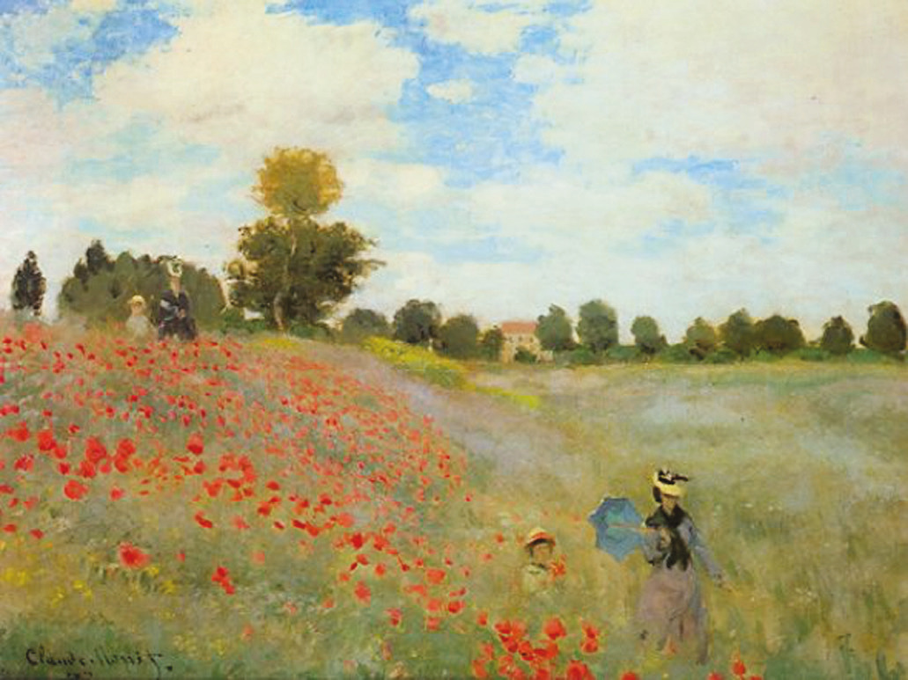

약한 경계는 Jo Baer 외에도 **Claude Monet**를 포함한 많은 화가들이 효과적으로 사용했습니다.

Monet의 유명한 그림 *아르장퇴유 근처의 양귀비(The Poppy Field Near Argenteuil)* (Figure 3.32, 1873년경)에서:
- 붉은 양귀비와 주변 녹색 들판이 **거의 같은 휘도(luminance)**로 그려짐
- 즉, **등휘도(equiluminant)** 상태
- 결과: 빨강-초록 영역 사이의 경계가 **약하고 위치적으로 불안정**
- 이것이 양귀비가 **산들바람에 움직이는 듯한 인상**을 촉진

### 모네의 회화 기법과 경계 웹

모네(1840-1926)는 프랑스 인상파 운동의 창시자 중 한 명입니다. 그의 회화 기법의 핵심:

| 특성 | 설명 |
|------|------|
| **작은 붓질** | 이산적이지만 병치된 색 요소로 구성 |
| **창발적 경계** | 복잡한 표면을 유도하여 대상 형태를 정의 |
| **방향적 불확실성** | 경계 완성 시스템에 내장 (Figures 3.14, 3.15, 3.17-3.21) |
| **"흐릿한" 계산** | 방향적으로 "퍼지한" 계산이 종종 날카로운 분절로 이어짐 |

> **역설적 예측**: 모네의 그림에는 날카로운 에지가 거의 없음에도, 연속적 경계, 매끄러운 표면 형태, 빛이 지각됩니다. 이는 다중 스케일의 방향적 국소 대비 검출기와 이들이 유도하는 경계 그루핑 및 채움 표면 때문입니다.

관찰자들은 모네 회화의 **미시구조(붓질)**와 **거시구조(장면)**를 동시에 감상할 수 있습니다:
- 다중 스케일 방향적 국소 대비 검출기의 존재
- 이들이 유도하는 경계 그루핑과 채움 표면
- 수채화 착시에서 약한 경계를 가로질러 양쪽의 경계와 색의 확산이 지각되는 것과 유사

---

## 18. 경계 웹, 자기발광, 광채, 이중 밝기 착시, 광택

### 경계 웹이 만드는 놀라운 지각들

경계 웹이 이미지나 장면에 반응하여 형성될 때, 놀라운 다양한 지각이 발생할 수 있습니다. 특정 속성의 경계 웹을 만들면, 휘도가 변하는 공간적 맥락에서 장면의 다른 부분이 **내부 빛을 발하거나 빛나는 것처럼** 보이는 **자기발광(self-luminosity)** 지각을 만들 수 있습니다.

관련 현상들:

| 현상 | 연구자 | 설명 |
|------|--------|------|
| **광채 효과(glare effect)** | Daniele Zavagno (1999) | 밝은 영역이 빛을 내는 듯 보임 |
| **이중 밝기 착시(double brilliant illusion)** | Paola Bressan (2001) | 두 개의 밝은 지각이 동시 발생 |
| **광택(gloss)** | Beck and Prazdny (1981) | 하이라이트가 표면 전체를 광택있게 보이게 함 |

### 광채 효과

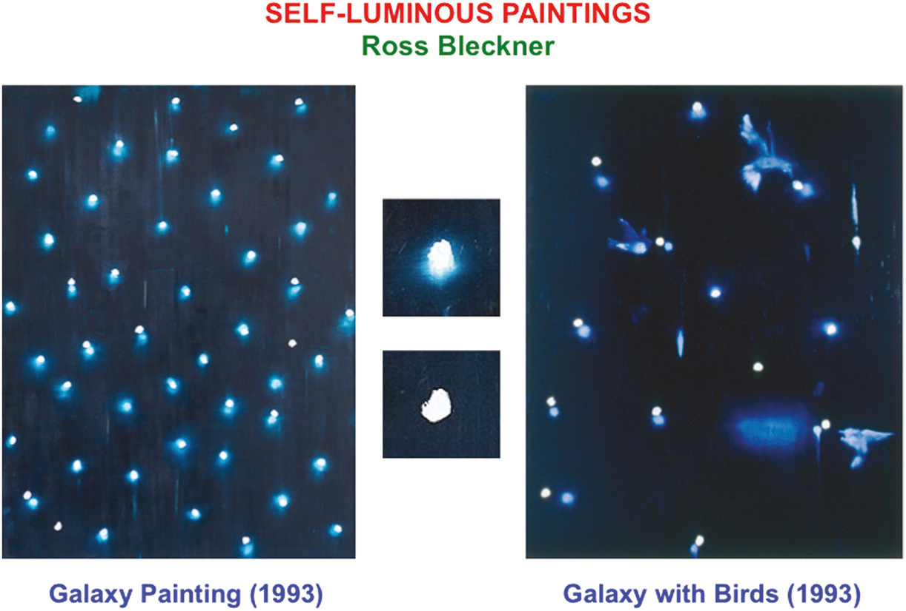

Figure 3.33 (좌측 열, 상단)에서:
- 네 개 그림 모두 내부 흰색 영역은 **동일**
- 그러나 점점 강해지는 휘도 기울기가 이 영역을 둘러쌈
- 가장 강한 기울기에 대한 반응 지각: **빛나는 자기발광**
- 더 약한 기울기에서는 더 약한 효과

**설명**: 경계 웹이 휘도 기울기에 반응하여 형성되고, 이들 경계 웹이 내부와 인접 영역의 밝기 채움을 제어합니다. 경계 웹이 수채화 착시의 가장 약한 경계에서 색이 퍼져나오게 하는 연속적 버전처럼 작동합니다.

### 이중 밝기 착시 (Double Brilliant Illusion)

Figure 3.33 (우측 열)은 **앵커드 채움 밝기 모델(anchored Filling-In Lightness Model, aFILM)**을 사용한 컴퓨터 시뮬레이션을 보여줍니다 (Grossberg and Hong, 2006). aFILM은 이 지각을 수학적으로 엄밀하게 설명하고 시뮬레이션합니다.

### 광택 지각

Figure 3.33 (좌측 열, 하단)에서:
- 두 개의 거의 동일한 꽃병이 나란히 배치
- 좌측 꽃병: 하이라이트(highlight)가 추가됨
- 우측 꽃병: 무광(matte), 평평한 색
- 놀랍게도, 이 국소적 변화가 **전체 꽃병을 광택있게** 보이게 만듦

**경계 웹 설명**: 하이라이트가 유도하는 경계 웹이 꽃병 나머지 부분의 경계 웹과 일관되게 합류하여, 하이라이트 내의 밝기가 인접 영역으로 확산되어 광택 있는 외관을 만듦. Beck and Prazdny (1981)는 하이라이트의 점진적 휘도 기울기를 급격한 것으로 바꾸거나 상대적 방향을 변경하면 광택 지각이 사라진다는 것을 보여주었습니다.

---

## 19. 밝기 앵커링과 Bleckner의 자기발광 회화

### 회화에서의 자기발광

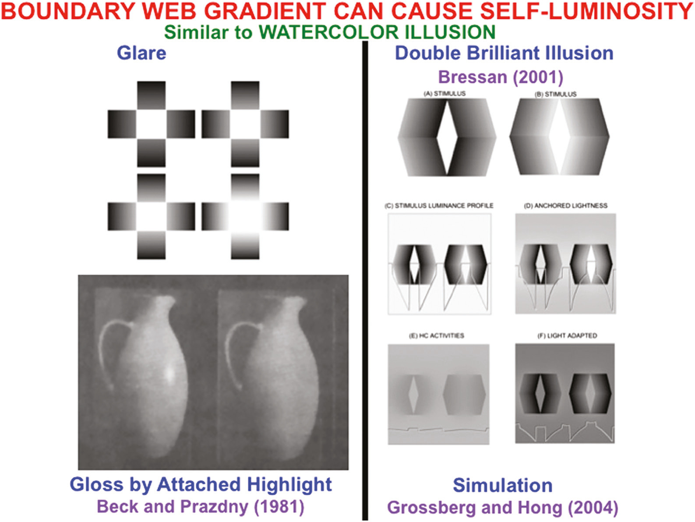

**Ross Bleckner**는 "형식적 코드에서 최대한의 빛을 짜내려(eke out of a formal code a maximum amount of light)"는 시도로 자신의 회화를 설명합니다 (Rankin, 1987).

Bleckner의 방법:
- 높은 반사율이나 밝은 색을 대면적으로 칠하지 **않음**
- 대신 **작고 별 같은 원형 영역**의 구성을 만들어 자기발광으로 지각되게 함 (Figure 3.34)

자기발광에 기여하는 세 가지 상호작용하는 속성:

| 속성 | 효과 |
|------|------|
| **높은 휘도 대비** | 어두운 배경 대비 밝은 영역 → 밝기 대비 효과 강화 |
| **매끄러운 휘도 기울기** | 많은 영역을 둘러싸는 기울기 → 경계 웹을 통한 자기발광 강화 |
| **작은 크기** | 작은 영역 → BHLAW 규칙을 통한 자기발광 강화 |

### HLAW 규칙 (Hans Wallach, 1948)

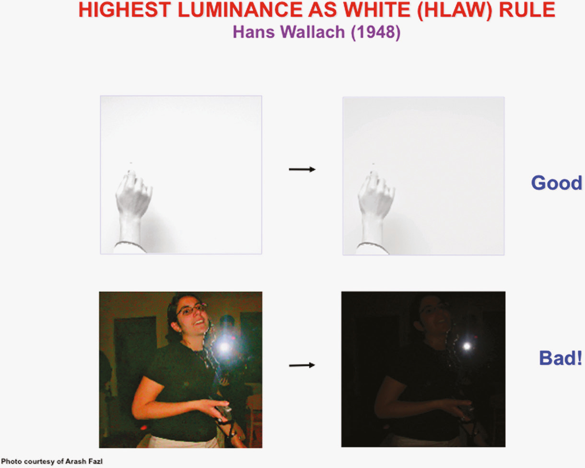

Hans Wallach가 제안한 **최고 휘도를 흰색으로(Highest Luminance As White, HLAW)** 규칙:

- 장면에서 최고 휘도에 "흰색"이라는 지각적 품질을 부여
- 더 낮은 휘도의 표면 영역은 흰색 기준에 상대적으로 회색값이 할당됨

**문제점**: HLAW 규칙은 많은 경우에 작동하지만 (Figure 3.35, 상단), 잘못된 답을 주는 경우도 많습니다 (Figure 3.35, 하단).

### BHLAW 규칙 (Grossberg and Hong, 2004, 2006)

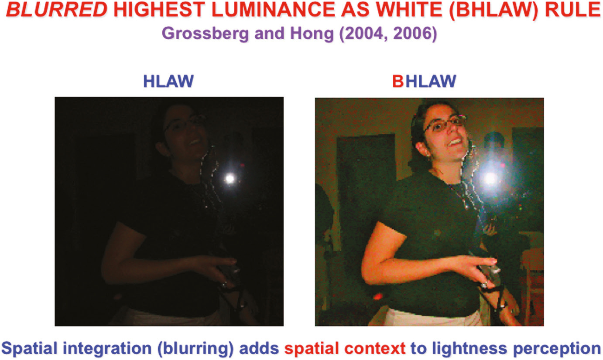

Grossberg와 Hong이 제안한 **흐린 최고 휘도를 흰색으로(Blurred Highest Luminance As White, BHLAW)** 규칙은 HLAW의 많은 문제를 해결합니다:

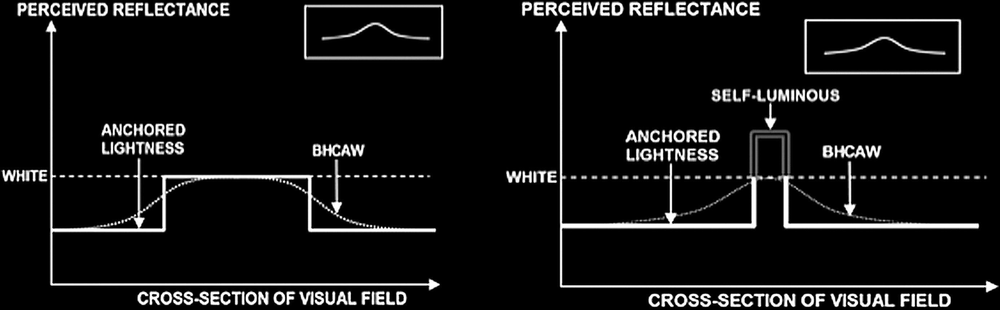

$$\text{BHLAW} = \text{HLAW} + \text{공간적 통합(spatial blurring)}$$

Figure 3.37의 핵심 작동 원리:

| 조건 | 결과 |
|------|------|
| **(a)** 최고 휘도가 "흐림(blurring)" 커널 크기 이상의 영역 차지 | 흰색으로 재정규화 → 자기발광 아님 |
| **(b)** 최고 휘도가 "흐림" 커널보다 작은 영역 차지 | 자기발광으로 지각 |

> **경계 웹과의 독립성**: Figure 3.34의 Bleckner 회화에서 빛 점들이 확대되어도 여전히 자기발광으로 보입니다. 이는 가파른 기울기를 가진 경계 웹에 의한 자기발광 효과가 그림이 BHLAW 규칙에 비해 너무 클 때도 여전히 존재할 수 있기 때문입니다.

---

## 20. 경계 웹과 Color Field 회화: Olitski의 "구름 같은" 그림

### Color Field 회화의 등장

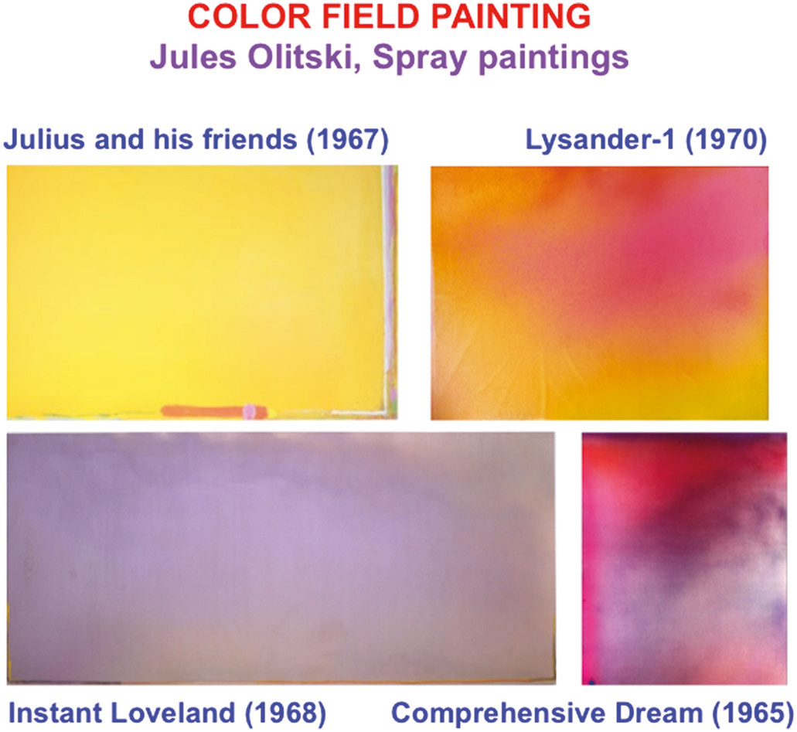

인상파 이후 거의 한 세기가 지난 후, **Color Field 회화**라는 추상 회화 운동이 미국에서 번성했습니다. Mark Rothko, Barnett Newman 등 정전적 Color Field 화가들과 그 후계자인 **Jules Olitski**, Helen Frankenthaler가 대표적입니다.

Color Field 화가들의 핵심 관심사: **색의 순수한 감정적 힘** — 특히 크고, 모호하게 구조화된 표면 내에 담긴 색.

### Olitski의 스프레이 회화

Jules Olitski는 1965년부터 스프레이 병과 총을 사용하여 미리 칠하지 않은 캔버스에 물감을 분사하는 기법을 개발했습니다. 이렇게 만들어진 "스프레이 회화"(Figure 3.38)의 특징:

| 특성 | 설명 |
|------|------|
| **미세한 안개** | 캔버스 위의 색 밀도를 미세하게 제어 |
| **이산적 단위 불가시** | 모네와 달리 개별 색 단위를 구별할 수 없음 |
| **모호한 깊이** | 안개 낀 색 공간을 들여다보는 듯한 감각 |
| **"구름 같은" 효과** | 이산적 구름 없이 일몰 하늘을 바라보는 듯 |

### Olitski의 미학적 의도

Olitski 자신의 말 (Riggs, 1997):

> "내적 형태의 개념이 에지에 의해 지배될 때, 색은... 표면 위에 또는 위쪽에 남아 있는 것으로 보인다. 나는... 색이 안에서 그리고 전체에 걸쳐 보이고 느껴지는 것이라 생각한다, 표면에만이 아니라."

### 신경과학적 설명

Olitski의 스프레이 회화에서는:
- 날카롭고 닫힌 경계 윤곽이 **지각 불가**
- 대신 점진적인 색채/휘도 공간 기울기가 공존
- 이로 인해 **다중 스케일**의 경계 웹이 형성되어 특정 깊이 평면에 제한된 표면이 아닌, 다중 깊이 선택적 표면 위의 매끄러운 색 전이를 포착
- Figure 3.33의 꽃병 광택이나 음영 타원체와 달리, 이 회화의 채색 표면은 하나의 깊이 평면에 명확히 담기지 않음
- 이런 방식으로 Olitski는 "안에서 그리고 전체에 걸쳐" 보이고 느껴지는 색을 달성

---

## 21. Gene Davis: 색 동화에서 깊이와 표면-슈라우드 공명으로

### Gene Davis의 스트라이프 회화

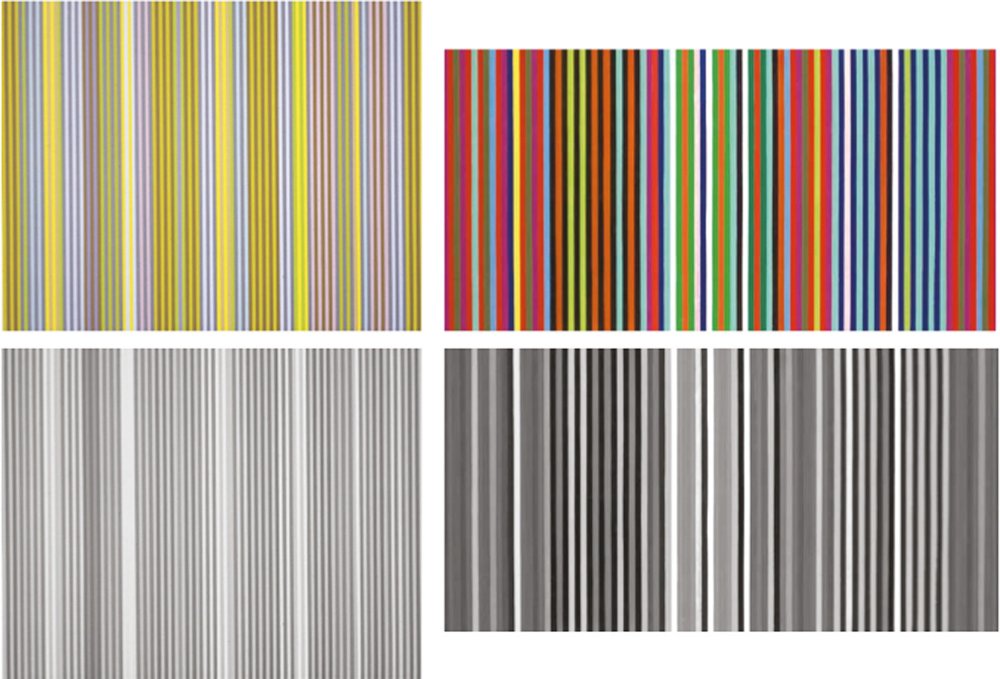

**Gene Davis**의 회화는 경계 그루핑과 표면 채움이 깊이와 크기의 회화적 지각에 어떻게 영향을 미치는지 보여주는 추가적 예입니다.

Figure 3.39에서 두 작품을 분석합니다:

| 작품 | 특성 | 지각 |
|------|------|------|
| **Black Popcorn** (좌측 상단) | 밝은 줄무늬가 캔버스 1/3에 집중 | "가장 밝은" 4줄무늬가 가장 가까운 깊이 평면에 보임 |
| **Flamingo** (우측 상단) | 개별 줄무늬와 그룹 모두 깊이 변화 | 더 밝은 줄무늬가 더 가깝게 보임 |

### 색 동화와 깊이 지각

색 유사성과/또는 거의 동일한 휘도가 줄무늬 사이에서 시청자의 시선이 개별 줄무늬에 갈지 줄무늬 그룹에 갈지를 영향합니다:

1. **Black Popcorn**: 줄무늬 간 휘도 차이가 매우 작아 → 색 동화가 촉진됨 → 수채화 착시(Figure 3.28)와 Jo Baer의 회화(Figure 3.30)를 연상
2. **약한 경계**: 줄무늬 사이의 경계가 약하여 → 표면 채움이 여러 줄무늬에 걸쳐 증가
3. **공간 주의**: 약한 경계와 색 동화 결과, 공간 주의가 하나의 줄무늬보다 큰 영역을 커버

### 주의적 슈라우드(Attentional Shroud)와 표면-슈라우드 공명

이러한 **형태 민감적 공간 주의**를 **주의적 슈라우드(attentional shroud)**라 합니다. 주의적 슈라우드는 뇌에서 **표면-슈라우드 공명(surface-shroud resonance)**이라는 동적 상태에 의해 생성됩니다.

주의적 슈라우드의 다중 역할 (Table 1.4):
- **의식적 시각(conscious seeing)**
- **인식(recognition)**
- **탐색(search)**

> **핵심**: 줄무늬들 사이의 동화가 장면 층화(scene stratification)와 명시적 깊이에 영향을 미칠 수 있습니다. 이는 개별 줄무늬를 더 큰 띠로 그루핑하여 다중 크기의 주의적 슈라우드를 형성하고, 더 가까운 깊이의 지각을 유도할 수 있기 때문입니다.

---

## 22. 원근법, T-접합, 엔드갭, 그리고 모나리자

### 르네상스 이후의 원근법 기법

르네상스 이후 예술가들은 뇌가 시각을 처리하는 방식의 많은 다른 속성을 미학적 목적으로 활용해 왔습니다.

### T-접합(T-junctions)과 깊이 지각

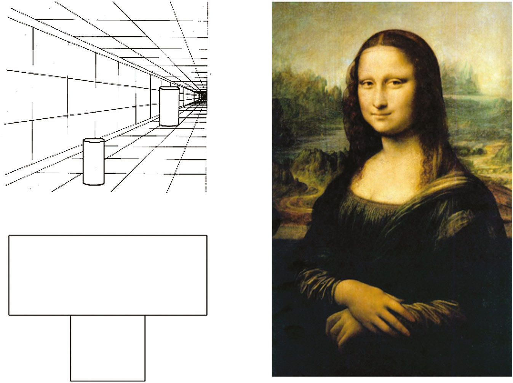

Figure 3.40은 여러 핵심 개념을 보여줍니다:

**원근법 단서 (Figure 3.40, 좌측 상단)**:
- 서로 다른 크기의 방향적 수용장(receptive field)을 가진 세포들을 활성화
- 3D 장면과 유사한 방식으로 깊이 지각을 생성

**T-접합 (Figure 3.40, 좌측 하단)**:
```
     ──────────
          │
          │  ← T의 줄기(stem)
          │
```

- 수직 경계와 수평 경계가 만나는 곳에서 형성
- T의 줄기가 상단을 만나는 곳에서 **엔드갭(end gap)**이라는 작은 끊어짐 발생
- 이 끊어짐이 **전경-배경 분리**를 촉발하는 초기 단계

르네상스 화가들은 T-접합이 그림과 배경 사이에 놓이면 그림이 배경 앞에 나타나 **전경-배경 분리의 지각**으로 이어진다는 것을 이해했습니다.

### 엔드갭(End Gaps)의 역할


Figure 3.41은 엔드갭이 어떻게 형성되고 작동하는지 보여줍니다:

1. 더 강한 경계가 더 약한 같은 방향(like-oriented) 경계에 닿는 곳에서 형성
2. 네온 색 퍼짐 이미지(Figures 3.10, 3.11)에서 파란색/빨간색 선의 끝이 검정 선에 닿는 위치와 동일한 원리
3. **더 강한 검정 경계가 더 약한 색 경계를 억제** → 색 특성 윤곽 활동이 이 경계 밖으로 흘러나옴
4. 수채화 착시(Figure 3.28)에서 경계가 약화되는 것과 같은 원리

### 모나리자에서의 통합

**레오나르도 다 빈치의 모나리자**(Figure 3.40, 우측)에는 원근법, T-접합, 키아로스쿠로가 모두 사용됩니다:

| 기법 | 모나리자에서의 적용 |
|------|-------------------|
| **원근법** | 배경의 풍경이 점진적으로 작아짐 |
| **T-접합** | 인물과 배경의 경계에서 전경-배경 분리 |
| **키아로스쿠로** | 빛과 그림자의 기울기로 3D 얼굴 형태 |

각각의 과정이 고유한 방식으로 모나리자의 3D 외관을 생성하고 풍경 배경 앞에 그녀를 투사하는 데 기여합니다.

### Frank Stella의 Protractor 시리즈

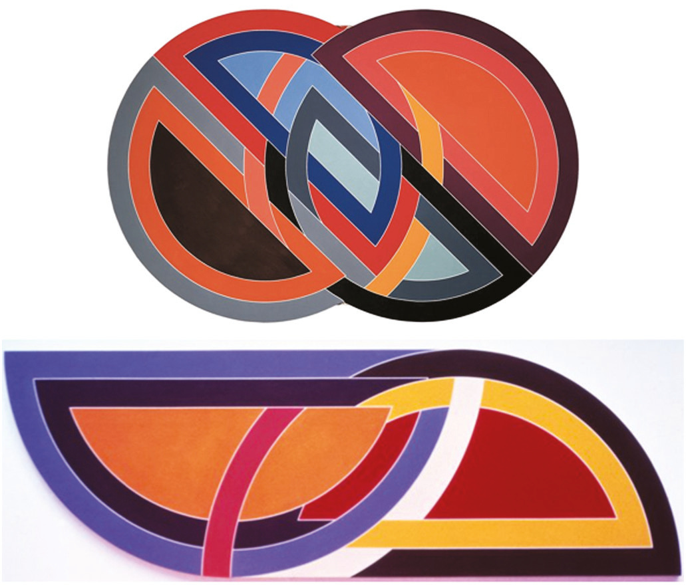

**Frank Stella**의 *Protractor* 시리즈 회화는 두 종류의 지각적 단서의 결과를 활용합니다:

Figure 3.42의 두 작품:

| 작품 | 특성 |
|------|------|
| **Firuzabad** (상단) | "안정성을 찾으면서 가능한 한 많은 불안정성을 만들려" 함 |
| **Khurasan Gate (Variation) I** (하단) | 얽히고설킨 패턴이 움직임의 감각을 생성 |

핵심 관찰:
- 추상적이고 밝게 착색된, 얽히고 겹치는 도형들을 포함
- *Firuzabad*의 중앙 부분: 어떤 세그먼트도 다른 모든 세그먼트 "위에" 있지 않음
- **비가시적 경계 완성(amodal boundary completion)**: 부분적으로 가려진 분할기 형태의 경계가 완성됨
- **표면 채움**: 구분된 세그먼트 색채가 분리된 세그먼트를 통합된 분할기 표면으로 합병

주의적 슈라우드의 역할:
- 하나의 분할기에 대한 주의적 슈라우드가 형성되면 → **표면-슈라우드 공명**이 시선 이동을 조절
- 같은 분할기의 다른 깊이 평면으로의 이동을 안내
- **억제 회귀(inhibition of return)** 또는 **활동 의존적 습관화(activity-dependent habituation)**: 같은 위치를 계속 바라보지 않으려는 경향
- 슈라우드 붕괴 시: 공간 주의가 새로운 표면으로 이동

> **운동감(kineticism)**: 서로 다른 깊이 평면과 서로 다른 분절을 가로지르는 주의 이동과 시선 이동이, 정적인 얽힌 패턴에서 **시각적 움직임의 감각**을 만들어냅니다 — Stella 회화의 특징적 효과입니다.

---

## 23. 다시 모네로: Gist, 다중스케일 주의 슈라우드, 장면 인식

### 예술가의 주의 조절

Gene Davis와 Frank Stella의 회화 맥락에서 논의했듯이, 예술가들은 구성과 그루핑을 통해 관객의 주의를 조절할 수 있습니다. 인상파 화가인 모네(Figure 3.32)와 쇠라(Figure 3.23)의 경우:
- 관객은 붓질이 유도하는 경계의 협력과 경쟁을 통해 개별 가시적 붓질과 이들이 유도하는 **창발적 형태** 모두를 지각

### 모네의 회화 과정과 Scene Gist

모네의 회화 기법은 인간이 **자연 장면을 이해하는 방식**을 반영합니다:

| 단계 | 모네의 기법 | 인간 시각의 대응 |
|------|-----------|---------------|
| 1 | 분산된 국소 대비 패치로 시작 | 장면의 **gist**(요지)를 빠르게 포착 |
| 2 | 붓질 사이의 장거리 협력을 점진적으로 구축 | 주의 슈라우드가 더 세밀한 분절로 이동 |
| 3 | 명시적 윤곽을 그리지 않고 붓질을 쌓아감 | 세밀한 경계와 표면이 점진적으로 형성 |
| 4 | "첫 번째 진짜 봄"의 신선함 보존 | 거친 gist가 "첫 인상"을 지배 |

**Scene Gist**: 장면의 요지(gist)는 장면에 대한 최초의 이용 가능한 정보입니다. 이것은 대규모, 또는 공간적으로 거친 텍스처 범주입니다. gist가 계산된 후, 공간 주의와 시선 이동이 더 세밀한 디테일로 줌인할 수 있습니다 (Chapter 14에서 상세 설명).

모네의 충고:
> "밖에 나가서 그릴 때, 앞에 있는 대상들을 잊으려 하라, 나무, 집, 들판, 무엇이든. 단지 생각하라, 여기 파란 작은 사각형, 여기 분홍 직사각형... 당신에게 보이는 대로의 정확한 색과 형태를 그리라, 당신 자신의 장면에 대한 순진한 인상을 줄 때까지."

### 루앙 대성당 시리즈

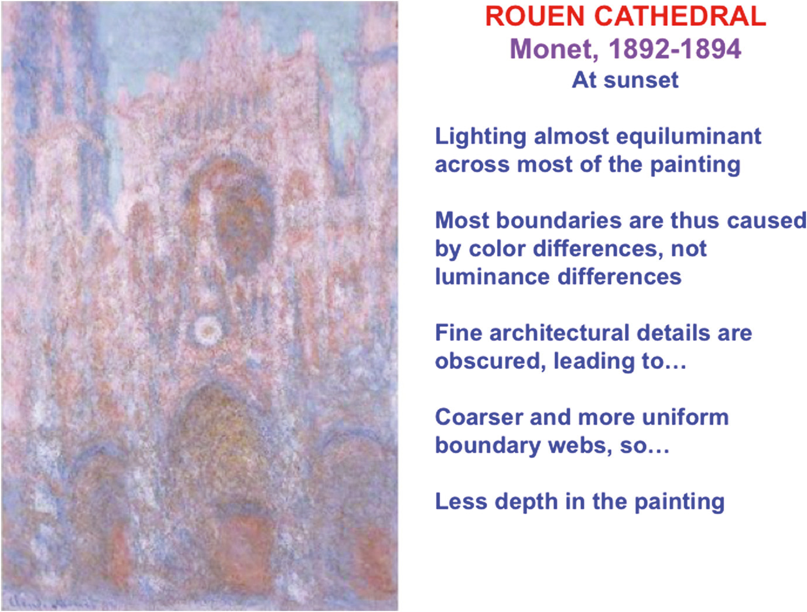

Figures 3.43-3.46은 모네의 **루앙 대성당(Rouen Cathedral)** 시리즈(1890년대, 30점 이상)에서 네 점을 분석합니다.

단색(grayscale) 버전(Figure 3.43, 하단)이 보여주는 것:
- 붓질 사이의 거의 등휘도(near-equiluminance)
- 형태 내부의 약한 경계 신호와 형태 사이의 강한 경계 신호
- 밝기와 색 차이에 따른 그루핑 차별화

### 해질녘 vs 정오: 경계 웹의 차이

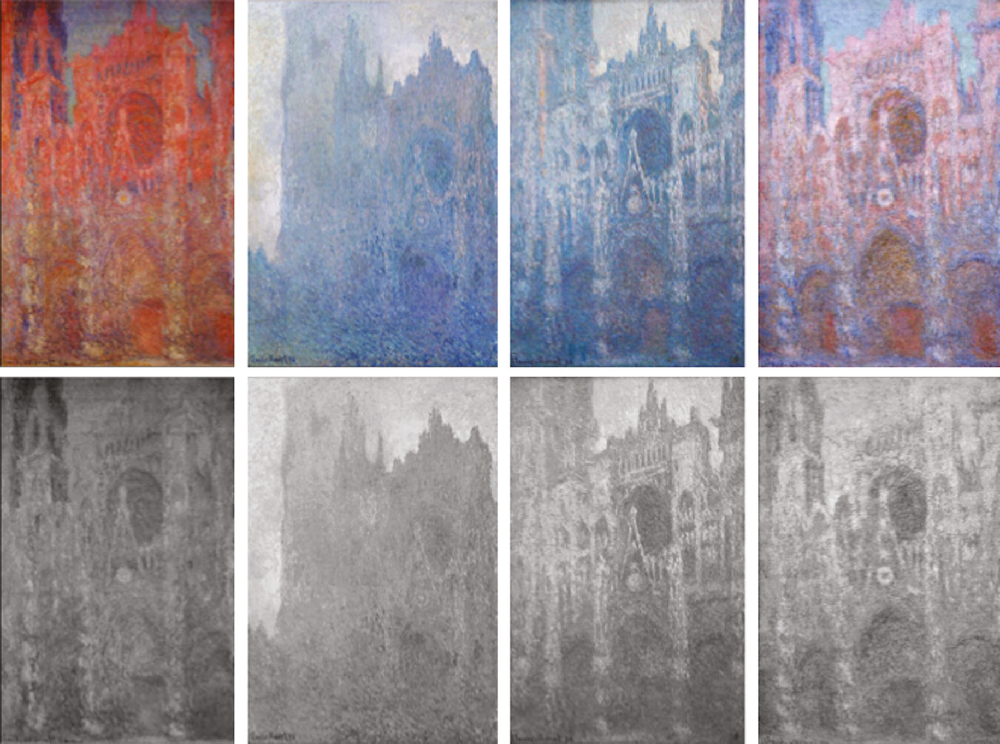

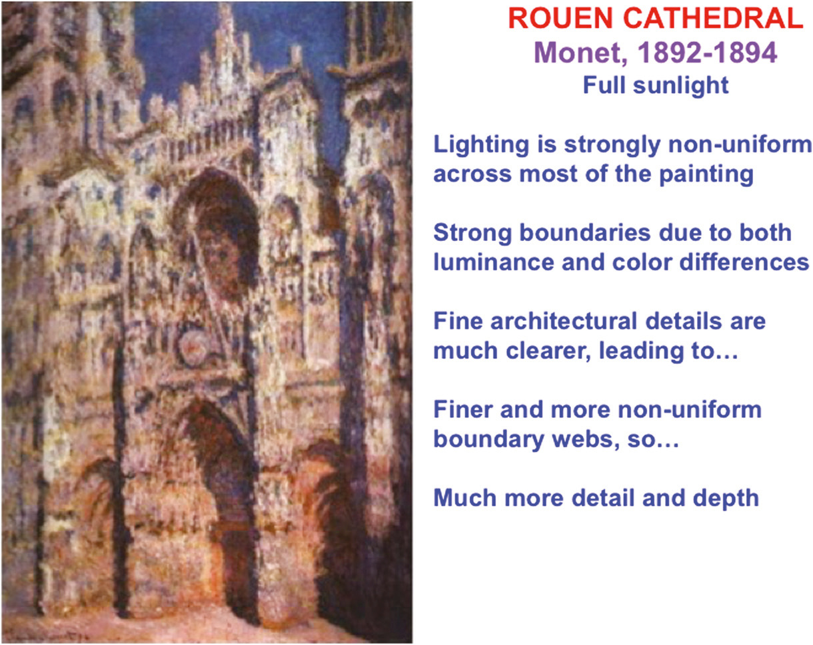

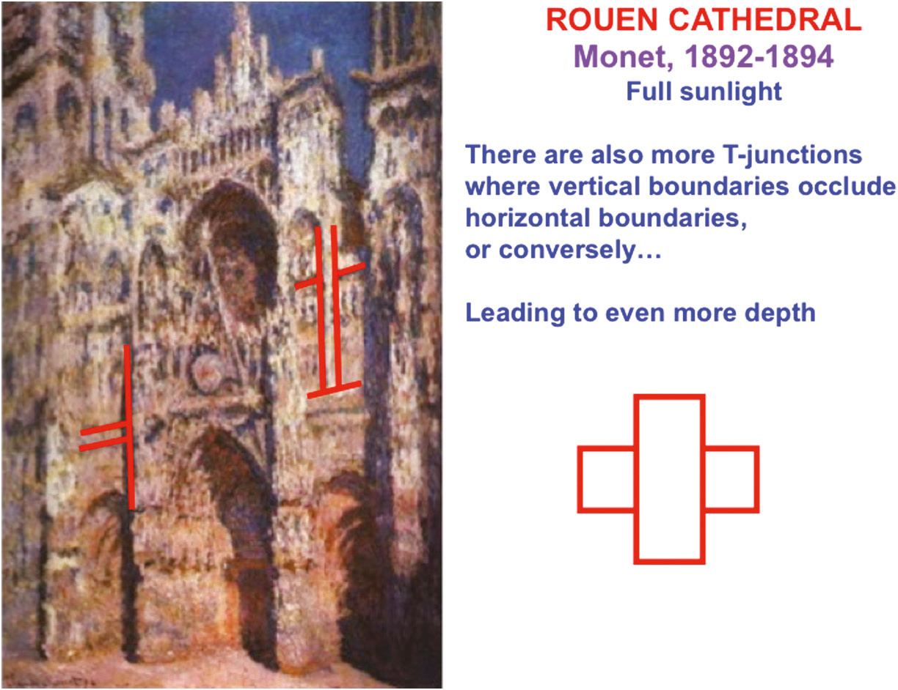

| 조건 | 해질녘 (Figure 3.44) | 정오 직사광 (Figures 3.45-3.46) |
|------|---------------------|-------------------------------|
| **조명** | 거의 등휘도 | 강하게 비균일 |
| **경계 원인** | 주로 색 차이 | 휘도 + 색 차이 모두 |
| **건축적 디테일** | 불분명 | 훨씬 명확 |
| **경계 웹** | 거칠고 균일 | 세밀하고 비균일 |
| **깊이감** | 적음 | 훨씬 많음 |
| **T-접합** | 불분명 | 수직/수평 경계가 서로를 가림 → 깊이 생성 |

> **색과 휘도의 역할**: 모네는 색과 휘도 모두가 형태 생성에 역할하는 시각 시스템의 통계적 불확실성을 활용했습니다. 일부 성숙기 작품에서 모네는 거의 등휘도인 인접 색을 사용하고 날카로운 고대비 휘도 에지는 드물게 사용합니다. 이는 형태 내부의 색 퍼짐을 촉진하면서 형태 간의 더 나은 분리를 가능하게 합니다.

---

## 최종 요약

3장 후반부(pp. 104-121)의 핵심 내용을 정리합니다:

### 핵심 개념 요약표

| 개념 | 설명 | 관련 그림 |
|------|------|----------|
| **다중 스케일 경계 웹** | 서로 다른 크기의 경계 세포들이 형태 민감 웹으로 그루핑 | 3.21, 3.22 |
| **FIDO (채움 도메인)** | 깊이 선택적 표면 채움 영역 | 3.22 |
| **"모든 경계는 비가시적"** | 경계 자체는 보이지 않고 표면 채움을 통해서만 드러남 | 3.21d, 3.25-3.27 |
| **색 동화** | 약한 경계를 통해 색이 인접 영역으로 확산 | 3.28, 3.39 |
| **수채화 착시** | 공간적 경쟁에 의한 경계 약화와 색 확산 | 3.28 |
| **키아로스쿠로** | 빛/어둠 기울기로 3D 부풀어 오름 지각 생성 | 3.29 |
| **자기발광** | 경계 웹 기울기가 빛나는 듯한 지각을 만듦 | 3.33, 3.34 |
| **BHLAW 규칙** | 공간적 통합을 추가한 밝기 앵커링 규칙 | 3.36, 3.37 |
| **주의적 슈라우드** | 형태 민감적 공간 주의의 동적 상태 | 3.39, 3.42 |
| **표면-슈라우드 공명** | 표면과 주의적 슈라우드의 피드백 공명 | 3.42 |
| **T-접합/엔드갭** | 전경-배경 분리를 촉발하는 경계 불연속 | 3.40, 3.41 |
| **Scene Gist** | 장면의 대규모 요지를 빠르게 포착하는 과정 | 3.43-3.46 |

### 예술과 신경과학의 대화

이 장의 후반부가 보여주는 가장 중요한 메시지는, **예술가들이 캔버스를 조작하고 새로운 그림의 의식적 지각을 경험할 때마다, 그 예술가는 우리가 보는 뇌 과정의 다양한 조합을 탐색하는 실험을 수행하고 있다**는 것입니다.

다양한 예술가들의 특정 관심사와 미학적 감성이 이들을 본능적으로 이러한 뇌 과정의 다양한 조합을 강조하도록 이끌었습니다:

| 화가 | 활용한 핵심 원리 |
|------|---------------|
| **Seurat** | 점묘법 → 경계 그루핑과 표면 채움 |
| **Matisse** | 색으로 직접 그리기 → 비가시적 경계와 색 동화 |
| **Monet** | 등휘도 색채 → 약한 경계와 장면 gist |
| **Bleckner** | 작은 빛 점들 → 자기발광과 BHLAW 규칙 |
| **Olitski** | 스프레이 기법 → 모호한 깊이와 다중 스케일 경계 |
| **Davis** | 스트라이프 → 색 동화와 주의적 슈라우드 |
| **Stella** | Protractor → 비가시적 경계 완성과 운동감 |
| **Da Vinci** | 원근법 + T-접합 + 키아로스쿠로 → 3D 깊이 |

> 이러한 경계 그루핑과 표면 채움 과정의 풍부한 지각적 속성이 우리의 일상적 활동에서든 위대한 시각 예술의 감상에서든 우리 뇌에서 생성됩니다. 다음 장은 이러한 속성들이 어떻게 생성되는지 더 자세히 설명합니다.
