# Grossberg *Conscious MIND Resonant BRAIN* 4장 완전 해설

> 원문: Stephen Grossberg, Conscious MIND Resonant BRAIN, Chapter 4 (pp. 122–183)
> 이 문서는 원문의 서사적 흐름을 따라, 수식·그림·이론을 한국어로 친절하게 풀어 설명합니다.

---

## 목차

### 전반부: 경계와 표면 채우기 (pp. 122-153)
1. [경계는 표면 채우기의 장벽이다](#1-경계는-표면-채우기의-장벽이다)
2. [Craik-O'Brien-Cornsweet 효과](#2-craik-obrien-cornsweet-효과)
3. [밝기 지각과 조명 할인](#3-밝기-지각과-조명-할인)
4. [계층적 해결: 조명 할인, 특징 윤곽, 표면 채우기](#4-계층적-해결-조명-할인-특징-윤곽-표면-채우기)
5. [밝기 항등성, 대비, 동화](#5-밝기-항등성-대비-동화)
6. [왜 공명인가? 철학자들의 도움](#6-왜-공명인가-철학자들의-도움)
7. [경계는 어떻게 형성되는가?](#7-경계는-어떻게-형성되는가)
8. [경계 시스템의 작동: 뇌에서 미래 칩으로](#8-경계-시스템의-작동-뇌에서-미래-칩으로)
9. [FACADE 이론 vs. 소박 실재론](#9-facade-이론-vs-소박-실재론)
10. [단순 세포와 반파 정류](#10-단순-세포와-반파-정류)
11. [복잡 세포: 무양식 경계 검출기](#11-복잡-세포-무양식-경계-검출기)
12. [Glass 패턴: 단거리 vs 장거리 협력](#12-glass-패턴-단거리-vs-장거리-협력)
13. [위치-방향 불확실성 원리](#13-위치-방향-불확실성-원리)
14. [지각적 재난: 통제되지 않는 채우기](#14-지각적-재난-통제되지-않는-채우기)
15. [모든 선분 끝은 환상이다!](#15-모든-선분-끝은-환상이다)
16. [패턴으로 계산하기](#16-패턴으로-계산하기)
17. [바이폴 세포와 장거리 협력적 경계 완성](#17-바이폴-세포와-장거리-협력적-경계-완성)
18. [의식 다시!: 세 가지 불확실성의 계층적 해결](#18-의식-다시-세-가지-불확실성의-계층적-해결)
19. [이중 필터와 그루핑 네트워크](#19-이중-필터와-그루핑-네트워크)

### 후반부: 3D 시각과 전경-배경 분리 (pp. 153-183)
20. [불확실성과 함께 살기](#20-불확실성과-함께-살기)
21. [베이즈 없는 뇌](#21-베이즈-없는-뇌)
22. [질감 분리에서의 창발적 특징](#22-질감-분리에서의-창발적-특징)
23. [공간적 불투과성과 T-교차점](#23-공간적-불투과성과-t-교차점)
24. [그래피티 예술가와 Mooney 얼굴](#24-그래피티-예술가와-mooney-얼굴)
25. [초과민성과 공간 위치 결정](#25-초과민성과-공간-위치-결정)
26. [환상적 윤곽 강도의 역U자 곡선](#26-환상적-윤곽-강도의-역u자-곡선)
27. [아날로그 일관성과 층상 피질 구조](#27-아날로그-일관성과-층상-피질-구조)
28. [Koffka-Benussi 고리와 Kanizsa-Minguzzi 고리](#28-koffka-benussi-고리와-kanizsa-minguzzi-고리)
29. [2D에서 3D로: 깊이 지각](#29-2d에서-3d로-깊이-지각)
30. [경계는 채우기 생성기이자 장벽: 이중 대립 경쟁](#30-경계는-채우기-생성기이자-장벽-이중-대립-경쟁)
31. [닫힌 경계만이 가시적 표면 지각을 만든다](#31-닫힌-경계만이-가시적-표면-지각을-만든다)
32. [다빈치 입체시](#32-다빈치-입체시)
33. [깊이 선택적 경계 표현의 생성](#33-깊이-선택적-경계-표현의-생성)
34. [표면 윤곽과 전경-배경 분리](#34-표면-윤곽과-전경-배경-분리)
35. [근접성-밝기 공변: 밝은 Kanizsa 사각형이 더 가까워 보이는 이유](#35-근접성-밝기-공변-밝은-kanizsa-사각형이-더-가까워-보이는-이유)
36. [V2와 V4: 가림과 투명성](#36-v2와-v4-가림과-투명성)
37. [최소 해부학의 방법과 다음 단계](#37-최소-해부학의-방법과-다음-단계)

---

# 전반부: 경계와 표면 채우기 (pp. 122-153)

---

## 1. 경계는 표면 채우기의 장벽이다

1960년대, 심리학자 John Krauskopf(1963)와 소련의 A.L. Yarbus(1967)는 **안정화된 이미지가 사라지는 현상**을 이용하여 실험실에서 채우기(filling-in) 현상을 연구했습니다. 이들은 망막 위에서 흔들리는 눈의 움직임에 의해 안정화된 이미지가 맹점이나 망막 혈관처럼 사라지는 사실을 활용했습니다.


**그림 4.1의 핵심 메시지:**
- **왼쪽 패널(Image)**: 두 개의 빨간 원반이 각각 흰색과 검은색 직사각형에 둘러싸여 있으며, 전체가 빨간 배경 위에 놓여 있습니다
- 직사각형 경계를 망막에 대해 안정화시키면, 이 경계들이 사라집니다
- **오른쪽 패널(Percept)**: 안정화된 경계가 사라진 후, 빨간색이 흑백 영역 위로 퍼져나갑니다

이 실험에서 **두 가지 핵심 사실**이 드러납니다:

| 원리 | 설명 |
|------|------|
| **경계 = 채우기의 장벽(barrier)** | 경계가 있으면 색이 퍼지지 못함 |
| **경계 = 채우기의 생성기(generator)** | 경계가 사라지면 특징 윤곽이 채우기를 지원할 수 없게 됨 |

> **"보이지 않는 원인의 보이는 효과"**: 배경의 흑백은 최종 의식적 지각에서 보이지 않지만, 밝기 대비 효과는 남아 있습니다. 이것은 경계 형성이 물체 인식 이전 단계에서 일어나듯이, 밝기와 색상 대비 계산도 채우기가 일어나는 단계 이전에 발생함을 시사합니다.

**쌍안 경합(binocular rivalry)** 또한 경계가 채우기를 생성하는 좋은 예입니다. 두 눈에 다른 이미지가 제시되면, 그 이미지에 의해 유도된 경계들이 우세를 놓고 경쟁합니다. 승리한 경계만이 가시적 표면 밝기나 색상의 의식적 지각을 지원할 수 있습니다.

---

## 2. Craik-O'Brien-Cornsweet 효과

**COCE(Craik-O'Brien-Cornsweet Effect)**는 채우기의 힘을 보여주는 또 다른 고전적 사례입니다.


**그림 4.2 해설:**
- **왼쪽**: 검은 테두리로 둘러싸인 밝은 회색 직사각형 안에 수직 경계(cusp)가 있음
- 검은 테두리가 만드는 닫힌 경계 때문에, 왼쪽과 오른쪽 밝기가 다르게 채워져 **두 개의 균일한 회색 직사각형**으로 지각됨
- **오른쪽**: 검은 테두리를 회색으로 바꾸면, cusp가 갑자기 보이게 됨!

COCE의 메커니즘:
- 검은 테두리가 닫힌 경계를 만들어 수직 cusp의 밝기 차이가 각 직사각형 내부로만 채워짐
- 테두리가 없으면, 밝기가 cusp 주변으로 자유롭게 흘러 균등화됨

---

## 3. 밝기 지각과 조명 할인

### 조명 할인(Discounting the Illuminant)

헬름홀츠가 깨달은 것처럼, 장면의 **평균 색상은 감쇠되어(desaturated)** 지각됩니다. 즉, 석양의 붉은 빛 아래에서도 우리는 물체의 "실제" 색상을 어느 정도 볼 수 있습니다. 이것이 **조명 할인** 과정입니다.


**McCann Mondrian**(그림 4.3): 다양한 색의 패치들로 구성된 퍼즐 같은 이미지입니다. Land의 실험에서:
- 다른 색과 강도의 조명으로 비추어도, 패치들의 색이 거의 동일하게 보입니다
- 뇌가 반사광의 **상대적 비율(ratio)**을 계산하여 조명의 영향을 제거하기 때문입니다

### 경쟁이 좋을 때: 아날로그 계산을 가능하게 하는 경쟁

뇌 세포들이 어떻게 조명을 할인할 수 있을까요? 답은 **경쟁(competition)**에 있습니다.

경쟁적 네트워크가 입력 신호의 **상대적 강도** $\theta_i = \frac{I_i}{\sum_{k=1}^{n} I_k}$를 자연스럽게 계산합니다.

여기서:
- $I_i$: $i$번째 세포에 대한 입력 신호
- 분모: 네트워크 내 모든 입력의 합

이 비율은 조명 강도 $I$와 무관하게 **반사율(reflectance)**을 추정합니다.

---

## 4. 계층적 해결: 조명 할인, 특징 윤곽, 표면 채우기

### 패치 경계에서의 반사율 변화 계산


패치 경계에서 반사율이 $A$에서 $B$로 갑자기 변할 때, 조명 강도 $I$ 근처에서:

$$\frac{A(I+\varepsilon) - B(I-\varepsilon)}{A(I+\varepsilon) + B(I-\varepsilon)}$$

$\varepsilon$이 $I$보다 훨씬 작을 때, 이것은 근사적으로:

$$\frac{A - B}{A + B}$$

이 결과의 핵심 의미:

| 위치 | 결과 |
|------|------|
| **패치 내부** (A = B) | 비율 = 0 → 대비 없음 |
| **패치 경계** (A ≠ B) | 비율 ≠ 0 → 반사율 변화 측정 |

이것이 **특징 윤곽(feature contour)** 또는 **색상 윤곽(color contour)**입니다. 이 윤곽들은 원래 밝기 프로파일을 크게 왜곡하지만, 뇌는 이를 나중 단계의 채우기를 통해 복원합니다.


**그림 4.6의 핵심**: 이것은 **"불확실성의 계층적 해결"**의 첫 번째 사례입니다:
1. 조명을 할인하면 → 연속적 색상 패턴이 이산적 특징 윤곽으로 변환됨 (정보 손실)
2. 나중 단계에서 채우기가 → 연속적 표면 색상 표현을 복원함 (정보 회복)

---

## 5. 밝기 항등성, 대비, 동화

### 밝기 항등성(Brightness Constancy) 시뮬레이션


**그림 4.7 해설** (Grossberg & Todorovic, 1988):
- **Stimulus(S)**: 두 개의 수직 막대가 균일한 배경 위에 놓여 있음
- **Feature(F)**: 조명 할인 과정이 대비를 추출 → 특징 윤곽
- **Boundary(B)**: 특징 패턴에서 경계 윤곽 추출 (경계 봉우리는 특징 봉우리보다 **공간적으로 좁음**)
- **Output**: 경계 내에서 특징 패턴이 채워져 원래 밝기 패턴을 충실히 재현!

> 경계 봉우리가 특징 봉우리보다 공간적으로 좁다는 사실은 매우 중요합니다. 이것은 경계 형성이 대비에 민감하기 때문입니다.

### 밝기 항등성: 조명 기울기 하에서


놀랍게도, 조명 기울기가 있어도 특징 윤곽(F)과 경계(B) 패턴은 그림 4.7과 **동일**합니다! 조명 할인 과정이 **대비(contrast)**를 추정하기 때문입니다. 이것이 **밝기 항등성**의 본질입니다.

### 밝기 대비(Brightness Contrast)


밝기 대비는 인접 영역 간의 밝기 차이를 **증강**합니다:
- 두 막대의 밝기가 동일하지만, 배경 밝기가 왼쪽에서 오른쪽으로 감소
- 결과: 오른쪽 막대가 더 밝게 보임 (배경 대비가 더 크기 때문)

### 밝기 동화(Brightness Assimilation)


밝기 대비와 반대로, 인접 영역의 밝기 차이가 **감소**하는 현상입니다:
- 동일한 밝기 계단이 다른 배경에 놓이면
- 더 밝은 배경의 어둡게 하는 효과가 중간 계단의 밝기에 흡수됨

### 이중 계단과 COCE 시뮬레이션


이 시뮬레이션은 **이중 계단(double step)**과 **COCE** 자극이 같은 특징 윤곽 패턴을 생성함을 보여줍니다. 두 이미지의 가장자리에서 유사한 대비가 있기 때문에, 조명 할인 과정이 동일한 특징 패턴을 만들어냅니다.

### 2D COCE 시뮬레이션


Grossberg와 Todorovic(1988)가 발표한 2D COCE 시뮬레이션:
- 좌상단: 원본 자극, 우상단: 경계 추출
- 좌하단: 조명 할인 후 세포 활동, 우하단: 채우기 후 COCE 지각

### 대비 항등성(Contrast Constancy)


조명 기울기에서도 **상대적 대비가 보존**되며, 이것이 **대비 항등성**의 예입니다.

### 채우기를 "현장에서" 잡기


Michael Paradiso와 Ken Nakayama(1991)는 채우기 과정을 "현장에서 잡기(catching filling-in on the fly)" 위한 실험을 수행했습니다:
- 흰 원반을 짧게 제시한 후 마스킹 자극을 제시
- 관찰자들이 보고한 밝기 프로파일이 채우기의 확산과 차단 과정을 반영함
- Karl Arrington(1994)이 Grossberg-Todorovic 모델로 이 데이터를 성공적으로 시뮬레이션

---

## 6. 왜 공명인가? 철학자들의 도움

### 세 가지 불확실성의 계층적 해결과 공명

경계와 표면의 세 가지 **상보적 성질**(그림 3.7)과 세 가지 **불확실성의 계층적 해결**은 초기 시각 처리에 상당한 불확실성이 존재함을 보여줍니다. 세 가지 해결이 모두 완료된 후에야, 뇌는 충분히 완전하고 안정적인 시각적 표면 표현을 구성할 수 있습니다.

> **핵심 제안**: 뇌 공명(brain resonance)과 그것과 함께하는 의식적 인식(conscious awareness)은, 경계와 표면 표현이 충분히 완전하고 안정적이 된 **후에** 촉발됩니다.

### Daniel Dennett과의 논쟁

Dennett(1991)은 채우기가 물리적 과정이 아니라고 주장했지만, 이는 실험 데이터와 맞지 않습니다. Grossberg와 Mingolla(1985)가 *Psychological Review*에 발표한 네온 색 확산의 신경 모델은 채우기가 실제 뇌 과정임을 보여주었습니다.

---

## 7. 경계는 어떻게 형성되는가?

네온 색 확산의 분석을 통해, 경계가 어떻게 형성되고 표면이 어떻게 구성되는지를 구체적으로 파악할 수 있습니다.

### 경계 형성에서 협력과 경쟁의 균형

네온 색 확산의 핵심 특성:
- 빨간색이 경계 밖으로 "탈출"하는 것은, 경계에 **틈(gap)**이 있기 때문
- 이 틈은 **end gap**이라 불리며, 검은 십자가의 끝에서 발생

| 과정 | 역할 |
|------|------|
| **장거리 협력(long-range cooperation)** | 떨어진 유도인자들 사이의 경계 완성 |
| **단거리 경쟁(short-range competition)** | 최선의 경계 그룹핑 선택 |

네온 색 확산은 세 가지 불확실성 해결의 **결합 효과**로 설명됩니다. 각각은 적응적 시각 기능에 중요하지만, 네온 색 확산 이미지 같은 비정상적 조건에서 함께 작용하면 이상한 환상을 만듭니다.

---

## 8. 경계 시스템의 작동: 뇌에서 미래 칩으로

경계 상호작용이 시각 피질의 알려진 **층상(laminar) 회로**에서 어떻게 수행되는지를 설명하는 모델이 있습니다. 이 층상 모델의 중요성:

1. **절약적이고 아름다운 설계**: 감각 및 인지 신피질의 모든 부분에 유사한 회로가 존재
2. **보편적 적용**: 시각, 청각, 언어, 인지 등 다양한 과정에 변형이 사용됨
3. **미래 설계의 청사진**: 인간 지능을 더 잘 모방하는 컴퓨터 칩 설계에 활용 가능

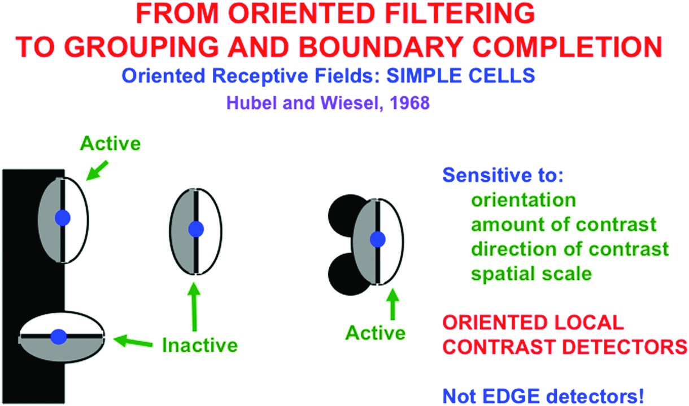

**그림 4.15의 핵심:**
- 단순 세포는 **방향성 수용장(oriented receptive field)**을 가짐
- 방향, 대비량, 대비 방향, 공간 스케일에 민감
- **가장자리 검출기가 아닌 방향성 국소 대비 검출기!**

### BCS와 FCS

Grossberg는 경계 모델을 **Boundary Contour System(BCS)**이라 명명했습니다:
- 가장자리, 질감, 음영에 대해 형태에 민감하게 반응
- 단순한 "가장자리 검출기" 모델이 아님

표면 모델은 **Feature Contour System(FCS)**이라 명명했습니다:
- 가시적 표면 속성(밝기, 색상, 깊이)이 특징 윤곽의 채우기를 통해 구성됨

---

## 9. FACADE 이론 vs. 소박 실재론

BCS와 FCS를 포함하는 전체 시각 이론을 **FACADE 이론**이라 합니다.

**FACADE** = **F**orm-**A**nd-**C**olor-**A**nd-**DE**pth

이 이름이 선택된 두 가지 이유:

1. 개별 뇌 세포가 형태, 색상, 깊이의 **다중(multiplex)** 속성을 결합하여 가시적 표현을 코딩
2. 시각 세계가 "실제"처럼 보이지만, 뇌의 내부 표현은 세계와 동형(isomorphic)이 **아님**
   - 우리는 소박 실재론(Naïve Realism)의 철학적 함정에 빠지지 않고도 "실제" 세계를 경험할 수 있음
   - 시각 표현은 서부 영화의 세트장 배경(facade)과 마찬가지로 "실제 세계"와의 동형성이 제한적

---

## 10. 단순 세포와 반파 정류

### 수용장과 단순 세포 모델


**그림 4.16 해설:**
- 단순 세포의 수용장은 두 반쪽으로 나뉨: "밝은" 쪽과 "어두운" 쪽
- 밝은 쪽에 빛이 오면 흥분, 어두운 쪽에 빛이 오면 억제
- 순 활동이 **역치(threshold)**를 초과하면 출력 생성

이것을 **반파 정류(half-wave rectification)**라 합니다:

$$\text{출력} = \max(0, \text{순 활동})$$

수용장의 모양은 **Gabor 필터** 또는 **가우시안 차이(Difference-of-Gaussian)** 필터로 모델링됩니다.

### 홀수(odd)와 짝수(even) 수용장

- **홀수 수용장** (그림 4.16): 가장자리에 더 잘 반응
- **짝수 수용장**: 선분 같은 양면 밝기 변화에 더 잘 반응

Hubel과 Wiesel은 1981년 노벨상을 수상한 고전적 실험에서 두 유형 모두를 보고했습니다.

---

## 11. 복잡 세포: 무양식 경계 검출기


**복잡 세포(complex cells)**는 같은 위치에서 반대 대비 극성의 단순 세포 쌍의 출력을 합산합니다:

$$\text{복잡 세포 출력} = |[\text{밝음→어둠}]^+| + |[\text{어둠→밝음}]^+|$$

이것은 **전파 정류(full-wave rectification)**입니다. 결과적으로:

| 복잡 세포의 속성 | 의미 |
|----------------|------|
| **대비 극성 불감성** | 밝은→어두운, 어두운→밝은 모두에 반응 |
| **위치, 방향, 크기, 대비량에 민감** | 경계 완성의 가장 정보적 신호 생성 |
| **극성과 파장에 불감** | 특정 질(qualia)을 감지할 수 없음 |

> **"모든 경계는 보이지 않는다"**: 복잡 세포가 대비 극성을 풀링하기 때문에, 경계 시스템은 특정 시각적 질을 감지할 수 없습니다. 이것이 **상보적** 표면 시스템이 필요한 이유입니다.

### 양안 시차(Binocular Disparity)


두 눈의 이미지가 약간 다른 위치에 투영되며, 이 위치 차이(**양안 시차**)가 깊이의 강력한 단서입니다.

### V1의 층상 피질 회로


- **Layer 4**: 단안 단순 세포
- **Layer 3B**: 양안 단순 세포 (양쪽 눈의 같은 극성 입력을 받음)
- **Layer 2/3**: 복잡 세포 (반대 극성의 양안 단순 세포 출력을 풀링)
- **억제 세포(빨간색)**: 양쪽 눈의 대비가 거의 같을 때만 양안 융합이 일어나도록 보장

---

## 12. Glass 패턴: 단거리 vs 장거리 협력


**Glass 패턴**(Leon Glass, 1969)은 단거리와 장거리 협력의 차이를 선명하게 보여줍니다:

| | Glass 패턴 (왼쪽 열) | 역대비 Glass 패턴 (오른쪽 열) |
|---|---|---|
| **점 쌍의 대비** | 같은 극성 (흰-흰) | 반대 극성 (흰-검) |
| **단순 세포 반응** | 점 쌍을 감지 → 방향 정보 추출 | 반대 극성이므로 감지 불가 |
| **복잡 세포 반응** | 원형 분포 → 원형 경계 완성 가능 | 방향 정보 없음 → 원형 아닌 방사형 |
| **지각** | 원형 경계 | 원형 경계 사라짐 |

**핵심 결론**: 단거리 처리(단순 세포)는 **같은 대비 극성**의 신호만 풀링하지만, 장거리 처리(바이폴 세포)는 **양쪽 극성** 모두로부터 경계를 완성할 수 있습니다.

---

## 13. 위치-방향 불확실성 원리

### Grossberg의 불확실성 원리 (1984)

> **위치-방향 불확실성 원리**: 방향적 확실성은 선분 끝과 모서리에서 위치적 불확실성을 의미한다.


**그림 4.21 해설:**
- **막대 끝(bar end)**: 충분히 두꺼워서 수직/수평 단순 세포가 모두 반응 가능
- **선분 끝(line end)**: 너무 가늘어서 수직 방향 단순 세포만 반응하고, 수평 방향은 감지 불가
- 결과: 선분 끝에 **end gap**(경계 틈)이 발생

### End Gap 시뮬레이션


**그림 4.22의 두 가지 중요한 속성:**
1. **위치적 초과민성(positional hyperacuity)**: end cut이 실제 선분 끝의 정확한 위치에서 발생
2. **방향적 퍼짐(orientational fuzziness)**: 수직과 수직에 가까운 여러 방향의 end cut이 생성됨

---

## 14. 지각적 재난: 통제되지 않는 채우기


**그림 4.23이 보여주는 재난:**
- 선분 끝에 end gap이 있으면, BCS 경계에 구멍이 생김
- FCS에서 조명 할인 후 남은 특징 윤곽 신호가 이 구멍으로 퍼져나감
- 결과: **모든 선분 끝에서 색과 밝기가 통제 불능으로 확산!**


> **핵심**: end cut은 **픽셀 단위**가 아닌 **패턴 단위**의 변환입니다. 개별 뉴런이 아닌, 수직 반응의 **전역적 맥락**에 민감한 패턴-대-패턴 맵이 필요합니다.

---

## 15. 모든 선분 끝은 환상이다!

시각 시스템은 end gap을 BCS의 다음 처리 단계에서 **닫아야** 합니다. 이렇게 완성된 경계를 **end cut**이라 합니다.

> **"모든 선분 끝은 환상이다!"** — End cut은 뉴런이 아무런 상향식(bottom-up) 입력을 받지 않는 위치에서 구성되기 때문에, 시각적 환상입니다.

이것은 조명 할인과 마찬가지로 **불확실성의 계층적 해결**의 사례입니다:
- 조명 할인: 정보 손실 → 채우기로 복원
- End gap: 정보 손실 → end cut으로 복원

### 로마 서체의 세리프

흥미롭게도, Times New Roman 같은 서체가 선분 끝에 작은 **세리프(serif)**를 붙이는 것은, 뇌가 end cut을 만들 필요를 줄여주어 더 쉽게 읽을 수 있게 해줍니다!

---

## 16. 패턴으로 계산하기

### 단거리 경쟁: 공간과 방향에 걸쳐


End cut 생성을 위한 **두 단계의 단거리 경쟁**:

| 단계 | 유형 | 설명 |
|------|------|------|
| **1단계** | 공간 경쟁 | 같은 방향, 다른 위치의 세포 간 경쟁 (on-center off-surround) |
| **2단계** | 방향 경쟁 | 같은 위치, 다른 방향의 세포 간 경쟁 (push-pull) |

**초복잡 세포(hypercomplex cells)** 또는 **끝정지(endstopped) 복잡 세포**:
- Hubel과 Wiesel이 발견
- 입력 길이에 민감하여, 수용장을 넘는 입력에는 덜 반응
- 이 속성이 end cut 생성의 핵심

### End Cut의 두 속성

1. **위치적 초과민성**: 실제 선분 끝의 정확한 위치에서 발생 (서브픽셀 정밀도)
2. **방향적 퍼짐**: 선분에 수직 또는 거의 수직인 방향들의 퍼진 대역으로 형성

### 신경생리학적 증거

1984년 von der Heydt, Peterhans, Baumgartner의 유명한 논문:
- 원숭이 V1의 단순 세포와 복잡 세포는 선분 끝에 반응하지 **않음**
- 더 높은 V2 영역의 세포가 선분 끝에 **반응함** — end cut 예측과 일치!
- 1989년 논문에서 이 end cut 반응이 방향적 퍼짐을 나타냄을 확인

---

## 17. 바이폴 세포와 장거리 협력적 경계 완성

### 네온 색 확산 중의 End Cut


End cut의 두 단계 단거리 경쟁이 네온 색 확산의 end gap을 만들고, 이 end gap을 통해 빨간색이 흘러나옵니다.

### 장거리 협력적 그루핑


장거리 상호작용이 필요한 이유:
- 맹점, 망막 혈관, Kanizsa 사각형 등에서 공선적(collinear) 유도인자 사이의 틈을 메워야 함
- 이 과정이 **경계 완성(boundary completion)**

### 바이폴 세포


Grossberg(1984)가 예측한 **바이폴 세포(bipole cell)**:
- 수용장이 두 개의 방향성 가지(pole A, pole B)로 나뉨
- 대부분 두 가지가 공선적(collinear)으로 배열
- **퍼지 AND 게이트**: 양쪽 가지 모두에서 입력을 받아야 발화

바이폴 세포의 핵심 속성:
- 경계를 유도인자 **쌍 사이에서 안쪽으로(inwardly)** 형성
- 경계와 표면의 상보적 속성 중 하나 (그림 3.7)

### 신경생리학적 증거


von der Heydt, Peterhans, Baumgartner(1984)의 V2 실험:
- end cut을 보고한 같은 논문에서 바이폴 속성을 가진 세포도 보고
- 수용장의 양쪽 극(pole) 모두가 활성화되어야 발화


Bosking et al.(1997)의 V1 해부학적 데이터:
- 두 개의 수용장/극을 가진 장거리 수평 연결이 확인됨
- 피질 Layer 2/3에서 주로 발견

### 바이폴 수용장의 예측과 증거


| 연구자 | 연도 | 기여 |
|--------|------|------|
| Grossberg | 1984 | 바이폴 세포 예측 |
| Grossberg & Mingolla | 1985 | 수용장 상세 모델 |
| Field, Hayes, Hess | 1993 | "association field" — 유사한 구조 |
| Heitger & von der Heydt | 1993 | 신경생리학적 모델 |
| Williams & Jacobs | 1997 | 컴퓨터 비전 응용 |
| Kellman & Shipley | 1991 | "relatability" 조건 — 곡선 보간 |

### 협력-경쟁 피드백이 최종 그루핑을 선택

충분히 단순한 장면에서는 바이폴 세포만으로 좋은 경계가 생성되지만, 복잡한 장면에서는 **CC Loop(cooperative-competitive loop)**가 필요합니다:

1. 활성 바이폴 세포가 같은 방향/위치의 초복잡 세포를 흥분시킴 (피드백)
2. 이 양성 피드백이 특정 그루핑을 강화
3. 강화된 초복잡 세포들이 다른 방향/위치의 세포와 경쟁
4. **가장 강한 그루핑이 승리**, 약한 그루핑은 억제

이 CC Loop는 **비매개변수적(nonparametric)**, **실시간 자율(real-time autonomous)** 과정입니다.

---

## 18. 의식 다시!: 세 가지 불확실성의 계층적 해결

시각적 의식의 관점에서 요약:

| 해결 | 메커니즘 | 불확실성 극복 방식 |
|------|----------|-----------------|
| **1차** | 공간·방향 경쟁 | 단순 세포의 경계 불확실성 → end cut 생성 |
| **2차** | 바이폴 그루핑 피드백 | 초기 퍼진 그루핑의 불확실성 → 날카로운 경계 선택 |
| **3차** | 표면 채우기 | 조명 할인에 의한 불확실성 → 표면 밝기/색상 복원 |

> 이 세 가지 불확실성이 모두 해결된 후에야, 경계가 완성되고 표면이 채워져, 적응적 행동을 제어하기에 충분히 완전하고 안정적인 시각 표현이 생성됩니다. 이 표현은 **표면-감싸개 공명(surface-shroud resonance)**에 의해 의식적 인식으로 표시됩니다.

---

## 19. 이중 필터와 그루핑 네트워크


BCS 전체 회로는 두 가지 기본 구성 요소로 분해됩니다:

### 이중 필터(Double Filter)
1. **1차 필터**: 단순 세포의 방향성 수용장
2. **2차 필터**: 공간 경쟁 (endstopping) — 더 큰 공간 스케일에서 작동

### 그루핑 네트워크(Grouping Network)
- 바이폴 세포와 초복잡 세포 간의 **협력-경쟁 피드백** (CC Loop)
- 최종 경계 그루핑을 선택

이중 필터와 그루핑 네트워크는 함께 많은 데이터를 설명하며, 질감 분리, 초과민성, 환상적 윤곽 강도 등 다양한 현상을 예측합니다.

---

# 후반부: 3D 시각과 전경-배경 분리 (pp. 153-183)

---

## 20. 불확실성과 함께 살기

뇌의 계산 단위는 종종 공간적으로 분포된 세포 네트워크의 **활성화 패턴**입니다. 초기 처리 단계에서 이 패턴은 네트워크가 처리할 수 있는 **가능성의 범위**를 나타냅니다.

핵심 원리:
- 불확실성은 처리의 자연스러운 부분이며, 나중 단계에서 충분한 맥락적 증거가 축적된 후 해결됨
- 활성화 패턴은 정규화되어 **실시간 확률 분포**의 역할을 함
- 더 큰 활성화 = 더 높은 확률 → 확률적 의사결정이나 추론

---

## 21. 베이즈 없는 뇌

많은 인지과학자들이 **베이지안 통계**를 뇌 기능 설명에 사용하려 하지만, Grossberg는 이에 대한 한계를 지적합니다:

| 베이지안 접근 | 뇌의 실제 방식 |
|-------------|-------------|
| 사전 확률(prior)이 필요 | 희귀하지만 중요한 사건에 적응적 반응 |
| 정상성(stationarity) 가정 | 비정상적(nonstationary) 세계에 적응 |
| 모델 설계 원리 제공 안 함 | 자기 조직화 패턴으로 적응적 반응 달성 |
| 특정 물리적 과정 설명 안 함 | 신경 메커니즘의 구체적 설명 |

> 뇌는 고전적 확률 형식론을 **넘어서는** 방식으로 정보를 처리합니다. 뇌의 **자기 조직화 패턴**은 끊임없이 변하는 세계에 적응하면서도, 실시간 확률적 의사결정의 특성을 가집니다.

---

## 22. 질감 분리에서의 창발적 특징


Jacob Beck의 질감 실험(Beck, Prazdny & Rosenfeld, 1983):

| 질감 유형 | 구성 | 그루핑 메커니즘 |
|---------|------|-------------|
| **삼분할(tripartite)** (상단) | 수직선과 대각선 | **공선적(collinear)** 그루핑 |
| **이분할(bipartite)** (하단 왼쪽) | U자와 역U자 | **수직** 환상적 윤곽 |
| **이분할(bipartite)** (하단 오른쪽) | U자와 역U자 | **대각** 그루핑 |

CC Loop는 공선적, 수직, 대각 그루핑을 모두 생성할 수 있으며, 어떤 그루핑이 선택되는지는 유도인자의 전역적 공간·방향 분포에 따릅니다.

### 이중 필터로 질감 데이터 설명


Sutter, Beck, Graham(1989)의 **complex channels** 모델과 BCS의 비교:
- Complex channels 모델은 질감 (g)와 (i)에 대해 **잘못된** 구별성 순서를 예측
- BCS는 바이폴 세포의 장거리 그루핑을 포함하여 **올바른** 순서를 예측

---

## 23. 공간적 불투과성과 T-교차점

### 차폐 물체의 공간적 불투과성

BCS 모델의 핵심 속성: **공간적 불투과성(spatial impenetrability)**

이 원리: 수직 초복잡 세포의 출력이 같은 위치의 수평 바이폴 세포를 **억제**하고, 그 반대도 마찬가지입니다.

결과:
- 한 방향의 경계가 다른 방향의 경계 완성을 차단
- 차폐된 물체의 경계가 앞에 있는 물체를 **관통하지 못함**
- T-교차점에서의 전경-배경 분리가 가능해짐


**그림 4.35**: 왼쪽 이미지에서는 배경의 수평 경계가 수직 바이폴 세포에 의해 억제되어 pac-men 간의 그루핑이 방해되지만, 오른쪽에서는 수직 경계가 pac-men 유도인자와 공선적이어서 Kanizsa 사각형이 형성됩니다.

---

## 24. 그래피티 예술가와 Mooney 얼굴


**Banksy의 예술적 선택과 BCS:**
- 매끄러운 벽에서는 스텐실 뒤 영역을 채우지 않아도 관찰자의 지각이 전경을 분리
- 벽돌 벽에서는 벽돌의 수평 가장자리가 공간적 불투과성을 활성화 → 환상적 윤곽 방해
- 따라서 Banksy는 벽돌 벽에서만 추가 색칠을 함

**Mooney 얼굴**(Craig Mooney, 1957):
- 밝기를 이진화한 흑백 사진
- 바이폴 세포의 장거리 협력으로 턱과 볼 사이에 환상적 윤곽 생성
- 벽돌 격자로 Mooney 얼굴을 오버레이하면, 공간적 불투과성이 환상적 윤곽을 방해하여 얼굴 인식이 어려워짐

---

## 25. 초과민성과 공간 위치 결정

BCS 모델은 뇌가 어떻게 수용장 크기보다 **더 정밀한** 위치 추정(**초과민성, hyperacuity**)을 달성하는지 설명합니다.

Badcock & Westheimer(1985)의 실험:
- 플랭킹 라인(flanking line)이 테스트 라인의 지각된 위치를 변화시킴
- **같은 대비 극성**: 끌림(attraction) → 단순 세포 수용장 내 풀링
- **반대 대비 극성**: 반발(repulsion) → 공간 경쟁의 억제 효과

이 결과는 반대 극성 단순 세포가 복잡 세포에 반파 정류 출력을 보내고, 그 후 더 넓은 공간 경쟁을 활성화한다는 가설을 지지합니다.

---

## 26. 환상적 윤곽 강도의 역U자 곡선


### Inverted-U 현상

유도인자(pac-men)의 밀도가 증가하면:
1. **처음**: 더 많은 입력 → 바이폴 세포 활동 증가 → 윤곽 강도 증가
2. **나중**: 유도인자가 너무 가까워짐 → 단거리 공간 경쟁이 강해짐 → 바이폴 세포 순 입력 감소
3. **결과**: 윤곽 강도가 역U자(inverted-U) 곡선을 따름

이것은 **협력과 경쟁의 균형**의 또 다른 예입니다.

### 아날로그 일관성(Analog Coherence)

승리한 그루핑은 **전부 아니면 전무(all-or-none)**가 아닌 **아날로그** 값을 가져야 합니다:
- 그루핑의 강도는 유도인자의 수, 위치, 방향, 상대적 대비에 민감해야 함
- 이 속성을 **아날로그 일관성**이라 명명

이 속성을 강건하게 달성하려면, 시각 피질의 **층상 구조**가 필수적입니다.

---

## 27. 아날로그 일관성과 층상 피질 구조


### LAMINART 모델

1997년 Grossberg, Mingolla, Ross가 제안한 **LAMINART 모델**:
- 층상 피질의 상향식, 수평, 하향식 회로를 통합
- ART(적응적 공명 이론)의 하향식 기대와 주의가 어떻게 층상 회로에서 실현되는지 설명

1999년에는 기대와 주의를 위한 하향식 회로도 포함하도록 확장:

| 피질 영역 | V1 | V2 |
|---------|-----|-----|
| **Layer 6** | LGN으로부터 입력 | V1으로부터 입력 |
| **Layer 4** | 단안 단순 세포 | 이중 필터 처리 |
| **Layer 2/3** | 복잡 세포, 바이폴 세포 | 더 큰 스케일의 그루핑 |

### 3D LAMINART 모델

1987-1997년 사이에 2D BCS/FCS를 3D로 확장 → **FACADE 모델** (1994, 1997)
이후 비층상 FACADE를 층상화 → **3D LAMINART 모델**
현재 시각 피질 작동 방식에 대한 가장 진보된 이론

### 보편적 설계

같은 층상 회로의 변형이 시각, 음성, 인지 모두에 적용:
- **cARTWORD 모델**: 음성 인식 (2011-2016)
- **LIST PARSE 모델**: 작업 기억 (2008)
- **lisTELOS 모델**: 목록 청킹 (2011)

---

## 28. Koffka-Benussi 고리와 Kanizsa-Minguzzi 고리

### Koffka-Benussi 고리


두 개의 균일한 밝기 배경 영역과 그 사이에 놓인 고리:
- **왼쪽**: 구분선 없음 → 고리의 양쪽 반이 다른 밝기로 보임 (**밝기 대비**)
- **오른쪽**: 수직선이 고리를 관통 → 채우기가 차단되어 양쪽 반의 밝기가 달라짐

이 효과는 BCS/FCS 상호작용의 자연스러운 결과입니다:
- 경계가 채우기의 장벽 역할 → 각 반의 특징 윤곽이 독립적으로 채워짐
- 더 밝은 배경이 인접 반고리의 특징 윤곽 활동을 **더 많이** 억제

### Kanizsa-Minguzzi 고리


**비정상적 밝기 분화(anomalous brightness differentiation)** 현상:
- 중앙 검은 원반, 둘레 검은 띠, 그 사이에 흰 고리
- 두 개의 방사선이 고리를 불균등한 부채꼴로 나눔
- 놀랍게도, **작은 부채꼴이 약간 더 밝게** 보임!

설명: 두 방사선이 유도하는 특징 윤곽의 밝기 증강 효과가 고리 전체에서 동일하지만, **채우기 시 면적 평균화** 때문에 작은 영역에서 효과가 더 집중됨.


---

## 29. 2D에서 3D로: 깊이 지각

### T-교차점 민감성과 전경-배경 분리


**그림 4.43(a)**: T-교차점에서 바이폴 세포가 어떻게 end gap을 만드는지:
- 수평 바이폴: 양쪽 가지 모두에서 입력 → 강하게 발화
- 수직 바이폴: 한쪽 가지만 입력 → 약하게 발화 또는 발화 안 함
- 강한 수평 경계가 약한 수직 경계에 end gap 생성 → Type 2 end gap
- 색이 end gap을 통해 퍼져나감 → **전경-배경 지각의 시작**

**그림 4.43(b)**: Necker 큐브 — 2D 그림에서 양립적(bistable) 3D 지각
**그림 4.43(c)**: Peter Tse(2005) — 주의를 한 원반에 집중하면 더 가깝고 어둡게 보임

---

## 30. 경계는 채우기 생성기이자 장벽: 이중 대립 경쟁

### FACADE 매크로 회로


경계와 표면 형성의 주요 단계:

```
LGN → V1 (단안 경계/표면) → V2 Layer 4 (양안 경계)
                            → V2 Layer 2/3 (양안 경계, 그루핑)
                            → V2 (단안/양안 표면)
                            → V4 (양안 표면)
```

### ON/OFF 특징 윤곽과 채우기


경계 윤곽이 특징 윤곽과 **위치적으로 정렬(positionally aligned)**될 때:
- 경계가 **채우기 생성기** 역할: ON/OFF 특징 윤곽이 경계 양쪽에서 채워짐
- 경계가 **채우기 장벽** 역할: 색/밝기가 경계를 넘어 퍼지지 못함

### 이중 대립 네트워크(Double Opponent Network)


두 단계의 경쟁으로 구성:
1. **1단계**: 각 ON/OFF FIDO 내에서 on-center off-surround 경쟁 (공간 경쟁)
2. **2단계**: ON FIDO와 OFF FIDO 사이의 대립 색 경쟁 (색 대비)

이 네트워크가 Helmholtz(1866)가 관찰한 **조직 대비(tissue contrast)** 현상을 설명합니다:
- 회색 원반 주위에 빨간 띠 → 회색이 녹색으로 보임
- 검은 선을 그리면 → 다시 회색으로 보임 ("모든 선은 두꺼운 것이다!")

---

## 31. 닫힌 경계만이 가시적 표면 지각을 만든다

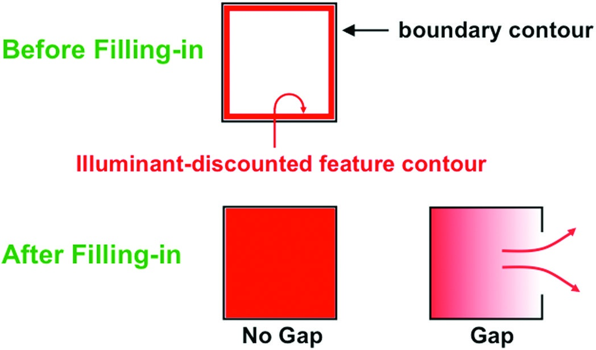

**그림 4.48의 핵심:**
- **닫힌 경계** (상단, 왼쪽): 특징 윤곽이 경계 안에 갇혀 채우기 발생
- **열린 경계** (하단, 오른쪽): 틈을 통해 색이 양쪽으로 퍼져 대비가 사라짐

이 속성은 3D 시각으로 일반화됩니다:
- 닫힌 경계와 열린 경계가 **같은 위치에서 다른 깊이**에 형성될 수 있음
- 닫힌 경계가 형성된 깊이에서만 가시적 표면 지각이 가능

---

## 32. 다빈치 입체시

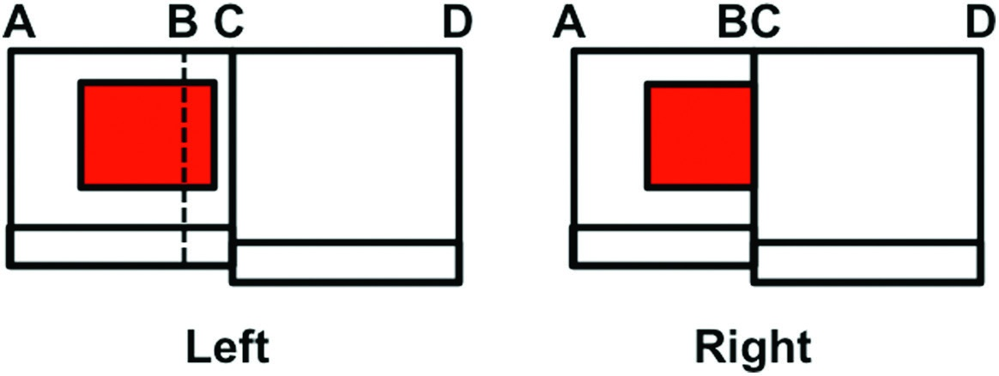

**다빈치 입체시(DaVinci stereopsis)**:
- 가까운 표면에 의해 먼 표면의 일부가 한쪽 눈에만 보이는 현상
- Leonardo da Vinci(1452-1519) 이래 알려져 있음

그림 4.49의 장면:
- 벽 CD가 관찰자에게 더 가까움
- 왼쪽 눈은 벽 AC의 더 많은 부분을 봄 (BC 영역 포함)
- 오른쪽 눈은 CD에 의해 BC가 가려짐

핵심 질문: 단안으로만 보이는 BC 영역이 어떻게 양안으로 보이는 AB 영역과 같은 깊이를 상속하는가?

답: 경계가 채우기 생성기이자 장벽이라는 속성 + 닫힌 경계에서만 채우기 가능

---

## 33. 깊이 선택적 경계 표현의 생성

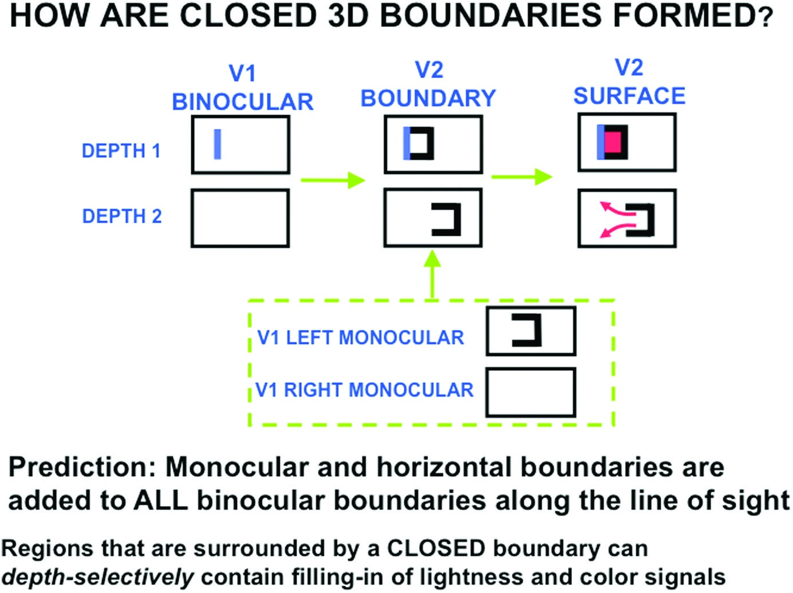

**그림 4.50의 핵심 예측** (Grossberg, 1994):
- 단안 및 수평 경계는 **모든 깊이의 시선(line of sight)**을 따라 투사됨
- 양안 경계(시차 정보 포함)와 결합하면:
  - **Depth 1**에서만 닫힌 경계 형성 (양안 + 단안 경계의 결합)
  - 다른 깊이에서는 열린 경계만 형성

> 이 메커니즘이 다빈치 입체시, 전경-배경 분리, 상보적 일관성을 모두 가능하게 합니다.

---

## 34. 표면 윤곽과 전경-배경 분리

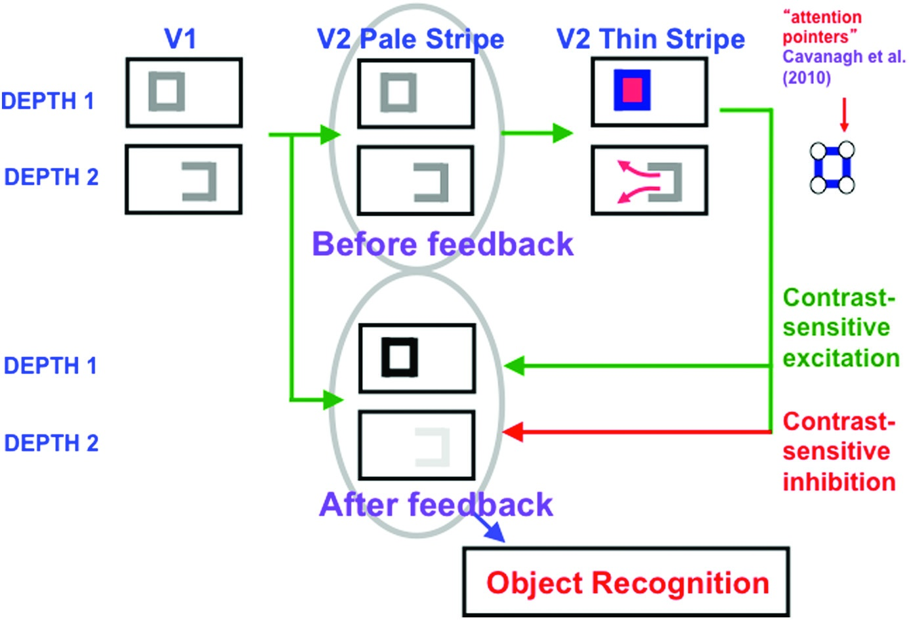

### 표면 윤곽(Surface Contour) 신호

닫힌 경계 내에서 채워진 표면 → **표면 윤곽** 신호 생성 → 경계 표현으로 피드백:
- **On-center 흥분(녹색)**: 성공적으로 채워진 표면의 경계를 **강화**
- **Off-surround 억제(빨간색)**: 같은 위치의 더 먼 깊이 경계를 **억제** (**경계 가지치기, boundary pruning**)

### 경계 가지치기가 자동으로 전경-배경 분리 시작

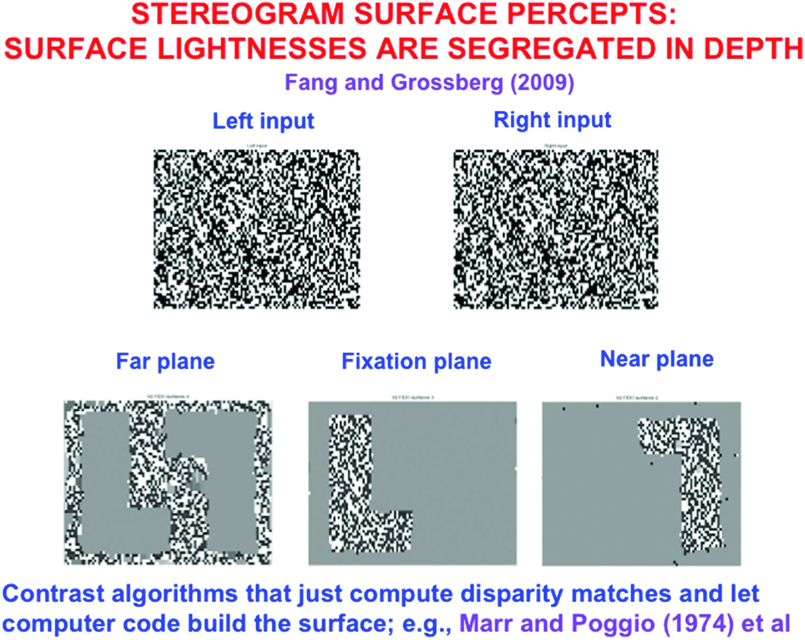

경계 가지치기의 효과:
1. 상보적 일관성 보장 (일관된 경계만 강화)
2. 불필요한 경계 제거 (전경-배경 분리)
3. **위치 내(within position) 및 깊이 간(across depth)** 작용

Fang & Grossberg(2009)의 랜덤 도트 스테레오그램 시뮬레이션:
- 두 개의 단안 이미지 → 세 개의 깊이 분리된 표면 표현

> **전경-배경 분리는 상보적 일관성의 자동적 결과입니다!**

---

## 35. 근접성-밝기 공변: 밝은 Kanizsa 사각형이 더 가까워 보이는 이유

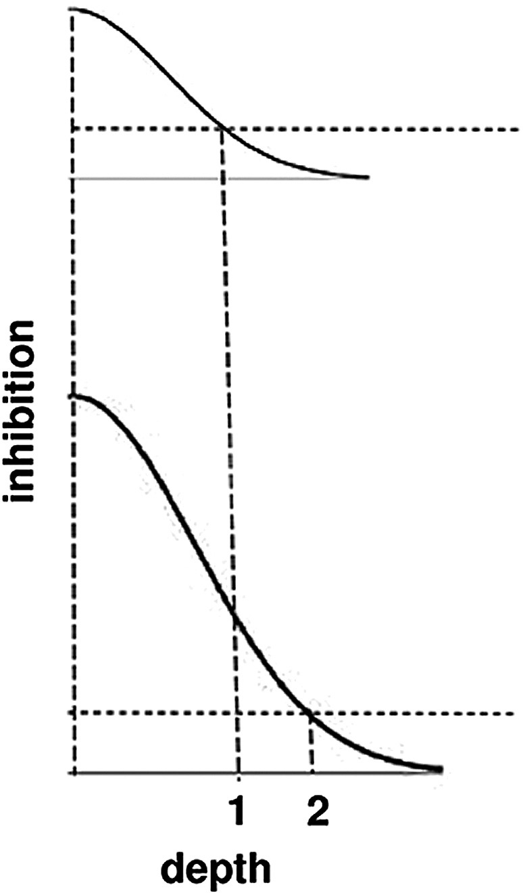

**근접성-밝기 공변(proximity-luminance covariance)**:
- 더 밝은 물체가 더 가까워 보이는 현상
- Kanizsa 사각형에서도 관찰: 유도인자를 더 추가하면 더 밝고 더 가까워 보임

설명:
1. 밝은 Kanizsa 사각형 → 더 큰 채워진 활동 → 더 큰 표면 윤곽 신호
2. 더 큰 표면 윤곽 → 더 강한 경계 가지치기 억제 신호 (그림 4.51, 4.53)
3. 억제 신호의 크기는 깊이 차이가 증가함에 따라 **감소** (off-surround의 거리 감쇠)
4. 결과: 더 밝은 표면 → 더 많은 깊이의 경계가 억제됨 → 배경이 더 먼 깊이로 밀려남 → **사각형이 더 가까워 보임**

---

## 36. V2와 V4: 가림과 투명성

### V2와 V4의 역할 분담

| 영역 | 기능 |
|------|------|
| **V2** | 가려진(occluded) 물체의 경계/표면 완성 → **무양식적(amodal) 인식** |
| **V4** | 가려지지 않은(unoccluded) 불투명 표면의 가시적 표현 → **양식적(modal) 시각** |

### 왜 모든 가리는 물체가 투명하게 보이지 않는가?

V2와 V4의 협력으로 해결:
- V2: 가려진 부분의 경계와 표면을 완성 (무양식적, 보이지 않음)
- V4: 가려지지 않은 불투명 표면만 선택하여 가시화
- **표면-감싸개 공명**(V4 ↔ PPC) → 의식적 시각

### 투명성 지각

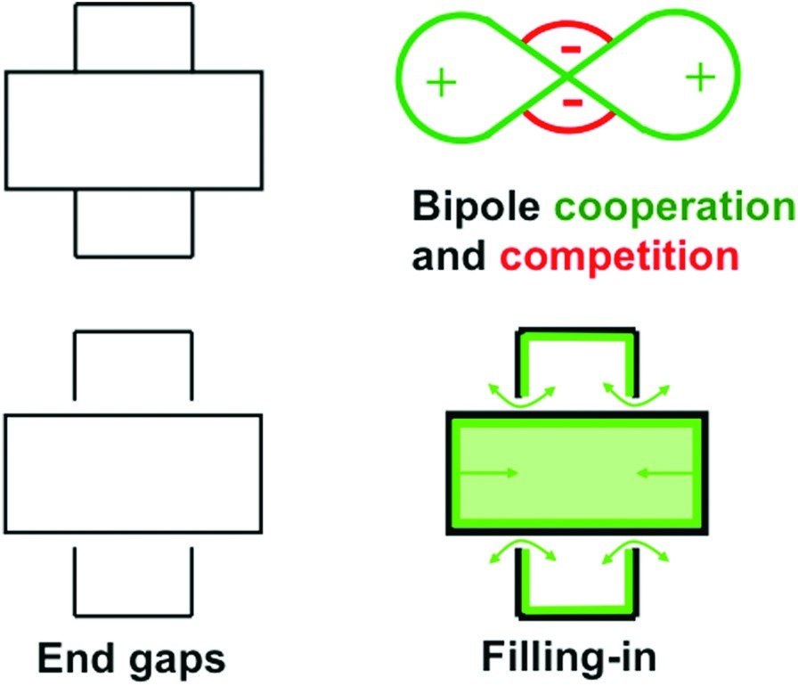

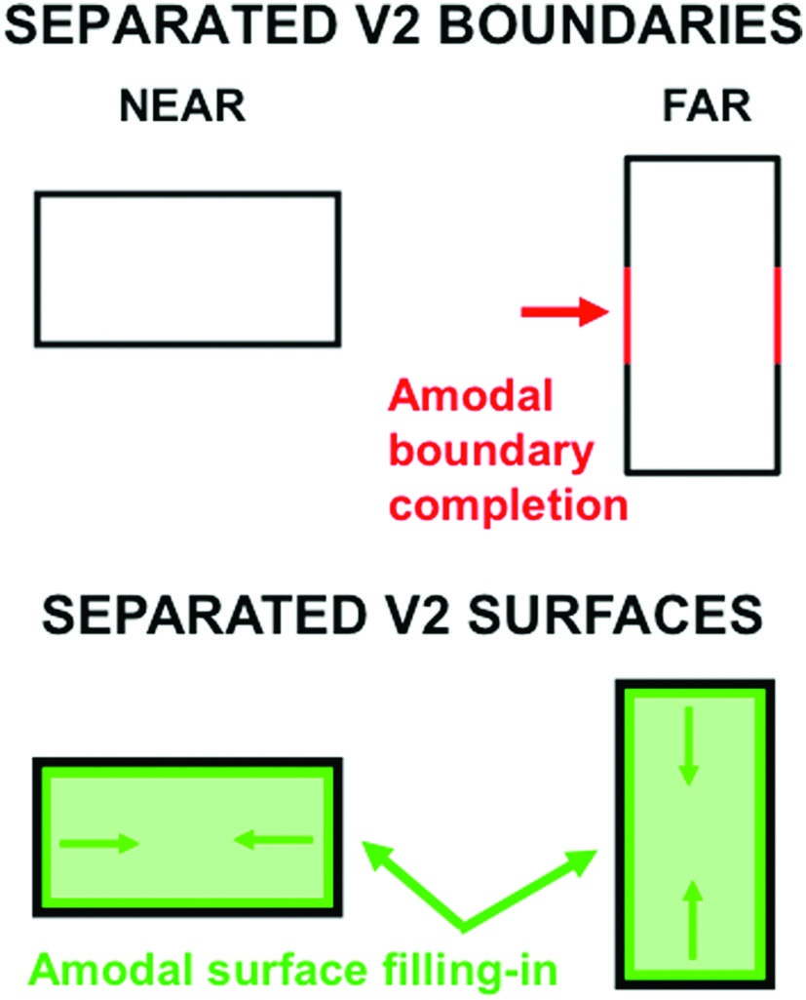

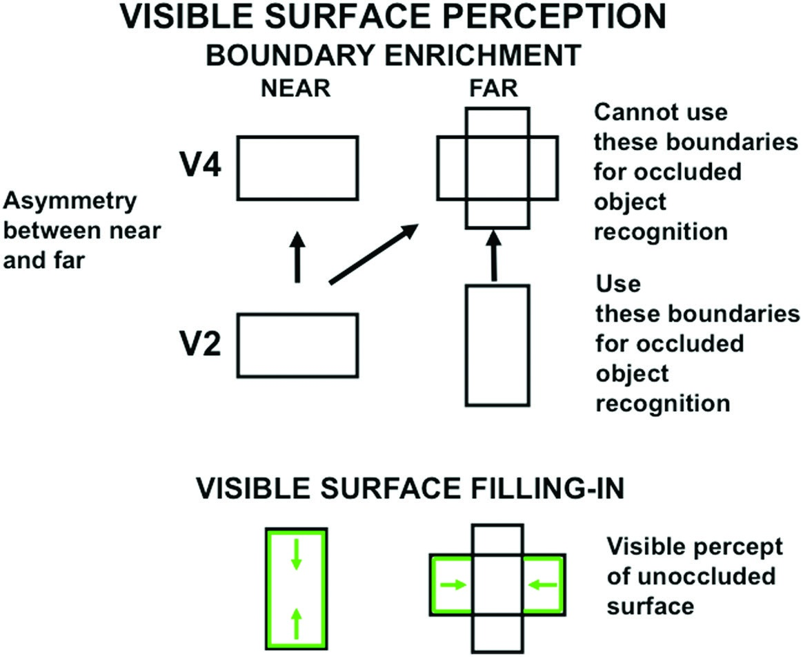

**경계 강화(boundary enrichment)**: V2의 가까운 깊이 경계가 V4의 먼 깊이 경계에도 추가되어, 가까운 표면이 불투명하게 보이도록 보장합니다.

### 투명성의 조건

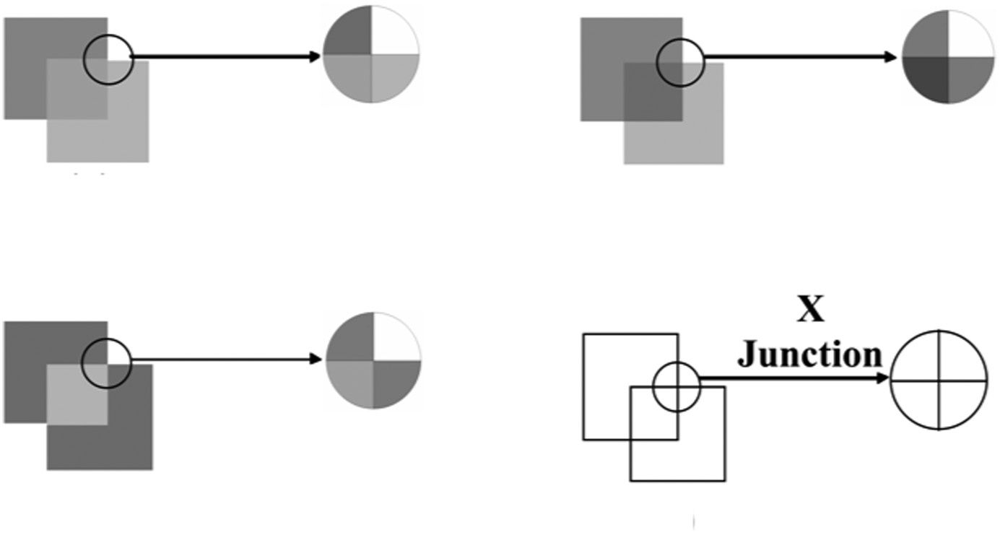

같은 기하학적 구조(두 개의 교차 사각형)에서 밝기만 바꾸면:
- **단양식 투명성**: 한 사각형이 항상 앞에 보임
- **양립적 투명성**: 주의에 따라 앞뒤가 바뀜
- **불투명 2D 표면**: 깊이 층화 없음

차이의 핵심은 X-교차점에서의 **대비 극성** 관계:
- 극성이 보존됨 → 한 경계가 더 강함 → 투명성
- 극성이 반전됨 → 양쪽 경계 모두 강함 → 불투명

### 3D LAMINART의 투명성 설명

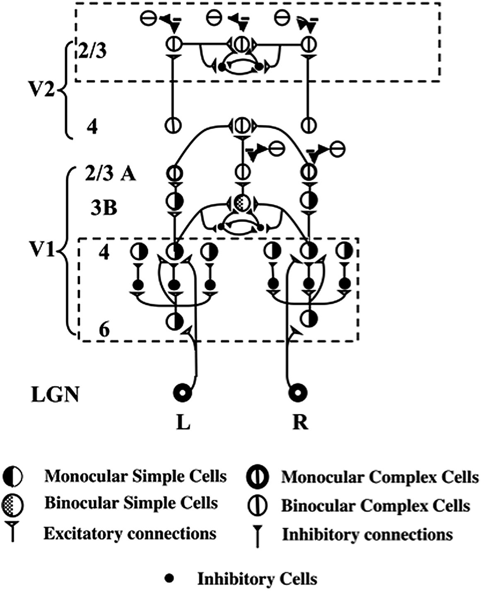

V1의 Layer 4에서 **단안, 방향 선택적, 극성 특이적 공간 경쟁**이 일어남:
- 이 경쟁은 X-교차점에서 극성을 보존하는 경계와 극성을 반전하는 경계를 다르게 처리
- 결과: end gap이 생기는 위치가 투명성/불투명성을 결정

---

## 37. 최소 해부학의 방법과 다음 단계

### 원칙적 점진적 이론화(Principled Incremental Theorizing)

Grossberg의 방법론적 결론:

> "나이가 들수록 나의 모델은 더 똑똑해지고, 나는 더 멍청해진다. 덕분에 함께 유용한 이론적 작업을 계속할 수 있다!"

**최소 해부학의 방법(Method of Minimal Anatomies)**:
- 목표 데이터를 설명할 수 있는 **최소한의** 모델 버전을 시뮬레이션
- 이 절약성이 메커니즘의 핵심 조합을 식별하게 해줌
- 점진적으로 더 많은 데이터를 설명하도록 확장

### 다음 단계 (5장 이후)

이 장은 주로 정적 2D/3D 시각에 초점을 맞추었습니다. 다음 장들에서는:
- **시간에 따라 변하는** 신호 처리 (움직이는 물체)
- **What 경로**: 물체 학습, 인식, 예측, 주의, 작업 기억
- **Where 경로**: 공간 처리
- 두 경로 간의 상호작용

---

## 핵심 용어 정리

| 영어 | 한국어 | 설명 |
|------|--------|------|
| Filling-in | 채우기 | 특징 윤곽이 경계 내에서 확산되어 연속적 표면 표현을 생성 |
| BCS | 경계 윤곽 시스템 | 가장자리, 질감, 음영에서 경계를 추출하는 시스템 |
| FCS | 특징 윤곽 시스템 | 밝기, 색상, 깊이의 가시적 표면을 생성하는 시스템 |
| FACADE | 형태-색상-깊이 이론 | BCS+FCS를 통합한 시각 이론 |
| LAMINART | 층상 ART 모델 | 층상 피질 회로에 기반한 경계 완성 모델 |
| 3D LAMINART | 3D 층상 ART | FACADE의 층상 피질 실현 |
| CC Loop | 협력-경쟁 루프 | 바이폴-초복잡 세포 간의 피드백 네트워크 |
| FIDO | 채우기 도메인 | 깊이 선택적 표면 채우기가 일어나는 영역 |
| End cut | 끝 절단 | 선분 끝의 경계 틈을 메우는 환상적 경계 |
| End gap | 끝 틈 | 선분 끝에서 발생하는 경계 불연속 |
| Bipole cell | 바이폴 세포 | 두 개의 방향성 수용장 가지를 가진 장거리 그루핑 세포 |
| Hypercomplex cell | 초복잡 세포 | 입력 길이에 민감한 끝정지 세포 |
| Double opponent | 이중 대립 | ON/OFF FIDO 간의 색 대비 처리 |
| Boundary pruning | 경계 가지치기 | 표면 윤곽의 피드백으로 불필요한 경계 억제 |
| Boundary enrichment | 경계 강화 | 가까운 깊이 경계가 먼 깊이에도 추가되는 과정 |
| Surface contour | 표면 윤곽 | 채워진 표면에서 경계로의 피드백 신호 |
| Spatial impenetrability | 공간적 불투과성 | 한 방향의 경계가 다른 방향의 완성을 차단 |
| DaVinci stereopsis | 다빈치 입체시 | 한쪽 눈에만 보이는 영역의 깊이 지각 |
| Analog coherence | 아날로그 일관성 | 그루핑 강도가 유도인자의 아날로그 속성에 민감 |
| Complementary consistency | 상보적 일관성 | 경계와 표면 피드백으로 일관된 지각 생성 |

---

## 4장의 핵심 흐름 요약

```
조명 할인 (경쟁 네트워크)
    ↓
특징 윤곽 추출 (대비 계산)     ←── 불확실성 해결 #1
    ↓                              (연속 → 이산 → 연속)
경계 형성
  ├─ 단순 세포 (방향성 반파 정류)
  ├─ 복잡 세포 (전파 정류, 양안, 무극성)
  ├─ 초복잡 세포 (끝정지, end cut)  ←── 불확실성 해결 #2
  └─ 바이폴 세포 (장거리 그루핑)   ←── 불확실성 해결 #3
    ↓
CC Loop (협력-경쟁 피드백)
    ↓
깊이 선택적 경계 + 표면 채우기 (FIDO)
    ↓
표면 윤곽 → 경계 피드백 (상보적 일관성)
    ↓
경계 가지치기 → 전경-배경 분리
    ↓
경계 강화 → 불투명/투명 표면 지각
    ↓
V4 표면-감싸개 공명 → 의식적 시각
```
