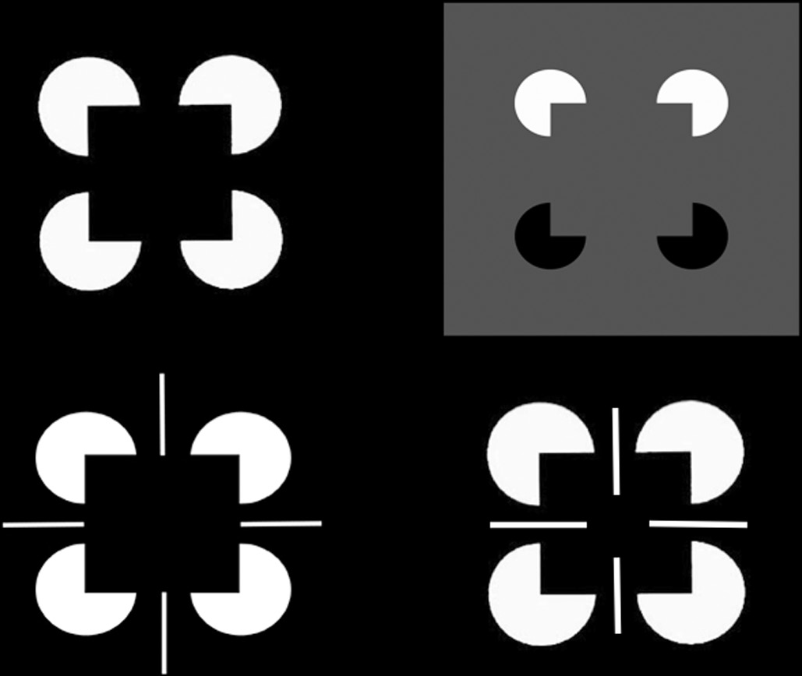
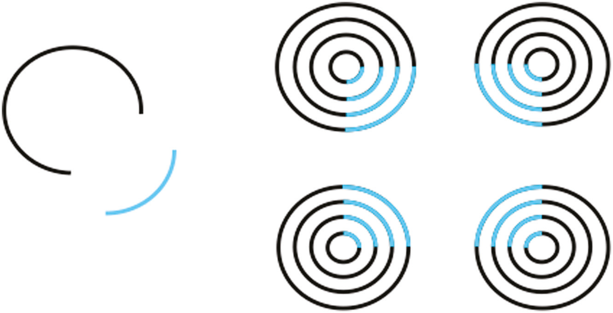
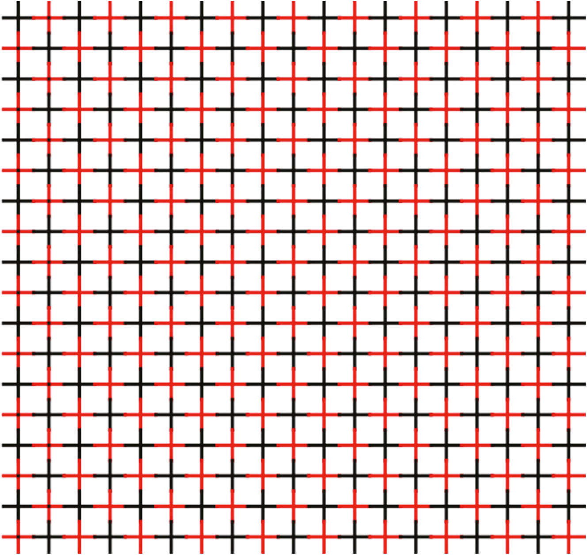
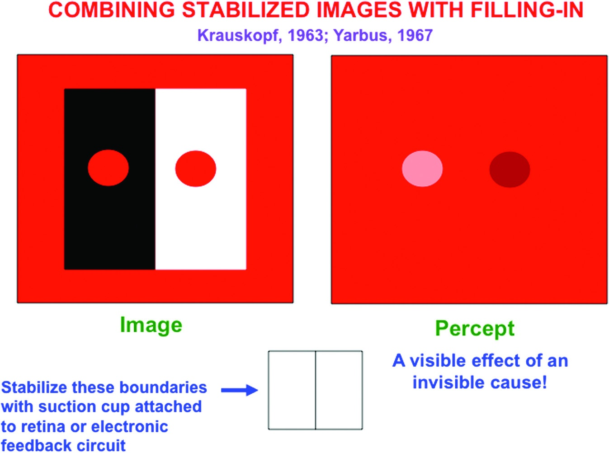
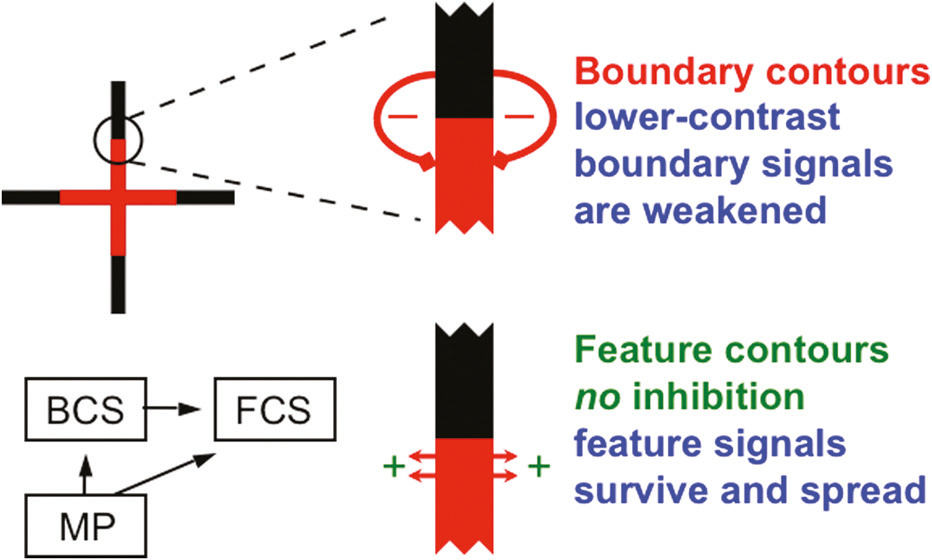
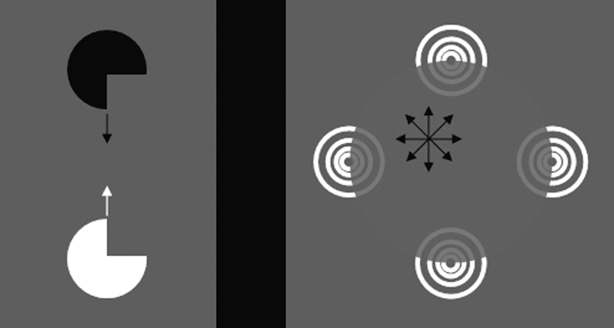

# 경계는 어떻게 형성되는가? 채우기로부터의 증거 / 경계 형성에서 협력과 경쟁의 균형

> 원문: Grossberg, *Conscious MIND Resonant BRAIN*, Chapter 4, pp. 136–137
> "How are boundaries formed? Evidence from filling-in" & "Balancing cooperation with competition during boundary formation"

---

## 경계는 어떻게 형성되는가? 채우기로부터의 증거

지각적 경계는 어떻게 형성되는가? 한 가지는 즉시 분명하다. 경계는 여러 경계 유도인자(boundary inducer) 사이에서 일어나는 어떤 형태의 협력(cooperation)의 결과로 생겨난다. 예를 들어, 그림 1.1의 옵셋 격자와 에렌슈타인(Ehrenstein) 이미지의 다중 선분 끝, 그리고 그림 3.3의 카니자 사각형 이미지의 팩맨 가장자리와 선분 끝이 그러하다. 더욱이 이 협력은 visual angle으로 수 °에 이르는 상당한 거리에 걸쳐 작용할 수 있다. 따라서 경계 형성은 공간적으로 장거리 협력(long-range cooperation)을 활용한다.

<figure>

<figcaption><strong>그림 3.3</strong> — 카니자 사각형. 팩맨 모양의 유도인자들이 협력하여 존재하지 않는 사각형 경계를 완성한다.</figcaption>
</figure>

<figure>

<figcaption><strong>그림 3.10</strong> — 네온 색 확산. 빨간 십자가들이 검은 십자가 안에 삽입되면, 빨간색이 십자가 경계 밖으로 퍼져나가 원형으로 지각된다.</figcaption>
</figure>

<figure>

<figcaption><strong>그림 3.11</strong> — 네온 색 확산에서의 경계와 채우기. 각 빨간 십자가 끝의 검은 선분 4개가 에렌슈타인 환상적 윤곽을 형성하여 색의 확산을 차단한다.</figcaption>
</figure>

그러나 협력만이 지각적 경계를 형성하는 유일한 과정은 아니다. 이것은 그림 3.11에 묘사된 것처럼, 네온 색 확산의 지각에서 특히 잘 드러난다. 그림 3.10과 3.11에서와 마찬가지로 경계가 없는 곳에서는 채우기(filling-in)가 너무 멀리 퍼져 감쇠될 때까지 아무런 장애물 없이 공간을 가로질러 확산할 수 있다는 주목할 만한 사실에 주목하라. 또한 지각된 빨간 원반들이 오른쪽보다 왼쪽에서 더 어둡고, 빨간 배경보다 더 밝다는 사실에도 주목하라. 비록 물리적으로는 이미지에서 동일하지만 말이다. 더 어두운 빨간 원반은 원래 이미지에서 흰색 배경 위에, 더 밝은 빨간 원반은 검은색 배경 위에 놓여 있다. 이러한 배경 차이를 만드는 것은 바로 밝기 대비(brightness contrast)이며, 이것이 원반의 색을 다르게 보이게 한다. 흰색과 검은색 영역은 채워진 빨간색으로 덮여 있음에도 대비 효과가 지각에 지속된다는 것은, 그림 4.1(오른쪽 패널)이 요약하는 지각이 시사하듯, 밝기와 색상 대비의 계산이 채우기가 일어나는 단계 이전의 처리 단계에서, 마치 경계 형성이 물체 인식이 일어나는 단계 이전에 발생하듯이, 일어난다는 것을 시사한다.

<figure>

<figcaption><strong>그림 4.1</strong> — 안정화된 이미지와 채우기의 결합. 직사각형 경계를 망막에 안정화하면 경계가 사라지고, 빨간색이 흑백 영역 위로 채워진다. 왼쪽 원반이 더 어둡게 보이는 것은 흰 배경과의 대비 효과가 채우기 이후에도 유지되기 때문이다.</figcaption>
</figure>

이 지각은 "보이지 않는 원인의 보이는 효과(a visible effect of an invisible cause)"의 흥미로운 사례이다; 즉, 우리는 최종 의식적 지각에서 배경의 흰색과 검은색 자체는 볼 수 없지만, 배경이 흰색과 검은색이었다는 효과(effect)는 볼 수 있다.

이제 네온 색 확산의 지속적 분석이 경계가 어떻게 형성되고 표면이 어떻게 구성되는지를 어떻게 명확히 하는지, 그리고 이러한 통찰이 뇌가 어떻게 보는지에 대해 만들어야 할 다른 많은 설명과 예측을 어떻게 가능하게 하는지를 보여주겠다.

경계 형성에 대해 이야기하기에 앞서, 이미지에서 가장자리가 있는 영역에서 경계가 색을 담지 못하는 이유를 먼저 설명하지 않겠다. 연속적 경계에 구멍이 뚫려서 색이 통과해 퍼질 수 있도록 허용하는 구멍은 어떻게 생기는가? 환상적 윤곽을 생성하는 모든 이미지는 경계 형성 규칙을 발견하는 데에도 도움이 된다. 에렌슈타인 이미지(그림 1.1)를 포함하여, 충분한 수의 방사상 선분이 선분 끝에 수직인 원형 환상적 윤곽을 유도한다. 옵셋 격자(그림 1.1)의 응답에서도 같은 일이 일어난다. 네 개의 검은 선분만이 유도인자로 사용되는 경우, 그림 3.3d의 중앙에서처럼 지각은 더 모호해질 수 있다. 선분의 길이, 두께, 상호 거리 같은 요인에 따라, 환상적 원, 사각형, 또는 심지어 마름모가 지각될 수 있다. 현재 목적상, 그림 3.11의 각 빨간 십자가 끝에 있는 네 개의 검은 선분이 에렌슈타인 이미지에서 환상적 윤곽을 형성한다는 점에 주목하라. 한 개의 빨간 십자가에만 주의를 집중하면, 빨간색이 그 빨간 십자가에서 흘러나와 경계를 이루는 네 개의 검은 선분에 의해 생성된 환상적 윤곽에 부딪힐 때까지 계속됨을 볼 수 있다.

이 속성은 우리가 이전에 언급한 여러 결론을 확인해 준다. 즉, 경계는 채우기의 장벽(barriers)으로 작용하며; 그리고 모든 경계는 "실제"이든 "환상적"이든 채워진 색의 흐름을 차단하는 데 동등하게 효과적이다. 그러나 이러한 결론은 네온 색 확산을 그토록 인상적으로 만드는 핵심 속성, 즉 색이 경계 밖으로 퍼져나간다는 것을 포착하지 못한다.

---

## 경계 형성에서 협력과 경쟁의 균형

네온 색 확산에서 특히 흥미로운 것은 빨간색이 어떻게든 각 빨간 십자가를 둘러싼 경계 밖으로 탈출한다는 것이다. 어떻게 그리고 왜 이런 일이 일어나는가? 가장 명백한 대답은 경계에 틈(gaps)이 있어서 색의 일부가 흘러나올 수 있을 만큼 충분히 크다는 것이다. 마치 댐의 작은 균열이 물이 빠져나가도록 하는 것과 같다. 이 끝 틈(end gaps)은 각 빨간 십자가의 끝에서, 검은 십자가의 가장자리에 닿는 곳에서 발생한다. 이것은 그림 3.41에서 이미 언급한 바이다.

<figure>

<figcaption><strong>그림 3.41</strong> — end gap과 네온 색 확산의 메커니즘. 검은 십자가(강한 경계)와 빨간 십자가(약한 경계)가 경쟁하여, 빨간 십자가 끝의 경계가 깨지면서 끝 틈(end gap)이 생긴다. 이 틈을 통해 빨간색이 흘러나온다.</figcaption>
</figure>

네온 색 확산이 일어나려면, 검은 십자가와 흰색 배경 사이의 대비가 빨간 십자가와 흰색 배경 사이의 대비보다 더 커야 한다. 그 결과, 검은 십자가를 둘러싼 수직 경계들이 빨간 십자가를 둘러싼 수직 경계들보다 더 강하다. 이 경계들은 그림 3.41에서 보듯이 공간을 가로질러 서로 경쟁(compete)한다. 이는 색을 조명에서 할인하기 위해 색들이 경쟁하는 것과 마찬가지이다. 빨간 십자가 끝에 있는 더 약한 경계들은 검은 십자가 끝에 있는 더 강한 경계들과의 경쟁에 의해 약화되거나, 심지어 깨진다. 일부 빨간색은 결과적으로 그 뒤따르는 끝 틈에서 흘러나올 수 있다.

경계 형성에서의 협력과 경쟁의 균형에 대한 또 다른 인상적인 예가 양안 경합(binocular rivalry) 현상이다. 양안 경합 동안, 서로 다른 이미지가 두 눈에 제시된다. 이 이미지들에 의해 유도된 경계들은 우세를 놓고 경쟁한다. 승리한 경계만이 가시적 표면 밝기나 색상의 의식적 지각을 지원할 수 있다. 억제된 눈의 시각 입력이 계속 처리되더라도, 그것은 의식에 도달할 수 없다. 왜냐하면 채우기를 지원하는 데 필요한 경계가 억제되기 때문이다. 우세한 눈에 정렬된 특징 윤곽은, 그러나, 승리한 경계가 의식적 표면 지각 안에 채울 수 있다. 제11장에서 양안 경합을 유발하는 메커니즘을 더 자세히 논의할 것이다. 그러나 즉시 깨달아야 할 것은, 이 모든 사례가 "모든 경계는 보이지 않는다"와 "의식적으로 가시적인 질감은 표면 지각이다"라는 주장에 대해 추가적인 증거를 제공한다는 것이며, 이러한 속성들은 경계와 표면이 계산적으로 상보적이라는 근본적 사실에서 자연스럽게 따라나온다(그림 3.7).

<figure>

<figcaption><strong>그림 3.7</strong> — 경계와 표면의 상보적 속성. 경계 시스템(BCS)과 표면 시스템(FCS)은 서로 반대되는 성질을 가지며, 이 상보성으로부터 양안 경합, 네온 색 확산 등 다양한 현상이 자연스럽게 설명된다.</figcaption>
</figure>

---

### 핵심 개념 정리

| 개념 | 설명 |
|------|------|
| 장거리 협력 (long-range cooperation) | 떨어진 경계 유도인자들이 협력하여 환상적 윤곽 등의 경계를 완성하는 과정 |
| 단거리 경쟁 (short-range competition) | 인접한 경계들이 서로 경쟁하여 가장 강한 그루핑을 선택하는 과정 |
| 끝 틈 (end gap) | 경계의 불연속 지점으로, 색이 이 틈을 통해 흘러나갈 수 있음 |
| 네온 색 확산 (neon color spreading) | 경계 틈을 통해 색이 원래 영역 밖으로 퍼져나가는 지각 현상 |
| 양안 경합 (binocular rivalry) | 두 눈에 다른 이미지가 제시될 때 경계들이 우세를 놓고 경쟁하는 현상 |
| 밝기 대비 (brightness contrast) | 인접 영역의 밝기 차이로 인해 물체의 지각된 밝기가 변하는 현상 |
