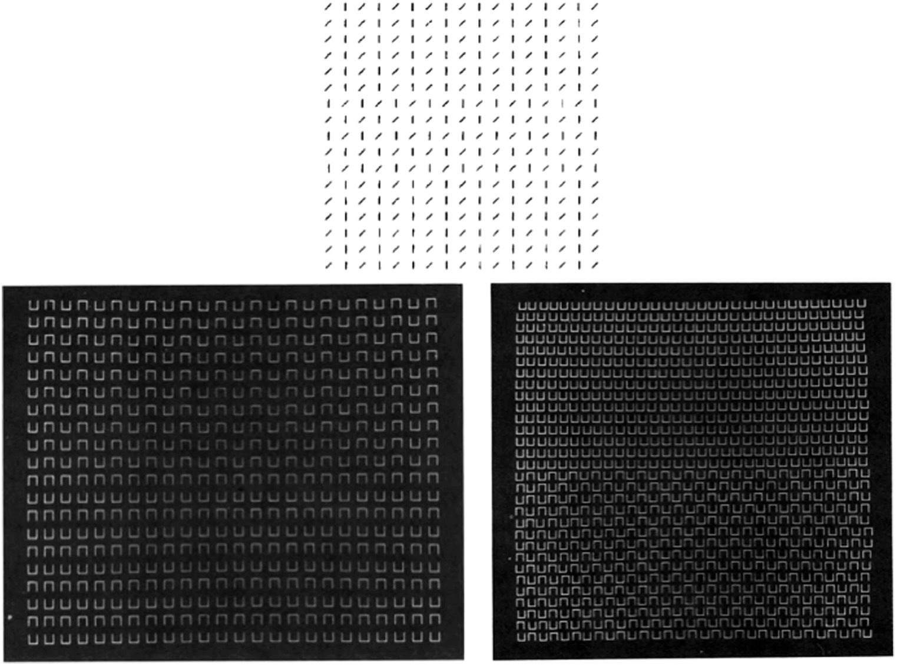
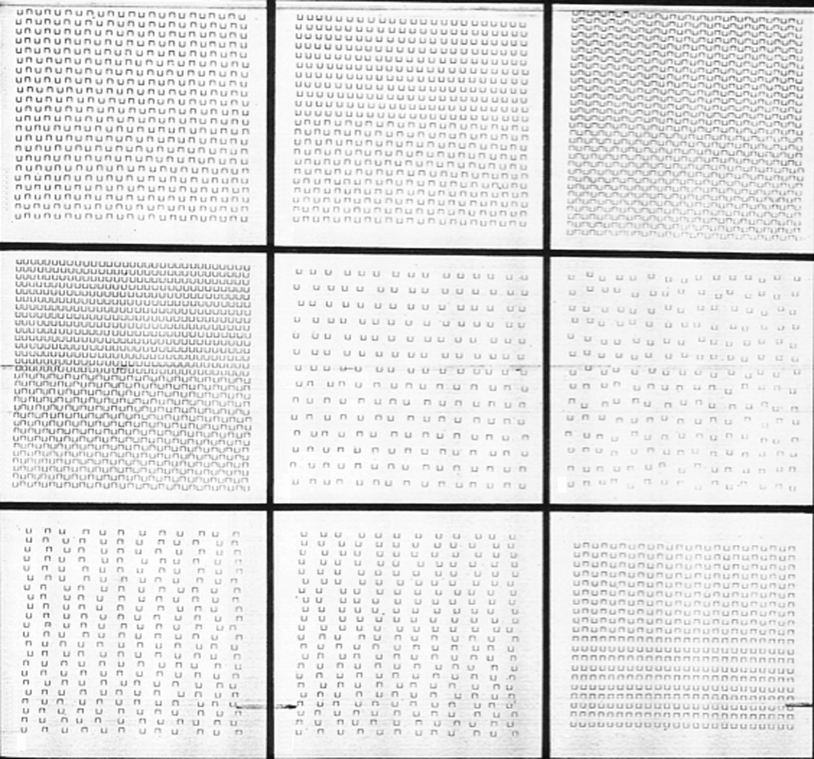

# 발표 자료: §39 질감 분리에서의 창발적 특징 / §40 이중 필터로 질감 데이터 설명하기

> 원문: Grossberg, *Conscious MIND Resonant BRAIN*, Ch.4
> §39 "Emergent Features in Texture Segregation"
> §40 "Explaining Texture Data with the Double Filter"
> **발표자용 상세 해설**

---

## 전체 논증의 위치: 왜 이 두 절인가?

이 두 절은 4장 후반부의 **이론 검증 단계**다. 앞에서 BCS(Boundary Contour System) 회로를 다 만들었으니, 이제 그것이 진짜 작동하는지 증명할 차례다.

### 직전까지 일어난 일

| 절 | 무엇을 했는가 |
|---|--------------|
| §17-19 | BCS의 두 모듈 정의: 이중 필터(simple→complex) + 그루핑 네트워크(bipole-hypercomplex CC Loop) |
| §20-26 | 단순/복잡/초복잡/바이폴 세포의 내부 수학 정립 |
| §27-30 | End cut 메커니즘 — 패턴 단위 계산이 어떻게 선분 끝의 구멍을 닫는가 |
| §31-37 | 위치-방향 불확실성, 신경생리학 검증 |
| §38 | "베이즈 없는 뇌" — 확률 추론이 아닌 협력-경쟁 동역학으로 불확실성 처리 |

여기까지는 모두 **단순한 자극(선분, 점, end gap)**을 다뤘다. 사실상 "이론 구축 + 단위 테스트" 단계.

### §39-40의 역할: 통합 테스트

- **§39**: 자연 이미지의 핵심 과제인 **질감 분리(texture segregation)**에 BCS를 들이댄다. 이론 단계에서 만든 회로가 복잡한 자극 앞에서도 작동하는가?
- **§40**: 단순한 작동 확인을 넘어, **경쟁 모델(Complex channels)**과 정량적으로 비교한다. BCS가 진짜로 더 나은가?

### 이후 흐름

§41부터는 **3D 시각**(T-교차점, 공간적 불투과성, DaVinci 입체시)으로 넘어간다. §39-40은 2D 처리의 마지막 검증대다.

```
[2D 회로 구축]──>[2D 검증]──>[3D 확장]
   §17-37        §39-40       §41-63
                   ↑
               지금 여기
```

---

## §39: Emergent Features in Texture Segregation

### 질감 분리란 무엇인가

길을 걷다가 잔디밭과 보도블록을 구분하는 데 의식적 노력이 필요한가? 아니다. **즉각적**이고 **자동적**이다. 이것이 질감 분리다.

핵심 속성:

- **전주의적(preattentive)**: 어디를 봐야 한다고 생각하기도 전에 분리됨
- **자동적**: 의도와 무관하게 일어남
- **빠름**: 약 100ms 내 완성

이 세 속성이 BCS 이론과 직접 연결되는 이유:

전주의적이라는 것은 **의식적 추론이 개입하지 않는다**는 뜻이다. 베이즈 추론이나 가설 검증 같은 고수준 인지 과정이 들어갈 시간이 없다(100ms). 즉, 질감 분리는 §38에서 다룬 "**베이즈 없는 뇌**"의 가장 강력한 사례다 — 협력-경쟁 동역학만으로 그루핑이 일어난다.

질감 분리는 시각의 가장 기초적이면서 가장 강력한 과제 중 하나다. 자연 이미지에서 물체와 배경, 영역과 영역을 구분하는 일차 단서다. 1981년 Béla Julesz는 이를 **사전-주의 시각(preattentive vision)**이라 명명하며, 질감 분리를 일으키는 국소 특징을 **"텍스톤(textons)"**이라 불렀다 — Grossberg는 이 가설을 §39에서 직접 반박한다.

> **발표 멘트**: "여러분이 지금 이 슬라이드의 글자와 배경을 구분하는 것이 바로 질감 분리입니다. 너무 쉬워 보이지만, 컴퓨터에게는 1980년대까지 해결되지 않은 난제였습니다. 그리고 §38에서 말한 '베이즈 없는 뇌'의 가장 강력한 증거이기도 합니다 — 의식이 개입할 시간이 없는 100ms 안에 완성되기 때문입니다."

---

### Beck, Prazdny, Rosenfeld (1983) 실험

<figure>

<figcaption><strong>그림 4.33</strong> — 삼분할·이분할 질감과 창발적 경계 그루핑. Jacob Beck(1983)의 유명한 실험 자극들. 같은 구성 요소가 전역적 배치에 따라 다른 그루핑을 만든다.</figcaption>
</figure>

이 그림은 시각 과학사에서 결정적이다. Beck은 세 가지 자극을 보여주었는데, 각각이 BCS 이론의 핵심 가설을 검증한다.

#### 자극 A: 삼분할 질감 (tripartite)

```
| | | | | | / / / / / / | | | | | |
| | | | | | / / / / / / | | | | | |
| | | | | | / / / / / / | | | | | |
| | | | | | / / / / / / | | | | | |
↑           ↑           ↑
수직선      대각선      수직선
영역        영역        영역
```

지각 결과: **세 영역이 깔끔하게 분리됨**. 같은 방향끼리 묶이는 **공선적(collinear) 그루핑**이 일어난다.

#### 자극 B: 이분할 질감 — 수직 그루핑

```
U U U U U U  ∩ ∩ ∩ ∩ ∩ ∩
U U U U U U  ∩ ∩ ∩ ∩ ∩ ∩
U U U U U U  ∩ ∩ ∩ ∩ ∩ ∩
↑            ↑
U자 영역      역U자 영역
            (수직 환상 윤곽)
```

지각 결과: **수직 방향의 환상적 경계**가 두 영역 사이에 보인다. U와 역U 사이의 경계가 명확하게 인식된다.

#### 자극 C: 이분할 질감 — 대각 그루핑 (반전)

```
U ∩ U ∩ U ∩ U ∩
∩ U ∩ U ∩ U ∩ U
U ∩ U ∩ U ∩ U ∩
∩ U ∩ U ∩ U ∩ U

↑ 같은 U와 역U인데, 배치가 다름
```

지각 결과: **대각선 방향의 그루핑**이 지배적. 영역 분리가 아니라 대각 줄무늬가 보인다.

> **발표 멘트**: "여기서 충격적인 사실: B와 C는 **완전히 같은 구성 요소**(U자와 역U자)로 만들어져 있습니다. 다른 점은 오직 **배치**입니다. 그런데 우리 뇌는 두 자극을 완전히 다르게 봅니다."

---

### 핵심 통찰: 같은 요소, 다른 그루핑

| 자극 | 국소 요소 | 전역 배치 | 지각된 그루핑 |
|------|----------|----------|-------------|
| A | 수직선, 대각선 | 영역별 분리 | 공선적 (영역 경계) |
| B | U, 역U | 영역별 분리 | 수직 (영역 경계) |
| C | U, 역U | 교대 배치 | 대각 (줄무늬) |

이것이 던지는 메시지:

> **국소 특징만 보고는 그루핑을 예측할 수 없다. 전역 배치가 결정한다.**

#### "국소 통계가 동일"의 정확한 의미

이 표현이 막연하게 들릴 수 있어 명확히 한다. B와 C는 다음 통계가 같다:

| 통계 | B | C | 같음? |
|------|---|---|------|
| **1차 통계** (요소 개수, 밝기 히스토그램) | U:N개, 역U:N개 | U:N개, 역U:N개 | [O] |
| **방향 분포** (수직, 수평, 대각 방향 비율) | 같음 | 같음 | [O] |
| **공간 주파수 분포** (Fourier 스펙트럼) | 거의 같음 | 거의 같음 | [O] |
| **2차 통계** (인접 요소 쌍의 공분산) | 다름 | 다름 | [X] |

즉, 각 위치에서 **무엇이** 있는지의 통계는 동일하지만, **어디에 어떻게** 배치되었는지의 2차 통계만 다르다.

#### Julesz 추측의 반증

Béla Julesz는 1962년에 "사람은 1차 통계가 같은 두 텍스처를 구별하지 못한다"는 추측을 했다. 그러나 1980년대 초 본인이 이를 반증하며 "textons"라는 더 복잡한 단위를 도입했다. **Beck의 자극 B와 C는 textons 가설마저 반증한다** — 같은 textons로 구성되었는데 다른 그루핑이 나오기 때문이다.

이 사실이 왜 충격적인가? 1980년대까지 시각 모델은 대부분 "국소 필터의 합" 패러다임이었다. 각 위치에서 무엇이 있는지를 독립적으로 검출한 후, 후처리로 합치는 방식. Julesz의 textons도 본질적으로 이 패러다임이다. 이 패러다임으로는 자극 B와 C를 구별할 수 없다.

> **발표 멘트**: "1980년대 컴퓨터비전과 심리학은 '각 위치에서 무엇이 있는지의 히스토그램이 다르면 분리된다'고 믿었습니다. Julesz의 textons 가설이 대표적입니다. Beck은 이 가설을 정면으로 반박했습니다 — 같은 textons로 만들어진 두 자극이 완전히 다른 그루핑을 만들어내거든요."

---

### 창발적 특징(Emergent Features)이란

**정의**: 개별 요소에는 존재하지 않지만, 요소들의 전체 배치에서만 나타나는 특성.

자극 B의 "수직 환상적 윤곽"은:
- 어느 U자에도 없음
- 어느 역U자에도 없음
- 그러나 U와 역U가 영역별로 배치될 때만 **떠오름(emerge)**

자극 C의 "대각 줄무늬"도:
- 어느 단일 요소에도 없음
- 교대 배치에서만 떠오름

#### Gestalt 심리학과의 비교

| | Gestalt (1920s) | Grossberg (1985-) |
|---|----------------|-------------------|
| 관찰 | "전체는 부분의 합 이상" | 같음 |
| 설명 | 형태 법칙(Pragnanz, 근접성, 유사성) — 기술적 | 신경 메커니즘(CC Loop) — 인과적 |
| 예측력 | 정성적 | 정량적 (§40에서 입증) |

Gestalt는 현상을 **기술**했고, Grossberg는 **설명**한다. "왜" 그런 그루핑이 생기는지를 신경 회로로 설명한다.

> **발표 멘트**: "Gestalt 심리학자들은 100년 전에 이 현상을 발견했습니다. 그러나 그들은 '왜'를 설명하지 못했고, '법칙'으로 기술만 했습니다. Grossberg가 한 일은 같은 현상을 신경 회로의 동역학으로 환원한 것입니다."

---

### CC Loop가 어떻게 그루핑을 결정하는가

핵심 메커니즘은 §17의 CC Loop(Cooperative-Competitive Loop)다. 먼저 bipole 세포의 구조를 정확히 봐야 한다.

#### Bipole 세포의 구조: AND gate

```
       왼쪽 lobe          오른쪽 lobe
    [hypercomplex]      [hypercomplex]
    (같은 방향 선호)      (같은 방향 선호)
          \                    /
           \                  /
            ─→ [bipole] ←─
                   ↓
              발화 조건:
              왼쪽 AND 오른쪽 모두 활성화
              (한쪽만으로는 발화하지 않음)
```

핵심 규칙:
- Bipole은 **두 lobe** 모두에서 입력을 받음 (bi-pole = 두 극)
- 양쪽 lobe가 **공선적으로(collinear) 정렬**된 위치의 hypercomplex로부터 받음
- **두 lobe 모두**에 입력이 있을 때만 발화 (AND gate)
- 발화하면 자기 위치에 새 경계 신호 생성 → **환상 윤곽(illusory contour)** 형성

#### CC Loop 전체 회로

```
  [입력 패턴]
       ↓
  [단순 → 복잡 세포]            ← 국소 경계 추출 (Stage 1)
       ↓
  [hypercomplex 세포]           ← end-stopping
       ↓                ↑
       │      (협력)    │
       ↓                │
  [bipole 세포]         │       ← 장거리 그루핑 (Stage 2)
       │                │
       │     (피드백)    │
       └────────────────┘
       ↓
  [같은 위치, 다른 방향 경쟁]    ← 가장 강한 그루핑만 살아남음
```

협력(cooperation): bipole이 두 lobe의 입력을 곱셈처럼 통합 → 양쪽 모두 신호가 있을 때 강하게 발화 → hypercomplex로 피드백 → 그 hypercomplex가 강화

경쟁(competition): 같은 위치의 다른 방향 hypercomplex 간 측면 억제 → 한 방향만 승리

#### 자극 B의 처리 과정 (수직 그루핑)

```
영역 1 (U들)         영역 2 (역U들)
U U U U              ∩ ∩ ∩ ∩
| | | |              | | | |     ← U의 stem과 ∩의 stem
| | | |              | | | |        이 모두 수직선분
U U U U              ∩ ∩ ∩ ∩

영역 경계선 ────────────
```

1. **국소 단계**: 모든 U와 역U의 stem(수직선)에서 수직 방향 simple/complex 세포가 활성화. U의 윗변·역U의 아랫변에서는 수평 simple cell도 활성화.

2. **수직 bipole의 협력**:
   - 영역 경계를 가로지르는 수직 bipole의 왼쪽 lobe는 영역 1의 stem들에서 입력 받음
   - 오른쪽 lobe는 영역 2의 stem들에서 입력 받음
   - 두 lobe 모두 강한 입력 → bipole 강하게 발화 → 영역 경계에 **수직 환상 윤곽** 형성

3. **수평/대각 bipole**: 두 lobe가 공선적으로 정렬되지 않음 → 한쪽 lobe에만 입력 → 발화하지 않음 (AND gate 조건 위배)

4. **경쟁 후 결과**: 수직 환상 윤곽만 살아남음. 이것이 영역 경계로 지각됨.

이 환상 윤곽은 **카니자 사각형의 환상 윤곽과 같은 메커니즘**이다 — 물리적 자극이 없는 곳에 경계가 보인다. 다만 카니자에서는 4개 inducer가 만들고, Beck 자극에서는 수십 개 인듀서가 만든다.

#### 자극 C의 처리 과정 (대각 그루핑)

```
U ∩ U ∩ U ∩    ← 같은 행에 U와 ∩이 번갈아 배치
∩ U ∩ U ∩ U    ← 다음 행은 반대로
U ∩ U ∩ U ∩
∩ U ∩ U ∩ U
```

1. **국소 단계**: 자극 B와 동일하게 stem에서 수직 simple/complex cell 활성화.

2. **수직 bipole의 협력 실패**:
   - 한 위치의 수직 bipole이 왼쪽 lobe에서 stem 신호를 받음
   - 오른쪽 lobe는 그 옆 위치를 봄 → 그 위치는 U 또는 ∩의 stem (수직 자체는 있음)
   - 하지만 영역 분리가 없으므로 환상 윤곽을 만들 **경계 후보 위치가 없음**

3. **대각 bipole의 협력 성공**:
   - 대각 방향으로 같은 요소가 정렬됨 (예: 모든 U가 한 대각선 위에)
   - 대각 방향 bipole이 두 lobe에서 입력 받음 → 발화

4. **경쟁 후 결과**: 대각 방향 그루핑이 승리. 영역 분리가 아닌 줄무늬 패턴이 지각됨.

> **발표 멘트**: "여기가 핵심입니다. Bipole은 양쪽 lobe가 모두 입력을 받아야 발화하는 AND gate입니다. 같은 국소 입력이라도, 어느 방향에서 양쪽이 정렬되느냐가 배치에 따라 달라집니다. 그 정렬 방향이 그루핑 방향입니다."

---

### [발표 포인트] §39의 메시지

> **§39가 결정적인 이유**:
>
> 1. **국소 처리만으로 시각이 작동할 수 없다는 결정적 증거** — 같은 국소 통계, 다른 지각.
>
> 2. **전역 배치가 그루핑을 결정한다** — 이 사실은 long-range connection이 시각 회로에 필수임을 말한다.
>
> 3. **CC Loop의 협력-경쟁 동역학이 그루핑 선택의 메커니즘** — Gestalt가 100년 전 관찰한 현상의 신경학적 기반.
>
> 4. **현대적 함의**: 표준 CNN의 첫 몇 레이어(국소 conv)는 이 자극을 구별하지 못한다. ViT의 self-attention이나 recurrent CNN의 lateral connection이 필요한 이유가 여기 있다.

---

## §40: Explaining Texture Data with the Double Filter

§39가 "이론 vs. 현상"이었다면, §40은 "이론 vs. 다른 이론"이다. 두 모델이 같은 데이터를 두고 정량적으로 대결한다.

### Sutter, Beck, Graham (1989) 실험

<figure>

<figcaption><strong>그림 4.34</strong> — Complex channels 모델과 BCS의 비교. Sutter, Beck, Graham(1989)의 다양한 질감 자극에서, 두 모델이 예측하는 구별성 순서. BCS는 모든 질감 자극에서 올바른 순서를 예측하지만, Complex channels 모델은 일부 질감(g와 i)에서 잘못된 순서를 예측한다.</figcaption>
</figure>

#### 실험 방법

Sutter, Beck, Graham(1989)은 다양한 질감 쌍을 사람에게 보여주고, 두 영역을 얼마나 쉽게 구분하는지(**지각적 구별성, perceptual discriminability**)를 측정했다.

- 9가지 정도의 질감 자극(a, b, c, ..., i)
- 각 자극에 대해 사람의 구별 성능을 정량 측정
- 결과를 "이 자극이 저 자극보다 구별이 쉽다"는 **순서**로 정리

이제 두 모델이 이 순서를 예측할 수 있는지 검증.

---

### 두 모델의 대결

| 항목 | Complex Channels (Graham et al.) | BCS (Grossberg) |
|------|-------------------------------|-----------------|
| **시기** | 1980년대 후반, 당대 최첨단 | 1985년 제시 |
| **핵심 메커니즘** | 다중 스케일 Gabor 필터 응답의 통계 | 이중 필터 + bipole 그루핑 |
| **처리 범위** | 국소 (single cell scale) | 국소 + 장거리 |
| **계산 단위** | 각 위치의 필터 출력 | 그루핑된 영역 |
| **자극 (g)와 (i) 순서 예측** | 잘못 [X] | 맞음 [O] |

#### Complex Channels 모델이란

당시 텍스처 분리의 가장 정교한 모델. Norma Graham, Patrick Cavanagh, James Beck 등이 1980년대 후반에 발전시켰다.

작동 방식 (3단계):

```
Stage 1: 다중 스케일 필터링
이미지 I(x,y) → {G_σ,θ ⊗ I}   (여러 σ, θ 조합의 Gabor 필터 응답)
                   ↓
Stage 2: 비선형 변환 (rectification + squaring)
                   R_σ,θ(x,y) = [G_σ,θ ⊗ I]²   (energy)
                   ↓
Stage 3: 공간 평균 (영역 통계)
                   E_σ,θ(영역) = ⟨R_σ,θ⟩_영역
                   ↓
영역 A와 B의 구별성:
                   D(A,B) = Σ_σ,θ |E_σ,θ(A) - E_σ,θ(B)|
                   "각 채널의 에너지 차이의 합"
```

직관적으로 합리적이다:
- V1 simple cell ≈ Gabor 필터 → Stage 1
- V1 complex cell ≈ rectified-and-squared simple → Stage 2 ("complex" channels라는 이름의 유래)
- 평균 영역 응답으로 비교 → Stage 3

핵심 가정: **각 채널은 독립적**이고, **공간적으로 분리된 위치 간 상호작용이 없다**. 이것이 BCS와의 결정적 차이.

> **발표 멘트**: "Complex channels는 §20-21에서 본 simple→complex 처리를 그대로 확장한 것입니다. 다양한 스케일과 방향의 Gabor 필터를 두고, 각 채널의 응답을 제곱하고, 영역별로 평균을 냅니다. 그리고 두 영역의 에너지 차이를 합산해 구별성을 예측합니다. V1의 알려진 처리 단계를 그대로 따른 자연스러운 모델입니다 — 그래서 더 흥미로운 겁니다, 이게 부족하다는 사실이."

---

### 왜 BCS가 이기는가

자극 (g)와 (i)에서 두 모델의 예측이 갈린다.

#### Complex Channels의 한계

(g)와 (i)는 다음 특성을 가진다:
- **국소 통계**: 거의 동일 (같은 종류의 요소들로 구성)
- **그룹 구조**: 다름 (요소들이 어떻게 묶이는지가 다름)

Complex channels는 국소 필터 응답의 통계만 본다 → 두 자극을 구별하지 못함.

#### BCS의 강점

BCS는 두 단계로 처리:

```
Stage 1 (이중 필터): simple → complex 세포로 국소 경계 추출
                    [Complex channels와 동등]

Stage 2 (그루핑 네트워크): bipole 세포가 국소 경계를 묶어
                         "어떤 요소가 어떤 그룹에 속하는가"를 결정
                    [Complex channels에 없는 단계]
```

결과: BCS는 **그룹 구조의 차이**를 포착하고, 사람의 지각과 일치하는 순서를 예측한다.

> **발표 멘트**: "Complex channels는 '여기에 무엇이 있는가'에 답합니다. BCS는 한 발 더 나아가 '이 요소들이 어떻게 묶이는가'에 답합니다. 그 추가 단계가 결정적인 차이를 만듭니다."

---

### 자극 (g)와 (i)의 차이를 직관적으로

Sutter et al.(1989)의 자극 라인업은 작은 사각형 요소들로 구성된 텍스처 쌍들이다. (g)와 (i)는 다음 구조적 차이를 가진다 (정확한 자극은 그림 4.34 참조).

```
자극 (g) - 큰 단위가 정렬된 텍스처:
요소가 큰 블록으로 그룹화되어, 각 그룹의 경계가 영역 분리를 만든다.

자극 (i) - 작은 단위가 다른 패턴으로 묶이는 텍스처:
요소 크기는 비슷하지만 그룹화 패턴이 달라, 다른 영역 구조가 떠오른다.
```

**핵심은 자극의 정확한 형태가 아니라 두 모델의 예측 차이다**:

| 측정 | Complex Channels 예측 | BCS 예측 | 사람의 지각 |
|------|---------------------|---------|-----------|
| (g)의 구별성 | 높음 | 낮음 | **낮음** |
| (i)의 구별성 | 낮음 | 높음 | **높음** |
| **순서** | g > i | **i > g** | **i > g** |

Complex channels는 두 자극에서 채널 에너지 차이를 계산했더니 (g)에서 더 큰 차이가 나왔다 → "(g)가 더 잘 구별된다"고 예측. 하지만 사람은 반대로 (i)가 더 잘 구별된다고 답한다.

#### 왜 Complex channels가 틀렸는가

(g)에서는 큰 요소들이 영역마다 다른 공간 주파수 채널에 에너지를 몰아준다 → 채널별 에너지 차이가 큼 → 모델은 "잘 구별된다"고 본다.

그러나 사람의 시각은 **에너지 차이**가 아닌 **bipole 그루핑이 만드는 명시적 경계**를 본다. (i)에서는 요소들의 배치가 bipole의 AND gate 조건을 잘 만족시켜 강한 환상 경계를 만든다 → 사람에게 더 잘 구별된다.

핵심: 두 자극은 1차/2차 픽셀 통계가 비슷한 범위 안에 있지만, **bipole 그루핑 결과**가 다르다. BCS는 이 그루핑을 명시적으로 계산하므로 사람과 일치한다.

---

### [발표 포인트] §40의 방법론적 교훈

> **§40이 시각 과학에 던진 메시지**:
>
> 1. **방법론의 표본**: 현상 제시(§39) → 이론(§17-30) → 정량적 검증(§40). Grossberg 연구 프로그램의 전형.
>
> 2. **잘 설계된 Gabor 필터도 부족**: Complex channels는 당대 최첨단이었다. 그것이 부족하다는 사실은 시각 처리에 대한 우리 직관을 흔든다.
>
> 3. **장거리 그루핑이 필수**: 단순한 "필터뱅크 + 통계"로는 시각의 핵심 능력을 모델링할 수 없다.
>
> 4. **신경과학의 함의**: V1의 long-range horizontal connection(Gilbert & Wiesel, 1989)이 발견된 것이 우연이 아니다 — Grossberg의 bipole 가설을 해부학이 뒷받침한다.

---

## 현대 딥러닝과의 연결

§39-40의 메시지는 1985년에 끝나지 않았다. 2010년대 딥러닝 혁명에서 같은 패턴이 반복된다.

### CNN vs. Vision Transformer

```
1980s:   Complex channels   vs.   BCS
         (국소 필터 통계)         (장거리 그루핑)
                  [BCS 승리]

2020s:   CNN              vs.   ViT
         (국소 conv)             (전역 self-attention)
                  [ViT가 점진적 승리]
```

두 경쟁의 **구조가 동일**하다는 점이 결정적이다. 80년대 텍스처 분리 논쟁이 2020년대 시각 인식 논쟁으로 그대로 재현됐다.

#### 구조적 동형

| Grossberg (1985) | CNN | ViT |
|------------------|-----|-----|
| Simple cell + 반파 정류 | Conv + ReLU | Patch embedding (linear) |
| Complex cell (반대 극성 풀링) | Max pooling | (없음, attention이 대체) |
| Bipole 세포 (장거리 협력) | (없음 — 한계) | Self-attention head |
| CC Loop (시간적 반복) | (없음 — 한계) | Multi-layer stacking |

#### Depth = Unrolled Recurrence

CC Loop는 시간적 순환(같은 회로를 여러 번 통과)이고, ViT는 공간적 깊이(여러 다른 레이어)다. 그러나 수학적으로 동형이다:

```
CC Loop (recurrent, weight-tied):
  상태₀ → [회로 R] → 상태₁ → [회로 R] → 상태₂ → ...

ViT (feedforward, weight-free):
  토큰₀ → [Layer 1] → 토큰₁ → [Layer 2] → 토큰₂ → ...
```

ViT는 레이어마다 다른 가중치를 학습하므로 CC Loop보다 표현력이 더 높다. 한 번의 forward pass에서 bipole 협력의 반복 정제를 흉내 낸다.

#### 실증

Tuli et al. (2021)이 보고: **ViT는 CNN보다 shape-biased**다. 텍스처에 휘둘리지 않고 형태를 본다 — 즉, Beck 자극처럼 "국소 통계는 같고 그루핑 구조만 다른" 자극에서 사람의 지각과 일치한다.

Raghu et al. (2021): ViT는 첫 레이어부터 전역(global) attention을 학습한다 — CNN처럼 작은 RF에서 시작해 점진적으로 커지지 않는다. 처음부터 long-range cooperation을 구현하는 셈.

> **발표 멘트**: "여기서 충격적인 점: Grossberg가 1985년에 신경과학적 제약에서 손으로 설계한 구조를, 딥러닝이 2020년대에 데이터로부터 재발견했다는 것입니다. CC Loop는 시간적으로 반복되고 ViT는 공간적으로 깊지만, '장거리 협력을 반복 정제한다'는 본질에서 같습니다. 시각의 본질적 제약이 두 경로에서 같은 답을 주었습니다."

### 그러나 ViT도 못 하는 것

- **명시적 경계 표현 부재**: bipole이 만드는 "이것이 경계다"라는 명시적 신호가 없음. ViT는 패치 임베딩에 모든 정보를 섞어버린다.
- **Filling-in 없음**: 표면을 채우는 확산 메커니즘이 없음 → 깊이/투명성/색 확산 같은 표면 표현 부재
- **설명 가능성**: ViT는 "왜 이렇게 그루핑했는지" 설명할 수 없음. Grossberg는 bipole의 AND gate 조건으로 정확히 예측한다.
- **인덕티브 바이어스의 부재**: ViT는 bipole의 "양쪽 정렬" 조건을 데이터에서 학습해야 한다 → 사람 수준에 도달하려면 막대한 데이터 필요

---

## §41로의 다리: 2D에서 3D로

§39-40은 2D 처리의 마지막 검증대다. 무엇이 입증되었는가:

1. BCS의 이중 필터 + bipole 그루핑이 자연 자극(질감)에서 작동
2. 국소 필터만으로는 부족하고 장거리 협력이 필수
3. 환상 윤곽(illusory contour)이 단순한 착시가 아니라 시각의 **기본 작동 원리**

§41부터는 같은 메커니즘이 **3D 해석**을 만든다. 핵심 질문이 바뀐다:

```
§39-40: "같은 평면 위 어떤 요소들이 함께 묶이는가?"
§41-:   "어떤 요소가 앞이고 어떤 요소가 뒤인가?"
```

§41의 핵심 개념:

- **T-교차점(T-junction)**: 두 선이 T자로 만나는 곳. T의 가로획이 앞 물체, 세로획이 뒤 물체.
- **공간적 불투과성(Spatial Impenetrability)**: 한 방향의 강한 경계가 같은 위치의 다른 방향 bipole을 억제. T-교차점에서 가려진 물체의 경계가 끊어지는 메커니즘.

이 메커니즘은 §39-40에서 본 **bipole의 AND gate와 경쟁**의 자연스러운 확장이다. 새로운 회로가 추가되는 게 아니라, 같은 회로가 3D 단서(T-교차점)를 만나면 자동으로 전경-배경 분리를 만들어낸다.

> **발표 멘트**: "오늘 본 메커니즘 — bipole의 AND gate, CC Loop의 협력-경쟁 — 이 4장 후반부 전체의 기반입니다. §41부터는 이 같은 메커니즘이 어떻게 3D 시각(가림, 깊이, 입체시)을 만드는지 보게 됩니다."

---

## Q&A 대비

### Q1. "Beck 실험의 자극이 왜 중요한가? 그냥 신기한 착시 아닌가?"

**답**: 신기한 착시가 아니라 **시각 모델의 결정적 시험대**입니다. 자극 B와 C는 국소 통계가 거의 동일한데 지각이 완전히 다릅니다. 이 사실은 "국소 처리의 합으로 시각을 설명할 수 있다"는 가설을 직접 반증합니다. 1980년대 컴퓨터비전이 이 자극에서 막혔고, 그래서 BCS 같은 장거리 협력 메커니즘이 필요해졌습니다.

### Q2. "Complex channels 모델은 정확히 무엇인가?"

**답**: Norma Graham 등이 1980년대 후반에 제안한 텍스처 분리 모델입니다. V1 simple cell을 다양한 공간 주파수와 방향의 Gabor 필터로 모델링하고, 각 위치에서의 필터 응답 통계(평균, 분산)로 두 텍스처 영역의 차이를 예측합니다. 당대로서는 가장 정교했고, 많은 자극에서 잘 맞았습니다. BCS와의 차이는 **장거리 그루핑이 없다는 것**입니다.

### Q3. "바이폴 세포의 장거리 연결은 V1에서 발견되었는가?"

**답**: 네, Charles Gilbert와 Torsten Wiesel이 1989년에 V1의 **long-range horizontal connection**을 발견했습니다. 이 연결은 같은 방향 선호도를 가진 세포들 사이에서 형성되고, 수 mm에 걸쳐 뻗습니다. Grossberg가 1985년에 bipole 세포로 가설했던 구조와 정확히 일치합니다. 이론이 해부학을 4년 앞서 예측한 사례입니다.

### Q4. "왜 같은 요소가 다른 배치에서 다른 그루핑을 만드는가? 직관적으로 설명?"

**답**: 음악으로 비유하면 좋습니다. 같은 음표 모음이라도 시간 배치가 다르면 다른 멜로디로 들립니다. 시각도 마찬가지입니다 — 같은 요소라도 공간 배치에 따라 bipole 세포가 어느 방향으로 협력 신호를 받는지가 달라집니다. 협력이 가장 강한 방향이 경쟁에서 이기고, 그것이 우리가 보는 그루핑입니다. CC Loop는 음악의 화성처럼 "여러 후보 중 가장 조화로운 것"을 골라냅니다.

### Q5. "이게 ViT/Transformer와 어떻게 연결되는가?"

**답**: ViT의 self-attention은 본질적으로 학습 가능한 장거리 연결입니다. Grossberg의 bipole이 손으로 설계한 장거리 연결이라면, ViT의 attention은 데이터에서 학습한 장거리 연결입니다. 흥미롭게도 ViT가 CNN보다 사람의 지각과 더 잘 일치한다는 보고가 늘고 있습니다(Tuli et al. 2021). Grossberg가 1985년에 신경과학적 제약에서 유도한 결론과, 딥러닝이 2020년에 데이터에서 발견한 결론이 같은 방향을 가리킵니다.

### Q6. "Bipole 세포의 'AND gate' 조건은 왜 필요한가? OR로 하면 안 되나?"

**답**: OR로 하면 한 lobe에만 입력이 있어도 발화합니다. 그러면 한쪽에 유도인자가 있는 모든 곳에 환상 윤곽이 생겨버립니다 — 시각이 환상 윤곽으로 가득 찬 노이즈가 됩니다. AND gate는 "양쪽에서 정렬된 증거가 있을 때만 새 경계를 만든다"는 보수적 조건입니다. 이것이 카니자 사각형은 보이지만 (혼자 떨어진) 팩맨 하나에는 환상 윤곽이 안 보이는 이유입니다. Grossberg가 강조하듯, 환상 윤곽은 **흔하지 않게**, **충분한 증거**가 있을 때만 만들어져야 합니다.

### Q7. "Julesz의 textons과 Grossberg의 bipole은 어떻게 다른가?"

**답**: Julesz는 1980년대 초 "텍스처 분리를 일으키는 국소 단위(textons)"를 찾으려 했습니다 — 선분 끝, 교차점, T-junction 등이 후보였습니다. 핵심 가정: **국소적 특징의 통계 차이**가 분리를 만든다. Beck의 자극이 이 가정을 직접 반박했습니다 — 같은 textons로 다른 그루핑이 나오니까요. Bipole은 textons를 부정하는 게 아니라, "국소 단위들이 **어떻게 묶이는지**가 핵심"이라고 한 단계 더 올라간 것입니다. Julesz가 점들을, Grossberg가 점들 간의 연결을 봤습니다.

### Q8. "CC Loop는 몇 번 반복되어야 수렴하는가?"

**답**: 단순 자극에서는 보통 3-5 iteration이면 수렴합니다. 복잡한 자극일수록 더 걸립니다. 실제 V1에서는 한 자극에 대한 처리가 100-200ms 안에 완성되는데, 이 시간 동안 피드백 루프가 여러 번 돌면서 그루핑이 결정됩니다. 흥미로운 점은 이 반복 과정이 의식적으로 인지되지 않는다는 것입니다 — 우리는 최종 수렴 결과만 봅니다. 이것이 §38 "베이즈 없는 뇌"와 연결되는 지점입니다.

---

## 발표 흐름 (15분 분량)

| 시간 | 슬라이드 | 핵심 메시지 |
|------|---------|-----------|
| 0-2분 | 직전 맥락 | "BCS 회로가 다 만들어졌다. 이제 검증할 차례다." |
| 2-3분 | 질감 분리란? | "전주의적, 자동, 100ms 내. 시각의 가장 기초." |
| 3-6분 | Beck 실험 (§39) | "같은 요소, 다른 배치, 다른 그루핑. 국소 처리로 설명 불가." |
| 6-7분 | CC Loop가 결정 | "협력 강한 방향이 경쟁에서 승리." |
| 7-10분 | Sutter et al. (§40) | "Complex channels는 (g)(i)에서 실패, BCS는 성공." |
| 10-12분 | 왜 BCS가 이기는가 | "그루핑 구조를 명시적으로 계산하기 때문." |
| 12-14분 | 현대 ML 연결 | "Grossberg 1985 ≈ ViT 2020. 다른 경로, 같은 답." |
| 14-15분 | Q&A | |

### 발표 시 강조할 한 줄

> **"국소 통계로는 시각을 설명할 수 없다. 장거리 협력이 본질이다."**

---

## 참고 문헌

- Beck, J., Prazdny, K., & Rosenfeld, A. (1983). A theory of textural segmentation. In *Human and Machine Vision*. Academic Press.
- Julesz, B. (1981). Textons, the elements of texture perception, and their interactions. *Nature*, 290, 91-97.
- Sutter, A., Beck, J., & Graham, N. (1989). Contrast and spatial variables in texture segregation: Testing a simple spatial-frequency channels model. *Perception & Psychophysics*, 46(4), 312-332.
- Grossberg, S., & Mingolla, E. (1985). Neural dynamics of perceptual grouping: Textures, boundaries, and emergent segmentations. *Perception & Psychophysics*, 38, 141-171.
- Gilbert, C. D., & Wiesel, T. N. (1989). Columnar specificity of intrinsic horizontal and corticocortical connections in cat visual cortex. *Journal of Neuroscience*, 9(7), 2432-2442.
- Raghu, M., Unterthiner, T., Kornblith, S., Zhang, C., & Dosovitskiy, A. (2021). Do Vision Transformers See Like Convolutional Neural Networks? *NeurIPS 2021*.
- Tuli, S., Dasgupta, I., Grant, E., & Griffiths, T. L. (2021). Are Convolutional Neural Networks or Transformers more like human vision? *arXiv:2105.07197*.
